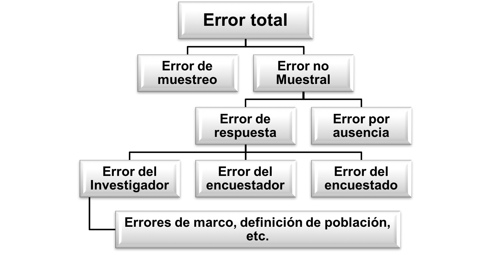
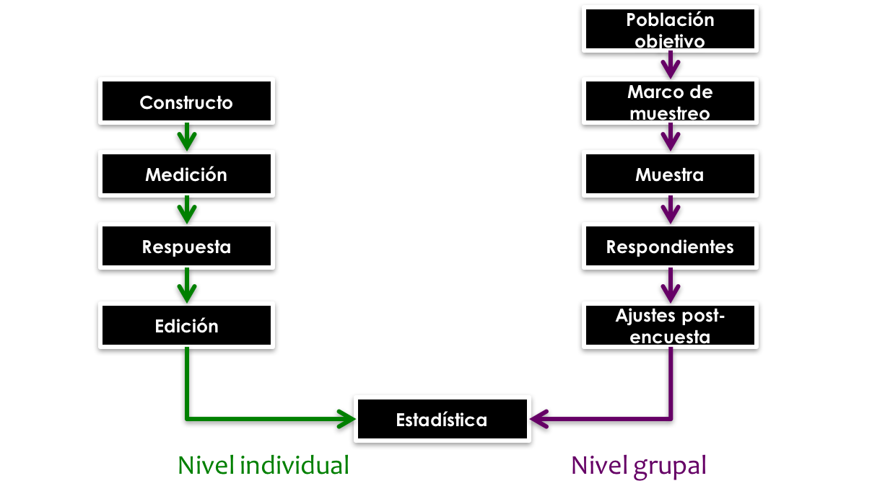

```{r setup, include=FALSE}
knitr::opts_chunk$set(warning = FALSE, 
                      message = FALSE,
                      cache = TRUE)
library(rstan)
library(printr)
library(knitr)
rstan_options (javascript = FALSE)
library(thematic)
library(ggplot2) 
theme_set(theme_bw())
thematic_on(
  bg = "white", fg = "black", accent = "red",
  font = font_spec("Oxanium", scale = 1.25)
)
```

# El paradigma del error total

Todos los procesos en la encuesta deben estar planificados y probados de antemano, antes de la recolección de los datos. Por ejemplo, el cuestionario debe estar muy bien diseñado para que las respuestas de las personas describan acertadamente las características de los entrevistados. De la misma forma, el subconjunto de personas que participan en la encuesta debe ser expandido con precisión y confiabilidad a la población de interés. 

En una encuesta, el interés no se centra en las características particulares de un individuo sino en las características de la población a la cual ese individuo pertenece. De esta forma, la inferencia siempre se realiza teniendo en mente agregados (indicadores) poblacionales. Las siguientes son las dos fuentes principales de error  cuando se realiza una encuesta:  

1. **Error de muestreo**:  ocurre porque no se incluyeron a todas las personas de la población y se seleccionó una muestra.
1. **Error no muestral**: se refiere a las posibles desviaciones de las respuestas provistas por un entrevistado con respecto al verdadero atributo que se desea medir.



Por ejemplo, en una encuesta de fuerza laboral mensual, puede haber confusión en el respondiente si no se hace hincapíe en el periodo de referencia; no es lo mismo indagar por la semana pasada, que por el mes pasado y el respondiente debe ser guiado para evitar equivocaciones. Además pueden existir no respondientes en algún subgrupo de interés, o incluso el marco puede estar desactualizado. Uno de los objetivos de la planeación concienzuda de la encuesta es minimizar los errores no muestrales. Es necesario minimizar las discrepancias encontradas entre la respuesta verdadera a una pregunta y la respuesta final.

@Groves_Fowler_Couper_Lepkowski_Singer_Tourangeau_2009 plantea que durante todo el siglo pasado, ha surgido una serie de teorías y principios que ofrecen un marco de referencia unificado en el diseño, implementación y evaluación de encuestas. Este marco de referencia se conoce comúnmente como el paradigma del error total de muestreo y ha encaminado la investigación moderna hacia una mejor calidad de las encuestas.

## ¿Qué es una encuesta?

@Groves_Fowler_Couper_Lepkowski_Singer_Tourangeau_2009 afirma que una encuesta es un método sistemático para obtener información de (una muestra de) entes, con el fin de construir descriptores cuantitativos de los atributos de una población más grande, de la cual los entes son miembros.
Por otro lado, Wikipedia afirma que una encuesta es un estudio observacional en el cual el investigador busca recaudar datos por medio de un cuestionario pre-diseñado, y no modificar el entorno ni controlar el proceso que está en observación (como sí lo hace en un experimento). 

Además, los datos se obtienen a partir de realizar un conjunto de preguntas normalizadas dirigidas a una muestra representativa o al conjunto total de la población estadística en estudio, formada a menudo por personas, empresas o entes institucionales, con el fin de conocer estados de opinión, características o hechos específicos. Hay una diferencia sustancial entre los sondeos y las encuestas; de esta forma, 

- **Sondeo**: es la traducción de *poll*, que a su vez viene del antiguo alemán referente a cabeza y se utilizaba para contar: “contar cabezas”.
- **Encuesta**: es la traducción de *survey*, que a su vez viene del latín *super* (sobre) y *videre* (observar).

En general, la primera expresión aparece muchas más veces en el sector privado, en estudios de opinión y de consumo. Un sondeo no será jamás utilizado para obtener estadísticas oficiales en estudios gubernamentales o en dominios científicos. Sin embargo, los sondeos muchas veces opacan la perspectiva científica de las cifras y pueden llevar a conclusiones inexactas acerca de la realidad de una problemática. No todos los procesos de recolección de información se pueden llamar encuestas; para efectos de este documento seguiremos la definición de @Groves_Fowler_Couper_Lepkowski_Singer_Tourangeau_2009, quienes afirman que una tendrá las siguientes características: 

1. Los datos son recopilados mediante preguntas a personas.
2. Las respuestas son compiladas cuando: a) un encuestador pregunta y graba las respuestas del entrevistado o b) el encuestado lee y graba sus propias respuestas.
3. Los datos son recolectados de un subgrupo de personas pertenecientes a la población de interés

## Sesgos generados en las encuestas

@Gutierrez_2016 plantea que existen diferentes fuentes de sesgo en las encuestas y resume de la siguiente forma las dos fuentes de sesgo más importantes:

### Sesgo de selección 

Este tipo de sesgo ocurre cuando parte de la población objetivo no está en el marco de muestreo, o cuando el marco está incompleto y presenta deficiencias. Una muestra a conveniencia\footnote{A pesar de que las muestras por conveniencia o por juicio no pueden ser utilizadas para estimar parámetros de la población, éstas sí pueden proporcionar información valiosa en las primeras etapas de una investigación o cuando no es necesario generalizar los resultados a la población.} es sesgada pues las unidades más fáciles de elegir o las que más probablemente respondan a la encuesta no son representativas de las unidades más difíciles de elegir. @Loh afirma que se presenta este tipo de sesgo si:

- La selección de la muestra depende de cierta característica asociada a las propiedades de interés. Por ejemplo: si la encuesta se realiza ingresando a un portal web, y precisamente las personas que no tienen cobertura de internet difieren significativamente de quienes sí tienen acceso.
- La muestra se realiza mediante elección deliberada o mediante un juicio subjetivo. Por ejemplo, si el parámetro de interés es la cantidad promedio de gastos en compras en un centro comercial y el encuestador elige a las personas que salen con muchos paquetes, entonces la información estaría sesgada puesto que no está reflejando el comportamiento promedio de las compras.
- Existen errores en la especificación de la población objetivo. Por ejemplo, en encuestas electorales, cuando la población objetivo contiene a personas que no están registradas como votantes ante la organización electoral de su país.
- Existe sustitución deliberada de unidades no disponibles en la muestra. Si, por alguna razón, no fue posible obtener la medición y consecuente observación de la característica de interés para algún individuo en la población, la sustitución de este elemento debe hacerse bajo estrictos procedimientos estadísticos y no debe ser subjetiva en ningún modo.
- Existe ausencia de respuesta. Este fenómeno puede causar distorsión de los resultados cuando los que no responden a la encuesta difieren críticamente de los que si respondieron.
- La muestra está compuesta por respondientes voluntarios. Los foros radiales, las encuestas de televisión y los estudios de portales de internet no proporcionan información confiable.


### Sesgo de medición 

Este tipo de sesgo ocurre cuando el instrumento con el que se realiza la medición tiene una tendencia a diferir del valor verdadero que se desea averiguar. Este sesgo debe ser considerado y minimizado en la etapa de diseño de la encuesta. Nótese que ningún análisis estadístico puede revelar que una pesa añadió a cada persona 2Kg de más en un estudio de salud. @Loh cita algunas situaciones en donde se presenta este sesgo de medición:

- Cuando el respondiente miente. Esta situación se presenta a menudo en encuestas que preguntan acerca del ingreso salarial, alcoholismo y drogadicción, nivel socioeconómico e incluso edad.
- Difícil comprensión de las preguntas. Por ejemplo: ¿No cree que este no es un buen momento para invertir? La doble negación en la pregunta es muy confusa para el respondiente.
- Las personas tienden a olvidar. Es bien sabido que las malas experiencias suelen ser olvidadas; esta situación debe acotarse si se está trabajando en una encuesta de criminalidad.
- Distintas respuestas a distintos entrevistadores. En algunas regiones es muy probable que la raza, edad o género del encuestador afecte directamente la respuesta del entrevistado.
- Leer mal las preguntas o polemizar con el respondiente. El encuestador puede influir notablemente en las respuestas. Por lo anterior, es muy importante que el proceso de entrenamiento del entrevistador sea riguroso y completo.
- La muestra está compuesta por respondientes voluntarios. Los foros radiales, las encuestas de televisión y los estudios de portales de internet no proporcionan, en general, información confiable. En este caso también se presenta sesgo de selección.


## Evolución de las encuestas estandarizadas

Cuando el mundo occidental superó los grandes traumatismos del siglo XX (dos guerras mundiales y una recesión a larga escala), la investigación social tuvo un auge sobresaliente a través de las encuestas por correo postal. Desde entonces, existen tres preguntas, en continua dinámica, que se deben responder para planificar, ejecutar y analizar una encuesta: ¿cómo se diseñarán las preguntas? ¿cómo se seleccionará la muestra? y ¿cómo se recolectarán las respuestas?

### Inicio de los cuestionarios estandarizados 

La práctica de realizar las mismas preguntas en forma de cuestionario es reciente. En el principio cada encuestador preguntaba lo mismo, pero con diferentes palabras. Difícilmente, dos personas distintas eran entrevistadas con las mismas preguntas. Se encontró que la forma en cómo se preguntaba y cómo se recopilaba la información afectaba dramáticamente los resultados de las encuestas. Fue así como se decidió que los encuestadores deberías ser entrenados (pre-operativo) formalmente.

Desde la psicometría se implementó el formalismo del cuestionario. Intentando medir estados psicológicos, afectivos e intelectuales, se desarrollaron técnicas primitivas para hacer comparables las respuestas. @Likert_1932 demostró que era posible realizar este tipo de comparaciones, evadiendo los largos instrumentos de medición, al formular una sola pregunta - a todos los encuestados - con una serie de respuestas en forma de escala.


### Inicio de los métodos de muestreo 

En un principio, los investigadores trataban de recolectar datos sobre todos los elementos de la población de interés. Esta práctica resultaba logísticamente inadecuada cuando se trataba de poblaciones con un gran tamaño. Los cálculos de los indicadores sobre toda una población resultaban muy demandantes. @Groves_Fowler_Couper_Lepkowski_Singer_Tourangeau_2009 afirman que, aunque la teoría de la probabilidad tuvo sus orígenes en el siglo XVIII, no fue hasta la segunda década del siglo XX que se utilizó para realizar encuestas. La primera aplicación fue la selección sistemática de un elemento en una población enlistada. Para realizar esta selección, los registros censales se dividían en secciones y se procedía a seleccionar un elemento de la sección.

Más adelante, cuando la estadística permeó la agricultura, se definieron otros tipos de muestreo (menos demandantes) y se dio origen al muestreo de áreas. Es así como hoy en día es posible seleccionar muestras de bloques, zonas amanzanadas, secciones y sectores cartográficos, o áreas de empadronamiento censal. Se descubrió que era posible generalizar el muestreo de áreas y se creó el muestreo multietápico que permitió la selección de grandes bloques dentro de una ciudad, y áreas dentro de los bloques y el submuestreo sucesivo de unidades dentro hasta llegar a la unidad de interés. Todos estos submuestreos se realizan de forma probabilística.

La segunda guerra mundial y la gran depresión en EE.UU. fueron catalizadores de las encuestas a gran escala. En ese entonces, al igual que hoy, la tasa de desempleo era una cifra importante. Las políticas públicas empezaron a decidirse de acuerdo con las estadísticas oficiales, puesto que las grandes encuestas se realizaron mensualmente. Hoy en día existen cientos de encuestas mensuales que dan cuenta de la realidad de las sociedades en la región.

### Inicio de la recolección de datos 

Debido a que en un principio no existía un cuestionario estandarizado, entonces las respuestas abiertas eran la única opción de recopilar información. Esta práctica demandaba un gran esfuerzo en términos de resumir y sintetizar todo el corpus de palabras que los entrevistados usaban para responder.

En la mitad de la década del sesenta del siglo pasado, empezó una proliferación masiva de las entrevistas por correo en EE. UU. Los países con registros administrativos actualizados pueden contemplar este escenario puesto que induce altas tasas de cobertura a precios más económicos (pues se prescinde del encuestador). Las bajas tasas de respuestas (pues el encuestado debe llenar un formulario con sus respuestas y devolverlo a la oficina postal) hicieron que paulatinamente esta forma de recolección no fuese tan apetecida [@Groves_Fowler_Couper_Lepkowski_Singer_Tourangeau_2009].

Un camino intermedio entre las entrevistas cara a cara y las formularios auto-administrados por correo postal son las entrevistas telefónicas. Hoy en día, la mayoría de encuestas en investigación de medios y de mercado se realiza por teléfono.
 

## El ciclo de vida de una encuesta

Atendiendo al modelo de @Groves_Fowler_Couper_Lepkowski_Singer_Tourangeau_2009, se puede afirmar que en todas la encuestas se tienen dos niveles de inferencia: el individual y el grupa. El proceso de inferencia individual trata con los mismos respondientes que proveen la información primaria en el estudio; mientras que el el proceso de inferencia grupal, basado en una aproximación inductiva, va desde lo particular (la muestra) a lo general (la población). 



### Inferencia individual  

#### Constructo 

@Gutierrez_2016 menciona que los constructos son las ideas abstractas (ambiguas) sobre las cuales el investigador desea inferir y que, a su vez, dan origen a la investigación al ser la simiente de la encuesta. Las palabras con que se describen los constructos son siempre simples, pero la redacción elaborada de los constructos no siempre es precisa. Por ejemplo:

* En una *encuesta de victimización* que mida la cantidad de incidentes relacionados con crímenes en un año determinado, es necesario definir muy apropiadamante qué se entiende por crimen, o cómo se define a una víctima, entre otros muchos aspectos.
* En una *encuesta de goce efectivo de derechos ciuidadanos* sobre menores de edad se puede medir la efectividad del estado al garantizar los derechos básicos a la primera infancia. Sin emabargo, es necesario definir qué es un derecho, o cómo se define primera infancia.

Mientras que algunos constructos son más abstractos que otros (optimismo en la economía, confianza inversionista, percepción del Plan Nacional de Desarrollo), algunos otros son observables más fácilmente (consumo de alcohol y otras drogas, nutrición en la primera infancia, productividad de una intervención en el sector agrícola, factores de riesgo asociados a una enfermedad). 

#### Mediciones 

La medición es una caracterización mucho más concreta que el constructo, puesto que representa una forma de obtener información de los constructos de interés. La cuestión clave para realizar una buena medición es realizar preguntas que induzcan respuestas que reflejen claramente los constructos que se desean medir. @Groves_Fowler_Couper_Lepkowski_Singer_Tourangeau_2009 indican indican que estas preguntas pueden ser comunicadas en forma oral (encuestas cara a cara o telefónicas), o comunicadas en forma visual (atributos de un producto - marketing). Así mismo, también pueden existir observaciones directas del encuestador (condiciones de la vivienda), u observaciones proveninetes de dispositivos electrónicos o físicos (precios de productos en supermercados, muestra de agua, muestra de sangre, etc.).

#### Respuesta y edición 

El resultado de la medición es la respuesta y la naturaleza de las respuesta está determinada por la naturaleza de las preguntas. Después de que los entrevistados han respondido, los datos deben pasar por un proceso de edición y validación de inconsistencias. 

En este proceso de edición se debe examinar la distribución completa de las respuestas y buscar *datos atípicos* para que sean revisados con detenimiento. Los datos editados constituyen el insumo para realizar todo el proceso de inferencia estadística pertinente para que las cifras resultantes sean confiables y precisas.

### Inferencia grupal  

#### La población objetivo 

De las definiciones concernientes a agregados, esta es la más abstracta. En general, la *población objetivo* representa el conjunto de unidades que serán estudiadas. Por ejemplo, en una encuesta es posible definir la población objetivo como los adultos nacionales. Sin embargo, esta definición de población no contempla el periodo de referencia de la medición, tampoco aclara si se incluyen los adultos residentes en el exterior y, no precisa cómo se verificará la nacionalidad de un entrevistado.

Por ende, la definición de la población objetiva tiene que ser lo más precisa posible. Por ejemplo, la Gran Encuesta Integrada de Hogareas de Colombia define a su población objetivo como la Población civil no institucionalizada (PCNI), la cual contiene a todas las personas que no hacen parte de la fuerza pública y no pertenecen a instituciones de aislamiento como prisiones, hospitales, sanatorios, ancianatos, etc. La PCNI contiene a la población en edad de trabajar (PET) y a los no pertenecientes a la fuerza laboral. La edad para empezar a trabajar en el área rural es 10 años, y en la ciudad es 12 años. A su vez, la PET contiene a Inactivos y Ocupados. La clasificación de ocupado es una variable derivada que está inducida por muchos filtros.


#### La población enmarcada 

No es posible realizar una encuesta probabilística sin un *marco de muestreo*, definido como un dispositivo que permite ubicar e identificar (ambas acciones al mismo tiempo) las unidades pertenecientes a la población de interés. Es necesario darse cuenta de que todos los marcos de muestreo presentan algún nivel de desactualización con respecto a la población de interés. Por ejemplo, un marco de muestreo de líneas telefónicas puede no contener a todos lo residentes de una ciudad.

De la misma forma, un marco de muestreo de áreas, basado en la cartografía del último ejercicio censal, puede estar desactualizado. Nótese que con un marco de áreas es posible entrevistar a la misma persona en varias ocasiones (múltiples residencias), o incluso nunca realizar la entrevista a una persona que no tienen un lugar fijo de residencia.

La población enmarcada está definida por el conjunto de miembros de la población objetivo que efectivamente tienen una probabilidad no nula de ser seleccionados en una muestra probabilística. En general para definir quién pertenece a un hogar del marco existen dos alternativas:

1. Regla *de iure*: quien habitualmente reside en el hogar es miembro de ese hogar. 
    - Una situación *de iure* es aquella que está reconocida por la legalidad vigente o por la autoridad competente en virtud de algún acuerdo o acto formal. 
    - Evita la subcobertura de individuos que no residen usualmente en su hogar, considerándolo suyo. 
1. Regla *de facto*: quien pasó la noche anterior en una residencia de un hogar es miembro de ese hogar. 
    - Una situación *de facto* es aquella que, existiendo en la realidad, no ha sido reconocida formalmente. 
    - Evita la sobrecobertura de individuos que tienen más de una residencia. 

#### La muestra 

El tamaño de muestra define directamente la precisión y confiabilidad de las estimaciones. Este debería incrementarse a medida que lo hagan los niveles de desagregación (grupos etarios, regiones geográficas, niveles de escolaridad, etc.). Sin embargo, dependiendo de la caracterización de la estrategia de muestreo, pueden existir escenarios en donde una encuesta con un tamaño de muestra menor induzca menores errores de muestreo que una encuesta con un mayor tamaño de muestra.

No obstante, en algunas ocasiones los esfuerzos realizados para que los individuos seleccionados en la muestra respondan no son fructíferos. De esta manera, los individuos que son efectivamente entrevistados se denominan respondientes efectivos; mientras que al complemento de este conjunto se les denomina no respondientes. 

#### Los respondientes 

Pueden existir casos de no respondientes parciales (no respondientes de ítems), para los cuales debe existir un proceso de *decisión* en términos de su reemplazo. Asimismo, no todas las ausencias parciales son reemplazadas. @Groves_Fowler_Couper_Lepkowski_Singer_Tourangeau_2009 afirman que algunos de los factores que inciden en el aumento de la ausencia de respuesta pueden ser causados por:
  
- *Contenido*: por preguntas sensibles (encuestas relacionadas con el uso de drogas, finanzas, victimización). En este caso, se puede acotar la tasa de respuesta si se ordenan las preguntas de manera adecuada.
- *Encuestadores*: aplicar métodos estándar de mejoramiento de la calidad para aumentar la precisión y tasa de respuesta de los entrevistadores involucrados en el estudio.
- *Método de recolección*: las encuestas telefónicas y por correo tienen una tasa de respuesta menor que las entrevistas personales.
- *Diseño de cuestionario*: mala planificación en el pase de las preguntas que conforman el instrumento.
- *Tiempo de la encuesta y agobio*: algunas temporadas arrojan tasas de no respuestas más altas que otras. De la misma forma, algunos cuestionarios largos son propensos a inducir una mayor ausencia de respuesta parcial por el agotamiento del respondiente. En general, las encuestas demasiado largas pueden indisponer al respondiente.

#### Los ajustes post-encuesta 

Toda encuesta cuenta con personas que no quisieron responder y/o con un marco de muestreo que no cubre a toda la población. Por ende, es necesario reajustar los factores de expansión para evitar, sobretodo, la sub-estimación de los parámetros de interés, o implementar métodos de imputación para suplir la información faltante. De esta forma se puede utilizar una reponderación diferencial cuando es evidente que hay un patrón de ausencia de respuesta en algunos subgrupos de la población; por ejemplo: si los desempleados no responden sistemáticamente, o si las tasas de respuestas a nivel urbano son menores que las tasas de respuesta a nivel rural.

También es posible imputar (cuya raíz inglesa es *input*, traducido como introducir valores) los valores perdidos en un subconjunto de observaciones de la muestra seleccionada. En este caso es factible utilizar metodologías estocásticas complejas para imputar valores, o técnicas simples sistemáticas. Sin embargo, en cualquier caso, siempre es preferible obtener la respuesta directa del entrevistado.


## El proceso de respuesta

No todas las encuestas se planean de tal forma que exista una interacción directa entre respondiente y entrevistador en todo tiempo. Por ejemplo:


1.	*La comprensión*, en donde el respondiente interpreta la pregunta. @Groves_Fowler_Couper_Lepkowski_Singer_Tourangeau_2009 afirman que en este momento se involucran todos aquellos procesos de atención a la pregunta y entendimiento de las instrucciones. La primera tarea del respondiente es interpretar la pregunta y, al hacerlo surgen procesos de análisis y asignación de un significado a los elementos sustantivos de la pregunta. Además el respondiente debe hacer una inferencia sobre el propósito de la pregunta, determinar los límites de la respuesta, así como acotar los posibles traslapes sobre las respuestas permitidas.
2.	*El recaudo*, en donde el respondiente recolecta la información necesaria para brindar una respuesta. En algunas ocasiones se accede a la memoria de largo plazo que almacena todo el contenido autobiográfico y el conocimiento general. Nótese que muchas cosas pueden afectar el desempeño de la memoria de largo plazo (cuando los eventos en cuestión no se distinguen con facilidad o cuando los eventos no tienen un gran impacto personal). Aunque la memoria de largo plazo no provea la información exacta, sí provee la información relevante para que el entrevistado proporcione una respuesta adecuada. Este ciclo de recaudo de información continúa hasta que el entrevistado dé una respuesta acertada o simplemente no quiera recordar más (algunas situaciones son más difíciles de recordar) [@Groves_Fowler_Couper_Lepkowski_Singer_Tourangeau_2009]. Para ayudar a la memoria de largo plazo se pueden diseñar señales o pistas auto-contenidas en la pregunta. Las mejores señales son las que ofrecen un nivel de detalle más profundo.
3.	*El juicio*, momento en donde se combina, se pondera y se resume la información recolectada. En esta etapa se surten procesos que complementan los recaudos que el entrevistado ha contemplado anteriormente. El juicio puede llenar los vacíos de la memoria, combinar los recaudos o ajustarlos por omisión. Por ejemplo, en una encuesta de ingresos y gastos, las personas, por lo general, no llevan la cuenta del número de veces que compraron cierto artículo o no tienen una respuesta predefinida al número de veces que han salido de compras. Por ende, el respondiente tratará de contar el número de veces que experimentó una situación, y si ese número es muy grande, seguramente se acercará a la respuesta mediante una estimación. La estrategia de estimación del respondiente (llevar la cuenta, construir una escala mediante la recordación de eventos, realizar una estimación gruesa o adivinar al azar) depende del número de sucesos, su duración, la regularidad de los mismos y el periodo de referencia de la encuesta [@Groves_Fowler_Couper_Lepkowski_Singer_Tourangeau_2009].
4.	*El reporte*, que es el momento en donde el respondiente formula su respuesta y la estandariza en el formato inducido por el cuestionario. Este es el proceso de selección y comunicación de una respuesta, que incluye el encuadre de la respuesta dentro de las opciones que provee la pregunta (también implica alterar la respuesta para que se ajuste a las opciones aceptables). La forma en que se reporta la respuesta final dependerá del ajuste que se realice en los procesos de recaudo y estimación y las restricciones que la pregunta impone. En este sentido, si para una pregunta de percepción la mayoría de opciones de respuesta son negativas, la respuesta estará sesgada en esa dirección. Asimismo, los respondientes pueden dar mayor importancia a ciertas opciones de respuesta [@Groves_Fowler_Couper_Lepkowski_Singer_Tourangeau_2009].

El investigador debe saber que el solo hecho de haber experimentado una situación, no implica que el respondiente haya compilado la suficiente información para reportarla como respuesta. @Groves_Fowler_Couper_Lepkowski_Singer_Tourangeau_2009 afirman que se ha visto que los testigos presenciales de una situación omiten detalles importantes acerca de la situación de la cual son testigos. Además, las personas no pueden proveer la información que no tienen. Si la gente no compila la información necesaria, ninguna pregunta ni formulación logrará obtener la respuesta real. Por lo que se recomienda llevar a cabo un pre-test para validar el cuestionario. Por otro lado, aunque el respondiente conozca con exactitud la respuesta a una pregunta, no será capaz de reportarla correctamente si no hay una buena interpretación de la misma.

- *Tiempo de ocurrencia*: los eventos que sucedieron hace mucho tiempo son más difíciles de recordar.
- *Límites temporales e impacto emocional*: los eventos cercanos a límites temporales que generan impacto emocional son más fáciles de recordar. Por ejemplo, eventos catastróficos, atentados terroristas o desastres naturales.
- *Señales en las preguntas*: la asignación de múltiples señales en la redacción de la pregunta ayuda a activar el proceso de recordación. 

Las preguntas cerradas con escala ordenada tienden a producir un sesgo de respuesta positivo, pues los respondientes tienden a evadir las opciones negativas de la escala (encuestas de satisfacción). @Schwarz1991 demostró que las etiquetas numéricas afectan el proceso de respuesta, por lo cual recomendó que el encuestador no lea los números en las opciones de respuesta, así como acotar el número de opciones en preguntas de opinión (no muy pocas, no tantas). 

Nótese que la generación de pocas opciones hace que se pierda el poder de discriminación en la respuesta, mientras que utilizar muchas opciones puede hacer que los encuestados no distingan fácilmente entre las categorías adyacentes. Además, es posible que el respondiente no quiera esperar a que el entrevistador lea exhaustivamente todas las opciones de respuesta. En este caso se presentan dos fenómeno que es necesario evadir. En primer lugar el efecto de primacía, el cual incrementa el riesgo de que el respondiente escoja una de las primeras opciones; y el efectos de recencia, en donde el respondiente siempre escogerá una de las últimas opciones.

Algunos respondientes podrán desviarse del modelo de respuesta mediante la escogencia de rutas alternas de evasión (el encuestado hará el mínimo esfuerzo para satisfacer las demandas del entrevistador). Es así como podríamos encontrar respondientes que seleccionan sistemáticamente las opciones *No sabe* o *No responde*, o que escogen siempre la misma opción para cada pregunta. Inclusive, dependiendo de la apariencia del entrevistador, el respondiente puede estar sesgado a siempre estar de acuerdo (aquiescencia). De la misma manera, es posible que el respondiente quiera presentarse a sí mismo de manera favorable, omitiendo sus atributos no deseables [@Groves_Fowler_Couper_Lepkowski_Singer_Tourangeau_2009].
