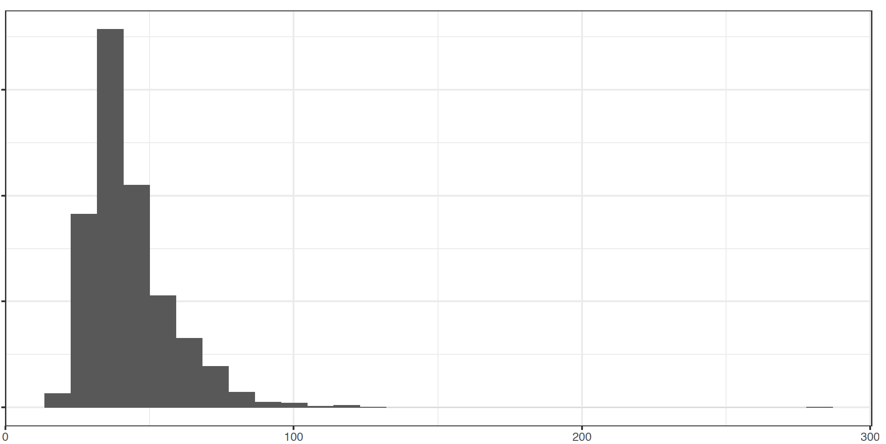
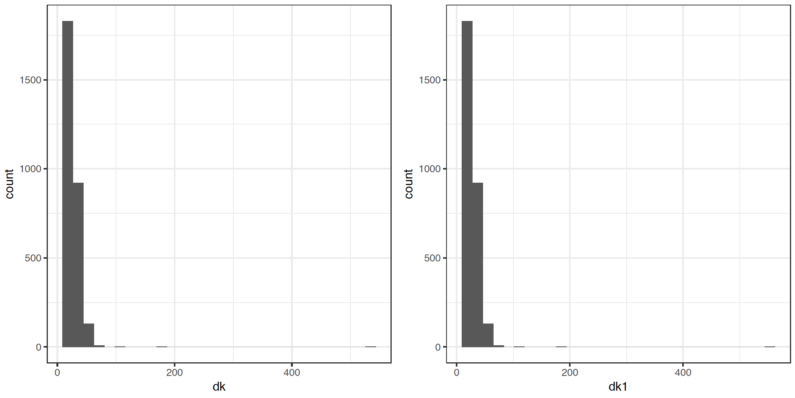
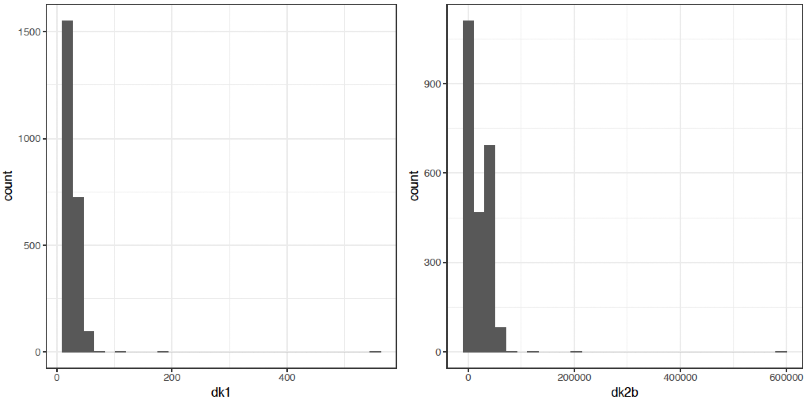
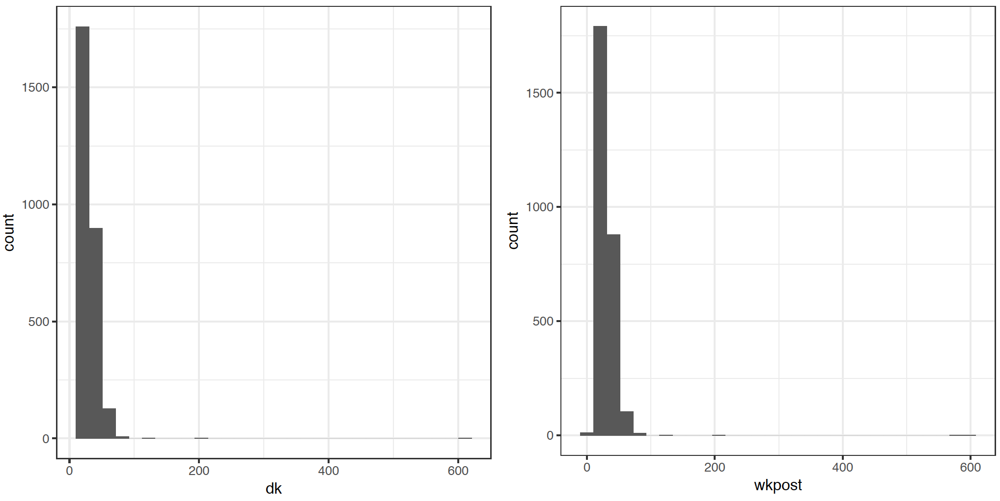

# Construcción de los factores de expansión

Los procesos de inferencia estadistica establecidos en cualquier encuesta de hogares descansan sobre el principio de representatividad que afirma que es posible seleccionar una muestra y representar con bastante precisión y exactitud la realidad de la población de interés. A su vez, las propiedades estadísticas de la inferencia en encuestas de hogares descansan sobre las probabilidades de inclusión generadas por el diseño de muestreo que se implementó en la encuesta. En general el peso de muestreo $w_k$ asociado a un individuo $k$ en la muestra $s$ es una función del inverso de la probabilidad de inclusión del individuo, así

$$
w_k \propto \frac{1}{Pr(k\in s)}
$$

Como se mencionó anteriormente, para conservar estabilidad en los pesos de muestreo, es posible definir diseños de muestreo auto-ponderados, en donde las unidades finales de muestreo tengan las misma probabilidad de inclusión, sin importar el tamaño de la unidad primaria de muestreo que la contiene. Este tipo de diseños es útil porque induce mayor control sobre las estimaciones finales. Es de notar que la conformación de los pesos de muestreo se transforma en un reto metodológico para el investigador, puesto que debe ajustarse a la realidad de la región en donde las poblaciones de los municipios se expanden cada vez más en el sector urbano y los marcos de muestreo de las áreas geográficas se desactualizan con rapidez. Varias soluciones a este problema han sido planteadas [@Gambino_Silva_2009] y todas ellas requieren de esfuerzos económicos, logísticos y técnicos. Por ende, los equipos de los INE (a todo nivel) deben ser flexibles y adecuarse a esta realidad cambiante de la movilidad de las poblaciones, sobre todo en las áreas urbanas. 

En condiciones ideales el marco de muestreo debería coincidir plenamente con la población finita. Sin emabargo, en general, no es posible contar con una lista de todos los elementos de la población y, en el contexto de las encuestas a hogares, no existe una lista que enumere todos los hogares de un país de manera actualizada, por lo que la práctica estándar es construir el marco de muestreo en varias etapas, seleccionando una muestra de áreas geográficas, realizando un empadronamiento exhaustivo de todos los hogares en las áreas seleccionadas y luego seleccionando hogares. Este esquema de muestreo hace que el marco de muestreo de las encuestas a hogares presente imperfecciones. El siguiente gráfico, adaptado de  @Valliant_Dever_2017, describe los problemas inferenciales que se deben surtir al trabajar con marcos de muestreo imperfectos y su relación con los pesos de muestreo originales.

XXXXXX incluir gráfico acá XXXXXXXXX

Para hacerle frente a las imperfeccciones del marco, la AsociacEl esquema de ponderación *American Association for Public Opinion Research* (AAPOR) recomienda tratar la ausencia de respuesta de manera diferenciada y clasificar a cada unidad en la muestra en algunas de las siguientes categorías:

1. ER (*unidades elegibles que fueron respondientes efectivos*): casos elegibles para los cuales se ha recolectado una cantidad suficiente de información.
2. ENR (*unidades eligibles no respondientes*): casos elegibles para los cuales no se recolectó ningún dato o la información fue parcialmente recolectada. 
3. IN (*unidades no elegibles*): casos de miembros no elegibles que no hacen parte de la población de interés. 
4. UNK (*unidades con elegibilidad desconocida*): casos en donde no se puede conocer si la unidad es elegible o no.

Para construir los factores de expansión de una encuesta se recomienda seguir en este orden los siguientes procesos:

1. Creación de los pesos básicos.
1. Descarte de las unidades no elegibles.
1. Ajuste por elegibilidad desconocida.
1. Ajuste por ausencia de respuesta.
1. Calibración por proyecciones poblacionales y variables auxiliares.
1. Preparación de la base de datos de respondientes. 

## Creación de los pesos básicos

Este primer paso ya ha sido explicado de forma detallada en la sección dedicada a la selección de la muestra. Observe que, asociado a cada esquema particular de muestreo, existe una única función que víncula a cada elemento con una probabilidad de inclusión en la muestra. De esta forma:

$$\pi_k = Pr (k \in s)$$

Por lo tanto, el primer paso, en la reponderación de los pesos de muestreo, es justamente la creación de los pesos básicos $d_{1k}$ que se definen como el inverso multiplicativo de la probabilidad de inclusión

$$d_{1k} = \frac{1}{\pi_k}$$

Estos pesos son creados incluso para aquellas unidades que serán excluidas de la muestra porque son no elegibles o porque no proveyeron ninguna información y luego serán modificados convenientemente. La siguiente figura muestra la distribución típica de los pesos originales en una encuesta de hogares. A través de las modificaciones posteriores, esta distribución irá sufriendo algunos cambios. Si la distribución original de los pesos básicos difiere estructuralmente con la distribución final de los ponderadores, resultante de todos los ajustes debidos a las imperfecciones del marco, entonces las propiedades estadísticas de insesgamiento, consistencia y precisión podrían desvanecerse. Lo anterior implica que el nivel de desactaulización del marco de muestreo tiene implicaciones directas en la calidad de la inferencia. Por tanto, si el marco de meustreo es muy imperfecto, los ponderadores finales no inducirán una inferecnia precisa. 

{width=350px, height=500px}

## Descarte de las unidades no elegibles

Si hay viviendas seleccionadas desde el marco de muestreo que han cambiado su estado de ocupación y ahora no contienen ningún hogar, entonces el segundo paso consiste en ajustar su peso básico de la siguiente manera:

$$
d_{2k} = 
\begin{cases}
0, \ \ \ \ \ \text{si la unidad $k$ no pertenece a la población objetivo}\\
d_{1k},\ \ \ \text{en otro caso }
\end{cases}
$$

## Ajuste por elegibilidad desconocida

El tercer paso consiste en redistribuir el peso de las unidades cuyo estado de elegibilidad es desconocido. Por ejemplo, si la encuesta está enfocada en la población mayor de 15 años y hay personas que no proveen ninguna información acerca de su edad, entonces es necesario distribuir estos pesos. Esta situación también se puede presentar a nivel de hogar cuando no puede ser contactado porque nadie nunca atendió el llamado del encuestador (*nadie en casa*). Se acostumbra a redistribuir los pesos de los UNK entre las unidades que sí disponen de su estatus de elegibilidad (ER, ENR, IN). 

Luego, si no es posible determinar la elegibilidad de algunas unidades que aparecen en el marco de muestreo, se tendrá una muestra $s$ que contendrá el conjunto de las unidades *elegibles* en la muestra $s_{e}$, el conjunto de las unidades *no elegibles* en la muestra $s_{n}$ y el conjunto de las unidades con *elegibilidad desconocidad* $s_{u}$. En este último caso, la elegibilidad de estos casos es desconocida, a no ser que de manera arbitraria sean clasificadas como ENR (elegibles no respondientes), o se tenga información auxiliar en el marco de muestreo que permita imputar su estado de elegibilidad. 

Se recomienda formar $B$ $(b = 1,  \ldots, B)$ categorías^[Se acostumbra a formar categorías con al menos 50 casos.] basadas en la información del marco de muestreo. Estas categorías pueden ser estratos o cruces de subpoblaciones. Siendo $s_b$ la muestra de unidades en la categoría $b$ (que incluye a ER, ENR y UNK), se define el factor de ajuste por elegibilidad como:

$$
a_b = \frac{\sum_{s_b}d_{2k}}{\sum_{s_b \cap s_e}d_{2k}}
$$
Para la categoría $b$, los pesos ajustados por elegibilidad desconocida para aquellas unidades cuya elegibilidad si pudo ser establecida (independientemente de su estado de respuesta) estarán dados por la siguiente expresión:

$$
d_{3k} = a_b * d_{2k}
$$

{width=350px, height=500px}

## Ajuste por ausencia de respuesta

En este paso los pesos básicos de los ER se ajustan para tener en cuenta a los ENR. Al final del proceso, los pesos de los ER se incrementan para compensar el hecho de que algunas unidades elegibles no proveyeron información. Para el manejo efectivo de la ausencia de respuesta se consideran las siguientes variables aleatorias:

$$
I_k=
\begin{cases}
1,  &\text{si $k$ pertenece a la muestra $s$}\\
0,  &\text{en otro caso.}
\end{cases}
$$

$$
D_k=
\begin{cases}
1,  &\text{si $k$ pertenece al conjunto de respondientes $s_r$}\\
0,  &\text{en otro caso.}
\end{cases}
$$

Al suponer que la distribución de las respuestas puede ser estimada, entonces la probabilidad de respuesta (*propensity score*) está dada por
$$
Pr(k\in s_r|k\in s)=Pr(D_k = 1|I_k = 1)=\phi_k 
$$

Si el patrón de ausencia de respuesta es completamente aleatorio (en donde la no respuesta no sigue ningún patrón específico) o aleatorio (en donde el patrón de la no respuesta puede ser explicado por covariables $\mathbf{x}$ de la encuesta), entonces 

$$
\phi_k = f(\mathbf{x}_k, \boldsymbol{\beta})
$$

Ahora, si es posible tener acceso a las covariables $\mathbf{x}$, entonces es posible estimar el patrón de ausencia de respuesta mediante 

$$
\hat{\phi}_k = f(\mathbf{x}_k, \hat{\boldsymbol{\beta}})
$$

Por otro lado, si el patrón de ausencia de respuesta es no aleatorio (en donde el patrón de la no respuesta es explicado por la variable de interés; por ejemplo cuando los desempleados son los que no responden), entonces 

$$
\phi_k = f(\mathbf{y}_k, \beta)
$$ 

Luego, como no es posible tener acceso a la variables de interés para todos los individuos en la muestra (porque no todos respondieron), entonces no es posible estimar el patrón de ausencia de respuesta y por ende hay sesgo. Bajo los dos primeros escenarios, es posible definir el siguiente estimador insesgado
$$
\hat{t}_y=\sum_{k\in s_r}d_{4k}y_k
$$

En donde

$$
d_{4k} = \frac{d_{3k}}{\hat{\phi_k}}
$$

Nótese que el sesgo se anula puesto que

$$
E(I_kD_k) 
= EE(I_kD_k|I_k) 
= E(I_k)E(D_k|I_k) = \pi_k \phi_k
$$

XXXXXXXX

Si se tiene acceso a información auxiliar (contenida en el marco de muestreo o en otras preguntas de la encuesta), y si se considera que el mecanismo que genera la ausencia de respuesta en la encuesta de hogares es MAR, es posible ajustar un modelo para la ausencia de respuesta (en donde la variable dependiente es una variable indicadora de la respuesta del individuo por lo general supeditado a una distribución Bernoulli o Binomial). @Kim_Riddles_2012 muestran que es posible utilizar un modelo basado en el *propensity score* de las respuestas. Si la muestra de los respondientes se denota como $s_r$ entonces la probabilidad de que un individuo conteste es $\phi_k = Pr(k \in s_r)$. Al suponer que existe un vector de información auxiliar $\mathbf{z}_k$ conocido  para todo $k\in s$ es posible estimarla por medio de un modelo de regresión logística; esto es, 

$$
\hat{\phi}_k = \frac{\exp\{\mathbf{z}_k'\hat{\boldsymbol{\beta}}\}}{1 + \exp\{\mathbf{z}_k'\hat{\boldsymbol{\beta}}\}}
$$

donde $\hat{\mathbf{\beta}}$ es el vector de coeficientes estimado de la regresión logística. Finalmente, el nuevo peso  estimador para un total poblacional, con el ajuste debido a la ausencia de respuesta no ignorable, queda expresado como

$$
\hat{t}_{y}^{(adj)}= \sum_{k\in s_r} \frac{w_k}{\hat{\phi}_k}y_k
$$

XXXXXX

{width=350px, height=500px}

## Calibración de los pesos

Después de conformar el sistema de ponderación de pesos de muestreo en la encuesta, es posible calibrar estos pesos con la información auxiliar disponible para cada país, a nivel nacional, por estratos de interés, e incluso por variable continuas sobre las que se tenga interés. @Sarndal_Lundstrom_2006 afirman que cuando los estudios por muestreo están afectados por la ausencia de respuesta, es deseable tener las siguientes propiedades en la estructura inferencial que sustenta el muestreo:

1. Sesgo pequeño o nulo.
2. Errores estándares pequeños.
3. Un sistema de ponderación que reproduzca la información auxiliar disponible^[Por ejemplo, el número de hogares o habitantes en el país.].
4. Un sistema de ponderación que sea eficiente al momento de estimar cualquier característica de interés en un estudio multipropósito.

A pesar de que cada vez es más extendido el uso de los pesos calibrados en las encuestas de América Latina, es necesario que se disemine más esta práctica metodológica que induce estimadores muestrales que reproducen exactamente la información auxiliar conocida a nivel poblacional. Debido a la construcción teórica de los estimadores de calibración, los pesos finales responden a la siguiente restricción

$$
\sum_{s}w^*_{k}\boldsymbol{x}_k = \sum_{U}\boldsymbol{x}_{k} = \boldsymbol{t}_{\boldsymbol{x}}
$$

El ejemplo más básico se encuentra cuando se desea que los pesos de muestreo deberían reproducir con exactitud el tamaño de las regiones $N_h$ y el tamaño del país $N$. Es así como, utilizar la metodología de calibración [@Deville_Sarndal_1992] hace que se cumpla la siguiente ecuación de calibración sobre los nuevos pesos calibrados $w_k^*$ para todos lo estratos explícitos

$$
\sum_{s_h} w_k^* = N_h
$$

Esta coherencia entre las cifras oficiales y las que la encuesta puede producir hace que sea preferible el uso de los estimadores de calibración. Las anteriores características son satisfechas al usar el enfoque de calibración que induce una estructura inferencial robusta en presencia de información disponible puesto que reduce tanto el error de muestreo como el error debido a la ausencia de respuesta. Los estimadores de calibración son **aproximandamente insesgados**, pero la magnitud del sesgo está dada por la siguiente expresión:

$$
Bias(\hat{t}_{y, cal}) = E_p \left[ \sum_{k \in s} (w_k - d_k) y_k \right]
$$

Si los nuevos pesos calibrados son cercanos a los pesos originales en todas las posibles muestras, entonces el sesgo será insignificante. Ahora, si el tamaño de muestra es insuficiente no conviene utilizar este tipo de estimadores. Además, se sugiere que el coeficiente de variación del estimador de Horvitz-Thompson para las covariables (inducidas por todos los cruces y celdas considerados) sea menor del 10% para asegurar que el sesgo de los estimadores de calibración sea despreciable.

Por otro lado, cuando se tienen múltiples variables discretas es posible que el cruce de categorías contenga muy pocas unidades para las cuales se deba ajustar los pesos originales. Esto induce sesgo en cada subgrupo ajustado. Si aún así se decide optar por múltiples aumentar las variables de calibración, es necesario hacer un chequeo empírico del ajuste que cada modelo pueda tener con todas las variables de la encuesta, aunque se advierte que este chequeo a veces puede ser demorado e ir en contravía de las apretadas agendas de producción estadísticas que se manejan en el INE.

@Silva_2004 presenta algunas consideraciones al respecto del sesgo que puede generarse al usar esta metodología en las encuestas de hogares y aborda algunos criterios para evaluar la calidad de la calibración. 

La idea general del proceso de calibración es encontrar un número de restricciones parsimonioso que permita tener estimaciones aproximadamente insesgadas con una varianza menor a la generada con los factores de expansión originales. En general los INE podrán clasificar sus procesos de calibración en una de las siguientes tres categorías:

1. Calibración con variables continuas, que es el caso en donde la calibración se realiza con los totales de variables continuas como ingreso, gasto, entre otras. 
2. Post-estratificación con variables categóricas, que representa el caso en donde la calibración se realiza con los tamaños poblacionales (basados en proyecciones demográficas o registros administrativos) de subgrupos de interés. 
3. *Raking* con variables categóricas, que se define como una calibración sobre los tamaños marginales de tablas de contingencia de subgrupos de interés. A diferencia del caso anterior, esta calibración no tiene en cuenta los tamaños de los cruces, sino solo los tamaños marginales; por ende, este método induce menos restricciones.

En un encuesta de hogares las restricciones de calibración pueden establecerse sobre características de hogares y características de personas al mismo tiempo. De esta forma, por ejemplo, es posible calibrar sobre las proyecciones demográficas de personas y al mismo tiempo controlar las estimaciones del número de hogares en el país de manera conjunta. @Estevao_Sarndal_2006 discuten una amplia variedad de casos en donde se calibra conjuntamente en distintos niveles de desagregación sobre diferentes esquema de muestreo. Por ejemplo, para la *Encuesta Continua de Empleo* de Bolivia la calibración está inducida por una post-estratificación sobre los tamaños poblacionales de los cruces resultantes entre las variable Departamento (hay 9 departamentos), Zona (rural y urbano) y PET (con dos categorías: mayor o igual a 10 años y menor de 10 años).

El asesor regional dio una charla acerca de la metodología de calibración al equipo del Departamento de Investigación y Desarrollo, en donde se presentaron algunas medidas de calidad como protección en contra del sesgo generado por considerar demasiadas restricciones y se resaltó la importancia de que las variables utilizadas para la calibración sean estimadas de manera precisa por los estimadores clásicos de muestreo. Por ejemplo, si el número de personas por hogar es utilizada como una variable de calibración (utilizando como total auxiliar las proyecciones demográficas), entonces el coeficiente de variación del estimador de Horvitz-Thompson sobre esta variable debería ser menor al 10%. 

{width=350px, height=500px}

La teoría afirma que entre más variables de calibración se tengan menor será la varianza asociada a las estimaciones (no así el sesgo). Sin embargo, existen problemas computacionales cuando crecen las restricciones que se deben satisfacer son demasiadas. Una primera opción es verificar que no se tengan variables que puedan tener codependencia lineal con otras. Al descartar estas variables es posible conservar una varianza pequeña puesto que se descartan combinaciones lineales de otras variables.

Si los pesos de calibración resultan ser menores que uno su interpretación puede tornarse difícil (aunque no reviste un problema teórico). El usuario común entiende al factor de expansión como un factor de representatividad: *es la cantidad de veces que una persona se represnta a sí misma y a algunas otras más en la población*. Por ende, los pesos negativos o menores que uno no resisten esta interpretación intuitiva y natural. Además, los pesos negativos pueden conllevar a estimaciones negativas para algunos dominios en donde el tamaño de muestra es pequeño, lo cual resulta ser problemático en un contexto en donde todas las variables de estudio son no negativas. 

Para garantizar que los pesos se ubiquen en un intervalo determinado, se debe minimizar una distancia que a su vez debe inducir pesos restringidos a este intervalo y que respete las ecuaciones de calibración. Es posible que no se tenga una solución exacta para todas las restricciones de calibración e incluso que el algoritmo de calibración no converja. Nótese que los estimadores de calibración se pueden escribir como 

$$
w_k = g_k * d_k
$$

Con base en lo anterior, es necesario analizar los pesos $g_k$ en perspectiva en cada dominio, estrato y postestrato de interés. Una buena idea puede ser identificar aquellos $g_k$ que resulten potencialmente grandes o influyentes. Se recomienda postestratificar la muestra, y aplicar la calibración a aquellas unidades en los que los $g_k$ sean estables y usar los pesos originales en el restante conjunto. 

Es posible hacer que los pesos de calibración estén restringidos a un espacio predefinido por el usuario, mediante límites $(L, U)$ sobre los $g_k$. De esta forma, si $w_k \geq 1$ implica $g_k \geq 1$ y por tanto $L=1$. Se acostumbra a tomar $U > Q_3 + 1.5 * (Q_3 - Q_1)$ en donde $Q_3$ y $Q_1$ están dados en términos de la distribución de $g_k$ y corresponden al tercer y primer cuartil, respectivamente.

Si el mecanismo que genera la ausencia de respuesta no es aleatorio (MAR) o completamente aleatorio (MCAR), es posible que los ponderadores de calibración induzcan sesgo en las estimaciones finales. En general, cuando hay ausencia de respuesta es más probable que aparezcan pesos de calibración negativos y que los pesos de calibración no convergieran a los pesos originales. Además, la varianza de los estimadores de calibración no convergerá a los resultados usuales de los estimadores de regresión. 

@Silva_2004 presenta algunas medidas que permiten decidir cuáles escenarios de calibración son los mejores. A continuación se citan tales medidas.

- Error relativo promedio sobre las variables auxiliares
$$
M1= \frac{1}{p} \sum_{j=1}^p \frac{|\hat{t}_{xc} - t_x|}{t_x}
$$

- Coeficiente de variación HT relativo promedio
$$M2= \frac{1}{p} \sum_{j=1}^p \frac{(Var(\hat{t}_{x\pi}))^{1/2}}{t_x} $$

- Proporción de pesos extremos (límite inferior)
$$M3 = \frac{1}{n} \sum_{k \in s}I(g_k<L)$$
- Proporción de pesos extremos (límite superior)
$$M4= \frac{1}{n} \sum_{k \in s}I(g_k>U)$$
- Coeficiente de variación de los $g_k$
$$M5= \frac{\sigma(g)}{\bar{g}}$$

- Distancia entre los pesos de calibración y los pesos originales
$$M6 = \frac{1}{n}\sum_{k \in s} \frac{(w_k - d_k)^2}{d_k}
= \frac{1}{n}\sum_{k \in s} d_k(g_k - 1)^2$$

- Eficiencia de los estimadores de calibración sobre la estimación del diseño de muestreo
$$M7 = \frac{1}{J}\sum_{j=1}^J \frac{Var(\hat{t}_{y_jc})}{Var(\hat{t}_{y_j\pi})} $$

- Efecto de la calibración sobre la dispersión de los ponderadores (DEFFk)
$$M8 = 1+\frac{\sigma^2_w}{\bar{w}^2}$$

## Consideraciones adicionales en la calibración de factores de expansión

### Medición del sesgo por ausencia de respuesta

