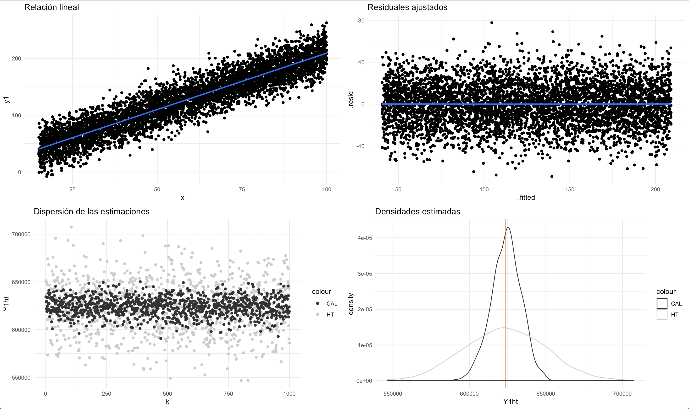
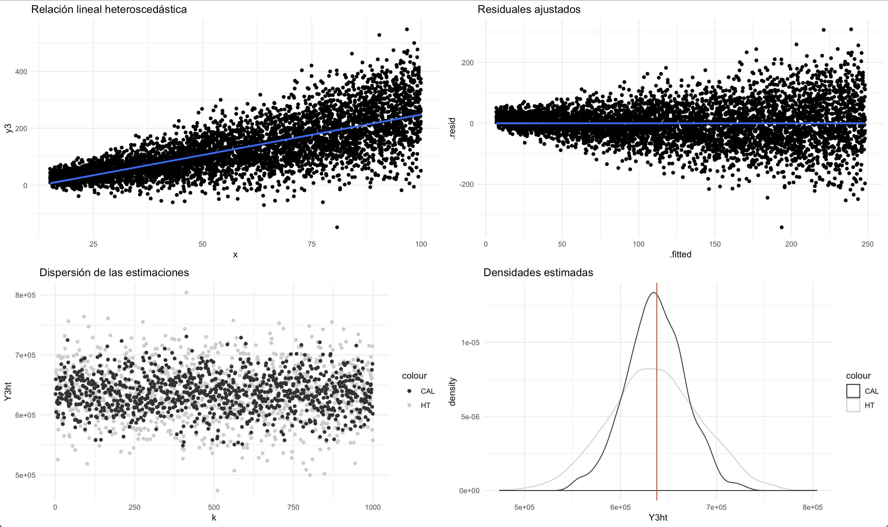
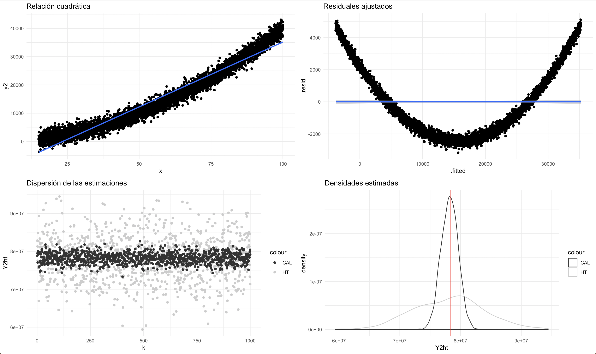
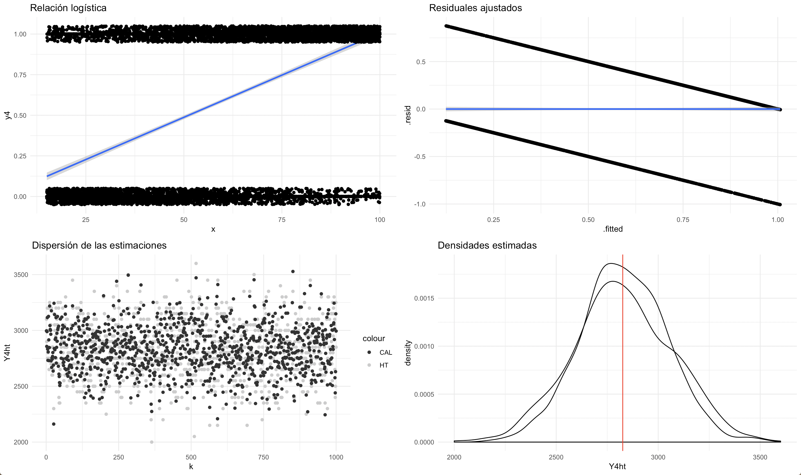

# (PART) Procesamiento transversal de las encuestas de hogares {-}

# Estimación de parámetros

Un estimador se define como una función de la muestra aleatoria $S$, al cual toma valores reales y sólo depende de los elementos pertenecientes a $S$. Las propiedades estadísticas de un estimador están determinadas por el diseño de muestreo. Es decir, dada la probabilidad de selección de cada muestra $s \in Q$, la esperanza, la varianza y otras propiedades de interés están definidas a partir de $p(s)$. En particular, la esperanza de una estimador $\hat\theta$ es

Así, las propiedades más comúnmente utilizadas de un estimador $\hat\theta$ son el sesgo, definido por

$$
B(\hat\theta)=E(\hat\theta)-\theta
$$

y el error cuadrático medio, dado por

$$
ECM(\hat\theta)=E[\hat\theta-\theta]^2=Var(\hat\theta)+B^2(\hat\theta).
$$

Si el sesgo de un estimador es nulo, se dice que el estimador es insesgado y cuando esto ocurre el error cuadrático medio se convierte en la varianza del estimador. Además, @Sarndal_Swensson_Wretman_2003 afirman que el objetivo en un estudio por muestreo es estimar uno a más parámetros poblacionales. @Gutierrez_2016 afirma que las decisiones más importantes a la hora de abordar un problema de estimación por muestreo son

1. La escogencia de un diseño de muestreo  y un algoritmo de selección que permita implementar el diseño.
1. La elección de una fórmula matemática o estimador que calcule una estimación del parámetro de interés en la muestra seleccionada.

Las anteriores no son decisiones independientes. Es decir, la escogencia de un estimador dependerá, usualmente, del diseño de muestreo utilizado. De hecho, si $\hat\theta$ es un estimador del parámetro $\theta$ y $p_s(\cdot)$ un diseño de muestreo definido sobre un soporte $Q$, entonces la estrategia de muestreo será la dupla $(p(\cdot),\hat{T})$.

## El estimador de Horvitz-Thompson 

### Estimación para para totales

La mayoría de indicadores sociales a nivel nacional pueden verse como funciones de totales de una o más variables de interés. Por ejemplo, si el interés está en estimar un total $t_y=\sum_U y_k$, el estimador de Horvitz-Thompson (HT) provee una metodología que induce insesgamiento.

$$
\hat{t}_y = \sum_s w_k y_k
$$

En donde la muestra $s$ hace referencia al subconjunto de la población que fue seleccionado siguiendo un diseño de muestreo probabilístico que induce los pesos de muestreo $w_k$, los cuales expanden el valor de la variable de interés $y_k$ para el $k$-ésimo individuo. Nótese que $w_k$ es el inverso multiplicativo de la probabilidad de inclusión de $k$-ésimo individuo en la muestra, $w_k = \pi_k^{-1}$. 

Como se verá más adelante, en presencia de esquemas de estratificación y selección de conglomerados y varias etapas, esta probabilidad resulta ser el producto de las probabilidades condicionales que surgen en los subsecuentes procesos de selección probabilística. Por tanto, el peso final de muestreo resulta ser por lo general una multiplicación de factores de expansión en cada etapa o fase del esquema de muestreo. En general, este estimador toma diferentes formas a medida que el diseño de muestreo cambia. A continuación se presenta una lista no exhausitva de algunas de los diseños más importantes en encuestas de hogares. 

#### Muestreo aleatorio simple {-}

En este caso, las probabilidades de inclusión son equivalentes para cada unidad incluida en la muestra,
$$
\pi_k =\frac{n}{N}
$$
Por tanto el estimador toma la siguiente forma:
$$
\hat{t}_{y,\pi}=\frac{N}{n}\sum_sy_k
$$

#### Muestreo proporcional al tamaño {-}

Este diseño de muestreo induce probabilidades de inclusión proporcionales al tamaño de una característica de información auxiliar disponible en el marco de muestreo; por tanto las probabilidades de inclusión obedecen la siguiente relación:
$$
\pi_k=\frac{n\ x_k}{t_x} \ \ \ \ \ \ \ \ \ 0<\pi_k\leq 1
$$
Por tanto el estimador toma la siguiente forma:
$$
\hat{t}_{y,\pi}=t_x \ \sum_s\frac{y_k}{n\ x_k}
$$

#### Muestreo estratificado {-}

Si $\hat{t}_{yh,\pi}$ estima insesgadamente el total de la característica de interés $t_{yh}$ del estrato $h$, entonces un estimador insesgado para el total poblacional $t_y$ está dado por
$$
\hat{t}_{y,\pi}=\sum_{h=1}^H \hat{t}_{yh,\pi}
$$
Por ejemplo, para un diseño de muestreo aleatorio estratificado, las probabilidades de inclusión de primer y segundo orden están dadas por:
$$
  \pi_k = \dfrac{n_h}{N_h} \ \ \ \text{si $k\in U_h$}
$$
En este caso, un estimador insesgado del total $t_{y}$ está dados por
$$
\hat{t}_{y,\pi}=\sum_{h=1}^H\dfrac{N_h}{n_h}\sum_{k\in S_h}y_k
$$

#### Muestreo de conglomerados {-} 

En el esquema general del muestreo por conglomerados, se utiliza un diseño de muestreo específico para la selección de los conglomerados en la muestra. La probabilidad de que el $k$-ésimo elemento, sea incluido en la muestra $S$ está dada por
$$
\pi_{k}=\pi_{Ii}  \ \ \ (\forall k \in U_i)
$$
Si se asume que la población está dividida en $N_I$ conglomerados y se selecciona una muestra $S_I$ de tamaño $n_I$, entonces para un diseño de muestreo aleatorio de conglomerados, el estimador de HT del total poblacional está dado por
$$
\hat{t}_{y,\pi}=\frac{N_I}{n_I}\sum_{S_I}t_{yi}
$$

#### Muestreo en dos etapas {-}

Bajo este diseño la probabilidad de inclusión de primer orden del $k$-ésimo elemento está dada por
$$
\pi_{k}=Pr(k\in S)=Pr(k\in S_i|i\in S_I)\ Pr(i\in S_I)=\pi_{k|i}\ \pi_{Ii}
$$
En particular, cuando el diseño de muestreo es aleatorio simple en las dos etapas, y para cada unidad primaria de muestreo seleccionada $i\in s_{Ih}$ de tamaño $N_i$ se selecciona una muestra $s_i$ de elementos de tamaño $n_i$, entonces el estimador HT toma la siguiente forma
$$
\hat{t}_{y,\pi}=\frac{N_{I}}{n_{I}}\sum_{i\in S_{I}}\frac{N_i}{n_i}\sum_{k\in S_i}y_k
$$

#### Muestreo en dos fases {-}

Para este caso particular, la probabilidad de que un elemento esté en la submuestra de la segunda depende de lo que haya sucedido en la primera fase; Por lo tanto la probabilidad de inclusión de cualquier elemento en la muestra final no tiene una forma cerrada y es algebraicamente intratable. Por ende, se define el estimador de Horvitz-Thompson condicionado, el cual toma la siguiente forma

$$
\hat{t}_{y,\pi^*}=\sum_{s}\frac{y_k}{\pi_{k}^*}=\sum_{s}\frac{y_k}{\pi_{ak}\pi_{k\mid{s_a}}}
$$

#### El estimador HT en una encuesta de hogares regular {-}

Bajo un diseño regular en una encuesta de hogares, en donde se tiene un esquema estratificado por regiones $h$ (agrupaciones de municipios), con tres etapas de selección dentro de cada estrato (la primera etapa con selección de municipios $i$ dentro del estrato, la segunda con selección de segmentos cartográficos $j$ y la última con selección de hogares $k$), entonces el peso de muestreo final y el estimador del total estará dado por la siguiente expresión

$$
\hat{t}_y = \sum_s w_k y_k = \sum_h \sum_{i \in s_h} \sum_{j \in s_{hi}} \sum_{k \in s_{hij}} w_{hijk} y_{hijk}
$$

### Estimación para tamaños y totales en dominios

En general todas las expresiones para totales son apropiadas para tamaños poblacionales, puesto que la variable $y_k = 1 \ \forall k \in s$. De esta forma, el estimador HT para un tamaño está dado por la suma de los factores de expansión:

$$
\hat{N} = \sum_s w_k 
$$

Bajo un diseño regular en una encuesta de hogares, con un esquema estratificado y tres etapas de selección, el estimador del tamaño poblacional estará dado por la siguiente expresión

$$
\hat{N} = \sum_s w_k = \sum_h \sum_{i \in s_h} \sum_{j \in s_{hi}} \sum_{k \in s_{hij}} w_{hijk} 
$$

Como lo afirma @Gutierrez_2016, en muchas investigaciones es necesario llevar a cabo estimaciones sobre la población en general, y también sobre subgrupos de ella (denominados dominios por la subcomisión en muestreo de las Naciones Unidas). La identificación de los dominios se logra una vez la información de los elementos ha sido registrada. Los dominios tienen que cumplir las siguientes características:

1. Ningún elemento de la población puede pertenecer a dos dominios.
1. Todo elemento de la población debe pertenecer a un único dominio.
1. La reunión de todos los dominios es la población del estudio.

La estimación por dominios se caracteriza por el desconocimiento de la pertenencia de las unidades poblacionales al dominio. Es decir, para conocer cuáles unidades de la población pertenecen al dominio, es necesario realizar el proceso de medición. En primer lugar construir una función indicadora $z_{dk}$ de la pertenencia del elemento al dominio, la cual toma el valor 1, si $k\in U_d$, y toma el valor 0, en otro caso. Ahora se puede utilizar los principios del estimador de Horvitz-Thompson para hallar un estimador insesgado del tamaño del dominio $U_d$, dado por:

$$
\hat{N}_d = \sum_{s_d} w_k 
$$

Al multiplicar la variable de pertenencia $z_{dk}$ por el valor de la característica de interés $y_k$, se crea una nueva variable $y_{dk}$ dada por $y_{dk}=z_{dk} \ y_k$, y una vez construida es posible definir el estimador insesgado del total de la característica de interés en el dominio $U_d$, dado por:
$$
\hat{t}_{y_d,\pi}=\sum_sw_k\ y_{dk}=\sum_{S_d}w_ky_k
$$

## El estimador de Hájek para medias y proporciones

Cuando se quieren estimar medias y proporciones, es muy probable que no se tenga conocimiento exacto del tamaño poblacional. Específicamente, para la estimación de indicadores a nivel de hogar en encuestas mensuales, es difícil tener certeza exacta del número de hogares en el país mes a mes. Por esta razón, cuando se definen estimadores de indicadores relativos, es necesario hacer un doble proceso de inferencia: a nivel de la característica de interés que se quiere investigar, y a nivel del tamaño de la población. El enfoque más comúnmente usado es el de Hájek, que define el estimador para una media de la siguiente manera:

$$
\hat{\bar{y}}_s=\frac{\hat t_y}{\hat N} = \frac{\sum_sw_k\ y_{k}}{\sum_sw_k}
$$

Para el caso de la estimación de una proporción, el estimador de Hájek toma la siguiente forma:

$$
\hat{P}_d=\frac{\hat N_d}{\hat N} = \frac{\sum_{s}w_k\ z_{dk}}{\sum_sw_k} = \frac{\sum_{s_d}w_k}{\sum_s w_k}
$$

Para el caso de la estimación de una media en una subpoblación, como por ejemplo la media del gasto en el área urbana, el estimador de Hájek puede escribirse de la siguiente manera:
$$
\hat{\bar{y}}_d=\frac{\hat t_{y_d}}{\hat N_d} = \frac{\sum_s w_k\ y_{k} \ z_{dk} }{\sum_s w_k \ z_{dk}} = \frac{\sum_{s_d} w_k\ y_{k}}{\sum_{s_d} w_k}
$$

En general, este tipo de estimadores se pueden considerar no lineales y sus propiedades estadísticas son complejas, y puesto que tanto el numerador como el denominador son variables aleatorias, es necesaria la verificación de algunos supuestos que tienen que ver con el tamaño de la población y de la muestra.  

Bajo un diseño regular en una encuesta de hogares, con un esquema estratificado y tres etapas de selección, el estimador de la media poblacional estará dado por la siguiente expresión:

$$
\hat{\bar{y}}_s=\frac{\sum_h \sum_{i \in s_h} \sum_{j \in s_{hi}} \sum_{k \in s_{hij}} w_{hijk} \ y_{hijk}}{\sum_h \sum_{i \in s_h} \sum_{j \in s_{hi}} \sum_{k \in s_{hij}} w_{hijk} }
$$

Las demás expresiones para los estimadores de proporciones o medias en una subpoblación, bajo un diseño de muestreo regular, pueden ser fácilmente derivadas siguiendo los principios expuestos anteriormente. 

## Otros estimadores de muestreo

En presencia de información auxiliar es posible mejorar la eficiencia de la estimación acudiendo a diferentes formas funcionales que estiman el total; por ejemplo, con el estimador de Razón:

$$
\hat{t}_y = t_x \frac{\sum_s w_k y_k}{\sum_s w_k x_k}
$$

En donde $t_x$ denota el total poblacional, que se supone conocido para toda la población, de una variable auxiliar $x$ que es preguntada en la encuesta de hogares. Por supuesto, en el análisis de este tipo de encuestas es común realizar inferencias sobre parámetros que tienen una forma no lineal. Uno de los más básicos es la razón poblacional $R_U = t_{y_1} / t_{y_2}$ cuya estimación se lleva a cabo estimando ambos componentes de la fracción 

$$
\hat{R}= \frac{\hat{t}_{y_1}}{\hat{t}_{y_2}}
= \frac{\sum_s w_k y_{1k}} {\sum_s w_k y_{2k}}
$$

Como se indicó anteriormente, la estimación de un promedio poblacional $\bar{y}_U = t_y / N$, se lleva a cabo de forma eficiente estimando el tamaño de la población y se puede ver como un caso particular de la estimación de una razón. Por otra parte, las encuestas de hogares con diseños panel o rotativos, tienen un mayor interés en la estimación del cambio de indicadores en dos periodos tiempo $\Delta = t_y^{(t)} - t_y^{(t-1)}$. Nótese que un estimador de este parámetro está dado por

$$
\hat{\Delta} = \hat{t}_{y^{(t)}} - \hat{t}_{y^{(t-1)}}
$$

Además, es posible mejorar la estimación del total actual $t_y^{(t)}$ al tener en cuenta la información inducida por el traslape de la encuesta en el segundo periodo, así:

$$
\tilde{t}_{y^{(t)}} = \alpha \hat{t}_{y^{(t)}} 
+ (1 -\alpha) (\tilde{t}_{y^{(t-1)}} - \hat{\Delta})
$$

En donde $0 < \alpha < 1$. Por otro lado, si el interés está en estimar algunas características asociadas con la pobreza, es posible utilizar estimadores más complejos. Siendo $y_k$ el ingreso del individuo $k$ y $l$ el umbral de pobreza, entonces el siguiente estimador puede ser utilizado 

$$
\hat{F}_{\alpha}=\frac{1}{N}\sum_{k\in s} w_k 
\left(\frac{l-y_k}{l}\right)^{\alpha}I(y_k<l)
$$

En donde $I(y_k<l)$ es una variable indicadora que toma el valor uno si $y_k<l$ o cero, en cualquier otro caso. Note que si $\alpha = 0$, se tiene una estimación de la incidencia de la pobreza y si $\alpha = 1$, se obtiene un estimación de la brecha de la pobreza [@Foster_Greer_Thorbecke_1984].

La selección del estimador está altamente relacionada con el diseño de la encuesta. Por ejemplo, si se pretende estimar un indicador para un periodo de tiempo definido, el diseño de la encuesta no debería inducir un esquema de rotación que tenga traslape de hogares, puesto que la correlación del indicador induciría un aumento de su varianza y por ende pérdida de eficiencia. Sin embargo, si se desea estimar el cambio del indicador entre dos periodos de tiempos, es necesario contar con un esquema de rotación que asegure un tamaño de muestra suficiente para estimar con precisión este cambio. @Cochran_1977[sección 12.13] afirma que, cuando el interés se centra tanto en la estimación del indicador en el periodo actual como en la estimación del cambio entre periodos, es recomendable tener una tasa de traslape de 2/3, 3/4 o 4/5 de una ronda a otra.

## Estimadores de calibración

La calibración se ha establecido como un importante instrumento metodológico en la producción de grandes masas de estadísticas [@Sar08]. Esta metodología integra información auxiliar en las estimaciones de la encuesta, no solo para garantizar la consistencia con las cifras oficiales reportadas por los INE, sino para hacer más eficiente el proceso de estimación. @Gutierrez_2016 afirma que da una breve descripción de este método:

1. Suponga que se tiene acceso a un vector de información auxiliar, $\mathbf{x}_k=(x_{1k}, x_{2k},\ldots,x_{pk})$, de $p$ variables auxiliares, el cual es conocido para los individuos seleccionados en la muestra.
1. Además, por registros administrativos u otras fuentes de confianza, se tiene el conocimiento del total del vector de información auxiliar $\mathbf{t_X}=\sum_{k\in U}\mathbf{x}_k$.
1. El propósito del estudio es estimar el total de la característica de interés incorporando la información auxiliar, dada por $\mathbf{x}_k \ \ \ k\in S$.
1. Se requiere que las estimaciones cumplan con la siguiente restricción dada por
$$
  \sum_{k\in S}w_k\mathbf{x}_k = \mathbf{t_X}
$$
y conocida como ecuación de calibración.
1. El resultado de la calibración es un nuevo conjunto de pesos $w_k$ que son muy cercanos al inverso de la probabilidad de inclusión del $k$-ésimo elemento $d_k=1/\pi_k$

En general, en América Latina, la estrategia de estimación utilizada por los INE recurre a la metodología de calibración sobre proyecciones poblacionales en los dominios de representatividad de la encuesta. Por ejemplo, departamento, zona urbana, zona rural, sexo y/o grupos de edad. Algunas ventajas de utilizar estos procedimientos es que las estimaciones tendrán un sesgo despreciable, y los errores estándares serán más pequeños al compararlos con los del estimador de Horvitz-Thompson; de esta forma se crea un sistema de ponderación que reproduce la información auxiliar disponible y que es eficiente al momento de estimar cualquier característica de interés en la encuesta. Esta coherencia entre las cifras oficiales y las que la encuesta puede producir hace que sea preferible el uso de los estimadores de calibración. 

En un encuesta de hogares las restricciones de calibración pueden establecerse sobre características de hogares y características de personas al mismo tiempo. De esta forma, por ejemplo, es posible calibrar sobre las proyecciones demográficas de personas y al mismo tiempo controlar las estimaciones del número de hogares en el país de manera conjunta. @Estevao_Sarndal_2006 discuten una amplia variedad de casos en donde se calibra conjuntamente en distintos niveles de desagregación sobre diferentes esquema de muestreo. Por ejemplo, para la *Encuesta Continua de Empleo* de Bolivia la calibración está inducida por una post-estratificación sobre los tamaños poblacionales de los cruces resultantes entre las variable Departamento (hay 9 departamentos), Zona (rural y urbano) y PET (con dos categorías: mayor o igual a 10 años y menor de 10 años).

En resumen, utilizar este tipo de estimadores garantiza una *consistencia estética*, puesto que es deseable que las estimaciones puntuales de las encuestas coincidan con los conteos censales, proyecciones poblacionales, registros estadísticos o registros administrativos. Además, existirá un a *aumento de la precisión*, porque en la búsqueda de la mejor estrategia de muestreo, el estadístico quiere obtener cifras precisas y confiables que induzcan intervalos de variación angostos y menores errores de muestreo. Por último, si existe una integración adecuada de la información auxiliar, se *disminuye el sesgo* generado por la ausencia de respuesta (debido a los individuos) o por la falta de cobertura (debido a los defectos del marco de muestreo).

### Ganancia en eficiencia 

Para mostrar cómo los estimadores de calibración inducen menores varianzas que los estimadores comunes, se planeó el siguiente experimento de simulación empírica:

1. Se generaron 4 conjuntos de datos que guardan cierto tipo de relación específica entre la variable de interés y las variables de información auxiliar.
1. Se utilizó la metodología de calibración y se compararon, de forma empírica, para mil iteraciones, las medidas de variabilidad. 

Las cuatro figuras siguientes figuras muestra la relación lineal entra las variables (arriba-izquierda), los resudiales ajustados en un modelo de regesión simple (arriba-derecha), la dispersión (abajo-izquierda) de las estimaciones de Horvitz-Thompson (puntos grises) y de las estimaciones de calibración (puntos negros), así como la distribución empírica (abajo-derecha) del estimador de Horvitz-Thompson (línea gris) y del estimador de calibración (línea negra)

Para el primer conjunto de datos, se supuso que existe una relación lineal entre la característica de interés y una variable de información auxiliar continua. Se nota que existe homoscedasticidad en el modelo y que los residuales tienen un comportamiento coherente. A pesar de que ambos estimadores se muestran insesgados para el parámetro de interés, se nota que el estimador de calibración es menos disperso y más eficiente.

El segundo conjunto de datos asume que existe una relación lineal entre la característica de interés y una variable de información auxiliar continua. Se nota que existe heteroscedasticidad en el modelo y los residuales lo muestran. A pesar de que ambos estimadores se muestran insesgados para el parámetro de interés, el estimador de calibración es un poco más eficiente que el de Horvitz-Thompson.

Para el tercer conjunto de datos asume que existe una relación cuadrática entre la característica de interés y una variable de información auxiliar continua. Al utilizar un estimador de calibración lineal, los residuales muestran un comportamiento inapropiado. Sin embargo, ambos estimadores se muestran insesgados para el parámetro de interés, pero el estimador de calibración es más eficiente que el de Horvitz-Thompson.

El último conjunto de datos asume que existe una relación logística entre la característica de interés y una variable de información auxiliar dicotómica Al utilizar un estimador de calibración lineal, los residuales muestran un comportamiento inapropiado. Ambos estimadores se muestran insesgados para el parámetro de interés e igual de eficientes.

¿Por qué siempre se mejora la eficiencia? Es posible demostrar que la razón entre la varianza del estimador de calibración con la varianza del estimador de Horvitz-Thompson está supeditada al coeficiente de determinación $R^2_{\xi}$ en un modelo de regresión lineal simple $\xi$ entre la característica de interés y la información auxiliar. 

$$
\frac{Var(\hat t_{y, cal})}{Var(\hat t_{y, HT})} = (1-R^2_{\xi} + o(\sqrt{n})) \approx (1-R^2_{\xi})
$$

Por ende, usar la metodología de calibración supone casi siempre una ganancia en la eficiencia de la estrategia de muestreo.

### Diferentes formas del estimador de calibración

La calibración es un ajuste que se realiza a los pesos de muestreo con el propósito de que las estimaciones de algunas variables de control reproduzcan de forma perfecta los totales poblacionales de estas variables. Sin embargo, es necesario tener en cuenta las diferencias entre los diferentes métodos de calibración, que en general corresponderán con el nivel de desagregación de información auxiliar:

1. Calibración con variables continuas, que es el caso en donde la calibración se realiza con totales de variables continuas como ingreso o gasto, entre otras. 
2. Post-estratificación con variables categóricas, que representa el caso en donde la calibración se realiza con los tamaños poblacionales (basados en proyecciones demográficas o registros administrativos) de subgrupos de interés. 
3. *Raking* con variables categóricas, que se define como una calibración sobre los tamaños marginales de tablas de contingencia de subgrupos de interés. A diferencia del caso anterior, esta calibración no tiene en cuenta los tamaños de los cruces, sino solo los tamaños marginales; por ende, este método induce menos restricciones. 

#### Postestratificación {-}

La postestratificación es una de las técnicas más usadas para el ajuste de los pesos de muestreo vía calibración. Este ajuste requiere la definición de categorías poblacionales. Por ejemplo, personas en un determinado grupo de edad, en cierta región y de cierta razan. Este método se se implementa dentro de cada uno de los cruces inducidos por las covariables de interés (edad X región X raza). Nótese que es necesario tener acceso a la información auxiliar a nivel de *todos* los cruces definidos por los subgrupos. Usualmente corresponden a proyecciones demográficas. En este caso, la suma de los pesos ajustados reproducirán con exactitud los tamaños poblacionales en cada cruce. 

Las categorías formadas para definir los pesos de muestreo se conocen como *post-estratos* puesto que son definidas después de que la muestra es seleccionada y los datos son recolectados. Esta es una ventaja pues estas variables no necesariamente participan en la planificación del diseño de muestreo. Por ejemplo, en una encuesta de hogares es difícil estratificar por raza, edad, sexo o ciclo educativo alcanzado. Como se conoce que estas variables pueden estar correlacionadas con la pobreza, el ingreso o la ocupación, sería una buena idea contemplarlas en la calibración.

De esta manera, siendo $g = 1, \ldots, G$ el indicador del cruce poblacional (post-estrato), el estimador de postestratifiación queda definido de la siguiente manera:

$$
\hat{t}_{y, pos} = \sum_{g = 1}^G \frac{N_g}{\hat{N}_g}\hat{t}_{y_g}
$$

En donde $N_g$ corresponde al tamaño poblacional del post-estrato, $\hat{N}_g = \sum_{s_g} d_{k}$ y $\hat{t}_{y_g} = \sum_{s_g} d_{k} y_k$. Por lo anterior, el factor de expansión de estimador postestratificado queda definido como sigue:

$$
w_k= d_k \frac{N_g}{\hat{N}_g} \ \ \ \ \ \forall \ k \in s_g
$$

Note que $d_k$ corresponde al peso inducido por el diseño de muestreo, corregido por los ajustes de elegibilidad y por la ausencia de respuesta.

Por último, se debe considerar que la cantidad de postestratos en la calibración está inducido por la cantidad de interacciones en las variables auxiliares. En algunos casos, es posible encontrar cientos de interacciones. Aunque los tamaños de los postestratos se reproduce sin error, esto puede decrecer la eficiencia de la calibración en las variables de interés. Es decir que, muchas variables e interacciones hacen que las estimaciones sean inestables, sobre todo si existen cruces con celdas vacías. Es posible que el efecto de las interacciones influencie la creación de los nuevos pesos calibrados y se tengan outliers en los pesos de calibración resultantes. 

#### Raking {-}

¿Qué sucede si los conteos poblacionales (información auxiliar) no están disponibles para todos los cruces de las variables de calibración? Es posible que los agregados poblacionales de las variables provengan de distintas fuentes y no se pueda llegar a nivel de cruce. En este caso, es factible calibrar los marginales de la tabla cruzada, sin necesidad de calibrar todas sus entradas. En este caso, el número de restricciones decrecería con respecto a la postestratifación, pues se sumaría el número de categorías, mientras que en la postestratificación se multiplican. 

Para ajustar los marginales de la tabla cruzada, es necesario realizar un procedimiento iterativo (IPFP), el cual no tiene una escritura cerrada [@Gutierrez_2016, capítulo 10]. Por ejemplo, si el *raking* es de dos marginales, se ajustan primero las filas, luego las columnas y así sucesivamente hasta alcanzar la convergencia de los pesos calibrados y el procedimiento se detiene cuando se alcanza una tolerancia prefijada. 

En general, los pesos calibrados se escriben de la siguiente manera:

$$w_k = d_k \times exp(u_h) \times exp(v_g)$$
En donde $u_h$ es una función de los totales marginales de las filas de la tabla cruzada y $v_g$ es una función de los totales marginales de las columnas. El *raking* permite utilizar variables que pueden ser predictoras de las variables de interés o explicar la probabilidad de responder del hogar (o persona), además de mejorar las tasas de cobertura del marco de muestreo.

### La calibración como un cambio de paradigma

@Sar08 concluye que existen seis ideas sobre las cuales vale la pena profundizar un poco más. A continuación se reproducen las ideas de @Gutierrez_2016 sobre estos criterios para enfatizar el uso práctico de los estimadores de calibración:

1. La calibración tiene un vínculo íntimo con la práctica. La fijación con métodos de ponderación de las agencias que manejan las estadísticas oficiales es una poderosa costumbre que empezó con la ponderación de unidades mediante el inverso de su probabilidad de inclusión y siguió con las ponderaciones surgidas del enfoque de post-estratificación. Las ponderaciones de calibración extienden las anteriores ideas. La calibración es reciente como término en el muestreo, pero no lo es como técnica para producir ponderaciones. Algunos autores derivaron estas ponderaciones con el argumento de que deberían diferir de la manera más mínima posible de los pesos originales. Otros autores encontraron las ponderaciones al reconocer que un estimador de regresión lineal podría ser escrito como una suma ponderada de los valores de la característica de interés. De allí surgieron términos tales como ponderación de muestreo, ponderación de regresión y ponderación de caso.

1. La calibración provee una forma sistemática para involucrar la información auxiliar. En la mayoría de aplicaciones prácticas, la calibración provee un enfoque simple para incorporar esta información dentro de la etapa de estimación. La información auxiliar fue usada para mejorar la precisión de los estimativos mucho antes que el término calibración fuera popular. La calibración puede ser usada efectivamente en encuestas donde la información auxiliar está disponible en diferentes niveles. Al realizar un muestreo en dos etapas la información auxiliar puede existir para las unidades de la primera etapa (los conglomerados) y puede existir otra información para las unidades de la segunda etapa (elementos o conglomerados).

1. En algunas ocasiones el término calibración se refiere a una forma de conseguir estimativos consistentes^[En este apartado la palabra consistente se da en el sentido de la consistencia con los totales de la información auxiliar.]. Las ecuaciones de calibración imponen esta propiedad de consistencia sobre el vector de ponderaciones; así que, cuando éste se aplica a las variables auxiliares el resultado será consistente con los totales de estas variables. Un deseo de promover la credibilidad en las estadísticas oficiales es una razón para que las entidades busquen la consistencia. Cuando la motivación primaria para la calibración no es la concordancia con los totales de la información auxiliar sino el reducir la varianza y el sesgo debido a la ausencia de respuesta entonces el vector de ponderaciones se dice balanceado.

1. El enfoque de calibración ha ganado popularidad en las aplicaciones reales debido a que las estimaciones resultantes son fáciles de interpretar y de motivar puesto que están directamente relacionadas a los pesos inducidos por el diseño de muestreo. La calibración sobre los totales conocidos brinda al usuario una forma natural y transparente de estimación. El usuario que entiende la ponderación muestral aprecia el método de calibración puesto que modifica sutilmente los pesos originales, pero al mismo tiempo respeta los totales de la información auxiliar y mantiene el sesgo despreciable. Además, en la mayoría de aplicaciones, la calibración induce un único vector de ponderaciones aplicable a todas las variables involucradas en el estudio. Esta última razón hace que este método sea muy apetecido en las entidades oficiales que manejan encuestas muy extensas.

1. Algunos autores usan la palabra calibración en combinación con otros términos para describir varias direcciones de pensamiento. Por ejemplo, es posible encontrar términos como calibración de modelo, calibración G, calibración armonizada, calibración a un nivel más alto, calibración de regresión, calibración no lineal, calibración super-generalizada, calibración de modelos de redes neuronales, calibración basada en modelos locales polinomiales, entre otras.

1. Si la calibración representa un nuevo enfoque demarcado claramente de sus predecesores, entonces es tiempo de hacer la pregunta: ¿La calibración generaliza las teorías anteriores? ¿La calibración da mejores respuestas a las preguntas de importancia, que los enfoques de estimación anteriores? En la práctica el estadístico encuentra algunos pormenores tales como ausencia de respuestas, deficiencias del marco muestral y errores de medición. Es cierto que algunos procesos como la imputación y la reponderación para no respuestas son ampliamente difundidos y usados en la práctica. Sin embargo queda un sinsabor al utilizar estos métodos pues no están enmarcados dentro de una teoría exhaustiva de inferencia en poblaciones finitas. La mayoría de artículos teóricos tratan con la estimación de parámetros bajo un mundo ideal, que no existe en la práctica, donde la ausencia de respuesta y otros errores no muestrales están ausentes.

