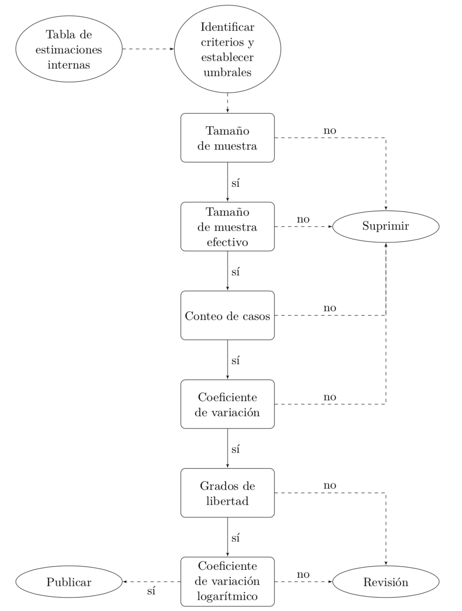

# Calidad de las estimaciones

XXXXXXXXXXXXXXXXXXXXXXXXXXXXXXXXXXXXXXXXXXXXX

La División de Estadísticas de la Comisión Económica para américa Latina y el Caribe provee estimaciones de indicadores sociales para cada país de la región. A través de convenios de cooperación, las oficinas nacionales de estadística (ONE) proveen anualmente las bases de datos de las encuestas de hogares y estas son sistematizadas en un repositorio interno llamado `BADEHOG`. 

Las encuestas de hogares tienen un diseño complejo, probabilístico, estratificado, multietápico y con probabilidades de inclusión no uniformes. Por ende, las estimaciones elaboradas a partir de estas operaciones estadísticas están sujetas al error muestral, y se requiere evaluar su validez estadística mediante diversos indicadores de calidad que describen su precisión y confiabilidad y que a su vez alertan al usuario cuando la precisión de la estimación no es confiable. Una vez obtenido el indicador de interés (por ejemplo, la proporción de personas en situación de pobreza y de pobreza extrema), se estiman los intervalos de confianza y otros indicadores de calidad con base en la información sobre el diseño muestral complejo, resumida en el factor de expansión, los estratos y las unidades primarias de muestreo (UPM), mediante el comando `svy` en `Stata` y `srvyr` en `R`. Cuando las encuestas de hogares sólo proveen los pesos de muestreo se utiliza el ajuste de @West_McCabe_2012. Los criterios de calidad estimados para cada cifra están comprendidos por: 

- *Intervalos de confianza*: describe un conjunto valores en donde es posible que el indicador de interés se encuentre. Este intervalo está determinado por el estimador de muestreo para el indicador, su error estándar y el percentil 0,975 de una distribución $t-student$ con grados de libertad igual a la diferencia entre estratos y UPM.
-	*Tamaño de muestra*: el número de unidades que comprenden el diseño de muestreo afecta indirectamente la amplitud del intervalo de confianza mediante el error estándar, el cual depende de manera inversamente proporcional al tamaño de muestra.  Con un mayor tamaño de muestra tendremos estimaciones más precisas y un intervalo de confianza más angosto.
-	*Efecto de diseño*: da cuenta de la correlación entre la variable de interés y la distribución de los hogares en las unidades primarias de muestreo.  Esta medida depende del promedio de hogares seleccionados por UPM y del coeficiente de correlación intraclase entre la variable de interés y las UPM.
-	*Tamaño de muestra efectivo*: se calcula como la razón entre el tamaño de muestra y el efecto de diseño.  El tamaño de muestra efectivo tiene por objeto deflactar el tamaño de muestra inicial por medio de la correlación intraclase de las UPM seleccionadas; de esta forma se evita contabilizar el exceso de información repetida debido a la aglomeración de los hogares en las UPM.
-	*Coeficiente de variación*: este indicador modela el error de muestreo de un estimador.  Se calcula como la razón entre el error estándar de la estimación y su estimación puntual. Esta medida es ampliamente utilizada para validar la precisión de una estimación, un coeficiente de variación elevado puede implicar que el error estándar de la estimación es relativamente grande.
-	*Grados de libertad*: se definen como la diferencia entre el número de UPM y el número de estratos. Estos definen el valor del percentil de la distribución $t-student$ a la hora de calcular el intervalo de confianza; mientras más grados de libertad, el intervalo de confianza será más estrecho y la estimación será más precisa.
- *Coeficiente de variación logarítmico*: como el coeficiente de variación no es simétrico alrededor de 0.5, esta medida se define como una transformación logarítmica sobre la proporción, la cual evita que las estimaciones cercanas a cero sean castigadas con un coeficiente de variación alto aun cuando su variación sea pequeña.
-	*Conteo de casos no ponderado*: está determinado por el número de casos en la muestra afectados por el fenómeno de estudio, sin considerar el factor de expansión, ni el diseño complejo de la encuesta. 

El proceso de estimación de las medidas de calidad produce una *alerta*, que establece una señal en caso de que la estimación no sea confiable para hacer inferencias dado el diseño de muestreo complejo de cada encuesta en particular. Una estimación no confiable arrojará una señal de alerta en los siguientes casos:

1. Tamaño de muestra menor a 100 unidades.
2. Tamaño de muestra efectivo menor a 68 unidades. 
3. Conteo de casos no ponderado menor a 50 unidades.
4. Coeficiente de variación mayor a 20%. 
5. Grados de libertad menor a 10.
6. Coeficiente de variación logarítmico mayor a 17.5%.


## Introducción

Una gran cantidad de indicadores sociales son estimados a partir de las encuestas de hogares. En particular, la Unidad de Estadísticas Sociales de la CEPAL utiliza el repositorio de bases de datos de encuestas de hogares BADEHOG que agrupa un total de 18 países y con el cual se calculan estimaciones de pobreza, distribución del ingreso, gastos, mercado laboral, entre otros. En este documento, se pretende generar una metodología de procesamiento de las bases de este repositorio, que le permita al analista decidir acerca de la pertinencia de una estimación con base en algunos criterios de calidad en términos de la precisión de las estimaciones. 

El resultado de los procesamientos corresponderá a una tabla simple que puede alimentar los procesos de análisis de información propios en la División de Estadísticas, así como dar apoyo a otras Divisiones que usen el repositorio de datos BADEHOG. El procesamiento computacional de este procedimiento se realiza conjuntamente con el software estadístico `R` (utilizando las librerías `dplyr`, `srvyr`, `survey`, `snow` y `TeachingSampling`) y con `Stata`. Como ejemplo particular, el cuadro \ref{T1} presenta la estimación de la proporción de la variable `Pobreza` (considerando las categorías `Pobre` y `No pobre`) para las subpoblaciones `Migrante` y `No migrante` en un país Latinoamericano para el año 2017. Note que la naturaleza de los resultados no es compleja y este documento describen los detalles del procesamiento, así como la definición de cada columna resultante.

\footnotesize
| Subpoblación | Proporción estimada | Límite inferior | Límite superior | Coeficiente de variación | Efecto de diseño | Tamaño de muestra | Tamaño de muestra efectivo | Grados de libertad | Número de casos | Coeficiente de variación logarítmico | Alerta |
|:--------------------------------:|:------------------------:|:---------------:|:---------------:|:------------------------:|:----------------:|:-----------------:|:---------------------------------------:|:------------------:|:---------------:|:------------------------------------------:|:----|
|Migrante     | 0.15| 0.06| 0.30| 40.0|  3.5|   127|    37|     43|    23| 20.8|*    |
|No migrante  | 0.35| 0.33| 0.37|  2.6| 14.5| 38074|  2620|    929| 12698|  2.5|     |
|Total        | 0.35| 0.33| 0.37|  2.6| 14.5| 38201|  2632|    929| 12721|  2.5|     |

Table: *Estimación de la proporción de personas pobres desagregada por estado migratorio, junto con algunas medidas de precisión, para un país Latinoamericano.*
\label{T1}

\normalsize	

En el caso anterior, se presenta un procesamiento que proviene de una base de datos del repositorio BADEHOG, el cual presenta la proporción estimada de personas pobres desagregada en la subpoblación definida por el estado migratorio. Esta tabla contiene además algunas medidas de calidad que pueden ser utilizadas para concluir acerca de la precisión de la estimación puntual y, por consiguiente, la pertinencia de utilizarla para hacer recomendaciones de política pública. Como se puede notar, cuando una estadística se clasifica como no confiable, la tabla lo muestra mediante la incorporación de un asterisco en la columna llamada `alerta`. 

Basados en la anterior tabla, se puede concluir que la estimación del porcentaje de pobreza en las personas migrantes no es precisa. La razón por la cual esta cifra no es precisa es simplemente porque la encuesta no fue planeada con estos propósitos y por ende una o más medidas de calidad están evidenciándolo. Nótese que la implicación entre precisión y diseño va en una sola dirección: *si la precisión es deficiente significa que esta estimación no fue considerada en el diseño de la encuesta.* Sin embargo, es posible encontrar en muchas ocasiones que a pesar de que una estimación no fue considerada inicialmente por el diseño de la encuesta, está pueda ser considerada como precisa y confiable. En este documento se definen y establecen algunos criterios que son considerados actualmente por algunas oficinas nacionales de estadística, así como por entidades dedicadas a la investigación social. 

## Principios básicos de estimación 

En primer lugar, se supone que cada base de datos del repositorio BADEHOG representa el levantamiento de una encuesta de hogares para algún país de la región. Esta encuesta está inducida por la selección de una muestra $s$ de tamaño $n$ sobre la población de interés $U$ de tamaño $N$. Para realizar la medición sobre las unidades pertenecientes a la muestra, se plantea un diseño de muestreo $P(s)$, que se asume probabilístico, estratificado y multietápico [@Gutierrez_2016].

El procesamiento de las bases de datos que vienen de encuestas de hogares debe tener en cuenta los criterios del diseño que se estableció para realizar el levantamiento de la información primaria. En particular, la base de datos debe contener como mínimo la siguiente información para cada individuo:

- *Estratos*: son particiones geográficas de la población para las cuales se definen selecciones independientes. Estas agrupaciones son mutuamente excluyentes e inducen $H$ sub-grupos poblacionales. En las bases de datos de `BADEHOG`, los estratos están definidos por la variable categórica `_estrato`.
- *Unidades primarias de muestreo*: son agregaciones de hogares definidas por un límite cartográfico proveniente del censo. Corresponden a la primera subdivisión de la población de hogares y están anidadas dentro de los estratos. En las bases de datos de `BADEHOG`, las UPM están definidas por la variable categórica `_upm`.
- *Pesos de muestreo*: corresponden a las ponderaciones utilizadas para representar a la población nacional a partir de los elementos de la muestra. En las bases de datos de `BADEHOG`, los pesos de muestreo están definidos por la variable continua `_fep`. 

### Análisis en subpoblaciones

Aunque el marco de referencia de la teoría de muestreo es la estimación de un parámetro de interés sobre alguna característica de interés, lo cierto es que en la práctica no solo se necesitan estimaciones que cobijen la población entera, sino que también son indispensables estimaciones que involucren subgrupos poblacionales, puesto que éstos inducen una partición de la población de interés. En general, es bien sabido que cuando se habla de subgrupos poblacionales se está haciendo referencia a dominios de interés, estratos o post-estratos. Cuando el investigador se enfrenta a una encuesta que tiene en cuenta subgrupos poblacionales - es decir, siempre - es indispensable conocer en qué se diferencian cada uno de ellos, pues de esto depende que la investigación arroje resultados confiables mediante el planteamiento de la mejor estrategia de muestreo.

En términos de notación, sean $U_1, \ldots, U_g, \ldots, U_G$ los subgrupos poblacionales de interés, lo cuales constituyen una partición de la población; además, $N_g$ denota el tamaño absoluto del subgrupo $U_g$, y por ende, se tiene que $\sum_{g=1}^G N_g=N$. A partir de las anteriores definiciones, se han planteado algunas diferencias y similitudes entre cada uno de ellos. A continuación se resumen rápidamente:

- **Dominios de interés**: Este tipo de subgrupos poblacionales son aquellos para los cuales se requieren estimaciones separadas. Estos requerimientos se planean en la etapa de diseño para asegurar que el diseño de la muestra sea tal que al momento de la recolección de la información exista una buena cobertura en cada uno de los dominios de interés. Lo anterior sólo se puede lograr ampliando el tamaño de muestra $n$ puesto que el marco de muestreo no informa acerca de la pertenencia de los individuos a los dominios de interés. Un aspecto importante de esta clase de subgrupos poblacionales es que el número de individuos en la muestra que pertenecen a un dominio $n_g$ de interés es siempre aleatorio, y para algunos dominios particulares puede llegar a ser muy pequeño. Por otro lado el tamaño absoluto de cada dominio $N_g$ no se conoce ni antes de la etapa de diseño ni después de la etapa de estimación. Un ejemplo claro de estos subgrupos es la condición de ocupación, la condición de pobreza, la rama de actividad, entre otros.

- **Estratos**: Cuando el marco de muestreo permite conocer la pertenencia de todos los individuos de la población a un subgrupo poblacional, se dice que esta clase de subgrupos se llaman estratos. Más aún, cuando se sabe que la característica de interés tiene un comportamiento distinto en cada uno de los estratos y se planea un diseño de muestreo que tenga en cuenta este aspecto mediante la selección aleatoria de unidades en cada uno de los estratos, se dice que el diseño de muestreo es estratificado. El aspecto fundamental de esta clase de subgrupos poblacionales es que el conocimiento de la pertenencia de los individuos a los estratos se incorpora en la etapa de diseño de la muestra. Nótese que a diferencia de los dominios, en los estrato se conoce tanto $N_g$ como $n_g$ antes de la etapa de estimación. Un ejemplo claro de estos subgrupos son las zonas urbanas o rurales, regiones y municipios.

- **Post-estratos**: La propiedad que caracteriza a este tipo de subgrupos poblacionales es que aunque en la etapa de diseño el tamaño del post-estrato $N_g$ es conocido, se desconoce el número de individuos que pertenecerán al post-estrato $n_g$ en la muestra realizada. Un ejemplo claro de estos subgrupos son los grupos etarios, el sexo o la etnia que, si bien no son utilizadas en la fase de diseño, sí se utilizan sus proyecciones demográficas en la fase de análisis para analizar mejorar la eficiencia de los estimadores. Al respecto @Sarndal_Swensson_Wretman_2003 afirman que existen dos situaciones en las cuales se presenta esta situación, llamada comúnmente post-estratificación:
    + Cuando el marco de muestreo es tal que se conoce la pertenencia de todos los elementos a los subgrupos poblacionales pero el investigador decide no utilizar esta información en la etapa de diseño. Las razones para esto son diversas, pero principalmente se decide obviar este tipo de información por facilidad logística. El investigador decide utilizar la información auxiliar de pertenencia a los post-estratos en la etapa de estimación para mejorar la eficiencia de la estrategia de muestreo, en particular del estimador propuesto.
    + Mediante alguna fuente de información confiable se conocen los tamaños absolutos $N_g$ de cada subgrupo poblacional aunque se desconoce la pertenencia de los individuos a los subgrupos, pues el marco de muestreo presenta esta deficiencia. Después de la etapa de diseño, se observa la característica de interés y se pregunta acerca de la pertenencia de los individuos seleccionados en los post-estratos de tal forma que en la etapa estimación se utiliza esta información para mejorar la eficiencia de los estimadores de los parámetros de interés.

El diseño y re-diseño de las encuestas se basan fundamentalmente en la búsqueda de estos subgrupos en la población. En todas las encuestas de hogares que se planean en América Latina se busca investigar fenómenos asociados a subgrupos poblacionales que se encuentran dispersos en la geografía de los países y podría especificar los siguientes aspectos:

1. El tamaño de muestra de una encuesta siempre se basa en la incidencia de un fenómeno que clasifica a la población en algún dominio de interés.
2. Este tamaño de muestra siempre se reparte entre los diferentes estratos geográficos para mejorar la eficiencia del levantamiento de la información y del diseño de muestreo.
3. En muchas ocasiones, las proyecciones demográficas sobre los post-estratos son utilizadas en la fase de estimación para mejorar la precisión de los estimadores.

### Estimación puntual de promedios y proporciones

Teniendo en cuenta las anteriores definiciones, se asume que la variable de interés $y$, que puede ser de naturaleza continua o discreta, es observada sobre un individuo $k\in s$, el cual se encuentra clasificado como miembro de una subpoblación $U_g$ ($g=1, \ldots, G$). Por lo tanto, se tiene que:
$$ 
y_{g_k}=y_k*z_{g_k}=
\begin{cases}
y_k, \ \text{Si $k \in U_g$} \\
0, \ \text{en otro caso}
\end{cases}
$$

En donde $y_k$ es el resultado de la observación de la variable de interés $y$ en el individuo $k$ y $z_k$ es la variable indicadora de la subpoblación de interés $U_g$, definida de la siguiente manera:
$$ 
z_{w_k}=
\begin{cases}
1, \ \text{Si $k\in U_g$ } \\
0, \ \text{en otro caso}
\end{cases}
$$

De esta forma, la estimación de la proporción de personas (que sería un promedio en el caso de que $y$ fuese de naturaleza continua) con la característica de interés en el dominio $U_g$ es:
$$
\hat P_g = \frac{\sum_h\sum_i\sum_k w_ky_{g_k}}{\sum_h\sum_i\sum_k w_kz_{g_k}}
=
\frac{\hat t_{y_g}}{\hat t_{z_g}}
$$

Nótese que las tres sumatorias corresponden a los estratos ($h=1\ldots, H$), las UPM ($i= 1, \ldots, n_{Ih}$) y los individuos ($k= 1, \ldots, n_i$); en donde $H$ representa el número de estratos, $n_{Ih}$ denota el número de UPM en el estrato $h$ y $n_i$ representa el número de individuos (hogares o personas) en la UPM $i$. Este estimador corresponde a una razón, puesto que tanto el numerador como el denominador son aleatorios, y el ponderador $w_k$ corresponde al peso de muestreo. La estimación para la proporción (o promedio, si es una variable continua) definida en toda la población está dada por la siguiente expresión:
$$ 
\hat P =\frac{\sum_h\sum_i\sum_k w_ky_{k}}{\sum_h\sum_i\sum_k w_k} =
\frac{\hat t_{y}}{\hat t_{z}}
$$

### Aproximación de la varianza

Debido a las dificultades algebraicas y computacionales, estimar la varianza del estimador - utilizando las expresiones matemáticas exactas - en encuestas complejas que contemplan esquemas de selección en varias etapas, estratificación y uso de pesos desiguales, puede tornarse bastante costoso e ineficiente [@Wolter_2007]. Por lo anterior, el acercamiento recomendado a la estimación de las varianzas es por medio del uso de aproximaciones. En esta sección se explican las ventajas de utilizar dicho recurso con el objetivo de establecer y definir los criterios de precisión.

Para la estimación de la varianza de los estimadores de interés en encuestas multi-etápicas es posible utilizar una aproximación conocida como la técnica del **último conglomerado**. @Hansen_Hurwitz_Madow_1953 propusieron este procedimiento y desde entonces esta aproximación se ha posicionado en las oficinas nacionales de estadística [@West2012AccountingFM], como la técnica estándar para la estimación de varianzas. Esta aproximación es utilizada por todos los software computacionales usados en las oficinas nacionales de estadística (como `SAS`, `SPSS`, `R`, `Stata`, `Wesvar`, `SUDAAN`, entre otros). 


En general, esta aproximación, que sólo tiene en cuenta la varianza de los estimadores en la primera etapa de muestreo, supone que esa selección fue realizada con reemplazo. Los procedimientos de muestreo en etapas posteriores de la selección son ignorados, a menos que la fracción de muestreo sea importante en la primera etapa de muestreo. ¿Qué es un **último conglomerado**? Es la primera unidad de muestreo en un diseño complejo. Por ejemplo, considere el siguiente diseño de muestreo en cuatro etapas:

\begin{equation*}
\underbrace{\textbf{Municipio}}_{\text{UPM}} \Rrightarrow
\underbrace{\textbf{Sector}}_{\text{USM}} \Rrightarrow
\underbrace{\textbf{Vivienda}}_{\text{UTM}} \Rrightarrow
\underbrace{\textbf{Hogar}}_{\text{UFM}}
\end{equation*}

En la primera las unidades primarias de muestreo son los municipios; dentro de cada municipio, se seleccionan unidades secundarias de muestreo (USM) que corresponden a sectores cartográficos; de esta forma, el submuestreo continua hasta seleccionar las unidades finales de muestreo (UFM) que son los hogares. Ahora, por lo general, la primera etapa de muestreo de una encuesta está inducida por dos tipos de diseños: estratificado o con probabilidad de selección proporcional al tamaño del municipio. En cualquiera de los dos casos, se crean subgrupos de inclusión forzosa. En el muestreo estratificado serán las ciudades grandes y en el muestreo proporcional también, puesto que la medida de tamaño es el número hogares en cada municipio y podría inducir probabilidades de inclusión mayores a uno. Luego, los municipios pertenecientes a este subgrupo de inclusión forzosa no pueden ser considerados como UPM, sino como un estrato de ciudades grandes. En cada ciudad de este estrato se realizará un muestreo de la siguiente manera:

\begin{equation*}
\underbrace{\textbf{Sector}}_{\text{UPM}} \Rrightarrow
\underbrace{\textbf{Vivienda}}_{\text{USM}} \Rrightarrow
\underbrace{\textbf{Hogar}}_{\text{UFM}}
\end{equation*}

Es necesario tener en cuenta esta particularidad de las encuestas para poder aplicar correctamente esta técnica de aproximación de varianzas. En resumen, para aquellas ciudades que pertenecen al estrato de inclusión forzosa, las UPM serán los sectores cartográficos, y para el resto del país, las UPM serán los municipios cuya probabilidad de inclusión en la muestra de la primera etapa es menor a uno. En general, la idea es que el software reconozca tres elementos importantes en la base de datos: los estratos ($h=1,\ldots, H$), las UPM  ($i \in s_{I_h}$)  y los pesos finales de muestreo ($w_k$). En las siguientes secciones, se exploran los detalles de esta técnica de aproximación de varianza. 

### Razonamiento probabilístico

En particular considere cualquier estimador del total poblacional dado por la siguiente combinación lineal

\begin{equation}
\label{est}
\hat{t}_{y}=\sum_{k\in s} w_k y_k = \sum_{k\in U} I_k w_k y_k 
\end{equation}

En donde $I_k$ son variables indicadoras de la pertenencia del elemento $k$ a la muestra $s$. Ahora, asumamos que el factor de expansión de la encuesta $w_k$ cumple con los supuestos básicos de un ponderador que hace insesgado a $\hat{t}_{y}$, es decir:

\begin{equation*}
E(I_k w_k) = 1
\end{equation*}

Se supone un diseño de muestreo en varias etapas (dos o más) en donde la primera etapa supone la selección de una muestra $s_{I_h}$ de $n_{I_h}$ unidades primarias de muestreo ($i\in s_{I_h}$) en el estrato $h$ de tal forma que

- Si la selección se realizó con reemplazo, la $i$-ésima UPM tiene probabilidad de selección $p_{I_i}$.
- Si la selección se realizó sin reemplazo, la $i$-ésima UPM tiene probabilidad de inclusión $\pi_{I_i}$.

En las subsiguientes etapas de muestreo, se procede a seleccionar una muestra de elementos para cada una de las UPM seleccionadas en la primera etapa de muestreo. Dentro de la $i$-ésima UPM se selecciona una muestra $s_i$ de elementos; en particular la probabilidad condicional de que el $k$-ésimo elemento pertenezca a la muestra, dado que la UPM que la contiene ha sido seleccionada en la muestra de la primera etapa, está dada por la siguiente expresión:

\begin{equation*}
\pi_{k|i} = Pr(k \in s_i | i \in s_{I_h})
\end{equation*}

Por ejemplo, dentro del estrato $h$, si el muestreo es sin reemplazo en todas sus etapas, la probabilidad de inclusión del $k$-ésimo elemento a la muestra $s$ está dada por

\begin{align*}
\label{piki}
\pi_k & = Pr(k \in s)\\ 
& = Pr(k \in s_i, i \in s_{I_h}) \\
& = Pr(k \in s_i | i \in s_{I_h}) Pr(i \in s_{I_h}) = \pi_{k|i} \times \pi_{I_i}
\end{align*}

Dado que el inverso de las probabilidades de inclusión son un ponderador natural, entonces se definen las siguientes cantidades:

1. $w_{I_i} = \frac{1}{\pi_{I_i}}$, que es el factor de expansión de la $i$-ésima UPM.
2. $w_{k|i} = \frac{1}{\pi_{k|i}}$, que es el factor de expansión del $k$-ésimo elemento dentro para la $i$-ésima UPM.
3. $w_k = w_{I_i} \times w_{k|i}$, que es el factor de expansión final del $k$-ésimo elemento para toda la población $U$.

Por lo tanto, cuando la muestra de UPM de la primera etapa fue seleccionada con reemplazo, entonces el estimador insesgado (conocido como el estimador de Hansen-Hurwitz) para el total poblacional está dado por la siguiente expresión.

\begin{equation}
\label{HH}
\hat{t}_{y,p}=\sum_{h=1}^H \sum_{i \in sI_h}\frac{1}{n_{I_h}}\frac{\hat{t}_{y_i}}{p_{I_i}}
\end{equation}

Y una estimación insesgada de su varianza es:
\begin{equation}
\label{var}
\widehat{Var}(\hat{t}_{y,p})=\sum_{h=1}^H \sum_{i \in sI_h}\frac{1}{n_{I_h}(n_{I_h}-1)}\left(\frac{\hat{t}_{y_i}}{p_{I_i}}-\hat{t}_{y,p}\right)^2
\end{equation}

Suponga ahora que la encuesta tiene un diseño bietápico $p(s)$ que no contempla reemplazo en la primera etapa. Por lo tanto, algunas cantidades deben ser equiparadas para poder utilizar esta aproximación. En principio, nótese que las cantidades $\hat{t}_{y_i}$ representan los totales estimados de la variable de interés en la $i$-ésima UPM y están dados por la siguiente expresión:

\begin{equation}
\hat{t}_{y_i} = \sum_{k \in s_i} \frac{y_k}{\pi_{k|i}}
= \sum_{k \in s_i} w_{k|i} y_k 
\end{equation}

Utilizar la aproximación de la varianza requiere equiparar los términos de manera apropiada. En primer lugar, fijémonos en los estimadores dados por \eqref{HH} y \eqref{est}. Para realizar esta comparación, se requiere que
se asuma la siguiente igualdad en las probabilidades de inclusión de la primera etapa:

\begin{equation}
\label{cons}
\pi_{I_i} = p_{I_i} \times n_{I_h} 
\end{equation}

Por lo tanto, el estimador del total poblacional quedaría definido desde \eqref{est} como un estimador de tipo Hansen-Hurwitz.

\begin{align*}
\hat{t}_{y} =\sum_{k\in s} w_k y_k  
= \sum_{h=1}^H \sum_{i \in sI_h}\sum_{k \in s_i} w_k y_k 
= \sum_{h=1}^H \sum_{i \in sI_h}\sum_{k \in s_i} \frac{1}{\pi_{I_i} \pi_{k|i}} y_k 
= \sum_{h=1}^H \sum_{i \in sI_h}\frac{\hat{t}_{y_i}}{\pi_{I_i}} 
\approx \sum_{h=1}^H \sum_{i \in sI_h}\frac{1}{n_{I_h}}\frac{\hat{t}_{y_i}}{p_{I_i}}
\end{align*}

Ahora, dado que la forma del estimador ha sido equiparada con un estimador tipo Hansen-Hurwitz, es posible utilizar su estimación de varianza. Aún más, después de un poco de álgebra y utilizando la equiparación dada por \eqref{cons}, es posible tener la siguiente aproximación, cuya gran ventaja es que sólo hace uso de los factores de expansión finales $w_k$, los estratos y las UPM, que suelen ser reportados por las oficinas nacionales de estadística cuando liberan los micro-datos de sus encuestas, en vez de los factores de expansión de la primera etapa o los factores de expansión condicionales dentro de las UPM. Basado en lo anterior, al definir $\breve{t}_{y_i} = \sum_{k \in s_i} w_k y_k$ como la contribución^[Note que la suma de estas contribuciones en la muestra de la primera etapa da como resultado la estimación $\hat{t}_y$.] de la $i$-ésima UPM a la estimación del total poblacional y $\bar{\breve{t}}_{y}=\frac{1}{n_{I_h}}\sum_{i=1}^{n_{I_h}}\breve{t}_{y_i}$ como la contribución promedio en el muestreo de la primera etapa, entonces el estimador de varianza toma la siguiente forma, conocida como el estimador de varianza del **último conglomerado**.

\begin{align}
\label{UC}
\widehat{Var}(\hat{t}_{y,p})
=\sum_{h=1}^H \sum_{i \in sI_h}\frac{n_{I_h}}{n_{I_h}-1}\left( \breve{t}_{y_i} -\frac{1}{n_{I_h}}\sum_{i=1}^{n_{I_h}}\breve{t}_{y_i} \right)^2 
=\sum_{h=1}^H \sum_{i \in sI_h}\frac{n_{I_h}}{n_{I_h}-1}\left( \breve{t}_{y_i} - \bar{\breve{t}}_{y} \right)^2
\end{align}

Utilizar la técnica del **último conglomerado** es una salida práctica al problema de la estimación de la varianza que, para la mayoría de las encuestas que brindan estadísticas oficiales a los países, puede tornarse bastante complejo. Si bien, la expresión \eqref{UC} no brinda estimaciones de varianza estrictamente insesgadas, sí constituye una aproximación bastante precisa, que en el peor de los casos sobre-estima ligeramente este parámetro [@Wolter_2007]. La expresión \eqref{UC} se obtiene teniendo en cuenta el siguiente desarrollo algebraico.

\begin{align*}
\widehat{Var}(\hat{t}_{y,p})&=
\frac{1}{n_{I_h}(n_{I_h}-1)}\sum_{i=1}^{n_{I_h}}\left(\frac{\hat{t}_{y_i}}{p_{I_i}}-\hat{t}_{y}\right)^2\\
&=\frac{n_{I_h}}{n_{I_h}-1}\sum_{i=1}^{n_{I_h}}\frac{1}{n_{I_h}^2}\left(\frac{\sum_{k \in s_i} w_{k|i} y_k }{p_{I_i}}-\sum_{i=1}^{n_{I_h}}\sum_{k \in s_i} w_k y_k \right)^2 \\
&=\frac{n_{I_h}}{n_{I_h}-1}\sum_{i=1}^{n_{I_h}}\left(\frac{\sum_{k \in s_i} w_{k|i} y_k }{n_{I_h} p_{I_i}}-\frac{1}{n_{I_h}}\sum_{i=1}^{n_{I_h}}\sum_{k \in s_i} w_k y_k \right)^2 \\
&=\frac{n_{I_h}}{n_{I_h}-1}\sum_{i=1}^{n_{I_h}}\left(\frac{\sum_{k \in s_i} w_{k|i} y_k }{\pi_{I_i}}-\frac{1}{n_{I_h}}\sum_{i=1}^{n_{I_h}}\sum_{k \in s_i} w_k y_k \right)^2 \\
&=\frac{n_{I_h}}{n_{I_h}-1}\sum_{i=1}^{n_{I_h}}\left( \sum_{k \in s_i} w_k y_k -\frac{1}{n_{I_h}}\sum_{i=1}^{n_{I_h}}\sum_{k \in s_i} w_k y_k \right)^2 
\end{align*}

### Aproximación de la varianza en las subpoblaciones

Existe un precio que debe pagarse cuando se desconoce la membrecía de los individuos al subgrupo poblacional; es decir, cuando se realiza una estimación en dominios, la varianza tiende a ser más grande, y cuando se realizan estimaciones en estratos la varianza es mucho menor. Por otro lado, esas diferencias teóricas se encuentran matizadas en la práctica, puesto que en la realidad de las oficinas nacionales de estadística se utilizan programas computacionales que hacen uso de aproximaciones en la estimación de los errores estándar de los estimadores de interés. En general, cuando se trata de estimar la varianza de un estimador, la estimación dentro de los estratos arroja menores coeficientes de variación que la estimación dentro de los dominios, y este es el precio que se debe pagar ante el desconocimiento de la membrecía de las unidades del marco de muestreo a los subgrupos poblacionales. En particular, el estimador de la varianza del último conglomerado cumple con esta regla. El autor de la librería `survey` de `R` [@Lumley_2010], plantea que cuando se trata de la estimación en dominios, la varianza involucra una cierta cantidad de ceros para todas aquellas unidades que no pertenecen al dominio. En efecto, operacionalmente, la estimación de la varianza en un subconjunto de la encuesta de hogares debe incluir varias contribuciones iguales a cero en la ecuación de estimación. Esto implica que las observaciones fuera del dominio se descartan con un filtro y las contribuciones nulas se agregan en el momento de la estimación de la varianza.

Cuando se requiere una estimación sobre un subgrupo poblacional que coincide con un estrato $h'$ (o es una agregación de estratos), y teniendo en cuenta que los individuos de las UPM que no son de este estrato tomarán un valor nulo, tanto para la estimación del total, como para la aproximación de la varianza, entonces la forma de la aproximación se escribe de la siguiente manera:

\begin{align*}
\widehat{Var}(\hat{t}_y) &=
\sum_{h=1}^H \sum_{i \in sI_h}\frac{n_{I_h}}{n_{I_h}-1}\left( \breve{t}_{y_i} - \bar{\breve{t}}_{y} \right)^2\\
&=
\frac{n_{Ih'}}{n_{Ih'} -1}\sum_{i \in   sI_{h'}}\left( \breve{t}_{y_i} - \bar{\breve{t}}_{y_h'} \right)^2 + \sum_{h \neq h'} \frac{n_{Ih}}{n_{Ih} -1}\sum_{i \in   sI_h}\left( \breve{t}_{y_i} - \bar{\breve{t}}_{y_h} \right)^2\\
&=\frac{n_{Ih'}}{n_{Ih'} -1}\sum_{i \in   sI_{h'}}\left( \breve{t}_{y_i} - \bar{\breve{t}}_{y_h'} \right)^2
\end{align*}

La anterior igualdad se tiene puesto que $\sum_{h \neq h'} \frac{n_{Ih}}{n_{Ih} -1}\sum_{i \in   sI_h}\left( \breve{t}_{y_i} - \bar{\breve{t}}_{y_h} \right)^2=0$, dado que $\breve{t}_{y_i} =0$ en estas UPM que no pertenecen al estrato $h'$.  Sin embargo, esta reducción en la varianza no se tiene cuando los subgrupos poblacionales son dominios, puesto que $\breve{t}_{y_i} \neq 0$. Es decir, la cuantificación del precio que se debe pagar ante el desconocimiento de la membrecía de las unidades al subgrupo es del orden de $\sum_{h \neq h'} \frac{n_{Ih}}{n_{Ih} -1}\sum_{i \in   sI_h}\left( \breve{t}_{y_i} - \bar{\breve{t}}_{y_h} \right)^2$.


## Criterios de calidad

Los criterios que aparecen en esta sección pueden ser tenidos en cuenta para determinar si una estadística debe ser considerada como precisa y confiable. En el caso particular de las proporciones, el resultado final del proceso inducirá un tabla con la estructura evidenciada en el cuadro \ref{T2}.

\footnotesize
| Subpoblación | Proporción estimada | Límite inferior | Límite superior | Coeficiente de variación | Efecto de diseño | Tamaño de muestra | Tamaño de muestra efectivo | Grados de libertad | Número de casos | Coeficiente de variación logarítmico |
|:--------------------------------:|:------------------------:|:---------------:|:---------------:|:------------------------:|:----------------:|:-----------------:|:---------------------------------------:|:------------------:|:---------------:|:------------------------------------------:|
|     $U_1$    |     $\hat{P}_1$     |      $LI_1$     |      $LS_1$     |          $CV_1$          |     $DEFF_1$     |       $n_1$       |           $n^*_1$          |       $gl_1$       |      $n^y_1$      |             $CVL_1$            |
|     $U_2$    |     $\hat{P}_2$     |      $LI_2$     |      $LS_2$     |          $CV_2$          |     $DEFF_2$     |       $n_2$       |           $n^*_2$          |       $gl_2$       |      $n^y_2$      |             $CVL_2$            |
|   ...   |       ...      |     ...    |     ...    |         ...         |     ...     |      ...     |          ...          |      ...      |     ...    |            ...            |
|     $U_G$    |     $\hat{P}_G$     |      $LI_G$     |      $LS_G$     |          $CV_G$          |     $DEFF_G$     |       $n_G$       |           $n^*_G$          |       $gl_G$       |      $n^y_G$      |             $CVL_G$            |
|      $U$     |     $\hat{P}$     |      $LI$     |      $LS$     |          $CV$          |     $DEFF$     |       $n$       |           $n^*$          |       $gl$       |      $n^y$      |             $CVL$            |
Table: *Estructura de resultados del procesamiento de un proporción para un país del repositorio BADEHOG.*
\label{T2}

\normalsize

### Intervalos de confianza

En general, la precisión de una estadística se debe estudiar a la luz del intervalo de confianza generado por la medida de probabilidad asociada al diseño de muestreo de la encuesta. Por ejemplo, si el parámetro de interés sobre el cual se busca realizar la inferencia es $\theta$, y se ha definido una subpoblación de interés $U_g$, entonces un intervalo del 95% de confianza sobre esa subpoblación está dado por la siguiente expresión [@Heeringa_West_Berglund_2010]:

$$
(\hat\theta - t_{0,975, gl} * se(\hat\theta), \ \ \hat\theta + t_{0,975, gl} * se(\hat\theta))
$$

En donde $\hat\theta$ es un estimador por muestreo para el parámetro de interés $\theta$, $t_{0,975, gl}$ es el percentil 0.975 de una distribución *t-student* con $gl$ grados de libertad, que están dados por la resta entre el número de UPM seleccionadas menos el número de estratos de muestreo considerados y $se(\hat\theta)$ es el error estándar de la estimación, definido por la raíz cuadrada de la varianza del estimador; es decir: 
$$
se(\hat\theta) = \sqrt{\widehat{Var}(\hat\theta)}
$$

En el caso particular de las proporciones, los intervalos de confianza deben estar contenidos dentro del intervalo $(0, 1)$. Sin embargo, en algunas ocasiones puede ocurrir que el error estándar de una estimación cercana al 0 o al 1 sea demasiado grande y que el límite inferior, o superior del intervalo de confianza sea menor a cero, o mayor a uno, respectivamente. En este caso, es necesario estimar el intervalo de confianza con una variante que permita considerar estas restricciones. Una solución a este problema es considerar una transformación al estimador. De esta manera, si $\hat{P}$ es una estimación de la proporción, se define la transformación Logit de la proporción.


\begin{equation}
\label{L1}
\hat{L} = \log \left(\dfrac{\hat{P}}{1-\hat{P}} \right) = logit(\hat{P})
\end{equation}


Note que la aproximación de Taylor de primer orden para $\hat{L}$ es:

$$
\hat{L} \cong L(P) + \frac{\partial \hat{L}}{\partial \hat{P}}\biggr\rvert_{\hat{P}=P}(\hat{P}-P) = L(P) + \left( \dfrac{-1}{P(1-P)}\right)(\hat{P}-P)
$$

Luego la varianza de $\hat{L}$ se puede escribir como: 
$$
Var(\hat{L}) = AVar(\hat{L}) = \dfrac{Var(\hat{P})}{P^2(1-P)^2}
$$

De esta forma, es posible definir un intervalo de $(1-\alpha)100\%$ de confianza para $L$ como
$$
\left(\hat{L} - t_{0,975, gl}\sqrt{Var(\hat{L})}, \ \
\hat{L} + t_{0,975, gl}\sqrt{Var(\hat{L})}
\right) =
(\hat{L}_1, \ \ \hat{L}_2)
$$

Finalmente, de \eqref{L1} se tiene que
$$
\hat{P} = logit^{-1}(\hat L) = \dfrac{\exp (\hat{L})}{1+\exp (\hat{L})}
$$

Por tanto, un intervalo de confianza para $\hat{P}$ está por 
$$
\left(logit(\hat{L}_1), \ \ logit(\hat{L}_2)\right) = 
\left(
\dfrac{\exp (\hat{L}_1)}{1+\exp (\hat{L}_1)}, \ \
\dfrac{\exp (\hat{L}_2)}{1+\exp (\hat{L}_2)}
\right) \subseteq (0, 1)
$$

### Coeficientes de variación

Esta medida configura un acercamiento al error de muestreo que permite verificar si la inferencia es válida, su definición es como sigue:
$$
CV(\hat\theta) = \frac{se(\hat\theta)}{\hat\theta} = \frac{\sqrt{\widehat{Var}(\hat\theta)}}{\hat\theta}
$$

Esta medida de precisión de las estimaciones se ha consolidado como un estándar de calidad que ha permeado la práctica de las ONE en la publicación de estadísticas oficiales. Su uso es transversal puesto que, por su definición, tiene una naturaleza relativa, liberando al usuario de la unidad de medida inducida por la varaible de interés. Además, es posible reformular los intervalos de confianza en términos del coeficiente de varaición, de la siguiente manera:

$$
\hat\theta \pm t_{0,975, gl} * se(\hat\theta) = \hat\theta  \left(1 \pm t_{0,975, gl} * CV(\hat\theta)\right)
$$

Como lo afirman @Singh_Westlake_Feder_2004, esta es una medida de fácil interpretación, proporcional a la amplitud del intervalo de confianza, que provee una medida estadarizada y relativa de la precisión alrededor de la estimación puntual, que permite comparar dos estimaciones del mismo indicador en diferentes sub-poblaciones, y además que es utilizada en el diseño y a re-diseño de las encuestas, entre otras cualidades. Por ejemplo, desde el punto de vista teórico, @Sarndal_Swensson_Wretman_2003 expresan que un estadístico puede expresar su opinión de "que un valor del coeficiente de variación del 2% es bueno, considerando las restricciones de la encuesta, mientras que un valor del coeficiente de variación de 9% puede ser considerado inaceptable." De esta forma, muchos institutos nacionales de estadística alrededor del mundo han considerado que las precisiones de las estadísticas resultantes de una encuesta estén supeditadas al comportamiento de su coeficiente de variación. En el contexto de la calidad de las estimaciones provenientes de encuestas de hogares, mucho se ha discutido acerca del uso del coeficiente de variación en la validación de la confiabilidad y precisión de las cifras que provienen de estudios por muestreo. 

Nótese que, cuando se están estimando proporciones, esta medida tiene algunas consideraciones importantes. En primer lugar, fijar un umbral para el coeficiente de variación tiene una interpretación directa sobre la amplitud relativa del intervalo de confianza. Por ejemplo, si la ONE decide fijar como umbral para el coeficiente de variación un 30%, esto implica que la amplitud relativa (AR) del intervalo de confianza se fija de forma automática alrededor de 118%, puesto que:

$$
CV(\hat\theta) = 30\% 
\Rightarrow 
AR = \frac{2*t_{0,975, gl} * se(\hat\theta)}{\hat\theta} \approx 118\%
$$

Por otro lado, como en todo fenómeno dicotómico resumido en un proporción, la varianza y el error estándar de la proporción obtiene su valor máximo en $P=0,5$. Por lo tanto, en este valor es necesario aumentar el tamaño de muestra para asegurar la precisión definida. A partir de $P=0,5$, a derecha e izquierda, los fenómenos son simétricos. Por ejemplo, bajo este paradigma, la precisión de una proporción $P=0,9$, es la misma que la de una proporción $P=0,1$; de la misma manera, la precisión de una proporción $P=0,7$, es la misma que la de una proporción $P=0,3$. Sin embargo, el coeficiente de variación no es una medida simétrica alrededor de $P=0,5$, como sí lo es la varianza y el error estándar y, por su definición, cuando la proporción es pequeña, el coeficiente de variación tiende a ser muy grande, indicando que la precisión es baja. 

### El efecto de diseño DEFF

Cuando se selecciona una muestra utilizando un diseño de muestreo complejo es muy improbable que exista independencia entre las observaciones. Además, como el muestreo de las encuestas de hogares es complejo, la distribución de la variable de interés no es la misma para todos los individuos. Por lo anterior, cuando se analizan datos que provienen de encuestas de hogares la inferencia correcta debe tener en cuenta estas grandes desviaciones con respecto al análisis estadístico clásico, que considera muestras aleatorias simples. Por ello, en la mayoría de ocasiones se necesita aumentar el tamaño de muestra para obtener la precisión deseada. Una forma sencilla de incorporar el efecto del diseño complejo está dada por la siguiente relación, denotada como efecto de diseño [@Kish_1965]:

$$
DEFF=\frac{Var(\hat{\theta})}{Var_{MAS}(\hat{\theta})}
$$

En donde $Var(\hat{\theta})$ denota la varianza de un estimador $\hat{\theta}$ bajo un diseño de muestreo complejo $P$ y $Var_{MAS}(\hat{\theta})$ denota la varianza del este estimador $\hat{\theta}$ bajo un diseño de muestreo aleatorio simple $MAS$. Esta cifra da cuenta del efecto de aglomeración causado por la utilización de un diseño de muestreo complejo $(p)$, frente a un diseño de muestreo aleatorio simple $MAS$, en la inferencia de un parámetro de la población finita $\theta$ (que puede ser un total, un promedio, una proporción, una razón, un percentil, etc.). Por ejemplo, suponiendo que el parámetro de interés es la media poblacional ($\bar{y}$) de una variable de interés $y$ (por ejemplo, el ingreso per cápita mensual), es posible escribir la varianza del estimador bajo el diseño de muestreo complejo como 

$$
Var(\hat{\bar{y}}) = \frac{DEFF}{n}\left(1-\frac{n}{N}\right)S^2_{y}
$$

En donde $S^2_{y}$ corresponde a la varianza de la características de interés, $N$ es el tamaño de la población de interés y $n$ el tamaño de la muestra de individuos. Por otro lado, suponiendo que el parámetro de interés es la proporción poblacional ($P $) de una variable dicotómica $y$ (por ejemplo, el  porcentaje de individuos de bajo de la línea de pobreza en un país), es posible escribir la varianza del estimador bajo el diseño de muestreo complejo como 

$$
Var(\hat P) = \frac{DEFF}{n}\left(1-\frac{n}{N}\right)P(1-P)
$$

Por otro lado, en un diseño de muestreo bietápico, el efecto de diseño también se puede expresar de la siguiente manera
$$
DEFF = 1 + (\bar m-1)\rho_y
$$

donde $\bar m$ corresponde al promedio de hogares seleccionados por UPM y $\rho_y$ es el coeficiente de correlación intraclase entre la variable de interés y las UPM. En general, nótese que el efecto de diseño será mayor cuando:

1.  El coeficiente de correlación crezca, lo cual no puede ser controlado de antemano, puesto que se trata de la observación de la realidad. En general, $\rho_y$ será más grande cuando la distribución de la variable de interés sea explicada por las UPM en el país. Por ejemplo, si el indicador de interés es la pobreza y los hogares pobres están aglomerados, segregados y separados de los hogares más acaudalados, entonces $\rho_y$ será más grande; además, entre más segregación haya, mayor será su valor. 
2. El promedio de hogares seleccionados por UPM ascienda. Esto es controlado de antemano en la etapa de diseño y será un número fijo y transversal en la encuesta. 

La estimación del efecto de diseño es un problema común cuando se trabaja con estimaciones desagregadas en subpoblaciones de interés. Luego, cuando las subpoblaciones constituyen estratos (o agregaciones de estratos) planeados de antemano, para los cuales se conoce previamente su tamaño poblacional, se tiene el siguiente efecto de diseño:

$$
DEFF_h= \frac{Var (\hat\theta_h) }{Var_{MAS}^h(\hat\theta_h) }
$$

En donde $Var_{MAS}^h(\hat\theta_h)$ es la varianza restringida al estrato $h (h=1,\ldots, H)$; en el caso en el que $\hat\theta_h$ corresponda al estimador del promedio poblacional en el estrato $h$, su valor es el siguiente:
$$
Var_{MAS}^h(\hat\theta_h)=\frac{1}{n_h}\left(1-\frac{n_h}{N_h}\right)S_{y_h}^2
$$

Siendo $n_h$ el tamaño de la muestra en el estrato $h$, $N_h$ el tamaño poblacional del estrato $h$ y $S_{y_h}^2$ la varianza muestral de la variable de interés restringida al subgrupo $h$. Cuando la subpoblación de interés no es un estrato o un post-estrato sino un subgrupo aleatorio - como por ejemplo las personas pobres, las personas ocupadas, o cualquier otro subgrupo no planeado en el diseño de la encuesta o en la etapa de calibración - cuyo tamaño de muestra no es fijo (o condicionalmente fijo por la calibración) sino aleatorio, entonces la estimación correcta del efecto de diseño es la siguiente:

$$
DEFF= \frac{Var (\hat\theta_h) }{Var_{MAS}^U(\hat\theta_h) }
$$

En donde $Var_{MAS}^U(\hat\theta_h)$ es la varianza poblacional del estimador de interés. En el caso en el que $\hat\theta_h$ corresponda al estimador del promedio poblacional en el estrato $h$, entonces su varianza estaría dada por la siguiente expresión:

$$
Var_{MAS}^U(\hat\theta_h)=\frac{1}{n}\left(1-\frac{n}{N}\right)S_{y_{hU}}^2
$$

En donde $S_{y_{hU}}^2$ es la varianza muestral de la variable de interés calculada en toda la población. Por lo tanto, en ambos efectos de diseño, la estimación de la varianza del diseño de muestreo complejo $Var (\hat\theta_h)$ es la misma, pero el denominador cambia dependiendo de si el subgrupo es un estrato o no. Es por esta razón que en los software computacionales las cifras relacionadas con la estimación puntual, errores estándar, intervalos de confianza y coeficientes de variación coinciden plenamente. Sin embargo, tanto los software `Stata` como `SPSS` estiman por defecto el DEFF. Nótese que, en este caso, las estimaciones de $Var_{MAS}^U(\hat\theta_h)$ y $Var_{MAS}^h(\hat\theta_h)$  serán diferentes, puesto que la primera involucra a toda la muestra, mientras que la segunda involucra únicamente a la muestra del estrato. Retomando el ejemplo, cuando los subgrupos de interés son agregaciones de los estratos de diseño, no es correcto utilizar el enfoque que `Stata` trae por defecto. En efecto, @Lumley_2010 afirma que el efecto del diseño compara la varianza de una media o total con la varianza de un estudio del mismo tamaño utilizando un muestreo aleatorio simple sin reemplazo y que su cálculo será incorrecto si los pesos de muestreo se han re-escalado o no son recíprocos a las probabilidades de inclusión. Además, en `R` se compara la varianza de la estimación con la varianza de una estimación basada en una muestra aleatoria simple del mismo tamaño que el de la subpoblación. Entonces, por ejemplo, en el muestreo aleatorio estratificado, el efecto de diseño calculado en un estrato será igual a uno.

### Tamaño de muestra 

El tamaño de muestra afecta de manera indirecta la amplitud del intervalo de confianza, a través del error estándar, que generalmente decrece a medida que el tamaño de muestra se hace más grande. Un adecuado tamaño de muestra garantiza la convergencia en distribución de los estimadores a la distribución teórica de donde se calculan los percentiles en el cálculo del intervalo de confianza. En la fase de diseño, es posible mostrar que el tamaño de muestra requerido para estimar el promedio de una variable de interés en una encuesta de hogares, con un error de muestreo relativo menor a $\delta \in (0,1)$ y una confianza estadística mayor a $1-\alpha$, está dado por la siguiente expresión.

$$ 
n \geq \dfrac{S^2_{y}\ DEFF}{\dfrac{\delta^2 \  \bar{y}^2}{z_{1-\alpha/2}^2}+\dfrac{S^2_{y}\ DEFF}{N}}
$$

En donde $z_{1-\alpha/2}$ es el percentil ($1- \alpha/2$) asociado a una distribución normal estándar. Nótese que si $\rho_y$ es grande, entonces el valor del efecto de diseño DEFF también lo será y por consiguiente el tamaño de muestra deberá ser más grande. Por ejemplo, al medir ingresos en la región, debido a la realidad económica de los países, es común encontrar que el tipo de hogar está altamente asociado con el ingreso de los individuos. Esto quiere decir que los ingresos no están uniformemente dispersos a través de todos los hogares, y por ende el coeficiente de correlación intraclase será alto. Por otro lado, si lo que se quiere estimar es una proporción $P$, entonces la expresión apropiada para calcular el tamaño de muestra estará dada por

$$ 
n \geq \dfrac{P\ (1-P)\ DEFF}{\dfrac{\delta^2}{z_{1-\alpha/2}^2 }+\dfrac{P\ (1-P) \ DEFF}{N}}
$$ 

Como se puede apreciar, el tamaño de muestra es un indicador de la calidad de la encuesta, el cual resulta ser muy importante en la etapa de planeación y diseño. Sin embargo se tiene que considerar que:

- Si el parámetro de interés **sí** fue tenido en cuenta en la planeación de la encuesta con el propósito de tener representatividad sobre una subpoblación, entonces el tamaño de muestra será apropiado y, por ende, el error de muestreo estará controlado, al igual que el coeficiente de variación, el intervalo de confianza y la precisión de la inferencia será óptima.
- Si el parámetro de interés **sí** fue tenido en cuenta en la planeación de la encuesta, pero hubo una alta tasa de no respuesta, entonces el tamaño de muestra será mucho menor al planeado inicialmente y, por ende, el error de muestreo será más alto, al igual que el coeficiente de variación, y el intervalo de confianza será muy ancho, haciendo que la precisión de la inferencia no sea apropiada. 
- Si el parámetro de interés **no** fue contemplado en la planeación y diseño de la encuesta de hogares, entonces es posible que el tamaño de muestra sea menor al necesario y, por ende, el error de muestreo será mayor, el coeficiente de variación será mayor, el intervalo de confianza será más amplio y la precisión de la inferencia será deficiente.


### Tamaño de muestra efectivo

El principio general detrás de esta medida está supeditado a que en la inferencia propia de las encuestas de hogares con diseños de muestreo complejos no existe una sucesión de variables que sean independientes e idénticamente distribuidas. Por lo tanto, si se piensa en la muestra $(y_1, \ldots, y_n)$ como un vector en el espacio $n$-dimensional, el estándar clásico de la teoría estadística asumiría que cada componente del vector puede variar por sí mismo. Sin embargo, debido a la forma jerárquica de la selección de los hogares y a la interrelación de la variable de interés con las UPM, la variabilidad de la inferencia en las encuestas complejas tiene un fuerte componente asociados al mismo conglomerado, por lo que la dimensión final del vector $(y_1, \ldots, y_n)$ es mucho menor que $n$. De esta forma, se ha definido el tamaño de muestra efectivo [@United_Nations_2005, capítulo 6] como sigue
$$
n_{eff} = \frac{n}{DEFF}
$$

En resumen, el diseño clásico de las encuestas de hogares consiste en seleccionar un conjunto de hogares dentro de una misma UPM y repetir esta estrategia de selección sistemáticamente en todo el país. Por lo tanto, se puede pensar en que, si la variable de interés tiene una alta correlación intraclase, entonces la realidad de las personas y de los hogares dentro de una misma UPM será muy homogénea, tanto que se podría interpretar como que la información estuviese repetida, y que los individuos u hogares de una misma UPM no estuvieran aportando de manera diferenciada. Por lo tanto, debido a los efectos del diseño de muestreo complejo, la cantidad de individuos que están aportando a la inferencia del indicador no es el número de personas, ni el número de hogares en la muestra, sino el tamaño de muestra efectivo $n_{eff}$, que deflacta los efectos de aglomeración. 

### Grados de libertad

La amplitud del intervalo de confianza de un indicador no sólo está supeditada al error estándar, sino también al percentil de la distribución $t-student$ con sus correspondientes grados de libertad. De esta manera, entre más grados de libertad se consideren, menor será la amplitud del intervalo y mayor será la precisión de la inferencia. En el caso más general en donde la subpoblación sea toda la población objetivo, los grados de libertad se reducen a la siguiente expresión:

$$
gl = \# UPM - \# Estratos
$$

Los grados de libertad constituyen una medida de cuántas unidades independientes de información se tienen en la inferencia. Nótese que, en el caso extremo de realizar un censo en cada UPM, sin importar el número de individuos que componen el conglomerado, el número de unidades independientes será únicamente el número de UPM seleccionadas en al primera etapa de muestreo puesto que la UPM es la unidad de muestreo que contribuye en mayor medida a la variabilidad de las estimaciones. En las aplicaciones reales de encuestas de hogares, en donde se realiza un submuestreo dentro de la UPM, la variabilidad de la estimación puede verse como la contribución del conglomerado a la gran media, más una contribución (considerada insignificante) de la segunda etapa de muestreo. Nótese la importancia de utilizar la distribución $t-student$ como base inferencial para la construcción de los intervalos de confianza. Por ejemplo, considere el percentil 0.975 para el cual los valores críticos de la distribución t varían con respecto a sus grados de libertad; en este contexto se tiene que $t-student_{gl = 1} = 12,7$, $t-student_{gl = 2} = 4,30$, $t-student_{gl = 5} = 2,57$, $t-student_{gl = 40} = 2,02$ y $t-student_{gl = \infty} = Z = 1,96$.

A nivel desagregado, los grados de libertad son determinantes a la hora de hacer inferencias dentro de subpoblaciones de interés. En este caso los grados de libertad no se consideran fijos sino variables. @Korn_Graubard_1999[p. 209] proponen el siguiente método de cálculo sobre los grados de libertad en una subpoblación $U_g$:

$$
gl_{g} = \sum_{h=1}^H v_h*(n_{Ih}^g - 1)
$$

En donde $v_h$ es una variable indicadora que toma el valor uno si el estrato $h$ contiene uno o mas casos de la subpoblación de interés y toma el valor cero en otro caso, $n_{Ih}^g$ es el número de unidades primarias de muestreo en el estrato $h$ $(h=1, \ldots, H)$ con uno o más casos de la subpoblación.


### Coeficiente de variación logarítmico

El coeficiente de variación es una medida que define la precisión de un indicador, pero para el caso de las proporciones no constituye una medida simétrica, como sí lo es el error estándar o la varianza. Por ejemplo, suponga que se está estimando una proporción $P$, si la estimación del parámetro de interés es muy cercana a cero, sin importar que tan pequeña sea su varianza, el coeficiente de variación será muy grande y no representará la calidad de la estrategia de muestreo. Sin embargo, el coeficiente de variación del complemento de la proporción $(1-P)$ será muy pequeño y confiable. Esto se traduce en una paradoja, puesto que el mismo fenómeno está siendo medido, pero los coeficiente de variación son contradictorios. Debido a lo anterior, las estimaciones que tienen una magnitud pequeña (muy cercana a cero) son automáticamente castigadas por este indicador, incluso si la variabilidad de la cifra es pequeña.

Algunos autores han propuesto la posibilidad de realizar una transformación logarítmica sobre la proporción y utilizar su coeficiente de variación como una medida robusta del error de muestreo en las proporciones cercanas a cero y a uno, que además sea simétrica al rededor de $P=0,5$, que es donde se maximiza la variabilidad de la proporción [@Barnett_Walker_Chromy_Davis_Emrich_Odom_Packer_2003]. Por ende, si $P\leq 0,5$, se define $\hat L = -\log( \hat P)$. En este caso, la aproximación de Taylor de primer orden es:


$$
\hat{L} \cong L + \frac{\partial \hat{L}}{\partial \hat{P}}\biggr\rvert_{\hat{P}=P} (\hat{P}-P) = L + \left(\frac{-1}{P}\right)(\hat{P}-P)
$$

Luego, la varianza de $\hat{L}$ será $Var(\hat{L})\cong AV(\hat{L}) = \dfrac{Var(\hat{P})}{P^2}$, y por consiguiente el error estándar de la transformación equivaldrá al coeficiente de variación de la proporción, dado por:

$$
SE(\hat{L}) = \sqrt{AVar(\hat{L})} = \dfrac{\sqrt{Var(\hat{P})}}{\hat{P}} = CV(\hat{P}) 
$$

De esta manera, podemos definir una medida de suavizamiento como el coeficiente de variación asociado a la transformación:

$$
CV(\hat{L}) = \dfrac{SE(\hat{L})}{\hat{L}} = \dfrac{CV(\hat{P})}{\hat{L}}
$$

De manera similar, para mantener la simetría, cuando $P>0,5$ se realiza un ajuste definiendo $\hat{L} = -\log(1-\hat{P})$. Por lo tanto, para proporciones centrales, los coeficientes de variación de $\hat{P}$ y $\hat{L}$ serán comparables, puesto que $\hat{L}$ toma valores cercanos a uno cuando $P \in (0,2\ \ ,\ \ 0,8)$, y en este caso el $CV(\hat{L})$ será similar a $CV(\hat{P})$.

```{r, echo =FALSE, message=FALSE, warning=FALSE, fig.height=4,  fig.cap="\\label{fig1}*Relación entre el tamaño de muestra y la precisión de un indicador utilizando la transformación Logit*."}
library(samplesize4surveys)
s = ss4pLN(N=10000, P=0.5, DEFF=1, cve =0.175, plot=TRUE)
```

La figura \ref{fig1} muestra que, al igual que con el coeficiente de variación original, el tamaño de muestra aumentará a medida que se requiera mayor precisión en la estimación; pero a diferencia del coeficiente de variación original, el tamaño de muestra será idéntico para los fenómenos que induzcan proporciones simétricas. Además, el tamaño de muestra necesario para estimar eficientemente la proporción $P$ con una precisión mayor a un determinado umbral del coeficiente de variación $\delta$ es:  

\begin{equation}
\label{ncvL}
n \geq \dfrac{P \ (1-P) \  DEFF}{\frac{P \  (1-P) \ DEFF}{N}+\log^2\ (P) \ P^2 \ \delta^2}
\end{equation}

La expresión \eqref{ncvL} se obtiene teniendo en cuenta el siguiente desarrollo algebraico. En particular, cuando $P > 0,5$, se desea que el coeficiente de variación logarítmico sea menor a un umbral $\delta$ y, por lo tanto, habiendo definido $S^2 = P\ (1-P) \  DEFF$, se tiene el siguiente conjunto de implicaciones.

\begin{align*}
CV(\hat{L}) \leq \delta 
&\Longrightarrow \ \ \ \ \dfrac{SE(\hat{P})}{-\log(1-\hat{P})(1-\hat{P})} \leq \delta \\
&\Longrightarrow \ \ \ \ \dfrac{\sqrt{\frac{1}{n}(1-\frac{n}{N})S^2}}{-\log (1-\hat{P})(1-\hat{P})} \leq \delta \\
&\Longrightarrow \ \ \ \ 
\frac{1}{n}(1-\frac{n}{N})S^2 \leq \delta^2 (1-\hat{P})^2(-\log (1-\hat{P}))^2 \\ 
&\Longrightarrow \ \ \ \ 
\frac{1}{n}-\frac{1}{N} \leq \frac{\delta^2 (1-\hat{P})^2(\log (1-\hat{P}))^2}{S^2} \\
&\Longrightarrow \ \ \ \ 
\frac{1}{n} \leq \frac{\delta^2 (1-\hat{P})^2\log^2(1-\hat{P})}{S^2} + \frac{1}{N} \\ 
&\Longrightarrow \ \ \ \ 
\frac{1}{n} \leq \frac{N\ \delta^2(1-\hat{P})^2\log^2(1-\hat{P}) +S^2}{S^2N} \\
&\Longrightarrow \ \ \ \ 
n \geq \frac{S^2N}{N\ \delta^2(1-\hat{P})^2\log^2(1-\hat{P}) +S^2} \\
&\Longrightarrow \ \ \ \ 
n \geq \frac{S^2}{\ \delta^2(1-\hat{P})^2\log^2(1-\hat{P}) +\frac{S^2}{N}}
\end{align*}

Análogamente, cuando $P \leq 0,5$, se tiene que

\begin{align*}
CV(\hat{L}) \leq \delta
&\Longrightarrow \ \ \ \ 
\frac{SE(\hat{P})}{-\log(\hat{P})\hat{P}} \leq \delta \\
&\Longrightarrow \ \ \ \ 
\frac{\sqrt{\frac{1}{n}(1-\frac{n}{N})S^2}}{-\log(\hat{P})\hat{P}}\leq \delta \\
&\Longrightarrow \ \ \ 
(-\log (\hat{P})\hat{P}\delta)^2 \leq \frac{1}{n}(1-\frac{n}{N})S^2 \\
&\Longrightarrow \ \ \ 
(\log (\hat{P}))^2\hat{P}^2\delta^2 \leq (\frac{1}{n}-\frac{1}{N})S^2 \\
&\Longrightarrow \ \ \ 
\dfrac{\log^2(\hat{P})\hat{P}^2\delta^2}{S^2} \leq \frac{1}{n} - \frac{1}{N} \\
&\Longrightarrow \ \ \ 
\dfrac{\log^2(\hat{P})\hat{P}^2\delta^2}{S^2} + \frac{1}{N} \leq \frac{1}{n} \\ 
&\Longrightarrow \ \ \ 
n \geq \dfrac{S^2N}{\log^2(\hat{P})\hat{P}^2\delta^2N + S^2}\\
&\Longrightarrow \ \ \ 
n \geq \dfrac{S^2}{\frac{S^2}{N}+\log^2(\hat{P})\hat{P}^2\delta^2}
\end{align*}

### Conteo de casos no ponderado

El número de casos no ponderados en una muestra es simplemente el conteo de los individuos dentro de la muestra que son afectados por un fenómeno de interés en estudio. Esta cifra está supeditada únicamente a razones y proporciones y tiene un efecto indirecto en la determinación de la precisión del estimador de interés y está determinada por la siguiente expresión.

$$
n_y = \sum_{s}\delta_{k}^y
$$

En donde $\delta_{k}^y$ es una variable indicadora sobre cada individuo $k$ de la muestra $s$ que toma el valor de uno si el individuo está afectado por el fenómeno inducido por la variable de interés $y$. Nótese que esta es una cantidad aleatoria por definición, y también puede ser calculada en la muestra de un subgrupo poblacional específico $U_g$, de la siguiente manera:

$$
n_y^g = \sum_{s}z_{g_k}\delta_{k}^y = \sum_{s_g}\delta_{k}^y
$$

Si la incidencia del fenómeno es muy baja (cuando la proporción $P$ es cercana a cero), tanto el coeficiente de variación original y su transformación logarítmica tendrán magnitudes altas, puesto que:

$$
\lim_{n_y \rightarrow 0} CV(\hat \theta) = 
\lim_{n_y \rightarrow 0} CV(\hat L) = \infty
$$

En muchos países las encuestas de hogares son usadas por las autoridades gubernamentales para asignar recursos a una población potencial. En estos casos, es de particular interés conocer el número de personas que serán susceptible de participar en la repartición de recursos. Por ende, si la estimación de la incidencia total del fenómeno en la población no es precisa, difícilmente se podrá establecer un rubro presupuestal para atender a esta población. Por ejemplo, si la estimación del total de personas afectadas por el fenómeno es del orden de 5% y su margen de error es 5%, entonces el coeficiente de variación será de 100% y el intervalo de confianza de la proporción será $(0 \%, 10 \%)$, demasiado amplio para tomar algún tipo de decisión sobre los recursos públicos de un país. Nótese que esta amplitud se magnifica cuando el número de casos no ponderado no es suficiente. 

## Consideraciones adicionales

En esta sección se abordan temáticas referentes al procesamiento apropiado de los indicadores de interés en las subpoblaciones y, habiendo realizado las estimaciones y calculado sus respectivos criterios de calidad, se plantea la utilización de umbrales apropiados para la supresión, revisión o publicación de cifras.

### Variables y subpoblaciones

El análisis apropiado de las estadísticas generadas a partir de las encuestas de hogares debe pasar por una definición clara tanto de las subpoblaciones sobre las cuales se quiere realizar la inferencia, como de las variables que generan el indicador de interés. De hecho, como se mostrará más adelante, algunas variables pueden definir una subpoblación y, por ende, es posible que se dé lugar a confusiones. Para aclarar esto, se proponen a continuación algunos ejemplos que permiten dilucidar el cálculo de las medidas de calidad sobre un conjunto no exhaustivo de indicadores de interés.

**Promedio del ingreso per cápita en el país**

En este caso la variable de interés es una característica continua $y_k \geq 0 \ \ \ (\forall k \in U)$ definida sobre toda la población del país, mientras que el indicador se escribe como una razón.

$$
\hat {\bar y}_{nacional} = \frac{\hat t_y}{\hat N} =\frac{\sum_h\sum_i\sum_k w_ky_{k}}{\sum_h\sum_i\sum_k w_k}
$$

En donde los subíndices $h$, $i$ y $k$, se refieren a los estratos, las UPM y los individuos, respectivamente. Nótese que la variable que define la población es siempre determinista puesto que $z_{g_k} = 1$ para todos los individuos que residen en el país, es decir para todos lo individuos de la muestra. En este caso se tiene que los grados de libertad corresponden a todas las UPM menos todos los estratos de la encuesta en el país.

**Promedio del ingreso per cápita en una ciudad**

En este caso la variable de interés está definida sobre un subgrupo poblacional $U_g$, correspondiente a la ciudad de interés. El estimador del indicador se escribe como una razón.

$$
\hat {\bar y}_{ciudad}= \frac{\hat t_{y_g}}{\hat N_g} =\frac{\sum_h\sum_i\sum_k w_kz_{g_k}y_{k}}{\sum_h\sum_i\sum_k w_kz_{g_k}}
$$

Nótese que la variable que define la subpoblación es dicotómica dada por

$$ 
z_{g_k}=
\begin{cases}
1, \ \text{Si $k$ reside en la ciudad $U_g$} \\
0, \ \text{en otro caso}
\end{cases}
$$

En este caso el tamaño de muestra es $n_g = \sum_s z_{g_k}$, es decir el tamaño de muestra de la ciudad; los grados de libertad corresponden a todas las UPM  en la ciudad menos todos los estratos en la ciudad.

**Proporción de personas pobres en el área urbana**

En este ejemplo, el estimador del indicador se escribe como una razón sobre el área urbana $U_g$.

$$
\hat{P}_{urbano} = \frac{\hat t_{y_g}}{\hat N_g} =\frac{\sum_h\sum_i\sum_k w_kz_{g_k}y_{k}}{\sum_h\sum_i\sum_k w_kz_{g_k}}
$$

En donde $y_{k}$ es la variable de interés que define una característica dicotómica de la siguiente manera
$$
y_k=
\begin{cases}
1, &\text{si el ingreso per cápita de la persona está por debajo de la línea de pobreza}\\
0, &\text{en otro caso.}
\end{cases}
$$

Las mediciones se realizan sobre la subpoblación definida por la siguiente variable

$$
z_{g_k}=
\begin{cases}
1, &\text{si la persona reside en el área urbana $U_g$}\\
0, &\text{en otro caso.}
\end{cases}
$$


En este caso el tamaño de muestra es $n_g = \sum_s z_{g_k}$, es decir el tamaño de muestra del área urbana; los grados de libertad corresponden a todas las UPM del área urbana menos todos los estratos del área urbana.

**Tasa de desocupación nacional**

Este indicador está definido como la división entre el total de personas desocupadas sobre el total de personas activas en la fuerza de trabajo. El estimador del indicador está definido como una razón de dos estimadores de totales poblacionales:

$$
\widehat{TD}_{nacional} =  \frac{\hat t_y}{\hat t_z} =\frac{\sum_h\sum_i\sum_k w_kz_{k}y_{k}}{\sum_h\sum_i\sum_k w_kz_{k}}
$$

En donde la variables de interés toman la siguiente forma
$$
y_{k}=
\begin{cases}
1, &\text{si el individuo es desocupado,}\\
0, &\text{si el individuo no es desocupado,}\\
NA, &\text{si no está en edad de trabajar.}
\end{cases}
$$

Y la variable que define la subpoblación es 
$$
z_{k}=
\begin{cases}
1, &\text{si el individuo es activo,}\\
0, &\text{si el individuo es inactivo,}\\
NA, &\text{si el individuo no está en edad de trabajar.}
\end{cases}
$$

En este caso el tamaño de muestra es $n = \sum_s z_{k}$, es decir el número de personas en la muestra que están en edad de trabajar y son activas. Los grados de libertad corresponden a todas las UPM menos todos los estratos de la encuesta en el país en los que se encontraron hogares con individuos en edad de trabajar y activas. Nótese que estos son los mismos grados de libertad inducidos por la tasa de ocupación. Además, el conteo de casos no ponderado corresponde al número de individuos desocupados en la muestra.

**Tasa de desocupación masculina en migrantes**

Este indicador está definido como la división entre el total de hombres migrantes desocupados sobre el total de hombres migrantes activos. El estimador del indicador está definido como una razón de dos estimadores de totales poblacionales:

$$
\widehat{TD}_{hombre-migrante} =  \frac{\hat t_{y_g}}{\hat t_{z_g}} =\frac{\sum_h\sum_i\sum_k w_kz_{g_k}y_{k}}{\sum_h\sum_i\sum_k w_kz_{g_k}}
$$

En donde la variables de interés toman la siguiente forma
$$
y_{k}=
\begin{cases}
1, &\text{si el individuo es desocupado,}\\
0, &\text{si el individuo no es desocupado,}\\
NA, &\text{si no está en edad de trabajar.}
\end{cases}
$$

Y la variable que define la subpoblación es 
$$
z_{g_k}=
\begin{cases}
1, &\text{si el individuo es activo, hombre y migrante,}\\
0, &\text{si el individuo es inactivo, hombre y migrante}\\
NA, &\text{si el individuo no está en edad de trabajar, o es mujer o es no migrante.}
\end{cases}
$$

En este caso el tamaño de muestra es $n = \sum_s z_{g_k}$, es decir el número de personas en la muestra que están en edad de trabajar, son hombres migrantes y están activos. El conteo no ponderado de casos corresponde al número de individuos en la muestra que son hombres migrantes y están desocupados. Además, los grados de libertad corresponden a todas las UPM menos todos los estratos de la encuesta en el país en los que se encontraron hogares con hombres migrantes y activos en la fuerza de trabajo.

### Secuencia lógica para crear reglas de supresión

En este documento se ha querido enfatizar el hecho de que la precisión de una estimación recae directamente en los intervalos de confianza, los cuales pueden ser descompuestos en elementos fundamentales que permiten crear una secuencia lógica de revisión, publicación o supresión de cifras. Nótese que lo anterior se basa en que la longitud de los intervalos de confianza induce la seguridad de que un estimador es o no es preciso. Considere los siguientes ejemplos prácticos:

- La incidencia de la pobreza en un departamento de un país se estimó en $5,2$%, con un intervalo de confianza de ($5,15$%, $5,25$%). 
- La tasa de desocupación en el país para los hombres se ubicó en $7,5$%, con un intervalo de confianza de ($7,1$%, $7,9$%); mientras que para las mujeres se ubicó en $9,2$%, con intervalo de confianza de ($8,8$%, $9,6$%). 
- La tasa de asistencia neta estudiantil en primaria para el último quintil de ingreso se estimó en $85$%, con un intervalo de confianza de ($48,2$%, $100,0$%). 

Claramente, en la última situación ejemplificada, el intervalo de confianza no brinda la precisión adecuada para que una Oficina Nacional de Estadística publique esta cifra confiadamente, o para que un gobierno pueda realizar algún tipo de política pública educativa, y mucho menos para estimar los recursos que una de intervención estatal sobre la población de interés. Como se ha descrito a lo largo de este documento, utilizar únicamente el coeficiente de variación como estándar para la supresión de cifras es un criterio que no tiene en cuenta toda las variantes asociadas a la inferencia en un muestreo complejo. A continuación se incorporan algunas recomendaciones internacionales que incorporan otros criterios adicionales a este.

- **Coeficiente de variación**: @CepalSAe2018 realizó una revisión de las experiencias internacionales, con base en la información publicada en las páginas web de las ONE, para determinar cómo son usados los criterios de supresión de información y los umbrales que las oficinas nacionales de estadística definen para la validación de las cifras. Para encuestas de hogares, se encontró que Estados Unidos y los países del Mercosur utilizan un umbral de $CV > 30\%$, Canadá y México usan como referencia un umbral del $CV > 25\%$, Chile y Costa Rica utilizan un umbral del $CV > 20\%$, Ecuador y Perú utilizan un umbral del $CV > 15\%$, mientras que Colombia usa un umbral del $CV > 10\%$%. De esta forma, cualquier cifra estimada cuyo coeficiente de variación sea mayor al umbral predefinido es suprimida o marcada como una cifra poco confiable.
- **Tamaño de muestra**: este criterio debe ser considerado como uno de los más importantes a la hora de decidir la ruta de publicación de una cifra, puesto que los desarrollos teóricos en términos de inferencia estadística para encuestas dependen de este término. La cobertura de los intervalos de confianza y la distribución de los estimadores dependen de que tanto el tamaño de la subpoblación como su tamaño de muestra asociado no sean pequeños. En este espíritu, @Barnett_Walker_Chromy_Davis_Emrich_Odom_Packer_2003 proponen que todas las estimaciones basadas en un tamaño de muestra menor a 100 unidades deberían ser suprimidas o marcadas como no confiables.
- **Tamaño de muestra efectivo**: al igual que con el anterior criterio, el tamaño de muestra efectivo induce que las aproximaciones teóricas, en términos de convergencia de las distribuciones de los estimadores y la cobertura de los intervalos de confianza, se cumplan.  @Hornik_Maklan_Cadell_Prado_Barmada_Jacobsohn_Orwin_Sridharan_Zador_Southwell_etal consideran que si el tamaño de muestra efectivo no es mayor a 140, entonces la cifra no debería ser considerada para publicación. Por otro lado, teniendo en cuenta el tamaño de muestra inducido por la transformación logarítmica, @Barnett_Walker_Chromy_Davis_Emrich_Odom_Packer_2003 afirman que cuando la proporción se encuentra entre $0,05$ y $0,95$, entonces el tamaño de muestra efectivo, dado por la expresión \eqref{ncvL}, es máximo cuando $P = 0,5$, siendo su valor $n_{eff} = 68$, tal como se puede ver en la figura \ref{fig1}. 
- **Conteo de casos no ponderado**: cuando la incidencia de un fenómeno es muy baja y el diseño de la encuesta no lo tuvo en cuenta, entonces es posible que las estimaciones asociadas a tamaños, totales y proporciones sobre este fenómeno no sean confiables. En particular, para las proporciones es posible restringir las estimaciones tales que $\hat P <0,001$, pero es más expedito crear una regla a partir del conteo de casos en la muestra. Por ejemplo, @AmericanCommunitySurvey plantea que si el número de casos no ponderados es menor a 50 unidades entonces la estimación no es publicada.
- **Grados de libertad**: este criterio apunta a aislar el efecto inflacionario del tamaño de muestra en una encuesta compleja y plantea una aproximación al número de unidades independientes en la inferencia. Además, a medida que crece, la amplitud del intervalo de confianza se estabiliza. @Parker_Talih_Malec_2017 consideran que si los grados de libertad inducidos por la subpoblación son menos de ocho, la cifra debería ser suprimida. 
- **Coeficiente de variación logarítmico**: Esta medida de suavizamiento toma valores altos cuando las proporciones estimadas están demasiado cercanas a cero o a uno. @Barnett_Walker_Chromy_Davis_Emrich_Odom_Packer_2003 proponen que la cifra debe ser suprimida si el coeficiente de variación logarítmico es mayor que 17.5%.

Nótese que los criterios mencionados en este documento no deberían ser aplicados de manera independiente, sino que tendrían que seguir cierta lógica, puesto que es posible, por ejemplo para una variable con poca homogeneidad en las UPM, que con un tamaño de muestra de $n=90$, se haya estimado un efecto de diseño de $DEFF=0,5$, lo cual implicaría un tamaño de muestra efectivo de  $n_{eff}=180$. En este caso, si los criterios de supresión se aplicaran de manera independiente, se concluiría que la cifra debería ser suprimida por tener un tamaño de muestra insuficiente, pero a la vez, que la cifra debería ser publicada, por tener un tamaño de muestra efectivo suficiente. Lo anterior, podría llevar a contradicciones por parte de las ONE y malas interpretaciones por parte los usuarios finales de los datos.

De manera general, se recomienda que las ONE estudien a profundidad sus políticas de supresión, revisión y publicación de cifras en cada una de las encuestas que realiza y, de manera independiente, defina las reglas apropiadas para cada caso y que los criterios de supresión sean plasmados en forma de diagrama de flujo en la documentación de las encuestas. Además, cada encuesta debería considerar un algoritmo de forma particular; es decir, los criterios de supresión no necesariamente deben coincidir para cada operación estadística. 

Por ejemplo, la figura \ref{M1} muestra una propuesta preliminar, para la estimación de proporciones o razones, en cuanto a los criterios de supresión de cifras. En una primera instancia se realiza la estimación clásica de los parámetros de interés y se genera una tabla que adjunte el cálculo de todos los criterios descritos anteriormente. Luego, dependiendo de la naturaleza del fenómeno investigado, se deben establecer los criterios que se van a tener en cuenta y los umbrales en cada caso. El próximo paso es decidir, para cada cifra de la tabla generada, si se va a publicar o suprimir, y en algunos casos si se revisará la cifra con mayor detenimiento. Por ejemplo, en el diagrama propuesto se definen seis criterios como condiciones necesarias para la publicación inmediata de una cifra; los primeros cuatro, son condiciones necesarias para la revisión temática. Si alguno de los primeros cuatro criterios no se satisface, entonces la cifra es suprimida. 

{width=300px}