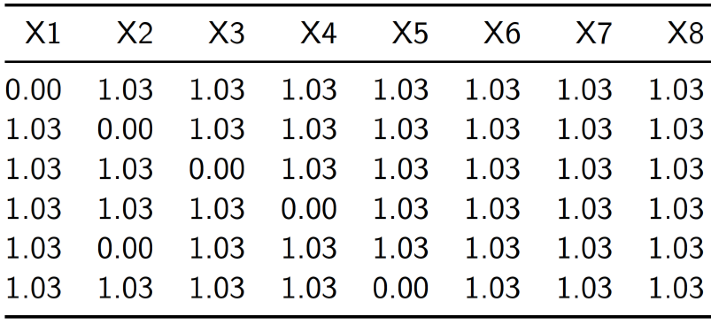
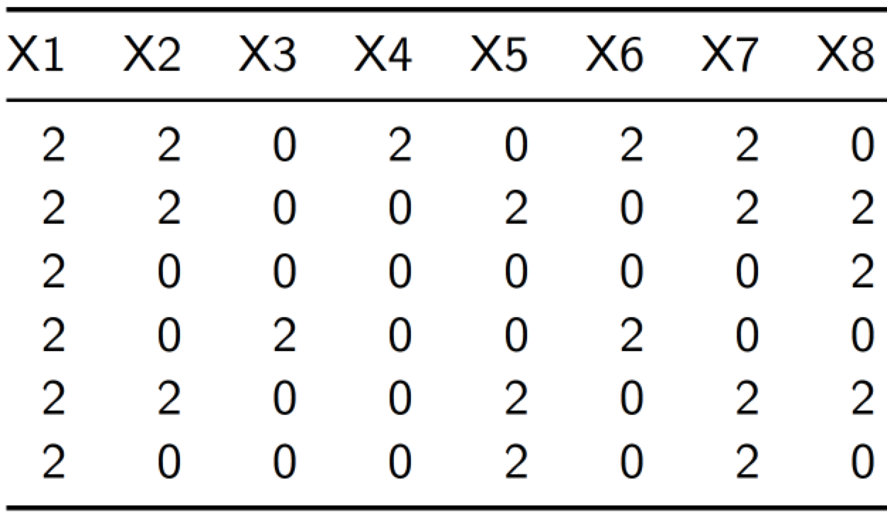
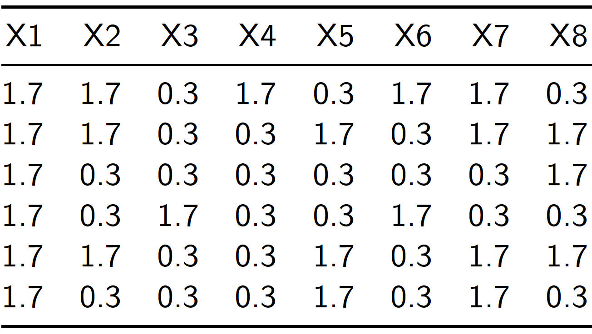
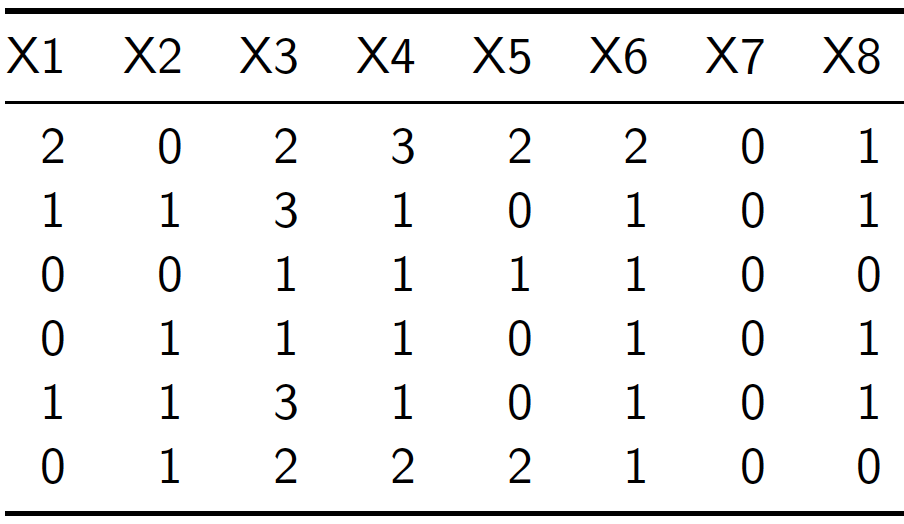

# Estimación del error de muestreo

Aunque la escogencia del diseño de muestreo y el estimador sean de libre elección para los investigadores, no lo es el cálculo de las medidas de confiabilidad y precisión. Dado que la base científica sobre la cual descansa el muestreo es la inferencia estadística, se deben respetar las normas básicas para la asignación y posterior cálculo del margen de error, que constituye una medida unificada del error total de muestreo que cuantifica la incertidumbre acerca de las estimaciones en una encuesta. 

## La técnica del último conglomerado

Debido a las dificultades algebricas y computacionales, estimar la varianza en encuestas complejas que contemplan esquemas de conglomeración, selección en varias etapas y estratifcación, puede tornarse bastante tedioso, costoso y además muy demorado. En este documento se explica por qué la técnica del último conglomerado resulta ser una buena opción a la hora de aproximar la varianza en una encuesta compleja.

Para la estimación de la varianza de los estimadores de interés en encuestas multi-etápicas, los programas computacionales existentes utilizan una aproximación conocida como la técnica del último conglomerado. Esta aproximación, que sólo tiene en cuenta la varianza de los estimadores en la primera etapa, supone que ese muestreo fue realizado con reemplazo. Los procedimientos de muestreo en etapas posteriores de la selección son ignorados a menos que el factor de corrección para poblaciones finitas sea importante a nivel municipal. 

En particular considere cualquier estimador del total poblacional dado por la siguiente combinación lineal

\begin{equation}
\label{est}
\hat{t}_{y}=\sum_{k\in s} d_k y_k = \sum_{k\in U} I_k d_k y_k 
\end{equation}

En donde $I_k$ son variables indicadoras de la pertenecia del elemento $k$ a la muestra $s$. Ahora, asumamos que el factor de expansión de la encuesta $d_k$ cumple con los supuestos básicos de un ponderador que hace insesgado a $\hat{t}_{y}$, es decir:

\begin{equation*}
E_p(I_k d_k) = 1
\end{equation*}

Se supone un diseño de muestreo en varias etapas (dos o más) en donde la primera etapa supone la selección de una muestra $s_I$ de $m_I$ unidades primarias de muestreo (UPM) $U_i$ ($i\in s_I$) de tal forma que

- Si la selección se realizó con reeemplazo, la $i$-ésima UPM tiene probabhilidad de selección $p_{I_i}$.
- Si la selección se realizó sin reeemplazo, la $i$-ésima UPM tiene probabilidad de inclusión $\pi_{I_i}$.

En las subsiguientes etapas de muestreo, se procede a seleccionar una muestra de elementos para cada una de las UPM seleccionadas en la primera etapa de muestreo. Dentro de la $i$-ésima UPM se selecciona una muestra $s_i$ de elementos; en particular la probabilidad condicional de que el $k$-ésimo elemento pertenzca a la muestra dada que la UPM que la contiene ha sido seleccionada en la muestra de la primera etapa está dada por la siguiente expresión:

\begin{equation*}
\pi_{k|i} = Pr(k \in s_i | i \in s_I)
\end{equation*}

Por ejemplo, si el muestreo es sin reemplazo en todas sus etapas, la probabilidad de inclusión del $k$-ésimo elemento a la muestra $s$ está dada por

\begin{align*}
\label{piki}
\pi_k & = Pr(k \in s)\\ 
& = Pr(k \in s_i, i \in s_I) \\
& = Pr(k \in s_i | i \in s_I) Pr(i \in s_I) = \pi_{k|i} \times \pi_{I_i}
\end{align*}

Dado que el inverso de las probabilidades de inclusión son un ponderador natural, entonces se definen las siguientes cantidades:

1. $d_{I_i} = \frac{1}{\pi_I}$, que es el factor de expansión de la $i$-ésima UPM.
2. $d_{k|i} = \frac{1}{\pi_{k|i}}$, que es el factor de expansión del $k$-ésimo elemento dentro para la $i$-ésima UPM.
3. $d_k = d_{I_i} \times d_{k|i}$, que es el factor de expansión final del $k$-ésimo elemento para toda la población $U$.

**Resultado**: *Bajo un diseño de muestreo en varias etapas, el estimador de Hansen-Hurwitz para el total poblacional está dada por:*
\begin{equation}
\label{HH}
\hat{t}_{y,p}=\frac{1}{m_I}\sum_{i=1}^{m_I}\frac{\hat{t}_{y_i}}{p_{I_i}}
\end{equation}

*Y su varianza estimada es:*
\begin{equation}
\label{var}
\widehat{Var}(\hat{t}_{y,p})=\frac{1}{m_I(m_I-1)}\sum_{i=1}^{m_I}\left(\frac{\hat{t}_{y_i}}{p_{I_i}}-\hat{t}_{y,p}\right)^2
\end{equation}

Supongamos ahora que la encuesta tiene un diseño complejo $p(s)$ que no contempla reeemplazo en la primera etapa. Por lo tanto, algunas cantidades deben ser equiparadas para poder utilizar esta aproximación. En principio, nótese que las cantidades $\hat{t}_{y_i}$ representan lo totales estimados de la variable de intereés en la $i$-ésima UPM y están dados por:

\begin{equation}
\hat{t}_{y_i} = \sum_{k \in s_i} \frac{y_k}{\pi_{k|i}}
= \sum_{k \in s_i} d_{k|i} y_k 
\end{equation}

Utilizar la aproximación de la varianza requiere equiparar los términos de manera apropiada. En primer lugar, fijémonos en los estimadores dados por \eqref{HH} y \eqref{est}. Para realizar esta comparación, se requiere que
se asuma la siguiente igualdad en las probabilidades de inclusión de la primera etapa:

\begin{equation}
\label{cons}
\pi_{I_i} = p_{I_i} \times m_I 
\end{equation}

Por lo tanto, el estimador del total poblacional quedaría definido desde \eqref{est} como un estimador tipo Hanwen-Hurwitz.

\begin{align*}
\hat{t}_{y} =\sum_{k\in s} d_k y_k  
= \sum_{i=1}^{m_I}\sum_{k \in s_i} d_k y_k 
= \sum_{i=1}^{m_I}\sum_{k \in s_i} \frac{1}{\pi_{I_i} \pi_{k|i}} y_k 
= \sum_{i=1}^{m_I}\frac{\hat{t}_{y_i}}{\pi_{I_i}} 
\approx \frac{1}{m_I}\sum_{i=1}^{m_I}\frac{\hat{t}_{y_i}}{p_{I_i}}
\end{align*}

Ahora, dado que la forma del estimador ha sido equiparada con un estimador tipo Hanwen-Hurwitz, es posible utilizar su estimación de varianza. Aún más, después de un poco de álgebra y tuilizando la equiparación dada por \eqref{cons}, es posible tener la siguiente aproximación, cuya gran ventaja es que sólo hace uso de los factores de expansión finales $d_k$, que suelen ser reportados por los Institutos Nacionales de Estadística cuando liberan los microdatos de sus encuestas, en vez de los factores de expansión de la primera etapa o los factores de expansión condicionales dentro de las UPM. 

\begin{align*}
\widehat{Var}(\hat{t}_{y,p})&=\frac{1}{m_I(m_I-1)}\sum_{i=1}^{m_I}\left(\frac{\hat{t}_{y_i}}{p_{I_i}}-\hat{t}_{y}\right)^2\\
&=\frac{m_I}{m_I-1}\sum_{i=1}^{m_I}\frac{1}{m_I^2}\left(\frac{\sum_{k \in s_i} d_{k|i} y_k }{p_{I_i}}-\sum_{i=1}^{m_I}\sum_{k \in s_i} d_k y_k \right)^2 \\
&=\frac{m_I}{m_I-1}\sum_{i=1}^{m_I}\left(\frac{\sum_{k \in s_i} d_{k|i} y_k }{m_I p_{I_i}}-\frac{1}{m_I}\sum_{i=1}^{m_I}\sum_{k \in s_i} d_k y_k \right)^2 \\
&=\frac{m_I}{m_I-1}\sum_{i=1}^{m_I}\left(\frac{\sum_{k \in s_i} d_{k|i} y_k }{\pi_{I_i}}-\frac{1}{m_I}\sum_{i=1}^{m_I}\sum_{k \in s_i} d_k y_k \right)^2 \\
&=\frac{m_I}{m_I-1}\sum_{i=1}^{m_I}\left( \sum_{k \in s_i} d_k y_k -\frac{1}{m_I}\sum_{i=1}^{m_I}\sum_{k \in s_i} d_k y_k \right)^2 
\end{align*}

Basado en lo anterior, al definir $\breve{t}_{y_i} = \sum_{k \in s_i} d_k y_k$ como la contribución^[Note que la suma de estas contribuciones en la muestra de la primera etapa da como resultado la estimación $\hat{t}_y$.] de la $i$-ésima UPM a la estimación del total poblacional y $\bar{\breve{t}}_{y}=\frac{1}{m_I}\sum_{i=1}^{m_I}\breve{t}_{y_i}$ como la contribución promedio en el muestreo de la primera etapa, entonces el estimador de varianza toma la siguiente forma, conocida como el estimador de varianza del **último conglomerado**.

\begin{align}
\label{UC}
\widehat{Var}(\hat{t}_{y,p})
=\frac{m_I}{m_I-1}\sum_{i=1}^{m_I}\left( \breve{t}_{y_i} -\frac{1}{m_I}\sum_{i=1}^{m_I}\breve{t}_{y_i} \right)^2 
=\frac{m_I}{m_I-1}\sum_{i=1}^{m_I}\left( \breve{t}_{y_i} - \bar{\breve{t}}_{y} \right)^2
\end{align}

Siguiendo con el escenario de muestreo planteado en las secciones anteriores, si el diseño de la encuesta es estratificado por regiones $h$, con tres etapas de selección dentro de cada estrato, entonces al utilizar la técnica del último conglomerado, el estimador de la varianza de $\hat{t}_{y}$ estaría dado por

$$
\hat{V}(\hat{t}_{y}) = 
\sum_h\frac{n_h}{n_h-1}\sum_{i\in s_h}\left(\hat{t}_{y_i}-\bar{\hat{t}}_{y_h}\right)^2
$$

En donde $\hat{t}_{y_i} = \sum_{k \in s_{hi}} w_k y_k$, $\bar{\hat{t}}_{y_h}=(1/n_h)\sum_{i \in s_h}\hat{t}_{y_i}$ y $n_h$ es el número de UPMs seleccionadas en el estrato $h$. Este procedimiento, propuesto por @hansen1953sample tiende a sobrestimar la varianza verdadera, aunque resulta ser una técnica apetecida por los investigadores puesto que utiliza directamente los pesos finales de muestreo o factores de expansión que son publicados por los INE.

Utilizar la técnica del **último conglomerado** es una salida práctica al problema de la estimación de la varianza que, para la mayoría de encuestas que brindan estadísticas oficiales a los países, puede tornarse bastante complejo. Si bien, la expresión \eqref{UC} no brinda estimaciones de varianza estrictamente insesgadas, sí constituye una aproximación bastante precisa. 

¿Qué es un **último conglomerado**? Es la primera unidad de muestreo en un diseño complejo. Por ejemplo, considere el siguiente diseño de muestreo en cuatro etapas:

\begin{equation*}
\underbrace{\textbf{Municipio}}_{\text{UPM}} \Rrightarrow
\underbrace{\textbf{Sector}}_{\text{USM}} \Rrightarrow
\underbrace{\textbf{Vivienda}}_{\text{UTM}} \Rrightarrow
\underbrace{\textbf{Hogar}}_{\text{UFM}}
\end{equation*}

En la primera las unidades primarias de muestreo (UPM) son los municipios; dentro de cada municipio, se seleccionan unidades secundarias de muestreo (USM) que corresponden a sectores cartográficos; de esta forma, el submuestreo continua hasta seleccionar las unidades finales de muestreo (UFM) que son los hogares. 

Ahora, por lo general, la primera etapa de muestreo de una encuesta está inducida por dos tipos de diseños: estratificado o con probabilidad de selección proporcional al tamaño del municipio. En cualquiera de los dos casos, se cren subgrupos de inclusión forzosa. En el muestreo estratificado serán las ciudades grandes y en el muestreo proporcional también, puesto que la medida de tamaño inducira probabilidades de inclusión mayores a uno. 
Luego, los municipios pertenecientes a este subgrupo de inclusión forzosa no pueden ser condierados como UPM, sino como un estrato de ciudades grandes. En cada ciudad de este estrato se realizará un muestreo de la siguiente manera:

\begin{equation*}
\underbrace{\textbf{Sector}}_{\text{UPM}} \Rrightarrow
\underbrace{\textbf{Vivienda}}_{\text{USM}} \Rrightarrow
\underbrace{\textbf{Hogar}}_{\text{UFM}}
\end{equation*}

Es necesario tener en cuenta esta particularidad de las encuestas para poder aplicar correctamente esta técnica de aproximación de varianzas. En resumen, para aquellas ciudades que pertenecen al estrato de inclusión forsoza, las UPM serán los sectores cartográficos, y para el resto del país, las UPM serán los municipios cuya probabilidad de inclusión en la muestra de la primera etapa es menor a uno. 

## Linealización de Taylor

Cuando se trata de estimar parámetros que tienen una forma no lineal, es posible recurrir al uso de las herramientas del análisis matemático para aproximar sus varianzas con el fin de publicar las cifras oficiales con sus respectivos errores estándar. @Valliant_Dever_Kreuter_2013 mencionan que esta técnica se basa en expresar el estimador como función de estimadores lineales de totales. Por ejemplo, si el interés recae en estimar un parámetro poblacional $\theta$ que a su vez depende de $p$ estimadores lineales, entonces su estimador de muestreo se debe expresar como

$$
\hat{\theta}=f(\hat{t}_1, \ldots, \hat{t}_p)
$$

En donde $\hat{t}_j=\sum_{k\in s}w_k y_{jk}$ es un estimador del $j$-ésimo total. La linealización de Taylor supone que es posible definir una aproximación lineal de $\hat{\theta}$ así

$$
\hat{\theta} - \theta 
\approx \sum_{j=1}^p \frac{\partial f(\hat{t}_1, \ldots, \hat{t}_p) }{\partial \hat{t}_j}(\hat{t}_j - t_j)
= \sum_{k\in s} w_k z_k + c
$$

En donde $z_k= \sum_{j=1}^p \frac{\partial f(\hat{t}_1, \ldots, \hat{t}_p) }{\partial \hat{t}_j} y_{jk}$ son variables linealizadas y $c$ son constantes determinísticas que por consiguiente no aportan a la varianza de $\hat{\theta}$. Nótese lo conveniente de expresar esta aproximación de esta manera puesto que al final, las cantidades que intervienen en la varianza se pueden expresar como una suma ponderada de las variables $z_k$ y por consiguiente es posible aplicar todos los principios establecidos anteriormente. De esta forma, asumiendo el escenario de muestreo planteado en las secciones anteriores, el estimador de la varianza de la  aproximación lineal de $\hat{\theta}$ está dado por

$$
\hat{V}(\hat{\theta}) = 
\sum_h\frac{n_h}{n_h-1}\sum_{i\in s_h}\left(\hat{t}_{z_i}-\bar{\hat{t}}_{z_h}\right)^2
$$

En donde $\hat{t}_{z_i} = \sum_{k \in s_{hi}} w_k z_k$ y $\bar{\hat{t}}_{z_h}=(1/n_h)\sum_{i \in s_h}\hat{t}_{z_i}$. Por ejemplo, si el interés estuviera en estimar una razón, entonces las nuevas variables linealizadas son $z_k=(1/\hat{t}_{y_2})(y_{1k}-\hat{\theta}y_{2k})$.

En la región la *Pesquisa Nacional por Amostra de Domicilios Continua*, en Brasil, y la *Encuesta de Caracterización Socioeconómica Nacional*, en Chile, utilizan esquemas de linealización de Taylor en conjunción con el acercamiento del último conglomerado.

## Réplicas

Las complicaciones en el cálculo de los errores de muestreo pueden ser mayores dependiendo de la escogencia del estimador y del diseño de muestreo asumido para la recolección de la información primaria. En algunas ocasiones, el proceso de linealización puede resultar complicado, por lo que es posible optar por una estrategia computacional aproximada que permite pasar por alto el proceso teórico de definición de las cantidades que estiman la varianza del estimador. Este conjunto de métodos supone la idea de la selección sistemática de *submuestras* que son utilizadas para estimar el parámetro de interés, utilizando los mismos principios de estimación que con la muestra completa. Por lo anterior, se obtienen estimaciones puntuales para cada réplica, las cuales son utilizadas para estimar la varianza del estimador de interés. 

En particular, hay tres metodologías que abordan este problema: las réplicas repetidas balanceadas [@McCarthy_1969; @Judkins_1990], el Jackknife [@Krewski_Rao_1981] y el Bootstrap [@Rao_Wu_1988]. La idea general detrás de estos métodos es que, partiendo de la muestra completa, en cada réplica se seleccione un conjunto de UPMs manteniendo todas las unidades que hayan sido seleccionadas dentro de esas UPMs. Luego, es necesario reponderar los pesos de muestreo para que se conserve la representatividad; de esta manera, para cada réplica se obtendrá un nuevo conjunto de pesos de muestreo. Con estos pesos, se calcula la estimación de interés, obteniendo tantas estimaciones como réplicas definidas. @Wolter_2007 provee todos los detalles teóricos referentes al problema de la estimación de la varianza utilizando réplicas. 

Por ejemplo, al utilizar la técnica de Jackknife, y asumiendo el escenario de muestreo planteado en las secciones anteriores (estratificado con varias etapas de muestreo), si se quiere estimar el error asociado a una medida de pobreza estimada, entonces se eliminará la primera UPMs del primer estrato para formar la primera réplica, luego la segunda UPMs del primer estrato para formar la segunda réplica y así sucesivamente hasta que se hayan formado todas las réplicas necesarias. De esta forma, si la UPMs $i$ del estrato $h$ fue eliminada, se deben crear los siguientes pesos de muestreo para las unidades que permanecen en la submuestra

$$
w_{k}^{(hi)} = 
\begin{cases}
0, & \text{si $k$ pertenece a la UPMs $i$ del estrato $h$.} \\
\frac{n_h}{n_h-1}w_k, & \text{si $k$ pertenece a la UPMs $i$ del estrato $h$.} \\
w_k, & \text{si $k$ no pertenece al estrato $h$.} 
\end{cases}
$$

Con cada nuevo conjunto de pesos, es necesario estimar la medida de pobreza requerida utilizando la siguiente expresión:

$$
\hat{F}_{\alpha}^{(hi)}=\frac{1}{N}\sum_{k\in s^{(hi)}} w_k^{(hi)} 
\left(\frac{l-y_k}{l}\right)^{\alpha}I(y_k<l)
$$

En donde $s^{(hi)}$ hace referencia al subconjunto de la muestra inducida por la réplica al eliminar la UPMs $i$ del estrato $h$. Luego, de obtener cada una de las estimaciones, la varianza de $\hat{F}_{\alpha}$ será estimada de la siguiente manera

$$
\hat{V}_{J}(\hat{F}_{\alpha})=\sum_{h}\frac{n_h-1}{n_h}
\sum_{i\in s_h} \left(\hat{F}_{\alpha}^{(hi)} - \hat{F}_{\alpha}\right)
$$

En lo concerniente con las técnicas de remuestreo y la utilización de las réplicas para el cálculo de los errores de muestreo se recalca que la técnica de *Jackknife* es útil para estimar parámetros lineales, pero no tiene un buen comportamiento cuando se trata de estimar percentiles o funciones de distribución. La técnica de *réplicas repetidas balanceadas* es útil para estimar parámetros lineales y no lineales, pero puede ser deficiente cuando se tienen dominios pequeños que pueden inducir estimaciones nulas en la configuración de los pesos. Sin embargo, el ajuste de Fay a la técnica anterior resulta palear todos los anteriores inconvenientes. En este caso es importante utilizar una matriz de Hadammard que induzca no más de 120 réplicas para que la publicación de la base de datos no se sobrecargue. Por último, el *bootstrap* debe ser utilizado con con detenimiento porque debe replicar el diseño de muestreo exacto y esto se hace construyendo una población a partir de los pesos de muestreo. 

XXXX

Las fórmulas computacionales requeridas para estimar la varianza de estadísticas descriptivas como la media muestral están disponibles para algunos diseños complejos que incorporan elementos como la estratificación y el muestreo por conglomerados. Sin embargo, en el caso de estadísticas analíticas más complejas, tales como coeficientes de correlación y coeficientes de regresión, no se encuentra fácilmente las fórmulas específicas en diseños muestrales que se aparten del muestreo aleatorio simple. Estas fórmulas son enormemente complicadas o, en última instancia, se resisten al análisis matemático (Frankel, 1971). 

En ausencia de fórmulas adecuadas, en los últimos años han aparecido una variedad de técnicas empíricas que proporcionan *varianzas aproximadas que parecen satisfactorias para fines prácticos* (Kish, 1995). Estos métodos utilizan una muestra de datos para construir submuestras y generar una distribución para las estimaciones de los parámetros de interés utilizando cada submuestra. Los resultados de la submuestra se analizan para obtener una estimación del parámetro, así como intervalos de confianza para esa estimación.

Entre los métodos de muestreo, se encuentran principalmente la técnica de Jackknife, el método de las Réplicas Repetidas Balanceadas (RRB) y el método de Bootstrap. 

#### La técnica de Jackknife {-}

Es posible estimar la varianza de los estimadores de interés usando la técnica de Jackknife. El desarrollo del procedimiento de Jackknife se remonta a un método utilizado por Quenouille (1956) para reducir el sesgo de las estimaciones. El refinamiento ulterior del método (Mosteller & Tukey, 1968) llevó a su aplicación en una serie de situaciones de las ciencias sociales en las que las fórmulas no están fácilmente disponibles para el cálculo de errores de muestreo. 

Este procedimiento ofrece los siguientes beneficios:

1. *Mayor flexibilidad*: el Jackknife puede implementarse en una amplia variedad de diseños muestrales.
2. *Facilidad de uso*: el Jackknife no requiere de software especializado.

El concepto principal de esta técnica parte de una muestra de tamaño $n$, la cual se divide en $A$ grupos de igual
tamaño $m=n/A$, a partir de esta división, la varianza de un estimador $\hat{\theta}$ se estima a partir de la varianza observada en los $A$ grupos.

Para cada grupo $(a=1,2,...,A)$, se calcula $\hat{\theta}_{(a)}$, una estimación para el parámetro $\theta$, calculada de la misma forma que la estimación $\hat{\theta}$ obtenida con la muestra completa, pero solo con la información restante (luego de la eliminación del grupo $a$). Para $a=1,2,...,A$ se define 

$$\hat{\theta}_{a}=A\hat{\theta}-(A-1)\hat{\theta}_{(a)}$$

como un pseudovalor de $\theta$. El estimador obtenido mediante Jackknife se presenta como una alternativa a $\hat{\theta}$ y se define como:

$$\hat{\theta}_{JK}=\dfrac{1}{A}\sum_{a=1}^{A}\hat{\theta}_{a}$$

mientras que el estimador de la varianza obtenido mediante Jackknife se obtiene como: 

$$\hat{V}_{JK1}=\dfrac{1}{A(A-1)}\sum_{a=1}^{A}\left(\hat{\theta}_{a}-\hat{\theta}_{JK}\right)^{2}$$

También es posible utilizar como estimador alternativo: 

$$\hat{V}_{JK2}=\dfrac{1}{A(A-1)}\sum_{a=1}^{A}\left(\hat{\theta}_{a}-\hat{\theta}\right)^{2}$$

Para diseños estratificados y multietápicos en los cuales  unidades primarias de muestreo han sido seleccionadas en el estrato $h$, para $h=1, \ldots, H$, el estimador de varianza de Jackknife para la estimación de un parámetro poblacional  está dado por

$$ \hat{V}_{JK}(\hat{\theta}) = \sum_{h=1}^H \frac{n_h - 1}{n_h} \sum_{i=1}^{n_h}
(\hat{\theta}_{(hi)}-\hat{\theta})^2$$

donde $\hat{\theta}_{(hi)}$ es la estimación de $\theta$ usando los datos de la muestra excluyendo las observaciones en la $i$-ésima unidad primaria de muestreo (Korn & Graubard, 1999, pg. 29 – 30). Shao & Tu (1995, Teorema 6.2) garantiza la convergencia en probabilidad de este estimador hacia la varianza teórica, de donde se puede concluir que es un estimador aproximadamente insesgado para la varianza teórica. Computacionalmente, se puede obtener la estimación Jackknife por medio de la creación de la base de datos omitiendo las observaciones necesarias usando comando `as.svrepdesign` de la librería `survey` del software estadístico `R para calcular $\hat{V}_{JK}(\hat{\theta})$, y posteriormente calcular el valor de la estimación Jackknife. 

En el contexto de este estudio, se tiene un número relativamente grande de unidades primarias de muestreo: 289 escuelas para el grado tercero y 287 para el grado sexto, por lo que el método de Jackknife puede ser un poco ineficiente puesto que implica la creación de 289 réplicas para el grado tercero y 287 réplicas para el sexto, por lo cual se recurrirá otro método de remuestreo, presentado más adelante, donde el usuario define el número de réplicas.

#### El método de las Réplicas Repetidas Balanceadas {-}

Las varianzas de muestreo tabmién pueden ser calculadas haciendo uso del método conocido como Réplicas Repetidas Balanceadas, el cual permite explicar la varianza que se obtiene en las estimaciones debido al muestreo. Este método es el que utilizan pruebas internacionales como PISA para realizar los análisis de datos. Bajo la metodología BRR, el estimador de la varianza toma la siguiente forma:
$$
Var(\hat{\theta}) = \frac{1}{A}\sum_{a=1}^A(\hat{\theta}_a - \hat\theta )^2
$$

Para la aplicación de la Réplicas Repetidas Balanceadas es recomendable usar el método de Fay, el cual es similar al método Jackknife, pero es más apropiado cuando hay funciones no diferenciables en el estudio. En PISA, por ejemplo, el método de Fay es preferido porque el método Jackknife no proporciona un estimador de varianza estadísticamente consistente para los cuantiles. Por otro lado, la Réplicas Repetidas Balanceadas brinda estimadores lineales simples que son imparciales y consistentes. Además, tiene una consistencia asintótica deseable para un conjunto amplio de estimadores, bajo diseños complejos y estudios de simulación empírica. Bajo la metodología BRR con el ajuste de Fay, el estimador de la varianza toma la siguiente forma:
$$
Var(\hat{\theta}) = \frac{1}{A(1-\rho)^2}\sum_{a=1}^A(\hat{\theta}_a - \hat\theta )^2
$$

En donde $0<\rho<1$ es el modificador del peso de muestreo de las UPM de la siguiente manera:
$$
d_k^a=
\begin{cases}
\rho*d_k\\ \text{si $k$ no pertenece a la *half-sample*}
(2-\rho)d_k \text{en otro caso}
\end{cases}
$$

Algunos estudios por simulación han mostrado una buena eficiencia para valores de $\rho$ iguales a 0.3, 0.5 o 0.7.

Para la aplicación de este método, los pesos de muestreo se ajustan para generar los pesos de repetición y, posteriormente, se repiten los ajustes por ausencia de respuesta de escuelas y estudiantes para estos nuevos pesos. Con estos pesos de repetición se estiman los errores de muestreo y la varianza de muestreo, incluyendo el impacto de la ausencia de respuesta, el cual se espera que sea pequeño, pero relevante en el momento de calcular estimadores más precisos. 

Para este estudio, si se quiere aplicar esta metodología, debe seguir los siguientes pasos: primero, las unidades de muestreo (escuelas y estudiantes) deben ser agrupadas en los estratos definidos por las tres variables: departamento, sector y zona; segundo, dentro de cada estrato se eliminó una de las unidades (siguiendo una matriz de Hadamard) y se recalcula el peso (peso replicado) para la otra; y tercero, para cada conjunto de pesos replicados se calcula el indicador de interés y se determina su error estándar. 

Retomando observaciones hechas anteriormente, hay estratos donde se encuetra solo una escuela, por lo que el método de las réplicas repetidas balanceadas no es aplicable puesto que al eliminar una unidad, algunos estratos quedarán vacíos. 

#### Método de Bootstrap {-}

En este apartado se presenta el método de Bootstrap, introducido por Bradley Efron (1979). Este método de remuestreo es el utilizado para este estudio, pues es un método que se implementa fácil, es flexible en términos del número de réplicas que se crean.

Teniendo los pesos muestrales calibrados (denotados por $w_k^{cal}$), se procede a crear las réplicas con el método de remuestreo con el fin de poder calcular estimaciones de indicadores junto con las varianzas de estimación. En el contexto de este estudio, se trata de realizar un remuestreo a las unidades primarias de muestreo (escuelas). Se toma a las $n_I$ escuelas de la muestra como si fuera la población, y de esta población se selecciona una muestra con reemplazo de $n_I$ selecciones teniendo en cuenta la probabilidad de selección del diseño $\pi$-PT de las escuelas. Dado que la selección es con reemplazo, una escuela puede quedar seleccionada más de una vez en esta nueva muestra. Al terminar la selección, se obtiene un vector de tamaño $n$ (tamaño muestral de los estudiantes) indicando el número de veces que la escuela correspondiente queda seleccionada, posteriormente se multiplica este vector con los pesos muestrales de los estudiantes $w_k^c$. El anterior proceso se repite un número grande de veces, que para este estudio, se escogió usar 200 réplicas (se usó la función `as.svrepdesign` de la librería `survey` para la creación de estas réplicas). 

En resumen, para la $i$-ésima réplica, se tiene los pesos muestrales $w_1^i,w_2^i, \cdots, w_n^i$, con $i=1,\cdots,200$, y estos pesos serán utilizados para calcular las estimaciones de totales, proporciones, promedios y razones y sus respectivas varianzas o desviaciones. Por ejemplo, si para una variable $y_k$ se requiere estimar el total poblacional $t_y$, se proce a calcular el total en cada una de las 200 réplicas 

$$\hat{t}_y^i=\sum_{k\in s} y_kw_k^i$$
con $i=1,\cdots,200$. La estimación de $t_y$ es
$$\hat{t}_y=\frac{1}{200}\sum_{i=1}^{200}\hat{t}_y^i$$
y varianza estimada de la estimación es
$$\hat{Var}(\hat{t}_y)=\frac{1}{199}\sum_{i=1}^{200}(\hat{t}_y^i-\hat{t}_y)^2$$
Usando la anterior expresión de la varianza se puede calcular medidas de precisión para las estimaciones, tales como: coeficiente de variación, margen de error relativo, margen de error absoluto e intervalo de confianza. 

### Error de muestreo utilizando imputación múltiple {-}

Por ejemplo, si se quiere realizar mediciones de pobreza utilizando la imputación múltiple es necesario primero establecer un modelo sobre los ingresos $y_k$ y luego generar $Q$ posibles valores $y_k^q \ (q=1, \ldots, Q)$ para cada individuo que no respondió. Luego, utilizando los $Q$ conjuntos de datos completos, es necesario estimar la siguientes cantidades 

$$
\hat{F}_{\alpha}^{q}=\frac{1}{N}\sum_{k\in s} w_k 
\left(\frac{l-y_k}{l}\right)^{\alpha}I(y_k<l) \ \ \ \ \ \ \ \ \ 
q= 1,\ldots, Q.
$$

El estimador final basado en la técnica de imputación múltiple será el promedio simple de las anteriores estimaciones, dado por 

$$
\tilde{F}_{\alpha}=\frac{1}{Q}\sum_{q=1}^Q \hat{F}_{\alpha}^{q}
$$

La varianza de esta metodología se puede descomponer en dos componentes, el primero correspondiente a la variación dentro de cada conjunto de datos creado, y el segundo correspondiente a la variación entre cada estimación resultante. Por lo tanto, la varianza asociada a $\tilde{F}_{\alpha}$ es

$$
\hat{V}(\tilde{F}_{\alpha})
= \frac{1}{Q}\sum_{q=1}^Q \hat{V}(\hat{F}_{\alpha}^{q})
+ \left(1+\frac{1}{Q}\right)\frac{1}{Q-1}\sum_{q=1}^Q (\hat{F}_{\alpha}^{q}-\tilde{F}_{\alpha})^2
$$

Nótese que, una vez se tienen los conjuntos de datos completos, es posible estimar $\hat{V}(\hat{F}_{\alpha}^{q})$ utilizando las técnicas del último conglomerado en conjunción con el Jackkinfe. Por último, existen otras formas de imputación no probabilística, tales como el vecino más cercano, técnicas de *hot-deck*, imputación lógica, entre otras. En resumen, la característica principal del proceso imputación es utilizar la información auxiliar para aproximar con precisión los valores faltantes. De esta forma, las estimaciones poblacionales de los parámetros de interés tendrán sesgo nulo o despreciable y la confiabilidad de la estrategia de muestreo se mantendrá como se planeó en una primera instancia.

XXXX

## El efecto de diseño y el error de muestreo

Cuando se selecciona una muestra utilizando un diseño de muestreo complejo es muy improbable que exista independencia entre las observaciones. Una forma sencilla de incorporar el efecto de aglomeración en las expresiones de tamaño de muestra está dada por la siguiente relación, denotada como efecto de diseño [@Kish_1965]:

$$
DEFF=\frac{Var_p(\hat{\theta})}{Var_{MAS}(\hat{\theta})}
$$

En donde $Var_p(\hat{\theta})$ denota la varianza de un estimador $\hat{\theta}$ bajo un diseño de muestreo complejo $p$ y $Var_{MAS}(\hat{\theta})$ denota la varianza del mismo estimador $\hat{\theta}$ bajo un diseño de muestreo aleatorio simple $MAS$. Esta cifra da cuenta del efecto de aglomeración causado por la utilización de un diseño de muestreo complejo $(p)$, frente a un diseño de muestreo aleatorio simple $MAS$, en la inferencia de un parámetro de la población finita $\theta$, que puede ser un total, una proporción, una razón, un coeficiente de regresión, etc. 

Por ejemplo, suponiendo que el parámetro de interés es la media poblacional ($\bar{y}_U$) de una variable de interés $y$, como el ingreso mensual, es posible escribir la varianza del estimador bajo el diseño de muestreo complejo como 

$$
Var_p(\hat{\bar{y}}_U) = \frac{DEFF}{n}\left(1-\frac{n}{N}\right)S^2_{y_U}
$$

En donde $S^2_{y_U}$ corresponde a la varianza de la características de interés, $N$ es el tamaño de la población de interés y $n$ el tamaño de la muestra de individuos. Ahora, al partir de la anterior expresión, es posible mostrar que el tamaño de muestra requerido para estimar este parámetro de interés en una encuesta repetida, con un error de muestreo relativo menor a $\delta$ y una confianza estadística mayor a $1-\alpha/2$, está dado por la siguiente expresión.

$$ 
n \geq \dfrac{S^2_{y_U}DEFF}{\dfrac{\delta^2 \bar{y}_U^2}{z_{\alpha}^2}+\dfrac{S^2_{y_U}DEFF}{N}}
$$

En donde $z_{\alpha}$ es el percentil ($1- \alpha/2$) asociado a una distribución normal estándar. Nótese que si $\rho$ es grande, entonces el valor del efecto de diseño $DEFF$ también lo será y por consiguiente el tamaño de muestra deberá ser más grande. Por ejemplo, al medir ingresos en la región, debido a la realidad económica de los países, es común encontrar que el tipo de hogar está altamente asociado con el ingreso de los individuos. Esto quiere decir que los ingresos no están uniformemente dispersos a través de todos los hogares, y por ende el coeficiente de correlación intraclase será alto.

Por otro lado, si lo que se quiere estimar es una proporción $P$, entonces la expresión apropiada para calcular el tamaño de muestra estará dada por

$$ 
n \geq \dfrac{P\ (1-P)\ DEFF}{\dfrac{\delta^2}{z_{\alpha}^2 }+\dfrac{P\ (1-P) \ DEFF}{N}}
$$ 

La estimación del efecto de diseño es un problema común cuando se trabaja con estimaciones desagregadas en subpoblaciones de interés. Luego, cuando las subpoblaciones constituyen estratos (o agregaciones de estratos) planeados de antemano, para los cuales se conoce previamente su tamaño poblacional, se tiene el siguiente efecto de diseño:

$$
DEFF_h= \frac{Var_p (\hat\theta_h) }{Var_{MAS}^h(\hat\theta_h) }
$$

En donde $Var_{MAS}^h(\hat\theta_h)$ es la varianza restringida al estrato $h (h=1,\ldots, H)$, cuyo valor es el siguiente:
$$
Var_{MAS}^h(\hat\theta_h)=\frac{1}{n_h}\left(1-\frac{n_h}{N_h}\right)S_{z_h}^2
$$
Siendo $n_h$ el tamaño de la muestra en el estrato $h$, $N_h$ el tamaño poblacional del estrato $h$ y $S_{z_h}^2$ la varianza muestral de la variable linealizada restringida al subgrupo $h$. 

Por otro lado, cuando la subpoblación de interés no es un estrato sino un subgrupo aleatorio - como por ejemplo las personas pobres, las personas menores de 25 años, o cualquier otro subgrupo no planeado en el diseño de la encuesta - cuyo tamaño de muestra es aleatorio entonces la estimación correcta del efecto de diseño es la siguiente:

$$
DEFF_U= \frac{Var_p (\hat\theta_h) }{Var_{MAS}^U(\hat\theta_h) }
$$

En donde $Var_{MAS}^U(\hat\theta_h)$ es la varianza poblacional del estimador de interés, cuyo valor es el siguiente:

$$
Var_{MAS}^U(\hat\theta_h)=\frac{1}{n}\left(1-\frac{n}{N}\right)S_{z_{hU}}^2
$$

En donde $S_{z_{hU}}^2$ es la varianza muestral de la variable linealizada calculada en toda la población. Por lo tanto, en ambos efectos de diseño, la estimación de la varianza del diseño de muestreo complejo $Var_p (\hat\theta_h)$ es la misma, pero el denominador cambia dependiendo de si el subgrupo es un estrato o no. Es por esta razón que en los tres softwares las cifras relacionadas con la estimación puntual, errores estándar, intervalos de confianza y coeficientes de variación coinciden plenamente en los tres softwares.

Ahora, tanto los software Stata como SPSS estiman por defecto el $DEFF_U$. Nótese que, en este caso, las estimaciones de $Var_{MAS}^U(\hat\theta_h)$ y $Var_{MAS}^h(\hat\theta_h)$  serán diferentes, puesto que la primera involucra a toda la muestra, mientras que la segunda involucra únicamente a la muestra del estrato. Retomando el ejemplo, debido a que los subgrupos de interés son agregaciones de los estratos de diseño, no es correcto utilizar el enfoque que Stata trae por defecto. 

