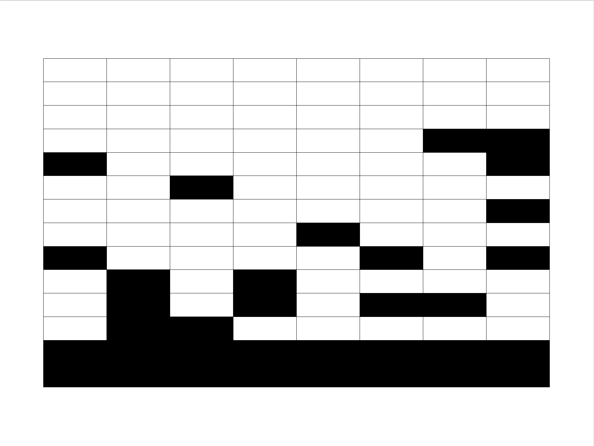
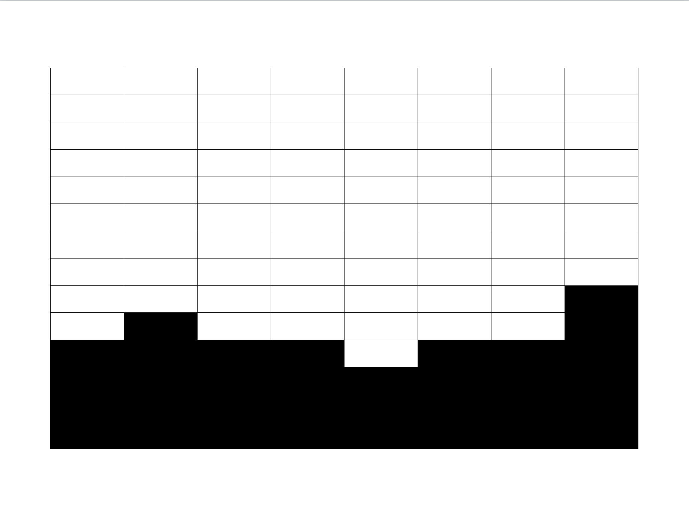

# Enfrentando la ausencia de respuesta por registro

En el diseño y puesta en marcha de una encuesta puede ocurrir cierto tipo de situaciones que pueden sesgar las estimaciones finales. Este tipo de sesgos puede ocurrir antes, durante y después de la recolección de los datos. Es tarea del estadístico advertir ante todas las posibles instancias de los problemas que causan los sesgos y procurar que, en todas las etapas de la encuesta, se minimice el error humano y el error estadístico para que al final los resultados del estudio sean tan confiables como sea posible.

## Sesgos generados en las encuestas

XXXXXXXXXXXXXXXXXXXXXXXXXXXXXXXXXXXXXXXXXX

**Sesgo de selección**

Este tipo de sesgo ocurre cuando parte de la población objetivo no está en el marco de muestreo. Una muestra a conveniencia\footnote{A pesar de que las muestras por conveniencia o por juicio no pueden ser utilizadas para estimar parámetros de la población, éstas sí pueden proporcionar información valiosa en las primeras etapas de una investigación o cuando no es necesario generalizar los resultados a la población.} es sesgada pues las unidades más fáciles de elegir o las que más probablemente respondan a la encuesta no son representativas de las unidades más difíciles de elegir. @Loh afirma que se presenta este tipo de sesgo si:

\begin{enumerate}
\item La selección de la muestra depende de cierta característica asociada a las propiedades de interés. Por ejemplo: Frecuencia con que los adolescentes hablan con los padres acerca del SIDA.
\item La muestra se realiza mediante elección deliberada o mediante un juicio subjetivo. Por ejemplo, si el parámetro de interés es la cantidad promedio de gastos en compras en un centro comercial y el encuestador elige a las personas que salen con muchos paquetes, entonces la información estaría sesgada puesto que no está reflejando el comportamiento promedio de las compras.
\item Existen errores en la especificación de la población objetivo. Por ejemplo, en encuestas electorales, cuando la población objetivo contiene a personas que no están registradas como votantes ante la organización electoral de su país.
\item Existe sustitución deliberada de unidades no disponibles en la muestra. Si, por alguna razón, no fue posible obtener la medición y consecuente observación de la característica de interés para algún individuo en la población, la sustitución de este elemento debe hacerse bajo estrictos procedimientos estadísticos y no debe ser subjetiva en ningún modo.
\item Existe ausencia de respuesta. Este fenómeno puede causar distorsión de los resultados cuando los que no responden a la encuesta difieren críticamente de los que si respondieron.
\item La muestra está compuesta por respondientes voluntarios. Los foros radiales, las encuestas de televisión y los estudios de portales de internet no proporcionan información confiable.
\end{enumerate}

**Sesgo de medición**

Este tipo de sesgo ocurre cuando el instrumento con el que se realiza la medición tiene una tendencia a diferir del valor verdadero que se desea averiguar. Éste sesgo debe ser considerado y minimizado en la etapa de diseñó de la encuesta. Nótese que ningún análisis estadístico puede revelar que una pesa añadió a cada persona 2Kg de más en un estudio de salud. @Loh cita algunas situaciones en donde se presenta este sesgo de medición:

\begin{enumerate}
\item Cuando el respondiente miente. Esta situación se presenta a menudo en encuestas que pregunta acerca del ingreso salarial, alcoholismo y drogadicción, nivel socioeconómico e incluso edad.
\item Difícil comprensión de las preguntas. Por ejemplo: ¿No cree que no este es un buen momento para invertir? La doble negación en la pregunta es muy confusa para el respondiente.
\item Las personas tienden a olvidar. Es bien sabido que las malas experiencias suelen ser olvidadas; esta situación debe acotarse si se está trabajando en una encuesta de criminalidad.
\item Distintas respuestas a distintos entrevistadores. En algunas regiones es muy probable que la raza, edad o género del encuestador afecte directamente la respuesta del entrevistado.
\item Leer mal las preguntas o polemizar con el respondiente. El encuestador puede influir notablemente en las respuestas. Por lo anterior, es muy importante que el proceso de entrenamiento del entrevistador sea riguroso y completo.
\item La muestra está compuesta por respondientes voluntarios. Los foros radiales, las encuestas de televisión y los estudios de portales de internet no proporcionan información confiable.
\end{enumerate}

## Tipos de ausencia de respuesta

Todas las encuestas de hogares sufren del fenómeno de la ausencia de respuesta en algunas de las variables de interés. En algunas ocasiones y aún después de un diseño cuidadoso y una planificación logística exhaustiva, esta problemática puede ser tan grande que los resultados de la encuesta pueden quedar en entredicho. Por esta razón, este problema debe ser considerado como una faceta normal, si bien no deseable, en el desarrollo de este tipo de estudios y la planificación y el diseño de todos los levantamientos de información a través de encuestas debe contemplar varios ajustes que prevean las consecuencias de este fenómeno. Es por esto que la última sección del capítulo cuatro abordó el tema del ajuste de subcobertura, que garantiza que el tamaño de muestra efectivo sea el adecuado para realizar un inferencia precisa. De otra forma, si el diseño de la enceusta no tiene en cuenta estos ajustes, el tamaño de muestra final se verá reducido puesto que muchos hogares no contestarán algunas preguntas del cuestionarios, y en algunos casos, muchos hogares no contestarán la totalidad del cuestionario. Existe un consenso completo de que la ausencia de respuesta puede perjudicar severamente la calidad de las estadísticas calculadas y publicadas en una encuesta. @Little_Rubin_2002 establecen tres tipos de mecanismos de ausencia de respuesta.

- **Completamente aleatoria** *(Missing At Random - MAR)*: cuando la probabilidad de que un individuo responda no depende de la característica de interés, ni de alguna otra covariable auxiliar. Por ejemplo, en una encuesta del mercado de trabajo, podría existir ausencia de respuesta que no dependa del estado actual de ocupación del respondiente, ni de su edad, ni de la UPM en donde está la vivienda, ni de su género, ni de su nivel educativo, ni de ninguna otra característica auxiliar. De esta forma, se puede considerar que esta ausencia de respuesta está dispersa de manera uniforme sobre toda la población. Es decir que cuando el investigador produzca estadísticas descriptivas sobre las personas que respondieron la encuestas, ese procentaje de personas sea muy similar y tenga un comportamiento uniforme sobre todas las posibles covariables que afecten al individuo. El siguiente gráfico podría mostrar algunos indicios de que el patrón de ausencia de respuesta podría ser MCAR puesto que el porcentaje de respuesta es similar en las variables auxiliares.

```{r, echo=FALSE, fig.height = 3, fig.cap="Patrón de respuesta MCAR"}
par(mfrow=c(1, 3))
counts.G <- c(Hombre = 95, Mujer = 94)
barplot(counts.G, xlab = "Sexo", ylab = "Porcentaje de respuesta")
counts.Z <- c(Urbano = 93, Rural = 95)
barplot(counts.Z, xlab = "Zona", ylab = "Porcentaje de respuesta")
counts.T <- c(Inactivo = 95, Ocupado = 96, Desocupado = 94)
barplot(counts.T, xlab = "Condición de ocupación", ylab = "Porcentaje de respuesta")
```

- **Aleatoria dependiente de covariables** *(Missing At Random - MAR)*: cuando la probabilidad de que un individuo responda depende de algunas covariables auxiliares, pero no depende de la característica de interés.  Por ejemplo, en una encuesta de fuerza laboral, la ausencia de respuesta puede depender de la edad del respondientes, o del sexo, o incluso del nivel económico del individuo, pero no depende de su clasificación laboral. El siguiente gráfico muestra que el patrón de ausencia de respuesta podría ser MAR puesto que el sexo y la zona del respondiente están influenciando el porcentaje de respuesta, aunque no el estado de ocupación. 

```{r, echo=FALSE, fig.height = 3, fig.cap="Patrón de respuesta MAR"}
par(mfrow=c(1, 3))
counts.G <- c(Hombre = 70, Mujer = 95)
barplot(counts.G, xlab = "Sexo", ylab = "Porcentaje de respuesta")
counts.Z <- c(Urbano = 98, Rural = 62)
barplot(counts.Z, xlab = "Zona", ylab = "Porcentaje de respuesta")
counts.T <- c(Inactivo = 95, Ocupado = 96, Desocupado = 94)
barplot(counts.T, xlab = "Condición de ocupación", ylab = "Porcentaje de respuesta")
```

- **No aleatoria** *(Missing Not At Random - MNAR)*: cuando la ausencia de respuesta depende de la característica de interés. Por ejemplo, en la encuesta de fuerza laboral, es posible que los no respondientes dependan de su clasificación laboral. En este caso puede suceder que los desocupados sean los que sistemáticamente no respondan la encuesta. El siguiente gráfico muestra indicios de que el patrón de respuesta es MNAR puesto que la condición de ocupación es la que influencia el porcentaje de respuesta. 

```{r, echo=FALSE, fig.height = 3, fig.cap="Patrón de respuesta MNAR"}
par(mfrow=c(1, 3))
counts.G <- c(Hombre = 80, Mujer = 82)
barplot(counts.G, xlab = "Sexo", ylab = "Porcentaje de respuesta")
counts.Z <- c(Urbano = 83, Rural = 79)
barplot(counts.Z, xlab = "Zona", ylab = "Porcentaje de respuesta")
counts.T <- c(Inactivo = 50, Ocupado = 20, Desocupado = 94)
barplot(counts.T, xlab = "Condición de ocupación", ylab = "Porcentaje de respuesta")
```

Nótese que a pesar de que se hayan tomado las medidas de ajuste necesarias en el diseño de la encuesta, cuando ya ha terminado el proceso de recolleción de infomración, se debe lidiar con la ausencia de respuesta para evitar sesgos y aumentar la precisión de la encuesta. La literatura especializada examina dos metodologías diferentes pero complementarias en el ejercicio de una encuesta: la prevención de la ausencia de respuesta (antes de que ocurra) y las técnicas de estimación necesarias para tener en cuenta la ausencia de respuesta de manera apropiada en el proceso de inferencia, después de la recolección de los datos. Si el mecanismo de ausencia de respuesta se asume MCAR, es posible contemplar en el proceso de inferencia únicamente a aquellas unidades que tienen registros completos y eliminar de la base de datos a aquellas unidades que no contestaron (*list-wise deletion*). A pesar de que este tipo de análisis es simple, para evitar subestimaciones de los parámetros de interés, se debe realizar un ajuste de los factores de expansión inducidos por el diseño muestral, que originalmente fue planeado con un tamaño de muestra más grande que el efectivo. De esta forma, es posible suponer que la muestra de respondientes corresponde a una submuestra completamente aleatoria de la población y utilizar los principios de los diseños en dos fases. @Heeringa_West_Berglund_2010[capítulo 11] afirman que este tipo de análisis, además de inducir posibles sesgos si el supuesto MCAR no se cumple, reduce la eficiencia de la inferencia debido al decremento del tamaño de muestra efectivo. Por lo tanto, en la mayoría de encuestas, este supuesto no se asume y se realiza un ajuste adicional después de que ha ocurrido la ausencia de respuesta. Es por esto que @Sarndal_Swensson_Wretman_2003[sección 15.5] afirman que las principales técnicas para tratar la ausencia de respuesta son el ajuste a los pesos de muestreo y la imputación. El ajuste por ponderación implica aumentar los pesos aplicados en la estimación de los valores y de los encuestados para compensar los valores que se pierden debido a la ausencia de respuesta, mientras que la imputación implica la sustitución de los valores faltantes por valores artificiales.

Siguiendo la notación en @Sarndal_Lundstrom_2006, consideramos una muestra seleccionada $s$ de unidades de interés; como resultado del proceso de observación se denota a $r$ como el conjunto de unidades que respondieron a uno o más de los $I$ variables de interés. Una unidad que no respondió a ninguna de las variables del estudio pertenecerá entonces al conjunto $s−r$. Así mismo, el conjunto de unidades que respondieron a una variable particular es denotado por $r_i$. Observe que, en general, todos los $r_i$ tendrán tamaños diferentes y además estarán contenidos en $r$; de esta forma, se tiene que:

$$
r_i\subseteq r \subseteq s
$$

La siguiente figura ilustra cómo, después de la recolección de datos, hay individuos que no respondieron a una o todas las variables de la encuesta. En esta ilustración, las unidades están representadas por las filas y las variables por las columnas. Observe que lo primeros tres individuos contestaron a todas las preguntas del cuestionario; el cuarto individuo no contestó las últimas dos preguntas; el quinto individuo no contestó ni la primera ni la última pregunta; el sexto individuo no contesto a la tercera pregunta; y así sucesivamente, hasta llegar a los últimos dos individuos quienes no contestaron a ninguna pregunta del cuestionario. Para este ejemplo particular, se observa que $I=8$, $n=\#(s)=14$, $\#(r_1)=10$, $\#(r_1)=10$, $\#(r_2)=9$, $\#(r_3)=10$, $\#(r_4)=10$, $\#(r_5)=11$, $\#(r_6)=10$, $\#(r_7)=10$, $\#(r_8)=8$ y $\#(r_8)=12$.

{width=300px}

Al lidiar con la ausencia de respuesta podemos distinguir varios enfoques para la estimación. El más extremo se conoce como el **enfoque de eliminación**, en donde se conservan para el análisis únicamente aquellas unidades que han respondido a todas y cada una de las pregutnas del cuestionario; es decir que aqueelas unidades que no respondierona al menos una pregunta serán eliminadas del análisis. Note que en este enfoque sólo las unidades del conjunto $r$ se consideran para el análisis posterior. Por supuesto, en general, esto no es aconsejable puesto que trae problemas de sesgo, dado que las unidades que contestaron todo el cuestionario generalmente difieren de forma estructural de las unidades que no contestaron; además trae problemas de eficiencia estadística, puesto que el tamaño de la muestra efectiva, después de la eliminación de unidades, será insuficiente para garantizar los mínimos requeridos en la inferencia. La siguiente figura muestra que, teneindo en cuenta el ejemplo anterior, solo tres unidades serían tenidas en cuenta para el análisis de la información, mientras que nueve unidades, que no contestaron al menos una pregunta, más las tres unidades que no contestaron ninguna pregunta, serían eliminadas del análisis estadístico. Es decir, la mayoría de unidades de la muestra incial serían descartadas. 

{width=300px}

El segundo enfoque se denomina **imputación total**, y se trata de imputar todos los valores faltantes del conjunto de observaciones. Es decir, los valores de las personas que no respondieron al menos a una variable en todo el cuestionario serán imputados. En este enfoque, la imputación se utiliza para tratar la ausencia de respuesta del ítem y la ausencia de respuesta de la unidad al mismo tiempo. La siguiente figura muestra un ejemplo de las unidades que serían consideradas para el análisis después de la imputación. Nótese entonces que las tres unidades que respondieron todas las preguntas del cuestionario entran al análisis sin nigun ajuste; mientras que las nueve unidades que no respondieron a todo el cuestionario entran al análisis habiendose imputado las celdas correspondientes a la ausencia de respuesta; además, las dos unidades que no respondieron ninguna pregunta del cuestionario también entran al análisis puesto que todas sus respuestas fueron imputadas. Luego, en este enfoque todas las unidades en el conjunto $s$ se consideran para el análisis posterior. 

Observe que si $y_k$ es una observación faltante y es imputada, entonces $\hat{y}_k$ denotará el valor imputado obtenido por cualquiera de los métodos de imputación que se describirán más adelante. Luego, como en este enfoque se imputan valores para todas las observaciones faltantes, ya sea por unidad o por no respuesta del ítem, se tendrá un conjunto de datos completos con los valores 

$$
y_{\circ \  k} = 
\begin{cases}
y_k, \ \text{for $k \in r_i$} \\
\hat{y}_k, \ \text{for $k \in s - r_i$}
\end{cases}
$$

{width=300px}

El tercer enfoque se denomina **ponderación total** y se utiliza para cada variable de interés en el estudio, una a la vez. En este enfoque nunca se utiliza la imputación, puesto que existirán tantos conjuntos de pesos y ponderaciones como variables con valores faltantes. Para este esquema, se utilizan pesos $w_k^{(i)}$ para cada variable $i \in I$ que compensan la ausencia de respuesta de la unidad. Si todos los $r_i$ son diferentes, cada variable de estudio requirá un peso diferente. Siguiendo con los ejemplos de las ilustraciones, se nota que la primera variable del cuestionario fue respondida por 10 personas, y cuatro personas no respondieron esta pregunta. Por lo tanto, en este enfoque se crearán pesos $w_k^{(1)}$ para cada $k\in s$ que ponderen satisfactoriamente la información recolectada en esta variable. Sin emabrgo, este conjunto de pesos no será único, puesto que, en particular, la segunda variable del cuestionario fue respondida por nueve personas, y tres personas no respondieron esta pregunta. Por lo tanto, en este enfoque se crearán pesos $w_k^{(2)}$ para cada $k\in s$ que ponderen esta información recolectada en esta variable. Nótese que en general $w_k^{(1)} \neq w_k^{(2)}$ y, por ende, cada una de las $I=8$ variables del estudio tendrá su propio conjunto de ponderadores. 

{width=300px}

Por último, el enfoque recomendado es una combinación de los procediemintos de imputación y ponderación y se conoce como **enfoque combinado** que imputa los valores de las celdas ausentes para los individuos que tienen al menos un valor faltante, exceptuando a aquellos que tienen todos los valores faltantes. De esta forma, los individuos que no contestaron ninguna pregunta del cuestionario son eliminados del análisis, mientras que los restantes serán considerado en el análisis con sus respuestas originales o con la imputación de las celdas vacías. En resumen, este enfoque implica que la imputación se utilice para tratar sólo la ausencia de respuesta del ítem, mientras que la ponderación se utilice únicamente para tratar la ausencia de respuesta del individuo. Retomando el ejemplo, el siguiente gráfico permite observar que los dos últimos individuos de la muestra fueron totalmente descartados puesto que no contestaron ninguna pregunta del cuestionario; además, para la primera variable, los valores del quinto y noveno individuo fueron imputados. De la misma manera, para la segunda variable, los valores de lso individuos 10, 11 y 12, fueron imputados; y así sucesivamente, hasta llegar a la última variable en donde los valores de los indivioduos tres, cuatro, seis y ocho fueron imputados. 

{width=300px}

En la realidad de las encuestas de hogares, lo más común es encontrar que se presente ausencia de respuesta tanto de unidad como de ítem. En estos casos, se aconseja imputar primero y luego descartar los individuos que no contestaron a niguna pregunta, de esta forma al final se obtendrá una matriz de datos rectangular completa. Por tanto, el conjunto de datos completados (originales o imputados) para la variable $y$ es $\{y_{\circ \  k}: k\in r\}$, en donde

$$
y_{\circ \  k} = 
\begin{cases}
y_k, \ \text{for $k \in r_i$} \\
\hat{y}_k, \ \text{for $k \in r - r_i$}
\end{cases}
$$


## Módelos para la imputación

El término imputación se refiere al conjunto de técnicas por las cuales los valores faltantes en una o más variables se reemplazan con infrmación plausible con el objetivo de lograr valores sustitutivos en una base de datos que pueda ser analizada posteriormente. Este proceso introduce un nuevo elemento de error, conocido como el error de imputación, debido a la incertidumbre que introducen los valores no observados. Cuando se tiene ausencia de respuesta por ítem, las técnicas de imputación se prefieren antes que la utilización de los esquemas de ponderación en la muestra. De esta manera, es posible crear un conjunto completo y rectangular de datos mediante la imputación de los valores faltantes, puesto que después de realizar la imputación, se espera que todos los valores del cuestionario de un individuo contengan información y no exista ningún vacío. Para lograr la sutitución de los valores faltantes con infomración plausible, es posible encontrar donantes apropiados, en la misma muestra que se ha conseguido, definidos como respondientes que comparten características demográficas similares con el individuo que no respondió. Por lo tanto, la información del respondiente donante (o una función de estos valores) se copiará en las celdas vacías del no respondiente. Para encontrar los donantes es posible realizar un análisis estadístico con base en métodos de clasificación. Dentro de los métodos de imputación más usados en encuestas de hogares se encuentran los siguientes:

- Imputación promedio (*mean value imputation*) que utiliza la media de la variable (dentro de las UPM o en un subconjunto apropiado de datos). En este caso, si se encuentra un valor faltante, inmediantamente será reemplazado por el promedio de los datos de los respondientes en esta variable. 
- Imputación por paquete caliente (*hot deck imputation*) que reemplaza los valores faltantes por los valores de un donante que es un respondiente de la encuesta en el mismo levantamiento. En este caso, el valor faltante es reemplazado por la información del individuo escogido de antemano. 
- Imputación por paquete frío (*cold deck imputation*) que reemplaza los valores faltantes por los valores de un donante que es un respondiente de encuesta en un levantamiento anterior. En este caso, el valor faltante es reemplazado por la información auxiliar de un individuo escogido de encuestas anteriores. 
- Imputación estadística que se apoya en un modelo (de regresión, generalmente) en donde la variable dependiente es aquella que se quiere imputar y las covariables se derivan del restante conjunto de datos. En este caso, el valor faltante es reemplazado por la predicción (o una función) del modelo ajustado con la información en la muestra. 

Como se mencionó anteriormente, cuando se trata de imputación, se pueden definir dos tipos de métodos. La imputación de la unidad completa, que se produce cuando toda la información de un individuo es imputada, y la imputación del ítem, que se da cuando un único valor de un individuo es imputado. Observe que la imputación de la unidad se utiliza para hacerle frente a la ausencia de respuesta de la unidad, cuando no hay datos para el individuo, mientras que la imputación del ítem se utiliza para la no respuesta del ítem, cuando no todos los valores se proporcionan para un individuo, pero algunos sí. 

La imputación se realiza a menudo en grupos no traslapados $g= 1, \ldots, G$, donde la unión de $s_1, \ldots, s_G$ equivale a la muestra completa $s$. Se pueden utilizar diferentes métodos para cada grupo, pero dentro de cada grupo se debe utilizar el mismo método de imputación. Esto se debe a que pueden existir diferentes covariables disponibles para cada grupo. Cuando la disponibilidad de las variables auxiliares (covariables) es limitada, es posible considerar una jerarquía de métodos de imputación. De esta forma, para los grupos con más información disponible, es posible utilizar métodos más sofisticados de imputación; mientras que para grupos con menos información auxiliar disponbible, se deben usar métodos de imputación más simples. @Sarndal_Lundstrom_2006 presentan una discusión acerca del uso de esta técnica en combinación con los estimadores utilizados en las encuestas de hogares que proveen estadísticas oficiales. A continuación, se presenta una compilación no exhaustiva de algunos de los principales métodos de imputación que se utilizan en las encuestas de hogares.

#### Imputación por regresión {-}

En este método determinístico, el valor imputado para el valor faltate $y_k$ se calcula utilizando una regresión lineal.
$$\hat{y}_k = \mathbf{x}_k \hat{\boldsymbol{\beta}}_i$$
Donde,
$$
\hat{\boldsymbol{\beta}}_i = (\sum_{r_i} a_k\mathbf{x}_k\mathbf{x}_k')^{-1}
\sum_{r_i} a_k\mathbf{x}_ky_k
$$
El vector de coeficientes de regresión  $\hat{\boldsymbol{\beta}}_i$ se produce a partir de un ajuste de regresión múltiple utilizando los datos $(y_k, \mathbf{x}_k)$ disponibles para cada unidad  $k \in r_i$ con pesos $a_k$ especificados adecuadamente. Nótese que, en general, las predicciones del modelo de regresión no necesariamente serán valores observados en algún otro individuo de la muestra. Por lo tanto, este método inducirá valores imputados que no han sido observados en la encuesta. Además, se deberán generar tantos modelos de regresión como variables con valores faltantes existan. 

#### Imputación de razón {-}

Un caso especial del anterior método se da cuando solo se tiene acceso a una sola covariable (positiva)  $\mathbf{x}_k = x_k$, y definiendo $a_k = \frac{1}{x_k}$. En este caso, la estimación del coeficiente de regresión será

$$
\hat{{\beta}}_i = \frac{\sum_{r_i}y_k}{\sum_{r_i}x_k} = R_i
$$

Y por tanto, la imputación para el valor faltante se convierte en

$$\hat{y}_k = x_k \hat{\beta}_i = x_k \frac{\sum_{r_i}y_k}{\sum_{r_i}x_k} = x_k R_i$$

Este método se utiliza a menudo cuando la misma variable se mide en dos momentos diferentes en la misma encuesta. Por ejemplo, si $y$ indica la variable de estudio en el momento actual, $x$ indica la variable en el punto de tiempo anterior, entonces el coeficiente utilizado para la imputación es la relación entre los dos puntos en el tiempo.

#### Imputación de promedio  {-}

El caso más sencillo de la imputación por regresión se da cuando $a_k = x_k = 1$ para todo $k \in r_i$. En este escenario, el valor imputado se convierte en

$$\hat{y}_k  = \frac{\sum_{r_i}y_k}{\sum_{r_i}1}= \bar{y}_{r_i}$$

Por lo tanto, todos los valores faltantes recibirán el mismo valor imputado, que es justamente el promedio de la variable en el conjunto de respondientes. Nótese que no se requiere de ninguna información adicional en este método.

#### El vecino más cercano  {-}

Si asumimos que valores similares de $x$ producirán valores similares de $y$, podemos "pedir prestado" un valor de $y$ para imputar el valor faltante de un "vecino" con valores similares en $x$. En este caso, el valor imputado para la unidad $k$ está dado por

$$\hat{y}_k = y_{l(k)}$$

Dónde $l(k)$ es el "elemento donante", determinado al minimizar una ecuación de distancia. Enn el caso más simple, para una sola covariable de imputación $x_k$, la distancia entre los posibles donantes $l$ a la unidad $k$ es:

$$
D_{lk} = |x_k - x_l|
$$

El donante $l$ al elemento $k$ es aquel individuo en el conjunto $r$ con la menor distancia $D_{lk}$ entre todos los posibles elementos $l\in r$. Para el caso en donde se contemple más de una covariable de imputación, es posible considerar la siguiente distancia 

$$
D_{lk} = \left( \sum_{j=1}^J h_j (x_{jk} - x_{jl})^2 \right)
$$

En donde $h_j$ se utiliza para ponderar adecuadamente cada una de las $J$ covariables de la matriz de imputación.

#### Imputación Hot Deck  {-}

La imputación por regresión y el vécino más cercano son métodos que asumen una fuerte relación entre la variable de interés $y$ y las covariables $\mathbf{x}$. Sin embargo, en algunas aplicaciones esta relación no se puede establecer fácilmente, y no es plausible validar los supuestos de modelación que otros métodos requieren. Por lo tanto, en este tipo de técnica, el valor imputado para el individuo $k$ está dado por: 

$$\hat{y}_k = y_{l(k)}$$

Donde el valor imputado $y_{l(k)}$ es proporcionado por un donante seleccionado aleatoriamente del conjunto de datos de la variable de interés. Este método no se recomienda cuando existen mejores opciones, ya que no se cuenta con información auxiliar para determinar un buen sustituto.

#### Imputación múltiple  {-}

Cuando existe información auxiliar que permita relacionar las covariables con la variable de interés, es posible establecer mejores modelos que no solo mantienen el insesgamiento de la inferencia, sino que estiman con bastante precisión el error de muestreo. Con respecto a esta última categoría de imputación, es posible completar el conjunto de datos utilizando información auxiliar de los respondientes en la encuesta (o encuestas anteriores, si se trata de un diseño rotativo) y la información disponible a nivel de la población para predecir los valores faltantes usando un modelo de regresión. Una de las técnicas más robustas es la imputación múltiple que consiste en formular un modelo probabilístico entre la variable de interés y las covariables disponibles en la encuesta [@Rubin_1987]. Suponga que este modelo es de la forma 

$$y_k = f(\mathbf{x_k},\boldsymbol{\beta}) + \varepsilon_k $$
En donde $\varepsilon_k$ es un término de error aleatorio. Una vez formulado el modelo, y debido a la naturaleza estocástica de $\varepsilon_k$, es posible generar $Q>1$ realizaciones de la variable de interés para los registros faltantes; esto se logra de manera muy sencilla, simulando $Q$ valores del término de error. De esta forma, se generan $Q$ conjuntos de datos completos. Para cada conjunto de datos, se generarán $Q$ estimaciones de interés que luego se promedian para obtener una estimación puntual. 

### Ejemplo: imputación en una encuesta de ingresos y gastos

Una vez que se ha discutido acerca de los propósitos de la imputación en una encuesta de hogares, se debe escoger un método (o métodos) de imputación y una vez establecido el mecanismo de imputación, generar el conjunto de datos rectangular y completo. En esta sección analizaremos, a la luz de las particularidades de una encuesta de hogares de ingresos y gastos, los pasos que se deben surtir para completar un proceso de imputación. Por sus características, este tipo de encuestas presenta tasas elevadas de ausencia de respuesta de ítem, aunque también de individuo. 

En general, el levantamiento común de este tipo de encuestas se centra en un trabajo de campo masivo que visita al hogar en varias ocasiones, pidiéndole al respondiente que diligencie sendos cuestionarios, y registre toda la información asociada al gasto y a los ingresos del hogar, durante un periodo de al menos dos semanas. Por supuesto, para que esto pueda realizarse, es necesario contar con la colaboración activa de todos los miembros del hogar. En el mejor de los casos, el encuestador habrá visitado varias veces el domicilio del hogar en el periodo de observación y tendrá un formulario totalmente diligenciado. Sin embargo, en muchas otras ocasiones, a pesar del seguimiento exhaustivo del encuestados, no se obtendrá el gasto de la totalidad de las categorías de la encuesta, sino que se obtendrá infomración parcial que se transformará en celdas vacías por la ausencia de respuesta. En el peor de los casos se obtendrán cuestionarios diligenciados en porcentaje tan bajo, que al final serán declarados como faltantes, lo cual se transforma en ausencia de respuesta de ese hogar. 

El siguiente ejemplo trata de ilustrar de manera escueta cómo se debería realizar el procedimiento de imputación en una encuesta de ingresos y gastos. El lector encontrará varios pasos en esta metodología, puesto que antes de imputar las variables de interés, es ncesario conocer qué covariables se relacionan fuertemente con las variables que se quieren imputar. Además de eso, es necesario primero imputar todas las covariables en primer lugar y reemplazar sus valores faltantes con información plausible que pueda ser utilziada en los modelos que se ajusten. Suponga que, para el conjunto de hogares que se consideró con fines de imputación, se observaron al menos las siguientes variables:

- Tamaño del hogar.
- Número de hombres y mujeres dentro del hogar.
-	Número de niños y adultos en el hogar.
- Edad del jefe de hogar.
- Estado de ocupación del jefe de hogar.
- Grado educativo más alto del jefe de hogar.
- Número de personas empleadas en el hogar.

El camino que se seguirá en este ejemplo será primero la imputación de los ingresos, como principal covariable del gasto y del consumo. Una vez que se imputaron las covariables, el segundo paso de este proceso se relaciona con la imputación de los filtros, que son las preguntas que se realizan para conocer si un hogar ha adquirido un bien o servicio específico.  El resultado de este paso produjo el tercer paso dedicado a la imputación de los valores de gasto anualizados en cada unidad. Esta serie de pasos metodológicos ha sido recomendados por diferentes agencias de estadística, incluyendo institutos y oficinas nacinoales de estadística. Por ejemplo, @Hayes_Watson_2009 y @Sun_2010 siguen esta metodología en el *Australian Bureau of Statistics* para imputación en la encuesta *Household, Income and Labour Dynamics in Australia (HILDA)*

#### Imputación del ingreso {-}

En primer lugar, debe ser notado que tanto teórica como empíricamente, los ingresos han demostrado ser un potente predictor de los gastos [@Starick_Watson_2011]. Si la base de datos contiene hogares que reportaron un ingreso nulo en todo el año, es posible que esos valores se consideren como faltantes porque se asume que los hogares no deben tener ingresos nulos durante todo un año. Además, los hogares con ingresos superiores a un límite también pueden ser considerados como valores atípicos y luego ser imputados. 

La imputación del ingreso está basada en un enfoque de modelos predictivos y la técnica que se podría utilizar para imputar esta covariable es la del vecino más cercano con regresión. De esta forma, se define un modelo lineal para las unidades encuestadas y luego se estiman los coeficientes de regresión para obtener un valor pronosticado que se computa para las unidades que faltan. Así, para cada unidad con información faltante en el ingreso, se identifica un solo donante que corresponderá al hogar cuyo ingreso disponible es más cercano a la predicción del modelo de regresión. Por ende, todos los componentes de los ingresos son imputados por el donante. El modelo lineal se describe como se indica a continuación y la predicción de los ingresos para los hogares faltantes se calcula utilizando una regresión lineal.

$$\tilde{y}_k = \mathbf{x}_k \hat{\boldsymbol{\beta}}_i$$

Donde, $\tilde{y}_k$ es el valor pronosticado del ingreso disponible para el hogar $k$, $\mathbf{x}_k$ es el vector de las covariables del modelo, y los coeficientes de regresión estimados están dados por:

$$
\hat{\boldsymbol{\beta}}_i = (\sum_{r_i} a_k\mathbf{x}_k\mathbf{x}_k')^{-1}
\sum_{r_i} a_k\mathbf{x}_ky_k
$$

Este vector de coeficiente de regresión $\hat{\boldsymbol{\beta}}_i$ se produce a partir de un ajuste de regresión múltiple utilizando los datos $(y_k, \mathbf{x}_k)$ disponibles para cada unidad $k \in r_i$ con pesos $a_k$ especificados adecuadamente. De aquí en adelante, esta covariable fue imputada a nivel de hogar y la información necesaria (incluida en $\mathbf{x}_k$) para hacerlo se resume de la siguiente manera:

- **Composición del hogar**: número de adultos, número de niños, número de hombres, número de mujeres, edad adulta media, edad media de los niños, edad de la persona más joven, edad de la persona mayor, edad del jefe de hogar, grado educativo más alto del jefe de hogar.
- **Ocupación y fuerza de trabajo**: situación laboral del jefe de hogar, número de personas empleadas, número de desempleados en el hogar.
- **Calidad de la vivienda**: creada creado a partir de la sección de calidad de la vivienda, incluye por ejemplo, un índice de hacinamiento (como la relación entre número de habitaciones utilizadas principalmente para dormir y el número de personas en el hogar), el material de las paredes, y la principal fuente de agua potable en el hogar.
- **Ubicación del hogar**: municipalidad y provincia, como primera y segunda desagregación cartográfica del país.

Asumiendo que valores similares de las predicciones del modelo lineal $\tilde y$ producirán valores similares en las observaciones del ingreso $y$, podríamos pedir prestado un valor real de ingreso $y$ para imputar el valor faltante con la infmración de este vecino que tiene valores similares en las predicciones $\tilde y$ del modelo lineal. Así, el valor imputado para la unidad $k$ es dada por

$$\hat{y}_k = y_{l(k)}$$

Donde $l(k)$ es el "elemento donante", determinado por minimizar una medida simple de distancia entre todos  posibles donantes $l$ a la unidad $k$. Esta distancia está dada por:

$$
D_{lk} = |\tilde y_k - y_l|
$$

El donante $l$ al elemento $k$ será aquel hogar en el conjunto $r_i$ con la menor distancia $D_{lk}$ entre todos los posibles hogares $l\in r_i$. Como regla general, todo los donantes deben estar ubicados en la misma provincia que la unidad faltante. La siguiente figura muestra un diagrame de caja junto con el histograma de los ingresos (antes de la imputación), así como la relación lineal entre los valores pronosticados derivados del modelo y los valores imputados tomados de los donantes. 

{width=350px, height=500px}


#### Imputación del filtro {-}

El siguiente paso, luego de haber logrado imputar con éxito las covariables determinantes del gasto es precisamente utilizarlas para lograr imputar el gasto en bienes o servicios. Por lo general, las encuestas de ingresos y gastos preguntan si el hogar consumió o adquirió cierto bien o servicio específico. En caso de responder afirmativamente, se pregunta por la cantidad de dinero gastado en el bien o servicio y por la cantidad de artículos adquiridos en el periodo de referencia; en caso de responder negativamente, se procede a preguntar por el siguiente bien o servicio. Por supuesto, diferentes artículos tiene diferentes  tasas de respuesta en sus filtros. De aquí en adelante, el valor a ser imputado en esta etapa es dicotóminco: sí o no. Si el valor imputado hubiera sido no, eso significaría que el hogar no debería tener ningún gasto asociado a ese ítem. Debido a la naturaleza del filtro, un modelo de regresión logística es conveniente para modelar la ausencia de respuesta en el filtro. De esta manera, la probabilidad de consumo (o compra)a un artículo $i$ en particular es $p_k = Pr(Filter_i = 1)$ y puede ser estimada por medio del siguiente modelo:

$$
\tilde{p}_k = logit^{-1}(\mathbf{x}_k \hat{\boldsymbol{\beta}}_i) =
\frac{exp(\mathbf{x}_k \hat{\boldsymbol{\beta}}_i)}{1+exp(\mathbf{x}_k \hat{\boldsymbol{\beta}}_i)}
$$ 

Las covariables incluidas en la matriz $\mathbf{x}$ podrían ser las mismas utilizados para la imputación de los ingresos y, por supuesto, los ingresos en sí. Es decir, las covariables incluidas serían la composición del hogar, el estado ocupación y fuerza de trabajo de los miembros del hogar, la calidad de la vivienda, la ubicación del hogar y los ingresos del hogar. Asumiendo que los similares valores de $\tilde p$  producirán valores de filtro similares, podemos "pedir prestado" un valor de filtro para imputar el que falta de un vecino con un valor similar de $\tilde p$. Por lo tanto, el valor imputado del filtro para la unidad $k$ es dada por

$$\hat{y}_k = y_{l(k)}$$

Donde $l(k)$ es el "elemento donante", determinado por la minimización de una distancia simple entre los posibles donantes $l$ a la unidad $k$, dada por:

$$
D_{lk} = |\tilde p_k - p_l|
$$

Nótese que el donante $l$ al elemento $k$ es el elemento en el conjunto $r_i$ con el valor más pequeño de la distancia $D_{lk}$ entre todos los posibles $l \in r_i$. Por regla general, todo los donantes deben estar en la misma provincia que la unidad con el valor faltante. Por ejemplo, considere el artículo arroz, para el cual algunos hogares no proveyeron ninguna respuesta asociada al filtro de compra. Como este es un artículo de consumo masivo en nuestra región, se supondría que la mayoría de hogares respondiera que efectivamente ha comprado arroz en el periodo de refernecia. De esta manera, al utilizar la regresión logística como modelo para la ausencia de respuesta del filtro del arroz, es posible encontrar que la distribución de las probabilidades estimadas de compra de arroz esté sesgada hacia el valor uno y alejada del valor cero, como lo muestra la siguiente figura. Está claro que la distribución de estas los valores imputados también debería estar cargada hacia el uno, reflejando la realidad de la compra de un artículo esencial como el arroz.

{width=350px, height=500px}

Por otro lado, el filtro para algunos artículos de bajo consumo estará más sesgado hacia el valor cero. La siguiente figura muestra la distribución de las probabilidades estimadas de compra de un artículo de bajo consumo, así como los valores imputados.

{width=350px, height=500px}

#### Imputación del gasto {-}

Éste es el paso final del proceso de imputación y está fuertemente influenciado por los resultados de la imputación de la pregunta de filtro. En este paso, los hogares cuyo valor imputado de filtro es cero automáticamente tendrá un cero imputado como la cantidad de dinero gastado en ese artículo. Es decir, si el resultado de la imputación en el filtro es cero, esto implica directamente que el hogar no compró (o produjo) el artículo en el periodo de referencia, y por tanto la frecuencia de compra, la cantidad que ítems comprados y la cantidad de dinero gastado en ese artículo debe ser cero. Las unidades restantes deben tener un valor observado o imputado de uno en el filtro, y por lo tanto los valores faltantes del gasto deben ser imputados.

Observe que el grupo de donantes está restringido a los que tienen un valor de gasto distinto de cero en el artículo específico. Es decir, para aquellas unidades con un valor de filtro distinto de cero, un donante debe ser identificado. Para la imputación del gasto, la técnica del vecino más cercano con el método de regresión puede considerarse en el mismo sentido que fue implementado en la imputación de los ingresos. Por lo tanto, se considera un modelo lineal en donde las covariables incluidas en la matriz $\mathbf{x}$ son la composición del hogar, el estado de ocupación y fuerza de trabajo, la calidad de la vivienda, la ubicación del hogar y los ingresos.

Volviendo a los ejemplos anteriores,la siguiente figura muestra la distribución de los gastos imputados sobre el arroz. Se nota que la cantidad de dinero gastado en este artículo es baja y que la relación entre los valores pronosticados del modelo y los valores imputados es fuertemente lineal. 

{width=350px, height=500px}

## Detección de datos atípicos
