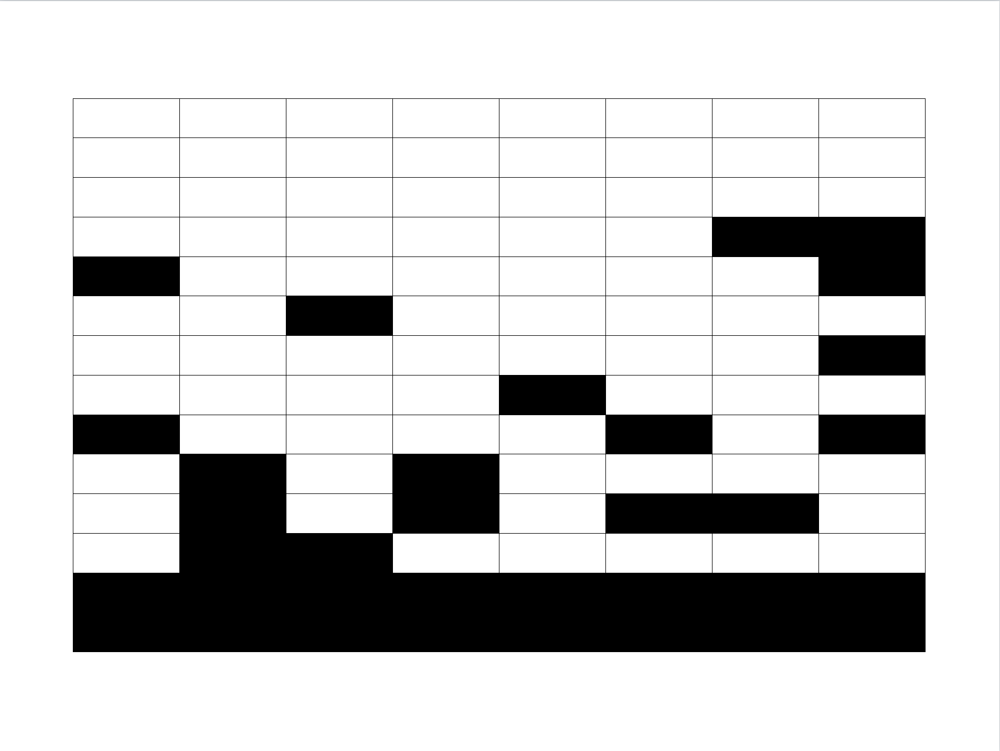

# Representatividad y ausencia de respuesta

El problema de la ausencia de respuesta es una faceta normal, aunque no deseable, en el desarrollo de una encuesta. Todas las encuestas de hogares sufren del fenómeno de la ausencia de respuesta ya sea de hogares completos, de personas dentro de los hogares, o en en algunas de las variables de interés dentro de los cuestionarios. En algunas ocasiones y aún después de un diseño cuidadoso y una planificación logística exhaustiva, esta problemática puede ser tan grande que los resultados de la encuesta pueden quedar en entredicho. Por esta razón, este problema debe ser considerado en la planificación y el diseño de todos los levantamientos de información a través de encuestas y se debe contemplar varios ajustes que prevean las consecuencias de este fenómeno. Es por esto que en los capítulos anteriores se abordó el tema del ajuste de subcobertura, que garantiza que el tamaño de muestra efectivo sea el adecuado para realizar un inferencia precisa. De otra forma, si el diseño de la encuesta no tiene en cuenta estos ajustes, el tamaño de muestra final se verá reducido puesto que muchos hogares no contestarán algunas preguntas del cuestionarios, y en algunos casos, muchos hogares no contestarán la totalidad del cuestionario. 

Existe un consenso general de que la ausencia de respuesta puede perjudicar severamente la calidad de las estadísticas calculadas y publicadas en una encuesta. @Lohr_2019 afirma que la mayoría de encuestas tienen cierta ausencia de respuesta residual, aún después de un diseño cuidadoso y un seguimiento de la ausencia de respuesta y establece que existen varios tipos de mecanismos de ausencia de respuesta.

1. Se define la ausencia de respuesta ignorable cuando la probabilidad de que un individuo responda no depende de la característica de interés. Nótese que el adjetivo ignorable hace referencia a que un modelo puede explicar el mecanismo de ausencia de respuesta y que ésta se puede ignorar después de que el modelo la toma en cuenta.
1. Por otra parte, la ausencia de respuesta se dice no ignorable cuando la probabilidad de que un individuo responda depende de la característica de interés. Por ejemplo, si en una encuesta de fuerza laboral, se desea estimar el número de personas empleadas o desempleadas, la ausencia de respuesta es no ignorable cuando depende de la clasificación laboral del individuo.

En términos de literatura, el fenómeno de la ausencia de respuesta y sus repercusiones negativas sobre la calidad de las estimaciones ha sido ampliamente estudiado. Por ejemplo, @Lumley_2010[, capítulo 9] hace un análisis detallado con la ausencia de respuesta individual, en donde existen datos parciales para un respondiente, considerando un enfoque que está basado en el diseño de muestreo al ajustar los pesos muestrales. @Fuller[, capítulo 5] cita algunas técnicas de imputación para el tratamiento de la ausencia de respuesta y conjuga modelos probabilísticos junto con los pesos del diseño de muestreo para mitigar los efectos de este problema. @Sar1 considera un enfoque asistido por modelos, en donde toma conjuntos balanceados para lograr mayor representatividad de las estimaciones. De la misma forma, @Sar2 propone un conjunto de indicadores para juzgar la efectividad de la información auxiliar utilizada para controlar el sesgo generado por la ausencia de respuesta. 

## El concepto de representatividad

El concepto de representatividad se utiliza a menudo en la investigación
de encuestas, pero por lo general no está claro qué significa. En particular Kruskal y Mosteller presentan una amplia descripción
de lo que se supone que significa el adjetivo representativo [@KruskalMosteller1, @KruskalMosteller2, @KruskalMosteller3, @KruskalMosteller4]. El concepto de muestra representativa no está del todo estandarizado; @Bethlehem_Cobben_Schouten_2009 menciona que algunos de estos conceptos son muy vagos e imprecisos; por ejemplo:

- Reconocimiento general de los datos.
- Ausencia de fuerzas selectivas en la muestra.
- Una muestra que sea una miniatura de la población.
- Una muestra que contenga casos típicos o ideales.
- Cobertura suficiente de la población,
- Que permite una buena estimación,
- Suficientemente bueno para un propósito particular.

En términos de notación, supongamos que se selecciona una muestra probabilística $s$ de tamaño $n$ sin reemplazo de una población finita $U$ de tamaño $N$. La muestra puede verse como un vector de $N$ indicadores $s=(I_{1},I_{2},\ldots,I_{N})$, donde el indicador $I_{k}=1$ si se selecciona el elemento $k$ en la muestra, y $I_{k}=0$ en caso contrario ($k=1,2,\ldots,N$). El fenómeno de la ausencia de respuesta se modela por medio de las probabilidades de respuesta. Para esto, se supone que cada elemento $k$ en la población tiene una cierta probabilidad desconocida $\phi_{k}$ de responder cuando se selecciona en la muestra. La respuesta a la encuesta se puede representar mediante el vector de indicadores $D=(D_{1},D_{2},\ldots,D_{N})$, donde $D_{k}=1$ si el elemento $k$ fue seleccionado en la muestra $(I_{k}=1)$ y respondió. De lo contrario, $D_{k}=0$. Por ende, se deduce que

$$
\phi_{k}=P\left(D_{k}=1\mid I_{k}=1\right)
$$

Para poder definir un indicador de representatividad, el concepto
de representatividad que mejor se acomoda se define como *la ausencia de fuerzas selectivas*. Está claro que no existen fuerzas selectivas si todas las probabilidades de respuesta son uniformes. Esta observación forma la base de la primera definición de representatividad.

La respuesta a una encuesta se denomina *fuertemente representativa* con
respecto a la muestra, si las probabilidades de respuesta de todos
los elementos de la población son iguales y si la respuesta de un
elemento es independiente de la respuesta de todos los demás elementos.
En otras palabras:

$$
\phi_{k} = P\left(D_{k}=1\mid I_{k}=1\right) =  \phi  \ \ \ \ \ \ \ \ \ \ k=1,2,\ldots,N
$$

Se debe tener en cuenta que la representatividad fuerte se garantiza cuando el mecanismo de datos faltantes es MCAR para cada variable objetivo en el estudio. En este caso, la falta de respuesta no provoca que los estimadores estén sesgados. Esta es una definición atractiva, pero no es muy útil ya que en la práctica no es posible comparar las probabilidades de respuesta individual.

Por otro lado, suponga que hay una variable auxiliar categórica $X$ que tiene $H$
categorías y divide la población en $H$ estratos (subpoblaciones).
El número de elementos en el estrato $h$ se denota por $N_{h}$,
para $h=1,2,\ldots,H$. Se asume que esta variable ha sido medida
en la encuesta y que su valor está disponible para cada encuestado
y no encuestado. La probabilidad de respuesta del elemento $k$ en
el estrato $h$ está definida por $\phi_{hk}$.

La respuesta a una encuesta se denomina *débilmente representativa*
con respecto a la muestra para la variable auxiliar $X$ si la probabilidad
de respuesta promedio es la misma en cada estrato, es decir,

$$
\bar{\phi}_{h} =  
\frac{1}{N_{h}}\sum_{k=1}^{N_{h}}\phi_{hk} =
\phi \ \ \ \ \ \ \ \ \ \  h=1,2,\ldots,H
$$

La representatividad débil significa que no es posible distinguir
a los encuestados de los no encuestados simplemente usando información
con respecto a $X$. Si la respuesta es débilmente representativa con respecto a muchas variables auxiliares $X$, existirán relaciones fuertes entre las variables objetivo y las variables auxiliares. Nótese que es posible estimar las medias de las probabilidades de respuesta en los estratos y, por lo tanto, se puede comprobar en la práctica el supuesto de representatividad débil.

## Indicadores de representatividad

Como se mencionó anteriormente, la mayoría de las encuestas adolecen de falta de respuesta y este fenómeno puede afectar seriamente la calidad de
los resultados de una encuesta. De hecho, las estimaciones de las características de la población estarán sesgadas si, debido a la falta de respuesta, algunos grupos de la población quedan sobre-representados o sub-representados; el problema se agrava cuando estos grupos
se comportan de manera diferente con respecto a las variables de la
encuesta. En referencia a la ausencia de respuesta de unidad, en general los INE de la región a menudo usan la tasa de respuesta de la encuesta como un indicador de la calidad de la encuesta. 

Dado que una tasa de respuesta baja no implica necesariamente que la precisión de las estimaciones de la encuesta sea deficiente, centrarse solo en la tasa de respuesta como indicador de la calidad de la encuesta puede ser engañoso. Por ejemplo, @Bethlehem_Cobben_Schouten_2009 ilustran esta situación con un ejemplo de la encuesta holandesa POLS en 1998 (Encuesta Integrada de Condiciones de Vida de los Hogares). Después de un mes de trabajo de campo, la tasa de respuesta fue del 47,2%, mientras que después del período completo de dos meses, la tasa había aumentado al 59,7%. El modo de recolección de datos en el primer mes fue CAPI (entrevista
personal asistida por computadora). Los que no respondieron fueron
contactados en el segundo mes con CATI (Entrevista Telefónica Asistida
por Computadora) si tenían un teléfono fijo en la lista. El segundo mes de trabajo de campo aumentó la respuesta en un 12,5%. Sin embargo, esto no resultó en mejores estimaciones puesto que el sesgo de los estimadores aumentó a partir del segundo mes, dado que las personas que habían reportado un número telefónico diferían de las que no reportaron este contacto.

Adicional a la tasa de no respuesta, se necesitan indicadores
de calidad de la encuesta que proporcionen más información sobre el
posible riesgo de estimadores sesgados. 

@Shlomo_Skinner_Schouten_2012 estudian el uso de los *indicadores de representatividad* (Indicadores $R$) que permiten conocer qué tanto la muestra de respondientes efectivos representa a la población y cómo la composición de la respuesta en la muestra diferiría de la composición de la población finita. Estos indicadores han probado ser una guía importante para determinar en qué medida el sesgo causado por la ausencia de respuesta afecta la encuesta. De hecho, en Europa el proyecto RISQ (*Representativity Indicators for Survey Quality*) está basado en este enfoque y pretende desarrollar y probar indicadores R en varias encuestas de interés. Los países que participan en este proyecto Holanda, Noruega y Eslovenia, en conjunto con las universidad de Southampton (Reino Unido) y la Universidad de Lovaina (Bélgica). 


Los indicadores $R$ miden hasta qué punto la composición de
la respuesta a una encuesta se desvía de la muestra original. Si todas las probabilidades de respuesta son iguales, la respuesta
es fuertemente representativa y no habrá diferencias sistemáticas
entre la composición de la respuesta y la muestra. Por el contrario, si las probabilidades de respuesta no son iguales, es importante
establecer en qué medida se ve afectada la composición de la respuesta. Esto se logra mediante la definición de una función de distancia
que mide en qué medida las probabilidades de respuesta individuales
difieren de la probabilidad de respuesta media.

Supongamos que se conocen las probabilidades de respuesta individual
$\phi_{1},\phi_{2},\ldots,\phi_{N}$ de todos los elementos de la población.
Entonces la desviación estándar es

$$
S\left(\phi\right)  =  \sqrt{\frac{1}{N-1}\sum_{k=1}^{N}\left(\phi_{k}-\bar{\phi}\right)^{2}}
$$

Nótese que $S\left(\phi\right)=0$ si todas las probabilidades de respuesta
son iguales y el valor de $S\left(\phi\right)$ será mayor a medida
que haya más variación en los valores de las probabilidades de respuesta. Además, el valor máximo de $S\left(\phi\right)$ es igual a 0.5. Por ende, el indicador $R$ se define como: 

$$
R\left(\phi\right)=1-2\,S\left(\phi\right)
$$

Este indicador asume valores en el intervalo $\left[0,1\right]$. De esta manera, un valor de uno implica una fuerte representatividad. Cuanto menor es su valor, más se desvía la composición de respuesta
de la composición de la muestra. En general, los valores de las probabilidades de respuesta individuales se desconocen en la práctica. Este problema se resuelve estimando las probabilidades de respuesta. Esto se puede lograr si se dispone de información auxiliar adecuada; es decir, de variables que se han medido tanto para los encuestados como para los no encuestados. Para estimar estas probabilidades es posible utilizar varias técnicas, por ejemplo, modelos logísticos o probit, árboles de clasificación, entre otras. 

Al suponer que $\hat{\phi}_{1},\hat{\phi}_{2},\ldots,\hat{\phi}_{n}$ son
las probabilidades de respuesta estimadas para las unidades en la muestra.
Entonces, la probabilidad de respuesta media se puede estimar mediante

$$
\hat{\bar{\phi}}  =  \frac{1}{N}\sum_{k=1}^{n}\frac{\hat{\phi}_{k}}{\pi_{k}}
$$

y

$$
\hat{R}\left(\phi\right)  =  1-2\sqrt{\frac{1}{N-1}\sum_{k=1}^{n}\frac{\left(\hat{\phi}_{k}-\hat{\bar{\phi}}\right)^{2}}{\pi_{k}}}
$$

Nótese que el indicador $R$ mide la desviación de la representatividad débil y no de la representatividad fuerte. Por ende, este enfoque no es capaz de detectar y cuantificar las diferencias
entre las probabilidades de respuesta individual dentro de las clases obtenidas al cruzar las variables auxiliares. Suponiendo que las clases están definidas por una variable auxiliar $X$ que tiene $H$ categorías. Sea $N_{h}$ el tamaño de la clase $h$ y sea $\bar{\phi}_{h}$ la media poblacional de las probabilidades de respuesta en el estrato $h$. Si se utiliza un modelo estándar como la regresión logística, el indicador $R$ se calcula como:

$$
R_{x}\left(\phi\right)  =  1-2\sqrt{\frac{1}{n-1}\sum_{h=1}^{H}N_{h}\left(\bar{\phi}_{h}-\bar{\phi}\right)^{2}}
$$

En este caso, $R_{x}\left(\phi\right)$ mide la variación de las probabilidades de respuesta entre clases $X$. Si se supone que la variación dentro de la clase es cero en todas las clases, entonces $R_{x}\left(\phi\right) = R\left(\phi\right)$. 

@Bethlehem_Cobben_Schouten_2009 mencionan que de julio a diciembre de 2005, Statistics Netherlands realizó un seguimiento a gran escala entre los no encuestados en la Encuesta de Población Activa (EPA) de Holanda. En el estudio, se abordó a dos muestras de personas que no respondieron en la EPA utilizando, por un lado, el enfoque de devolución de llamada con el cuestionario completo de la EPA y, por el otro lado, el enfoque de preguntas básicas con un cuestionario muy corto. Se usó CATI en el enfoque de devolución de llamada, y el enfoque de preguntas básicas se utilizó un diseño de recolección mixto que involucró cuestionarios *online* y recolección presencial con papel y CAPI. Los indicadores R se estimaron utilizando modelos de regresión logística que incluían una gran cantidad de variables explicativas que medían características demográficas, geográficas y socioeconómicas en los hogares. Los resultados de este estudio se dan a continuación:

1. Se reportó que el valor del indicador $R$ para la respuesta inicial de la EPA es igual a 0.8, que es menor que el valor ideal de 1. Entonces, esta respuesta no es fuertemente representativa. La aplicación del enfoque de devolución de llamada aumentó la
tasa de respuesta del 62.2% al 76.9%. Luego de esto, el valor del indicador $R$ aumentó de 0.8 a 0.85. Como los intervalos de confianza no se superponían, hubo indicios de que la respuesta adicional mejoró la composición del conjunto de datos.
1. La aplicación del enfoque de preguntas básicas dio como resultado
una conclusión diferente. Aunque la tasa de respuesta aumentó del 62.2% al 75.6%, el valor del indicador $R$ disminuyó de 0.80 a 0.78. Los intervalos para la EPA inicial y la EPA con preguntas básicas, se superpusieron. Por lo tanto, aparentemente, el enfoque de preguntas básicas no mejoró la composición del conjunto de datos. 

Este último enfoque no es novedoso y agudiza el contraste entre respondientes y no respondientes. Dado que las probabilidades de respuesta estimadas se utilizan para calcular
el indicador $R$ y esta estimación se basa en un modelo lineal que utiliza un conjunto de variables auxiliares como variables explicativas. 

La dependencia del indicador $R$ del conjunto de variables auxiliares utilizadas tiene implicaciones para comparar diferentes conjuntos de datos (por ejemplo, en el tiempo o en dominios). Un enfoque apropiado podría ser fijar el conjunto de variables auxiliares de antemano y mantenerlas iguales para todos los conjuntos de datos. Para ello, debe elegirse el máximo posible de variables. Por otro lado, debido al sobreajuste, el error estándar (estimado) puede verse
afectado, pero las probabilidades de respuesta estimadas no serán sesgadas.

Otro enfoque que se recomienda, es intentar encontrar el mejor modelo para cada conjunto de datos utilizando técnicas de selección de modelos. Esto hace que los modelos dependan del tamaño de la muestra: cuanto
mayor sea la muestra, más variables del modelo tendrán una contribución significativa. Las muestras pequeñas simplemente no permiten una estimación adecuada de las probabilidades de respuesta y conducirán a una visión más optimista de la representatividad.


Con esta metodología es posible determinar si la composición de la muestra de respondientes efectivos difiere o no de la de la muestra inicial. Los resultados de este proceso de seguimiento pueden ayudar a sustentar
la decisión de iniciar esfuerzos adicionales para obtener datos para grupos específicos de la población objetivo; este enfoque también puede resultar útil para evaluar si volver a abordar una muestra de personas que no respondieron sería una buena estrategia para acotar el sesgo, o si con un enfoque de preguntas básicas sería suficiente.

El uso de esta metodología durante la fase de recolección de datos podría revelar que la composición de los datos observados se está desviando cada vez más de la estructura poblacional esperada. Esto podría llevar a la decisión de enfocar el resto del proceso de recolección en los grupos que están subrepresentados. Estos cambios en medio de la encuesta se conocen en la literatura especializada como *diseños receptivos*. Otra forma de utilizar el indicador $R$ para controlar el proceso de la encuesta es analizar la representatividad de una versión anterior de la encuesta. Los resultados de dicho análisis pueden proporcionar información para implementar una estrategia mejorada de recopilación de datos para una nueva versión de la encuesta. 


## Clasificación de la ausencia de respuesta

Por otra parte, @Lund aclaran que existe una gran cantidad de literatura acerca de la ausencia de respuesta y muchos artículos recientes. Esta literatura examina dos aspectos diferentes pero complementarios en el ejercicio de una encuesta: la prevención de la ausencia de respuesta (antes de que ocurra) y las técnicas de estimación necesarias para tener en cuenta la ausencia de respuesta de manera apropiada en el proceso de inferencia. Esta segunda actividad se conoce con el nombre de ajuste para la ausencia de respuesta. @LR2002 establecen tres tipos de ausencia de respuesta.

La ausencia de respuesta completamente aleatoria (MCAR - *missing completely at random*) se presenta cuando la probabilidad de que un individuo responda no depende de la característica de interés, ni de alguna otra covariable auxiliar. Por ejemplo, si la ausencia de respuesta en una encuesta laboral, no depende del estado actual de empleo del respondiente, ni de alguna característica auxiliar. De esta forma, la ausencia de respuesta está dispersa de manera uniforme sobre toda la población. 

Es decir que, cuando el investigador produzca estadísticas descriptivas sobre las personas que respondieron la encuesta, ese porcentaje de personas sea muy similar y tenga un comportamiento uniforme sobre todas las posibles covariables que afecten al individuo. El gráfico \@ref(fig:mcar) podría mostrar algunos indicios de que el patrón de ausencia de respuesta podría ser MCAR puesto que el porcentaje de respuesta es similar en las variables auxiliares.

```{r, mcar, echo=FALSE, fig.height = 3, fig.cap="Patrón de respuesta MCAR"}
par(mfrow=c(1, 3))
counts.G <- c(Hombre = 95, Mujer = 94)
barplot(counts.G, xlab = "Sexo", ylab = "Porcentaje de respuesta")
counts.Z <- c(Urbano = 93, Rural = 95)
barplot(counts.Z, xlab = "Zona", ylab = "Porcentaje de respuesta")
counts.T <- c(Ocupado = 96, Desocupado = 94)
barplot(counts.T, xlab = "Condición de ocupación", ylab = "Porcentaje de respuesta")
```

La ausencia de respuesta aleatoria (MAR - *missing at random*) se establece cuando la probabilidad de que un individuo responda depende de algunas covariables auxiliares, pero no depende de la característica de interés.  Por ejemplo, en una encuesta de fuerza laboral, la ausencia de respuesta puede depender de la edad del respondientes, o del sexo, o incluso del nivel económico del individuo, pero no depende de su clasificación laboral. El gráfico \@ref(fig:mar) muestra que el patrón de ausencia de respuesta podría ser MAR puesto que el sexo y la zona del respondiente están influenciando el porcentaje de respuesta, aunque no el estado de ocupación. 

```{r, mar, echo=FALSE, fig.height = 3, fig.cap="Patrón de respuesta MAR"}
par(mfrow=c(1, 3))
counts.G <- c(Hombre = 50, Mujer = 95)
barplot(counts.G, xlab = "Sexo", ylab = "Porcentaje de respuesta")
counts.Z <- c(Urbano = 98, Rural = 42)
barplot(counts.Z, xlab = "Zona", ylab = "Porcentaje de respuesta")
counts.T <- c(Ocupado = 96, Desocupado = 94)
barplot(counts.T, xlab = "Condición de ocupación", ylab = "Porcentaje de respuesta")
```

Por último, la ausencia de respuesta no aleatoria (NMAR - *not missing at random*) se presenta cuando la ausencia de respuesta depende de la característica de interés. El gráfico \@ref(fig:nmar) muestra indicios de que el patrón de respuesta es NMAR, puesto que la condición de ocupación es la que influencia el porcentaje de respuesta; esto es contraproducente porque no existirá una forma simple de mitigar el sesgo generado por esta clase de ausencia de respuesta. 

```{r, nmar, echo=FALSE, fig.height = 3, fig.cap="Patrón de respuesta MNAR"}
par(mfrow=c(1, 3))
counts.G <- c(Hombre = 80, Mujer = 82)
barplot(counts.G, xlab = "Sexo", ylab = "Porcentaje de respuesta")
counts.Z <- c(Urbano = 83, Rural = 79)
barplot(counts.Z, xlab = "Zona", ylab = "Porcentaje de respuesta")
counts.T <- c(Ocupado = 10, Desocupado = 90)
barplot(counts.T, xlab = "Condición de ocupación", ylab = "Porcentaje de respuesta")
```


## Ausencia de respuesta de registro y de unidad

Nótese que a pesar de que se hayan tomado las medidas de ajuste necesarias en el diseño de la encuesta, cuando ya ha terminado el proceso de recolección de información, se debe lidiar con la ausencia de respuesta para evitar sesgos y aumentar la precisión de los estimadores en la encuesta. La literatura especializada examina dos metodologías diferentes pero complementarias en el ejercicio de una encuesta: la prevención de la ausencia de respuesta (antes de que ocurra) y las técnicas de estimación necesarias para tener en cuenta la ausencia de respuesta de manera apropiada en el proceso de inferencia, después de la recolección de los datos. 

Si el mecanismo de ausencia de respuesta se asume MCAR, es posible contemplar en el proceso de inferencia únicamente a aquellas unidades que tienen registros completos y eliminar de la base de datos a aquellas unidades que no contestaron (*list-wise deletion*). A pesar de que este tipo de análisis es simple, para evitar subestimaciones de los parámetros de interés, se debe realizar un ajuste de los factores de expansión inducidos por el diseño muestral, que originalmente fue planeado con un tamaño de muestra más grande que el efectivo. De esta forma, es posible suponer que la muestra de respondientes corresponde a una submuestra completamente aleatoria de la población y utilizar los principios de los diseños en dos fases. @Heeringa_West_Berglund_2010[capítulo 11] afirman que este tipo de análisis, además de inducir posibles sesgos si el supuesto MCAR no se cumple, reduce la eficiencia de la inferencia debido al decremento del tamaño de muestra efectivo. Por lo tanto, en la mayoría de encuestas, este supuesto no se asume y se realiza un ajuste adicional, después de que ha ocurrido la ausencia de respuesta. 

En general se puede afirmar que existen dos tipos de ausencia de respuesta: la primera, debido a la falta de respuesta de una unidad de observación (ausencia de respuesta de unidad), y la segunda debido a la falta de respuesta de una unidad en algunas variables de interés (ausencia de respuesta por registro). Es por esto que @Sarndal_Swensson_Wretman_2003[sección 15.5] afirman que las principales técnicas para tratar la ausencia de respuesta son el ajuste a los pesos de muestreo y la imputación. El ajuste por ponderación implica aumentar los pesos aplicados en la estimación de los valores y de los encuestados para compensar los valores que se pierden debido a la ausencia de respuesta, mientras que la imputación implica la sustitución de los valores faltantes por valores artificiales.

La ausencia de respuesta tiene una repercusión evidente en la base de datos de la encuesta. Por ejemplo, en la base de datos inicial puede faltar toda la información de una unidad de observación; esto suele suceder porque el encuestador no pudo establecer contacto con el hogar, o porque la persona seleccionada no puede responder o simplemente porque se rehúsa a participar. En esta etapa es recomendable que el encuestador pueda determinar algunas características demográficas del hogar para poder realizar los ajustes pertinentes en el proceso de análisis. También es posible que en la base de datos exista información faltante en algunas registros de las unidades; esto puede deberse a muchas más causas y se evidencia en la base de datos inicial porque faltan algunos registros de la unidad de observación, aunque otros sí están efectivamente respondidos. Algunas causas asociadas a este fenómeno pueden ser estar relacionadas con que el respondiente se sintió agotado en algún momento del cuestionario, o porque alguna pregunta en particular no fue respondida por considerarse sensible.

En general, es posible hacer frente a este fenómeno indeseado desde varias perspectiva. Los siguientes son algunos puntos de vista para enfrentar la ausencia de respuesta:

1. *Ignorancia*: lamentablemente, no es raro que se pretenda ignorar la ausencia de respuesta en la encuesta y realizar inferencias con los datos recopilados de las unidades respondientes, sin realizar ningún tipo de acercamiento estadístico para ajustar la inferencia.
2. *Prevención*: diseñar la encuesta de modo que la ausencia de respuesta sea pequeña. Éste es el mejor método de enfrentarla. La capacitación al equipo encuestador, la redacción de las preguntas, la longitud del cuestionario, las revisitas y el agendamiento de las entrevistas pueden palear las altas tasas de ausencia de respuesta. 
3. *Reacción*: utilizar herramientas para analizar la encuesta de modo que se corrijan los sesgos causados por la ausencia de respuesta. En este caso es posible ajustar los ponderadores de las unidades, o establecer procedimientos de imputación en los registros.

Ignorar la ausencia de respuesta puede tener consecuencias graves en el entendimiento del constructo de interés en la encuesta. Más aún, puede llevar a tomar decisiones erradas de política pública. Por ejemplo, si se omite el efecto de la ausencia de respuesta en una encuesta de ingresos y gastos, se podría subestimar el ingreso medio y el ingreso total en un país; si se omite el efecto de la ausencia de respuesta en una encuesta de desempleo, se podría subestimar el número total de desempleados; además, si se omite el efecto de la ausencia de respuesta en una encuesta de victimización, se podría subestimar el número total de víctimas.

La ausencia de repuesta conlleva grandes efectos de sesgo en los resultados de calidad de las estimaciones. Debe contemplarse muy bien la mejor estrategia para hacer frente a sus consecuencias. Por ejemplo, si se aumentara el tamaño de muestra para enfrentar la ausencia de respuesta, es posible que nos encontremos con una mayor cantidad de personas de la misma clase de respondientes (homogeneidad). En este caso, el sesgo puede aumentar porque se malgastaron recursos que hubiesen servido para remediar la ausencia de respuesta con otras medidas. 


## Posibles soluciones

Al lidiar con la ausencia de respuesta, podemos distinguir algunas prácticas que guían a diferentes tratamientos metodológicos diferentes. En general, se pueden distinguir las siguientes prácticas:

- **Imputación total**: se trata de imputar todos los valores faltantes para los individuos con al menos un valor perdido. En otras palabras, la imputación se considera como la única forma de tratar la ausencia de respuesta.
- **Ponderación total**: se trata de ponderar cada una de las variables de interés, así sea de manera diferenciada. No se utiliza la imputación y existirán tantos conjuntos de factores de expansión como variables con valores perdidos.
- **Eliminación total**: se trata de eliminar todos los registros con algún valor perdido y hacer el análisis con el conjunto restante de valores respondidos.
- **Enfoque combinado**: se trata de imputar únicamente en los elementos que tienen al menos un registro (no todos) perdido y modificar los factores de expansión en aquellos casos en donde hay omisión de todos los registros del cuestionario.

Siguiendo la notación de @Sarndal_Lundstrom_2006, consideramos una muestra de unidades $s$, de la cual $r$ denota el conjunto de respondientes que han contestado a una o más de las $I$ variables de interés. Por tanto, una unidad que no responde a ninguna variable pertenece al conjunto $s-r$. El conjunto de unidades que han respondido a una variable del estudio en particular se denota por $r_i$. Nótese que

$$
r_i\subseteq r \subseteq s
$$

Finalmente, si se supone que $y_k$ es faltante y se considera para la imputación, entonces $\hat{y}_k$ denotará su valor imputado. La figura \@ref(fig:figbaseincom) ilustra^[Las celdas en color blanco representas registros respondidos y las celdas en color negro representan registros no respondidos y faltantes] cómo, después de la recolección de datos, hay individuos que no respondieron  a una o todas las variables de la encuesta. En esta ilustración, las unidades están representadas por las filas y las variables por las columnas. Observe que lo primeros tres individuos contestaron a todas las preguntas del cuestionario; el cuarto individuo no contestó las últimas dos preguntas; el quinto individuo no contestó ni la primera ni la última pregunta; el sexto individuo no contestó a la tercera pregunta; y así sucesivamente, hasta llegar a los últimos dos individuos quienes no contestaron a ninguna pregunta del cuestionario. Para este ejemplo particular, se observa que:

* El número de variables de interés en la encuesta de hogares es $I=8$.
* El número de unidades incluidas en la muestra $s$ es $n=\#(s)=14$.
* El número de respondientes efectivos en la primera variable es $\#(r_1)=10$, en la segunda variable es $\#(r_2)=9$, y así sucesivamente hasta notar que el número de respondientes efectivos en la última variable de la base de datos es de $\#(r_8)=8$. 


```{r, figbaseincom, fig.cap="Un conjunto de datos después del proceso de observación.", echo=FALSE, out.width='50%'}

```


### Imputación total 

En este enfoque se imputarían todos los valores $y_k$ que están perdidos, sin importar si la pérdida es debida a la ausencia del registro o del individuo. En este caso, tendríamos un conjunto completo de datos con los valores $\{y_{\circ \  k}: k\in s\}$, donde

$$
y_{\circ \  k} = 
\begin{cases}
y_k, \ \text{for $k \in r_i$} \\
\hat{y}_k, \ \text{for $k \in s - r_i$}
\end{cases}
$$

y $\hat{y}_k$ es el valor imputado. Por ejemplo, el estimador del total utilizando este enfoque estaría dado por la siguiente expresión.

$$
\hat{t}_{y,\pi} = \sum_s d_{k}y_{\circ \  k}
= \sum_{r_i}d_{k}y_k + \sum_{s - r_i}d_{k}\hat{y}_k
$$

La figura \@ref(fig:figimptotal) muestra un ejemplo de las unidades que serían consideradas para el análisis después de la imputación. Nótese entonces que las tres unidades que respondieron todas las preguntas del cuestionario entran al análisis sin ningún ajuste; mientras que las nueve unidades que no respondieron a todo el cuestionario entran al análisis habiéndose imputado las celdas correspondientes a la ausencia de respuesta; además, las dos unidades que no respondieron ninguna pregunta del cuestionario también entran al análisis puesto que todas sus respuestas fueron imputadas. Luego, en este enfoque todas las unidades en el conjunto $s$ se consideran para el análisis posterior. 

```{r, figimptotal, fig.cap="Imputación total: todas las unidades que no respondieron son imputadas (las celdas en gris indican los valores que fueron imputados).", echo=FALSE, out.width='50%'}
knitr::include_graphics("Pics/j3.png")
```


### Ponderación total 

Al usar el enfoque de ponderación total es posible usar pesos de calibración específicos $w_k = d_k F_{ik}$ que compensarían la ausencia de respuesta de unidad y de registro. De esta forma, el estimador del total estaría dado por la siguiente expresión:

$$
\hat{t}_{y,cal} =\sum_{r_i}w_ky_k = 
\sum_{r_i}d_k F_{ik} y_k
$$

Si todos los $r_i$ son diferentes, entonces cada variable de estudio requerirá un conjunto de ponderadores diferentes. Al final este enfoque induce un número no uniforme de casos por variable. Para este esquema, se utilizan pesos $w_k^{(i)}$ para cada variable $i \in I$ que compensan la ausencia de respuesta de la unidad. Si todos los $r_i$ son diferentes, cada variable de estudio requerirá un conjunto de pesos diferente. 

Siguiendo con el ejemplo, a partir de la figura \@ref(fig:figpondtotal) se nota que la primera variable del cuestionario fue respondida por 10 personas, y cuatro personas no respondieron esta pregunta. Por lo tanto, en este enfoque se crearán pesos $w_k^{(1)}$ para cada $k\in r_1$ que ponderen satisfactoriamente la información recolectada en esta variable. Sin embargo, este conjunto de pesos no será único, puesto que, en particular, la segunda variable del cuestionario fue respondida por nueve personas, y tres personas no respondieron esta pregunta. Por lo tanto, en este enfoque se crearán pesos $w_k^{(2)}$ para cada $k\in r_2$ que ponderen esta información recolectada en esta variable. Nótese que en general $w_k^{(1)} \neq w_k^{(2)}$ y, por ende, cada una de las $I=8$ variables del estudio tendrá su propio conjunto de ponderadores. 

```{r, figpondtotal, fig.cap="Ponderación total: cada variable tendrá un conjunto de pesos diferente. No se utiliza ningún método de imputación.", echo=FALSE, out.width='50%'}
knitr::include_graphics("Pics/j4.png")
```

### Eliminación total 

En este enfoque se eliminarán de la base de datos todas las unidades que contengan al menos un registro perdido. Se recomienda fuertemente abstenerse de tomar este camino, puesto que, aunque induciría un solo conjunto de ponderadores, tendríamos un decrecimiento considerable y deliberado en el tamaño de muestra, asociado con pérdida de información, incremento sustancial de sesgos y decremento de la precisión de los estimadores. Note que en este enfoque sólo las unidades del conjunto de respondientes efectivos en todas las variables se consideran para el análisis posterior de la encuesta. Este subgrupo de individuos está dado por:
$$
\bigcap_{i=1}^I r_i
$$ 
Por supuesto, en general, esto no es aconsejable puesto que trae problemas de sesgo, dado que las unidades que contestaron todo el cuestionario generalmente difieren de forma estructural de las unidades que no contestaron; además trae problemas de eficiencia estadística, puesto que el tamaño de la muestra efectiva, después de la eliminación de unidades, será insuficiente para garantizar los mínimos requeridos en la inferencia. 

La gráfica \@ref(fig:figelimtotal) representa este enfoque en donde es evidente que el decrecimiento en el tamaño de muestra podría tener repercusiones nefastas en la inferencia de la encuesta. Teniendo en cuenta el ejemplo anterior, solo tres unidades serían tenidas en cuenta para el análisis de la información, mientras que nueve unidades, que no contestaron al menos una pregunta, más las dos unidades que no contestaron ninguna pregunta, serían eliminadas del análisis estadístico. Es decir, la mayoría de unidades de la muestra inicial serían descartadas.

```{r, figelimtotal, fig.cap="Enfoque de eliminación: únicamente se consideran las unidades que respondedieron a todas las varaibles.", echo=FALSE, out.width='50%'}
knitr::include_graphics("Pics/j2.png")
```


### Enfoque combinado 

Por el contrario, es recomendable escoger un camino parsimonioso que combine estas estrategias de forma diferencial a lo largo de la encuesta. El enfoque combinado usa la imputación para afrontar la ausencia de respuesta por registro para las variables (columnas de la base de datos) específicas que lo necesiten y luego utiliza un ajuste a los factores de ponderación para afrontar la ausencia de respuesta por unidad (filas de la base de datos). Usualmente, los pesos finales se producen utilizando un enfoque de calibración que hace uso de información auxiliar externa. 

Cuando se presenta ausencia de respuesta por registro y por unidad, el enfoque combinado imputa primero para luego obtener una matriz rectangular completa. Luego de lo anterior se procede a realizar un ajuste a los ponderadores. El conjunto de datos completo para la variable de interés $y$ está dado por $\{y_{\circ \  k}: k\in r\}$

$$
y_{\circ \  k} = 
\begin{cases}
y_k, \ \text{for $k \in r_i$} \\
\hat{y}_k, \ \text{for $k \in r - r_i$}
\end{cases}
$$

En donde $\hat{y}_k$ es el valor imputado. Note que en el enfoque de imputación total, también se imputa para $k \in s-r$. La gráfica \@ref(fig:figenfcomb) representa este enfoque parsimonioso en donde los valores imputados (en gris) entran a ser parte de la inferencia y las unidades que nunca respondieron (en negro) y que tienen todos sus registros faltantes son retiradas de la base de datos final.

Se observa que los dos últimos individuos de la muestra fueron totalmente descartados puesto que no contestaron ninguna pregunta del cuestionario; además, para la primera variable, los valores del quinto y noveno individuo fueron imputados. De la misma manera, para la segunda variable, los valores de los individuos diez, once y doce fueron imputados; y así sucesivamente, hasta llegar a la última variable en donde los valores de los individuos cuatro, cinco, siete y nueve fueron imputados. 

```{r, figenfcomb, fig.cap="Enfoque combinado: las unidades que no respondieron a ningún ítem son eliminadas del análisis y los respondientes parciales son imputados.", echo=FALSE, out.width='50%'}
knitr::include_graphics("Pics/j5.png")
```

Los capítulos anteriores profundizaron en el tema de la creación de factores de expansión para los individuos presentes en la base de datos final. De tal forma que en los capítulos posteriores se abordará algunas metodologías de imputación que pueden ser recomendables a la hora de completar una base de datos estructurada y rectangular cuyas entradas estén completas. Antes de introducir estos temas se presentarán algunas medidas descriptivas que pueden ser usadas para generar alertas sobre la pérdida de representatividad debido a la ausencia de respuesta. 


