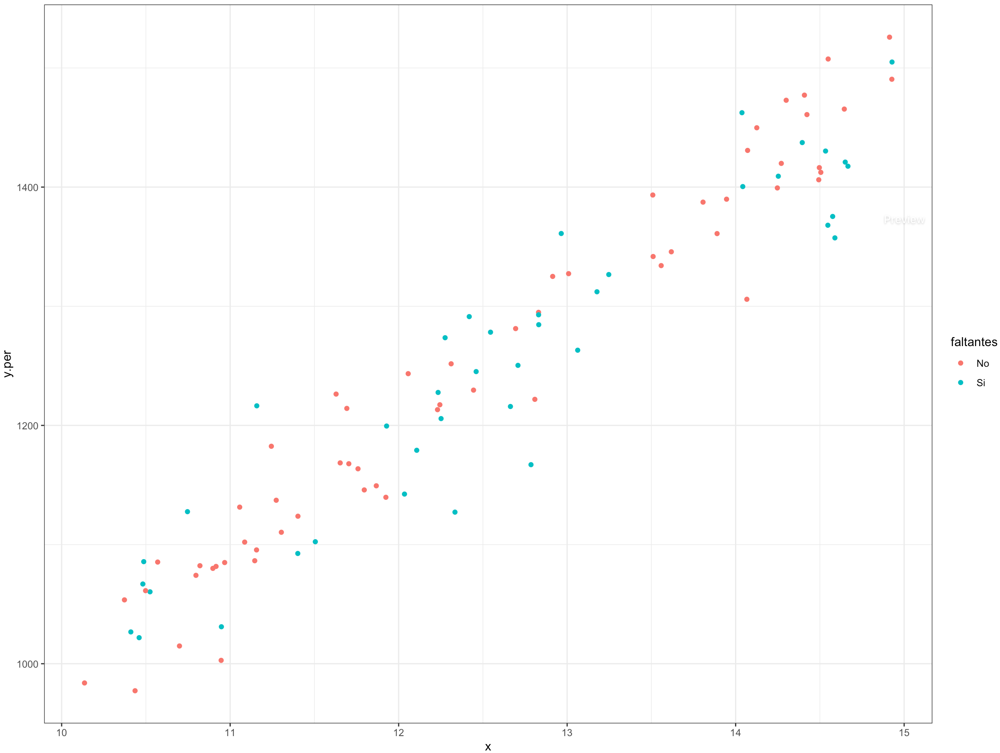

# Ausencia de respuesta por registro

En el diseño y puesta en marcha de una encuesta puede ocurrir cierto tipo de situaciones que pueden sesgar las estimaciones finales. Este tipo de sesgos puede ocurrir antes, durante y después de la recolección de los datos. Es tarea del estadístico advertir ante todas las posibles instancias de los problemas que causan los sesgos y procurar que, en todas las etapas de la encuesta, se minimice el error humano y el error estadístico para que al final los resultados del estudio sean tan confiables como sea posible.

Como se mencionó en los capítulos anteriores, el enfoque recomendado para hacer frente a la ausencia de respuesta es una combinación de los procedimientos de imputación y ponderación y se conoce como el **enfoque combinado**, el cual imputa los valores de las celdas vacías para los individuos que tienen al menos un registro faltante en la base de datos (exceptuando a aquellos que tienen todos o la mayoría de registros faltantes). En resumen, los individuos que no contestaron ninguna pregunta del cuestionario son eliminados del análisis, mientras que los restantes serán considerado en el análisis con sus respuestas originales o con la imputación de las celdas vacías. 

En este capítulo se abordara el enfoque de la imputación utilizada para tratar la ausencia de respuesta por registro, y los posibles métodos que pueden utilizarse para identificar valores atípicos en la base de datos que, por consiguiente, pueden también ser imputados. 

## Módelos para la imputación

El término imputación se refiere al conjunto de técnicas por las cuales los valores faltantes en una o más variables se reemplazan con información plausible con el objetivo de lograr valores sustitutivos en una base de datos que pueda ser analizada posteriormente. Este proceso introduce un nuevo elemento de error, conocido como el error de imputación, debido a la incertidumbre que introducen los valores no observados. Cuando se tiene ausencia de respuesta por registro, las técnicas de imputación se prefieren antes que la utilización de los esquemas de ponderación en la muestra. De esta manera, es posible crear un conjunto completo y rectangular de datos mediante la imputación de los valores faltantes, puesto que después de realizar la imputación, se espera que todos los valores del cuestionario de un individuo contengan información y no exista ningún vacío. 

Para lograr la sustitución de los valores faltantes con información plausible, es posible encontrar donantes apropiados, en la misma muestra que se ha conseguido, definidos como respondientes que comparten características demográficas similares con el individuo que no respondió. Por lo tanto, la información del respondiente donante (o una función de estos valores) se copiará en las celdas vacías del no respondiente. Para encontrar los donantes es posible realizar un análisis estadístico con base en métodos de clasificación. Dentro de los métodos de imputación más usados en encuestas de hogares se encuentran los siguientes:

- Imputación promedio (*mean value imputation*) que utiliza la media de la variable (dentro de las UPM o en un subconjunto apropiado de datos). En este caso, si se encuentra un valor faltante, inmediatamente será reemplazado por el promedio de los datos de los respondientes en un subgrupo apropiado. 
- Imputación por paquete caliente (*hot deck imputation*) que reemplaza los valores faltantes por los valores de un donante que es un respondiente de la encuesta en el mismo levantamiento. En este caso, el valor faltante es reemplazado por la información del individuo escogido de antemano. 
- Imputación por paquete frío (*cold deck imputation*) que reemplaza los valores faltantes por los valores de un donante que es un respondiente de la misma encuesta, pero en un levantamiento anterior. En este caso, el valor faltante es reemplazado por la información auxiliar de un individuo escogido de encuestas anteriores. 
- Imputación estadística basada en modelos (de regresión, generalmente) en donde la variable dependiente es aquella que se quiere imputar y las covariables se derivan del restante conjunto de datos. En este caso, el valor faltante es reemplazado por la predicción (o una función) del modelo ajustado con la información en la muestra. 

Como se mencionó anteriormente, cuando se trata de imputación, se pueden definir dos tipos de métodos. La imputación de la unidad completa, que se produce cuando toda la información de un individuo es imputada, y la imputación del registro, que se da cuando un único valor de un individuo es imputado. Observe que la imputación de la unidad se utiliza para hacerle frente a la ausencia de respuesta de la unidad, cuando no hay datos para el individuo, mientras que la imputación del registro se utiliza para la no respuesta del registro, cuando no todos los valores se proporcionan para un individuo, pero algunos sí. 

La imputación se realiza a menudo en grupos no traslapados $g= 1, \ldots, G$, donde la unión de $s_1, \ldots, s_G$ equivale a la muestra completa $s$. Se pueden utilizar diferentes métodos para cada grupo, pero dentro de cada grupo se debe utilizar el mismo método de imputación. Esto se debe a que pueden existir diferentes covariables disponibles para cada grupo. Cuando la disponibilidad de las variables auxiliares (covariables) es limitada, es posible considerar una jerarquía de métodos de imputación. De esta forma, para los grupos con más información disponible, es posible utilizar métodos más sofisticados de imputación; mientras que para grupos con menos información auxiliar disponible, se deben usar métodos de imputación más simples. @Sarndal_Lundstrom_2006 presentan una discusión acerca del uso de esta técnica en combinación con los estimadores utilizados en las encuestas de hogares que proveen estadísticas oficiales. A continuación, se presenta una compilación no exhaustiva de algunos de los principales métodos de imputación que se utilizan en las encuestas de hogares.

#### Imputación por regresión {-}

En este método determinístico, el valor imputado para el valor faltante $y_k$ se calcula utilizando una regresión lineal.

$$
\hat{y}_k = \mathbf{x}_k \hat{\boldsymbol{\beta}}_i
$$

Donde,

$$
\hat{\boldsymbol{\beta}}_i = (\sum_{r_i} a_k\mathbf{x}_k\mathbf{x}_k')^{-1}
\sum_{r_i} a_k\mathbf{x}_ky_k
$$

El vector de coeficientes de regresión  $\hat{\boldsymbol{\beta}}_i$ se produce a partir de un ajuste de regresión múltiple utilizando los datos $(y_k, \mathbf{x}_k)$ disponibles para cada unidad  $k \in r_i$ con pesos $a_k$ especificados adecuadamente. Nótese que, en general, las predicciones del modelo de regresión no necesariamente serán valores observados en algún otro individuo de la muestra. Por lo tanto, este método inducirá valores imputados que no han sido observados en la encuesta. Además, se deberán generar tantos modelos de regresión como variables con valores faltantes existan. 

#### Imputación de razón {-}

Un caso especial del anterior método se da cuando solo se tiene acceso a una sola covariable (positiva)  $\mathbf{x}_k = x_k$, y definiendo $a_k = \frac{1}{x_k}$. En este caso, la estimación del coeficiente de regresión será

$$
\hat{{\beta}}_i = \frac{\sum_{r_i}y_k}{\sum_{r_i}x_k} = R_i
$$

Y por tanto, la imputación para el valor faltante se convierte en

$$
\hat{y}_k = x_k \hat{\beta}_i = x_k \frac{\sum_{r_i}y_k}{\sum_{r_i}x_k} = x_k R_i
$$

Este método se utiliza a menudo cuando la misma variable se mide en dos momentos diferentes en la misma encuesta. Por ejemplo, si $y$ indica la variable de estudio en el momento actual, $x$ indica la variable en el punto de tiempo anterior, entonces el coeficiente utilizado para la imputación es la relación entre los dos puntos en el tiempo.

#### Imputación de promedio  {-}

El caso más sencillo de la imputación por regresión se da cuando $a_k = x_k = 1$ para todo $k \in r_i$. En este escenario, el valor imputado se convierte en

$$
\hat{y}_k  = \frac{\sum_{r_i}y_k}{\sum_{r_i}1}= \bar{y}_{r_i}
$$

Por lo tanto, todos los valores faltantes recibirán el mismo valor imputado, que es justamente el promedio de la variable en el conjunto de respondientes. Nótese que no se requiere de ninguna información adicional en este método.

#### El vecino más cercano  {-}

Si asumimos que valores similares de $x$ producirán valores similares de $y$, podemos "pedir prestado" un valor de $y$ para imputar el valor faltante de un "vecino" con valores similares en $x$. En este caso, el valor imputado para la unidad $k$ está dado por

$$
\hat{y}_k = y_{l(k)}
$$

Dónde $l(k)$ es el "elemento donante", determinado al minimizar una ecuación de distancia. Enn el caso más simple, para una sola covariable de imputación $x_k$, la distancia entre los posibles donantes $l$ a la unidad $k$ es:

$$
D_{lk} = |x_k - x_l|
$$

El donante $l$ al elemento $k$ es aquel individuo en el conjunto $r$ con la menor distancia $D_{lk}$ entre todos los posibles elementos $l\in r$. Para el caso en donde se contemple más de una covariable de imputación, es posible considerar la siguiente distancia 

$$
D_{lk} = \left( \sum_{j=1}^J h_j (x_{jk} - x_{jl})^2 \right)
$$

En donde $h_j$ se utiliza para ponderar adecuadamente cada una de las $J$ covariables de la matriz de imputación.

#### Imputación Hot Deck  {-}

La imputación por regresión y el vecino más cercano son métodos que asumen una fuerte relación entre la variable de interés $y$ y las covariables $\mathbf{x}$. Sin embargo, en algunas aplicaciones esta relación no se puede establecer fácilmente, y no es plausible validar los supuestos de modelación que otros métodos requieren. Por lo tanto, en este tipo de técnica, el valor imputado para el individuo $k$ está dado por: 

$$
\hat{y}_k = y_{l(k)}
$$

Donde el valor imputado $y_{l(k)}$ es proporcionado por un donante seleccionado aleatoriamente del conjunto de datos de la variable de interés. Este método no se recomienda cuando existen mejores opciones, ya que no se cuenta con información auxiliar para determinar un buen sustituto.

#### Imputación múltiple  {-}

Cuando existe información auxiliar que permita relacionar las covariables con la variable de interés, es posible establecer mejores modelos que no solo mantienen el insesgamiento de la inferencia, sino que estiman con bastante precisión el error de muestreo. Con respecto a esta última categoría de imputación, es posible completar el conjunto de datos utilizando información auxiliar de los respondientes en la encuesta (o encuestas anteriores, si se trata de un diseño rotativo) y la información disponible a nivel de la población para predecir los valores faltantes usando un modelo de regresión. Una de las técnicas más robustas es la imputación múltiple que consiste en formular un modelo probabilístico entre la variable de interés y las covariables disponibles en la encuesta [@Rubin_1987]. Suponga que este modelo es de la forma 

$$
y_k = f(\mathbf{x_k},\boldsymbol{\beta}) + \varepsilon_k 
$$

En donde $\varepsilon_k$ es un término de error aleatorio. Una vez formulado el modelo, y debido a la naturaleza estocástica de $\varepsilon_k$, es posible generar $Q>1$ realizaciones de la variable de interés para los registros faltantes; esto se logra de manera muy sencilla, simulando $Q$ valores del término de error. De esta forma, se generan $Q$ conjuntos de datos completos. Para cada conjunto de datos, se generarán $Q$ estimaciones de interés que luego se promedian para obtener una estimación puntual. 

## Consideraciones sobre la imputación múltiple

El verbo "imputar" viene del latín *impute*, cuya traducción al español puede ser calcular, estimar o atribuir. En el siglo XIX se utilizó el término **ingreso imputado** para denotar el ingreso derivado de los bienes raíces. Según @VanBuuren, la connotación de la imputación, en el sentido de completar valores en una base de datos, aparece por primera vez en 1957 en el *U.S. Census Bureau*. Es así como el tratamiento de datos faltantes consiste en **estimar** qué valores son **plausibles** para los datos faltantes, conociendo los demás valores en la base de datos.

### Propiedades de los estimadores

Antes de escoger un método particular, es pertinente observar qué efectos conlleva esta escogencia en las propiedades estadísticas de los estimadores en las encuestas de hogares. En cuanto a la imputación múltiple, las propiedades estadísticas de los estimadores deben ser modificadas acordemente. Subestimar la variación de las estimaciones puede ser un error muy grave, puesto que afecta la cobertura nominal de los intervalos de confianza y a su vez influye en las pruebas de hipótesis y en el cálculo de los $p$-valores. 

Por ejemplo, suponga que existe una muestra aleatoria compuesta por un conjunto de $n$ datos que relacionan dos variables $X$, $Y$, a través del siguiente modelo de regresión simple:

$$
y_i = \beta x_i + \varepsilon_i
$$

En donde los errores tienen distribución normal con $E(\varepsilon) = 0$ y $Var(\varepsilon) = \sigma ^2$. Bajo esta perspectiva, suponga que la variable dependiente $Y$ sólo pudo ser observada para un conjunto de individuos de tamaño $n_1$, mientras que para los $n_0$ individuos restantes (es decir, $n_1 + n_0 = n$), no existen datos para la variable de interés; además se asume que sí fue posible observar los valores de la covariable $X$ para todos los individuos en la muestra. 

El valor agregado de la imputación múltiple [@Rubin_1987] realmente está en la estimación de los errores estándar. No tener en cuenta la naturaleza estocástica de los valores imputados arroja estimaciones de la varianza mucho menores. La idea consiste en generar $M > 1$ conjuntos de valores para los registros faltantes. Al final, el valor *imputado* corresponderá al promedio de esos $M$ valores. Por tanto el modelo final de imputación (para los valores faltantes) toma la siguiente forma:

$$\dot{y}_i = \dot{\beta} x_{i_{(missing)}}+ \dot{\varepsilon_i}$$

Para este caso, se consideran dos maneras de realizar la imputación; la primera basada en la esperanza del modelo (sin imputación múltiple) y la segunda basada en la adición del término de error del modelo (imputación múltiple):

- **Ingenua**: en este escenario, el valor imputado para el registro faltante toma la siguiente forma:
$$
\dot{y}_i = \hat\beta x_{i_{(missing)}}
$$ 
Esta clase de imputación carece de aleatoriedad y por tanto, la varianza de $\beta$ será subestimada.
- **Múltiple**: en este caso, se tiene en cuenta el término de error en la generación de los valores imputados, tales que
$$
\dot{y}_i = \dot{\beta} x_{i_{(missing)}}+ \dot{\varepsilon_i}
$$

Es posible realizar la imputación múltiple de forma frecuentista o bayesiana. Por ejemplo, es posible seleccionar $M$ muestras *bootstrap*, y para cada una se estiman los parámetros $\beta$ y $\sigma$ para generar $\dot{y}_i$. Al final se promedian los $M$ valores y se imputa el valor faltante. Por otro lado, teniendo en cuenta el acercamiento bayesiano, se definen las distribuciones posteriores de $\beta$ y $\sigma$ para generar $M$ valores de estos parámetros y por tanto $M$ valores de $\dot{y}_i$. De igual manera, al final se promedian los $M$ valores y se imputa el valor faltante.

Por ejemplo, si el interés es la estimación de un parámetro $\beta$, entonces la esperanza estimada al utilizar la metodología de imputación múltiple está dada por:

$$
E(\hat{\beta} | Y_{obs}) = E(E(\hat{\beta} | Y_{obs}, Y_{mis}) | Y_{obs})
$$

Esta expresión es estimada por el promedio de las $M$ estimaciones puntuales de $\hat{\beta}$ sobre las $M$ imputaciones, dado por:

$$
\bar{\hat{\beta}} = \frac{1}{M} \sum_{m = 1} ^ M \hat{\beta}_m
$$

Entre tanto, la varianza estimada al utilizar la metodología de imputación múltiple está dada por la siguiente expresión:

$$
V(\hat{\beta} | Y_{obs}) = E(V(\hat{\beta} | Y_{obs}, Y_{mis}) | Y_{obs}) +
V(E(\hat{\beta} | Y_{obs}, Y_{mis}) | Y_{obs}) 
$$

La primera parte de la anterior expresión se estima como el promedio de las varianzas muestrales de $\hat{\beta}$ sobre las $M$ imputaciones, dado por:

$$
\bar{U} = \frac{1}{M} \sum_{m = 1} ^ M Var(\hat{\beta})
$$

El segundo término se estima como la varianza muestral de las $M$ estimaciones puntuales de $\hat{\beta}$ sobre las $M$ imputaciones, dada por:
$$
B = \frac{1}{M-1} \sum_{m = 1} ^ M (\hat{\beta}_m - \bar{\hat{\beta}})^2
$$

Además, es necesario tener en cuenta un factor de corrección (puesto que $M$ es finito). Por tanto, la estimación del segundo término viene dada por la siguiente expresión:

$$
\left(1 + \frac{1}{M}\right) B
$$

Por tanto, la varianza estimada es igual a:

$$
\hat{V}(\hat{\beta} | Y_{obs}) = \bar{U} + \left(1 + \frac{1}{M}\right) B
$$
 
 
### Simulación empírica

Para ejemplificar los anteriores escenarios, en esta sección se muestran los resultados empíricos de una simulación que asumió un conjunto de $n = 100$ datos con una pendiente $\beta = 100$ y con una dispersión de $\sigma = 2$. A su vez, el conjunto de datos tendrá $n_0 = 40$ valores faltantes en la variable respuesta. A continuación se muestran las primeras diez filas de esta base de datos simulados. 

|  x|    y|faltantes | y.per|
|--:|----:|:---------|-----:|
| 11|  991|Si        |    NA|
| 12| 1282|Si        |    NA|
| 12| 1164|No        |  1164|
| 12| 1217|No        |  1217|
| 13| 1325|No        |  1325|
| 11| 1086|No        |  1086|
| 12| 1210|Si        |    NA|
| 13| 1272|Si        |    NA|
| 15| 1459|Si        |    NA|
| 11| 1182|No        |  1182|

Con el 40% de valores faltantes, es necesario realizar una imputación para obtener registros completos en la base de datos. Para este ejemplo, los gráficos que relacionan las variables con (izquierda) y sin (derecha) valores faltantes se presentan a continuación. 

Al aplicar una imputación simple sobre el conjunto de datos creado, se obtiene un conjunto de datos completo, ejemplificado (solo las primeras diez filas de la base) en la siguiente tabla:

|  x | y (original) |faltantes | y (imputado) |
|:--:|:------------:|:--------:|:------------:|
| 11 |  991         |Si        |  1047        |
| 12 | 1282         |Si        |  1221        |
| 12 | 1164         |No        |  1164        |
| 12 | 1217         |No        |  1217        |
| 13 | 1325         |No        |  1325        |
| 11 | 1086         |No        |  1086        |
| 12 | 1210         |Si        |  1219        |
| 13 | 1272         |Si        |  1290        |
| 15 | 1459         |Si        |  1485        |
| 11 | 1182         |No        |  1182        |

En general, usar un enfoque simple no afecta la estimación puntual del parámetro de interés, sino la estimación del error estándar, puesto que la variación natural de los datos se subestima dramáticamente. Por ejemplo, la siguiente figura muestra que con la imputación simple, todos los valores faltantes imputados están sobre la línea de regresión. 

Si se considera la imputación múltiple con el enfoque *bootstrap*, también se obtiene un conjunto de datos completo, ejemplificado (solo las primeras diez filas de la base) en la siguiente tabla:

|  x|    y|faltantes | y.per|
|--:|----:|:---------|-----:|
| 11|  991|Si        |  1026|
| 12| 1282|Si        |  1263|
| 12| 1164|No        |  1164|
| 12| 1217|No        |  1217|
| 13| 1325|No        |  1325|
| 11| 1086|No        |  1086|
| 12| 1210|Si        |  1137|
| 13| 1272|Si        |  1237|
| 15| 1459|Si        |  1493|
| 11| 1182|No        |  1182|

Existe una buena dispersión en los valores imputados y la siguiente gráfica muestra cómo este enfoque es mucho más realista al considerar la variación natural del fenómeno de interés en los valores imputados. 

Por otro lado, bajo distribuciones previas no informativas, es bien sabido que la distribución posterior de $\sigma^2$ es:

$$
\sigma^2| y, x  \sim \frac{\sum_{i = 1}^{n_1} (y_i - \hat{\beta} x_i)^2}{\chi ^2_{n_1-1}}
$$

con $\hat{\beta} = \frac{\sum_{i = 1}^{n_1} x_i y_i}{\sum_{i = 1}^{n_1} x_i^2}$. Asimismo, la distribución posterior de $\beta$ es:

$$
\beta | \sigma^2, y, x \sim Normal \left(\hat{\beta}, \frac{\sigma^2}{\sum_{i = 1}^{n_1} x_i^2} \right)
$$

Asumiendo el anterior enfoque bayesiano de imputación múltiple, se genera un conjunto de datos completo, ejemplificado (solo las primeras diez filas de la base) en la siguiente tabla:

|  x|    y|faltantes | y.per|
|--:|----:|:---------|-----:|
| 11|  991|Si        |  1027|
| 12| 1282|Si        |  1205|
| 12| 1164|No        |  1164|
| 12| 1217|No        |  1217|
| 13| 1325|No        |  1325|
| 11| 1086|No        |  1086|
| 12| 1210|Si        |  1194|
| 13| 1272|Si        |  1332|
| 15| 1459|Si        |  1516|
| 11| 1182|No        |  1182|

En ambos casos, frecuentista y bayesiano, existe una buena dispersión en los valores imputados, respetando la distribución natural de la característica de interés. La siguiente gráfica así lo demuestra.

En resumen, a partir de esta simulación de Monte Carlo, se concluye rápidamente que imputar simplemente constituye un error técnico grave. La siguiente tabla muestra que los tres métodos de imputación arrojaron estimaciones puntuales insesgadas. Sin emabrgo, el error estándar de la estimación simple es gravemente subestimado. De esta forma, la amplitud de los intervalos de confianza al 95% inducidos por la estimación simple es inferior al de los otros dos métodos, causando que la cobertura del método simple sea deficiente, pues su nivel nominal en realidad no es del 95%, sino del 83%.

| Propiedades     | Ingenuo | Bootstrap | Bayesiano |
|:---------------:|:-------:|:---------:|:---------:|
|  Esperanza      |   100.00|    100.01 |     100.01|
|  Error estándar |     0.24|      0.41 |       0.42|
|  Amplitud       |     0.96|      1.60 |       1.66|
|  Cobertura      |     0.83|      0.97 |       0.95|

## Ejemplo: imputación en una encuesta de ingresos y gastos

Una vez que se ha discutido acerca de los propósitos de la imputación en una encuesta de hogares, se debe escoger un método (o métodos) de imputación y una vez establecido el mecanismo de imputación, generar el conjunto de datos rectangular y completo. En esta sección analizaremos, a la luz de las particularidades de una encuesta de hogares de ingresos y gastos, los pasos que se deben surtir para completar un proceso de imputación. Por sus características, este tipo de encuestas presenta tasas elevadas de ausencia de respuesta de registro, aunque también de individuo. 

En general, el levantamiento común de este tipo de encuestas se centra en un trabajo de campo masivo que visita al hogar en varias ocasiones, pidiéndole al respondiente que diligencie sendos cuestionarios, y registre toda la información asociada al gasto y a los ingresos del hogar, durante un periodo de al menos dos semanas. Por supuesto, para que esto pueda realizarse, es necesario contar con la colaboración activa de todos los miembros del hogar. En el mejor de los casos, el encuestador habrá visitado varias veces el domicilio del hogar en el periodo de observación y tendrá un formulario totalmente diligenciado. Sin embargo, en muchas otras ocasiones, a pesar del seguimiento exhaustivo del encuestados, no se obtendrá el gasto de la totalidad de las categorías de la encuesta, sino que se obtendrá infomración parcial que se transformará en celdas vacías por la ausencia de respuesta. En el peor de los casos se obtendrán cuestionarios diligenciados en porcentaje tan bajo, que al final serán declarados como faltantes, lo cual se transforma en ausencia de respuesta de ese hogar. 

El siguiente ejemplo trata de ilustrar de manera escueta cómo se debería realizar el procedimiento de imputación en una encuesta de ingresos y gastos. El lector encontrará varios pasos en esta metodología, puesto que antes de imputar las variables de interés, es ncesario conocer qué covariables se relacionan fuertemente con las variables que se quieren imputar. Además de eso, es necesario primero imputar todas las covariables en primer lugar y reemplazar sus valores faltantes con información plausible que pueda ser utilziada en los modelos que se ajusten. Suponga que, para el conjunto de hogares que se consideró con fines de imputación, se observaron al menos las siguientes variables:

- Tamaño del hogar.
- Número de hombres y mujeres dentro del hogar.
-	Número de niños y adultos en el hogar.
- Edad del jefe de hogar.
- Estado de ocupación del jefe de hogar.
- Grado educativo más alto del jefe de hogar.
- Número de personas empleadas en el hogar.

El camino que se seguirá en este ejemplo será primero la imputación de los ingresos, como principal covariable del gasto y del consumo. Una vez que se imputaron las covariables, el segundo paso de este proceso se relaciona con la imputación de los filtros, que son las preguntas que se realizan para conocer si un hogar ha adquirido un bien o servicio específico.  El resultado de este paso produjo el tercer paso dedicado a la imputación de los valores de gasto anualizados en cada unidad. Esta serie de pasos metodológicos ha sido recomendados por diferentes agencias de estadística, incluyendo institutos y oficinas nacinoales de estadística. Por ejemplo, @Hayes_Watson_2009 y @Sun_2010 siguen esta metodología en el *Australian Bureau of Statistics* para imputación en la encuesta *Household, Income and Labour Dynamics in Australia (HILDA)*

#### Imputación del ingreso {-}

En primer lugar, debe ser notado que tanto teórica como empíricamente, los ingresos han demostrado ser un potente predictor de los gastos [@Starick_Watson_2011]. Si la base de datos contiene hogares que reportaron un ingreso nulo en todo el año, es posible que esos valores se consideren como faltantes porque se asume que los hogares no deben tener ingresos nulos durante todo un año. Además, los hogares con ingresos superiores a un límite también pueden ser considerados como valores atípicos y luego ser imputados. 

La imputación del ingreso está basada en un enfoque de modelos predictivos y la técnica que se podría utilizar para imputar esta covariable es la del vecino más cercano con regresión. De esta forma, se define un modelo lineal para las unidades encuestadas y luego se estiman los coeficientes de regresión para obtener un valor pronosticado que se computa para las unidades que faltan. Así, para cada unidad con información faltante en el ingreso, se identifica un solo donante que corresponderá al hogar cuyo ingreso disponible es más cercano a la predicción del modelo de regresión. Por ende, todos los componentes de los ingresos son imputados por el donante. El modelo lineal se describe como se indica a continuación y la predicción de los ingresos para los hogares faltantes se calcula utilizando una regresión lineal.

$$\tilde{y}_k = \mathbf{x}_k \hat{\boldsymbol{\beta}}_i$$

Donde, $\tilde{y}_k$ es el valor pronosticado del ingreso disponible para el hogar $k$, $\mathbf{x}_k$ es el vector de las covariables del modelo, y los coeficientes de regresión estimados están dados por:

$$
\hat{\boldsymbol{\beta}}_i = (\sum_{r_i} a_k\mathbf{x}_k\mathbf{x}_k')^{-1}
\sum_{r_i} a_k\mathbf{x}_ky_k
$$

Este vector de coeficiente de regresión $\hat{\boldsymbol{\beta}}_i$ se produce a partir de un ajuste de regresión múltiple utilizando los datos $(y_k, \mathbf{x}_k)$ disponibles para cada unidad $k \in r_i$ con pesos $a_k$ especificados adecuadamente. De aquí en adelante, esta covariable fue imputada a nivel de hogar y la información necesaria (incluida en $\mathbf{x}_k$) para hacerlo se resume de la siguiente manera:

- **Composición del hogar**: número de adultos, número de niños, número de hombres, número de mujeres, edad adulta media, edad media de los niños, edad de la persona más joven, edad de la persona mayor, edad del jefe de hogar, grado educativo más alto del jefe de hogar.
- **Ocupación y fuerza de trabajo**: situación laboral del jefe de hogar, número de personas empleadas, número de desempleados en el hogar.
- **Calidad de la vivienda**: creada creado a partir de la sección de calidad de la vivienda, incluye por ejemplo, un índice de hacinamiento (como la relación entre número de habitaciones utilizadas principalmente para dormir y el número de personas en el hogar), el material de las paredes, y la principal fuente de agua potable en el hogar.
- **Ubicación del hogar**: municipalidad y provincia, como primera y segunda desagregación cartográfica del país.

Asumiendo que valores similares de las predicciones del modelo lineal $\tilde y$ producirán valores similares en las observaciones del ingreso $y$, podríamos pedir prestado un valor real de ingreso $y$ para imputar el valor faltante con la infmración de este vecino que tiene valores similares en las predicciones $\tilde y$ del modelo lineal. Así, el valor imputado para la unidad $k$ es dada por

$$\hat{y}_k = y_{l(k)}$$

Donde $l(k)$ es el "elemento donante", determinado por minimizar una medida simple de distancia entre todos  posibles donantes $l$ a la unidad $k$. Esta distancia está dada por:

$$
D_{lk} = |\tilde y_k - y_l|
$$

El donante $l$ al elemento $k$ será aquel hogar en el conjunto $r_i$ con la menor distancia $D_{lk}$ entre todos los posibles hogares $l\in r_i$. Como regla general, todo los donantes deben estar ubicados en la misma provincia que la unidad faltante. La siguiente figura muestra un diagrame de caja junto con el histograma de los ingresos (antes de la imputación), así como la relación lineal entre los valores pronosticados derivados del modelo y los valores imputados tomados de los donantes. 

{width=350px, height=500px}

#### Imputación del filtro {-}

El siguiente paso, luego de haber logrado imputar con éxito las covariables determinantes del gasto es precisamente utilizarlas para lograr imputar el gasto en bienes o servicios. Por lo general, las encuestas de ingresos y gastos preguntan si el hogar consumió o adquirió cierto bien o servicio específico. En caso de responder afirmativamente, se pregunta por la cantidad de dinero gastado en el bien o servicio y por la cantidad de artículos adquiridos en el periodo de referencia; en caso de responder negativamente, se procede a preguntar por el siguiente bien o servicio. Por supuesto, diferentes artículos tiene diferentes  tasas de respuesta en sus filtros. De aquí en adelante, el valor a ser imputado en esta etapa es dicotóminco: sí o no. Si el valor imputado hubiera sido no, eso significaría que el hogar no debería tener ningún gasto asociado a ese registro. Debido a la naturaleza del filtro, un modelo de regresión logística es conveniente para modelar la ausencia de respuesta en el filtro. De esta manera, la probabilidad de consumo (o compra)a un artículo $i$ en particular es $p_k = Pr(Filter_i = 1)$ y puede ser estimada por medio del siguiente modelo:

$$
\tilde{p}_k = logit^{-1}(\mathbf{x}_k \hat{\boldsymbol{\beta}}_i) =
\frac{exp(\mathbf{x}_k \hat{\boldsymbol{\beta}}_i)}{1+exp(\mathbf{x}_k \hat{\boldsymbol{\beta}}_i)}
$$ 

Las covariables incluidas en la matriz $\mathbf{x}$ podrían ser las mismas utilizados para la imputación de los ingresos y, por supuesto, los ingresos en sí. Es decir, las covariables incluidas serían la composición del hogar, el estado ocupación y fuerza de trabajo de los miembros del hogar, la calidad de la vivienda, la ubicación del hogar y los ingresos del hogar. Asumiendo que los similares valores de $\tilde p$  producirán valores de filtro similares, podemos "pedir prestado" un valor de filtro para imputar el que falta de un vecino con un valor similar de $\tilde p$. Por lo tanto, el valor imputado del filtro para la unidad $k$ es dada por

$$\hat{y}_k = y_{l(k)}$$

Donde $l(k)$ es el "elemento donante", determinado por la minimización de una distancia simple entre los posibles donantes $l$ a la unidad $k$, dada por:

$$
D_{lk} = |\tilde p_k - p_l|
$$

Nótese que el donante $l$ al elemento $k$ es el elemento en el conjunto $r_i$ con el valor más pequeño de la distancia $D_{lk}$ entre todos los posibles $l \in r_i$. Por regla general, todo los donantes deben estar en la misma provincia que la unidad con el valor faltante. Por ejemplo, considere el artículo arroz, para el cual algunos hogares no proveyeron ninguna respuesta asociada al filtro de compra. Como este es un artículo de consumo masivo en nuestra región, se supondría que la mayoría de hogares respondiera que efectivamente ha comprado arroz en el periodo de refernecia. De esta manera, al utilizar la regresión logística como modelo para la ausencia de respuesta del filtro del arroz, es posible encontrar que la distribución de las probabilidades estimadas de compra de arroz esté sesgada hacia el valor uno y alejada del valor cero, como lo muestra la siguiente figura. Está claro que la distribución de estas los valores imputados también debería estar cargada hacia el uno, reflejando la realidad de la compra de un artículo esencial como el arroz.

{width=350px, height=500px}

Por otro lado, el filtro para algunos artículos de bajo consumo estará más sesgado hacia el valor cero. La siguiente figura muestra la distribución de las probabilidades estimadas de compra de un artículo de bajo consumo, así como los valores imputados.

{width=350px, height=500px}

#### Imputación del gasto {-}

Éste es el paso final del proceso de imputación y está fuertemente influenciado por los resultados de la imputación de la pregunta de filtro. En este paso, los hogares cuyo valor imputado de filtro es cero automáticamente tendrá un cero imputado como la cantidad de dinero gastado en ese artículo. Es decir, si el resultado de la imputación en el filtro es cero, esto implica directamente que el hogar no compró (o produjo) el artículo en el periodo de referencia, y por tanto la frecuencia de compra, la cantidad que registros comprados y la cantidad de dinero gastado en ese artículo debe ser cero. Las unidades restantes deben tener un valor observado o imputado de uno en el filtro, y por lo tanto los valores faltantes del gasto deben ser imputados.

Observe que el grupo de donantes está restringido a los que tienen un valor de gasto distinto de cero en el artículo específico. Es decir, para aquellas unidades con un valor de filtro distinto de cero, un donante debe ser identificado. Para la imputación del gasto, la técnica del vecino más cercano con el método de regresión puede considerarse en el mismo sentido que fue implementado en la imputación de los ingresos. Por lo tanto, se considera un modelo lineal en donde las covariables incluidas en la matriz $\mathbf{x}$ son la composición del hogar, el estado de ocupación y fuerza de trabajo, la calidad de la vivienda, la ubicación del hogar y los ingresos.

Volviendo a los ejemplos anteriores,la siguiente figura muestra la distribución de los gastos imputados sobre el arroz. Se nota que la cantidad de dinero gastado en este artículo es baja y que la relación entre los valores pronosticados del modelo y los valores imputados es fuertemente lineal. 

{width=350px, height=500px}

