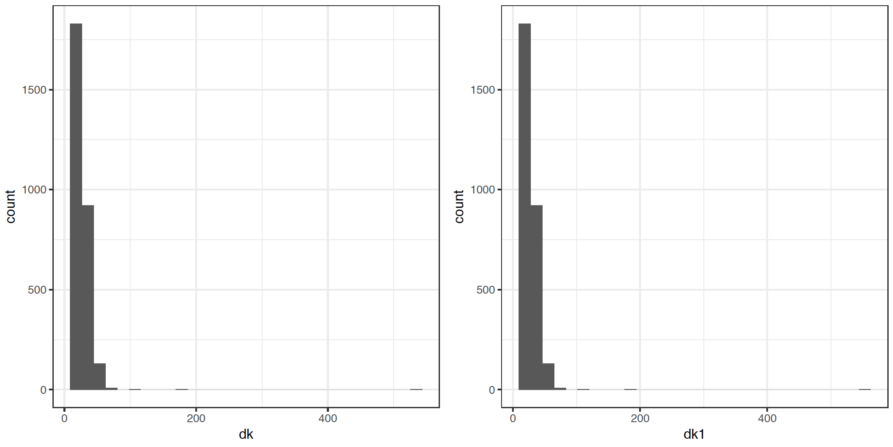

# Construcción de los factores de expansión

Los procesos de inferencia estadistica establecidos en cualquier encuesta de hogares descansan sobre el principio de representatividad que afirma que es posible seleccionar una muestra y representar con bastante precisión y exactitud la realidad de la población de interés. A su vez, las propiedades estadísticas de la inferencia en encuestas de hogares descansan sobre las probabilidades de inclusión generadas por el diseño de muestreo que se implementó en la encuesta. En general el peso de muestreo $w_k$ asociado a un individuo $k$ en la muestra $s$ es una función del inverso de la probabilidad de inclusión del individuo, así

$$
w_k \propto \frac{1}{Pr(k\in s)}
$$

Como se mencionó anteriormente, para conservar estabilidad en los pesos de muestreo, es posible definir diseños de muestreo auto-ponderados, en donde las unidades finales de muestreo tengan las misma probabilidad de inclusión, sin importar el tamaño de la unidad primaria de muestreo que la contiene. Este tipo de diseños es útil porque induce mayor control sobre las estimaciones finales. Es de notar que la conformación de los pesos de muestreo se transforma en un reto metodológico para el investigador, puesto que debe ajustarse a la realidad de la región en donde las poblaciones de los municipios se expanden cada vez más en el sector urbano y los marcos de muestreo de las áreas geográficas se desactualizan con rapidez. Varias soluciones a este problema han sido planteadas [@Gambino_Silva_2009] y todas ellas requieren de esfuerzos económicos, logísticos y técnicos. Por ende, los equipos de los INE (a todo nivel) deben ser flexibles y adecuarse a esta realidad cambiante de la movilidad de las poblaciones, sobre todo en las áreas urbanas. 

En condiciones ideales el marco de muestreo debería coincidir plenamente con la población finita. Sin emabargo, en general, no es posible contar con una lista de todos los elementos de la población y, en el contexto de las encuestas a hogares, no existe una lista que enumere todos los hogares de un país de manera actualizada, por lo que la práctica estándar es construir el marco de muestreo en varias etapas, seleccionando una muestra de áreas geográficas, realizando un empadronamiento exhaustivo de todos los hogares en las áreas seleccionadas y luego seleccionando hogares. Este esquema de muestreo hace que el marco de muestreo de las encuestas a hogares presente imperfecciones. El siguiente gráfico, adaptado de  @Valliant_Dever_2017, describe los problemas inferenciales que se deben surtir al trabajar con marcos de muestreo imperfectos y su relación con los pesos de muestreo originales.

XXXXXX incluir gráfico acá XXXXXXXXX

Para hacerle frente a las imperfeccciones del marco, la AsociacEl esquema de ponderación *American Association for Public Opinion Research* (AAPOR) recomienda tratar la ausencia de respuesta de manera diferenciada y clasificar a cada unidad en la muestra en algunas de las siguientes categorías:

1. ER (*unidades elegibles que fueron respondientes efectivos*): casos elegibles para los cuales se ha recolectado una cantidad suficiente de información.
2. ENR (*unidades eligibles no respondientes*): casos elegibles para los cuales no se recolectó ningún dato o la información fue parcialmente recolectada. 
3. IN (*unidades no elegibles*): casos de miembros no elegibles que no hacen parte de la población de interés. 
4. UNK (*unidades con elegibilidad desconocida*): casos en donde no se puede conocer si la unidad es elegible o no.

Para construir los factores de expansión de una encuesta se recomienda seguir en este orden los siguientes procesos:

1. Creación de los pesos básicos.
1. Ajuste por elegibilidad desconocida.
1. Descarte de las unidades no elegibles.
1. Ajuste por ausencia de respuesta.
1. Calibración por proyecciones poblacionales y variables auxiliares.
1. Preparación de la base de datos de respondientes. 

## Creación de los pesos básicos

Este primer paso ya ha sido explicado de forma detallada en la sección dedicada a la selección de la muestra. Observe que, asociado a cada esquema particular de muestreo, existe una única función que víncula a cada elemento con una probabilidad de inclusión en la muestra. De esta forma:

$$\pi_k = Pr (k \in s)$$

Por lo tanto, el primer paso, en la reponderación de los pesos de muestreo, es justamente la creación de los pesos básicos $d_{1k}$ que se definen como el inverso multiplicativo de la probabilidad de inclusión

$$d_{1k} = \frac{1}{\pi_k}$$

Estos pesos son creados incluso para aquellas unidades que serán excluidas de la muestra porque son no elegibles o porque no proveyeron ninguna información y luego serán modificados convenientemente. La siguiente figura muestra la distribución típica de los pesos originales en una encuesta de hogares. A través de las modificaciones posteriores, esta distribución irá sufriendo algunos cambios. Si la distribución original de los pesos básicos difiere estructuralmente con la distribución final de los ponderadores, resultante de todos los ajustes debidos a las imperfecciones del marco, entonces las propiedades estadísticas de insesgamiento, consistencia y precisión podrían desvanecerse. Lo anterior implica que el nivel de desactaulización del marco de muestreo tiene implicaciones directas en la calidad de la inferencia. Por tanto, si el marco de meustreo es muy imperfecto, los ponderadores finales no inducirán una inferecnia precisa. 

{width=350px, height=500px}

## Ajuste por elegibilidad desconocida

El tercer paso consiste en redistribuir el peso de las unidades cuyo estado de elegibilidad es desconocido. Por ejemplo, si la encuesta está enfocada en la población mayor de 15 años y hay personas que no proveen ninguna información acerca de su edad, entonces es necesario distribuir estos pesos. Esta situación también se puede presentar a nivel de hogar cuando no puede ser contactado porque nadie nunca atendió el llamado del encuestador (*nadie en casa*). Se acostumbra a redistribuir los pesos de los UNK entre las unidades que sí disponen de su estatus de elegibilidad (ER, ENR, IN). 

Es así como, si no es posible determinar la elegibilidad de algunas unidades que aparecen en el marco de muestreo, se tendrá una muestra $s$ que contendrá el conjunto de las unidades *elegibles* en la muestra $s_{e}$, el conjunto de las unidades *no elegibles* en la muestra $s_{n}$ y el conjunto de las unidades con *elegibilidad desconocidad* $s_{u}$. En este último caso, la elegibilidad de estos casos es desconocida, a no ser que de manera arbitraria sean clasificadas como ENR (elegibles no respondientes), o se tenga información auxiliar en el marco de muestreo que permita imputar su estado de elegibilidad. 

Se recomienda formar $B$ $(b = 1,  \ldots, B)$ categorías^[Se acostumbra a formar categorías con al menos 50 casos.] basadas en la información del marco de muestreo. Estas categorías pueden ser estratos o cruces de subpoblaciones. Siendo $s_b$ la muestra de unidades en la categoría $b$ (que incluye a ER, ENR y UNK), se define el factor de ajuste por elegibilidad como:

$$
a_b = \frac{\sum_{s_b}d_{2k}}{\sum_{s_b \cap s_e}d_{2k}}
$$
Para la categoría $b$, los pesos ajustados por elegibilidad desconocida para aquellas unidades cuya elegibilidad si pudo ser establecida (independientemente de su estado de respuesta) estarán dados por la siguiente expresión:

$$
d_{3k} = a_b * d_{2k}
$$

{width=350px, height=500px}

## Descarte de las unidades no elegibles

Si hay viviendas seleccionadas desde el marco de muestreo que han cambiado su estado de ocupación y ahora no contienen ningún hogar particular, entonces el segundo paso consiste en ajustar su peso básico de la siguiente manera:

$$
d_{2k} = 
\begin{cases}
0, \ \ \ \ \ \text{si la unidad $k$ no pertenece a la población objetivo}\\
d_{1k},\ \ \ \text{en otro caso }
\end{cases}
$$

## Ajuste por ausencia de respuesta

En este paso los pesos básicos de los ER se ajustan para tener en cuenta a los ENR. Al final del proceso, los pesos de los ER se incrementan para compensar el hecho de que algunas unidades elegibles no proveyeron información. Para el manejo efectivo de la ausencia de respuesta se consideran las siguientes variables aleatorias:

$$
I_k=
\begin{cases}
1,  &\text{si $k$ pertenece a la muestra $s$}\\
0,  &\text{en otro caso.}
\end{cases}
$$

$$
D_k=
\begin{cases}
1,  &\text{si $k$ pertenece al conjunto de respondientes $s_r$}\\
0,  &\text{en otro caso.}
\end{cases}
$$

Al suponer que la distribución de las respuestas puede ser estimada, entonces la probabilidad de respuesta (*propensity score*) está dada por
$$
Pr(k\in s_r|k\in s)=Pr(D_k = 1|I_k = 1)=\phi_k 
$$

Si el patrón de ausencia de respuesta es completamente aleatorio (en donde la no respuesta no sigue ningún patrón específico) o aleatorio (en donde el patrón de la no respuesta puede ser explicado por covariables $\mathbf{x}$ de la encuesta), entonces 

$$
\phi_k = f(\mathbf{x}_k, \boldsymbol{\beta})
$$

Ahora, si es posible tener acceso a las covariables $\mathbf{x}$, entonces es posible estimar el patrón de ausencia de respuesta mediante 

$$
\hat{\phi}_k = f(\mathbf{x}_k, \hat{\boldsymbol{\beta}})
$$

Por otro lado, si el patrón de ausencia de respuesta es no aleatorio (en donde el patrón de la no respuesta es explicado por la variable de interés; por ejemplo cuando los desempleados son los que no responden), entonces 

$$
\phi_k = f(\mathbf{y}_k, \beta)
$$ 

Ene ste caso, como no es posible tener acceso a la variables de interés para todos los individuos en la muestra (porque no todos respondieron), entonces no es posible estimar el patrón de ausencia de respuesta y por ende hay sesgo. @Kim_Riddles_2012 muestran que es posible utilizar un modelo basado en el *propensity score* de las respuestas. 

Si la muestra de los respondientes se denota como $s_r$ entonces la probabilidad de que un individuo conteste es $\phi_k = Pr(k \in s_r)$. Al suponer que existe un vector de información auxiliar $\mathbf{z}_k$ conocido  para todo $k\in s$ es posible estimarla por medio de un modelo de regresión logística; esto es, 

$$
\hat{\phi}_k = \frac{\exp\{\mathbf{z}_k'\hat{\boldsymbol{\beta}}\}}{1 + \exp\{\mathbf{z}_k'\hat{\boldsymbol{\beta}}\}}
$$

donde $\hat{\mathbf{\beta}}$ es el vector de coeficientes estimado de la regresión logística. Bajo los dos primeros escenarios, es posible definir el siguiente estimador insesgado

$$
\hat{t}_y=\sum_{k\in s_r}d_{4k}y_k
$$

En donde

$$
d_{4k} = \frac{d_{3k}}{\hat{\phi_k}}
$$
Nótese que, si el modelo está bien definido y se verifica en la población, el sesgo se anula puesto que

$$
E(I_kD_k) 
= EE(I_kD_k|I_k) 
= E(I_k)E(D_k|I_k) = \pi_k \phi_k
$$

Si se tiene acceso a información auxiliar (contenida en el marco de muestreo o en otras preguntas de la encuesta), y si se considera que el mecanismo que genera la ausencia de respuesta en la encuesta de hogares es MAR, es posible ajustar un modelo para la ausencia de respuesta (en donde la variable dependiente es una variable indicadora de la respuesta del individuo por lo general supeditado a una distribución Bernoulli o Binomial).

{width=350px, height=500px}

## Calibración de los pesos

Después de conformar el sistema de ponderación de pesos de muestreo en la encuesta, es posible calibrar estos pesos con la información auxiliar disponible para cada país, a nivel nacional, por estratos de interés, e incluso por variable continuas sobre las que se tenga interés. @Sarndal_Lundstrom_2006 afirman que cuando los estudios por muestreo están afectados por la ausencia de respuesta, es deseable tener las siguientes propiedades en la estructura inferencial que sustenta el muestreo:

1. Sesgo pequeño o nulo.
2. Errores estándares pequeños.
3. Un sistema de ponderación que reproduzca la información auxiliar disponible^[Por ejemplo, el número de hogares o habitantes en el país.].
4. Un sistema de ponderación que sea eficiente al momento de estimar cualquier característica de interés en un estudio multipropósito.

como se vio en el capítulo anterior, debido a la construcción teórica de los estimadores de calibración, los pesos calibrados responden a la siguiente restricción

$$
\sum_{s}w_{k}\boldsymbol{x}_k = \sum_{U}\boldsymbol{x}_{k} = \boldsymbol{t}_{\boldsymbol{x}}
$$

El ejemplo más básico se encuentra cuando se desea que los pesos de muestreo deberían reproducir con exactitud el tamaño de las regiones $N_h$ y/o el tamaño del país $N$. Es así como, utilizar la metodología de calibración [@Deville_Sarndal_1992] hace que se cumpla la siguiente ecuación de calibración sobre los nuevos pesos calibrados $w_k^*$ para todos lo estratos explícitos

$$
\sum_{s_h} w_k = N_h
$$

Esta coherencia entre las cifras oficiales y las que la encuesta puede producir hace que sea preferible el uso de los estimadores de calibración. Las anteriores características son satisfechas al usar el enfoque de calibración que induce una estructura inferencial robusta en presencia de información disponible puesto que reduce tanto el error de muestreo como el error debido a la ausencia de respuesta. 

{width=350px, height=500px}

### Medidas de calidad en la calibración

Los estimadores de calibración son *aproximandamente insesgados*, pero la magnitud del sesgo está dada por la siguiente expresión:

$$
Bias(\hat{t}_{y, cal}) = E_p \left[ \sum_{k \in s} (w_k - d_k) y_k \right]
$$

Si los nuevos pesos calibrados son cercanos a los pesos originales en todas las posibles muestras, entonces el sesgo será insignificante. Ahora, si el tamaño de muestra es insuficiente no conviene utilizar este tipo de estimadores. Además, se sugiere que el coeficiente de variación del estimador de Horvitz-Thompson para las covariables (inducidas por todos los cruces y celdas considerados) sea menor del 10% para asegurar que el sesgo de los estimadores de calibración sea despreciable.

Por otro lado, cuando se tienen múltiples variables discretas es posible que el cruce de categorías contenga muy pocas unidades para las cuales se deba ajustar los pesos originales. Esto induce sesgo en cada subgrupo ajustado. Si aún así se decide optar por múltiples aumentar las variables de calibración, es necesario hacer un chequeo empírico del ajuste que cada modelo pueda tener con todas las variables de la encuesta, aunque se advierte que este chequeo a veces puede ser demorado e ir en contravía de las apretadas agendas de producción estadísticas que se manejan en el INE.

@Silva_2004 presenta algunas consideraciones al respecto del sesgo que puede generarse al usar esta metodología en las encuestas de hogares y aborda algunos criterios para evaluar la calidad de la calibración. Estas medidas se pueden considerar como protección en contra del sesgo generado por tener demasiadas restricciones. Además, se resalta la importancia de que las variables utilizadas para la calibración sean estimadas de manera precisa por los estimadores clásicos de muestreo. Por ejemplo, si el número de personas en una región es utilizada como una variable de calibración (utilizando como total auxiliar las proyecciones demográficas), entonces el coeficiente de variación del estimador de Horvitz-Thompson sobre esta variable debería ser menor, por ejemplo, al 10%. 

La teoría afirma que entre más variables de calibración se tengan menor será la varianza asociada a las estimaciones (no así el sesgo). Sin embargo, existen problemas computacionales cuando crecen las restricciones que se deben satisfacer son demasiadas. Una primera opción es verificar que no se tengan variables que puedan tener codependencia lineal con otras. Al descartar estas variables es posible conservar una varianza pequeña puesto que se descartan combinaciones lineales de otras variables. Se recomienda hacer un análisis de cuántas variables se deben utilizar en la calibración para optimizar el error cuadrático medio de los estimadores finales en las encuestas de hogares. 

En una primera instancia, no sería adecuado utilizar demasiadas restricciones de calibración para satisfacer muchas proyecciones demográficas. Es fácil equivocarse en esta definición. Por ejemplo, si la encuesta es representativa a nivel de departamento (10 niveles), sexo (2 niveles) y edad (4 niveles), entonces sería equivocado utilizar $10 \times 2 \times 4 = 80$ restricciones de calibración y se debería empezar por analizar una estrategia más parsimoniosa con $10 + 2 + 4 = 16$ restricciones de calibración. Nótese que a medida que las desagregaciones sean más profundas, el nivel de error en las proyecciones poblacionales será más grande. Ademas, entre más restricciones haya, más sesgo y varianza se introduce a la estimación. La idea general del proceso es encontrar un número de restricciones parsimonioso que permita tener estimaciones aproximadamente insesgadas con una varianza menor a la generada con los factores de expansión originales.

Por otro lado, si los pesos de calibración resultan ser menores que uno su interpretación puede tornarse difícil (aunque no reviste un problema teórico). El usuario común entiende al factor de expansión como un factor de representatividad: *es la cantidad de veces que una persona se representa a sí misma y a algunas otras más en la población*. Por ende, los pesos negativos o menores que uno no resisten esta interpretación intuitiva y natural. Además, los pesos negativos pueden conllevar a estimaciones negativas para algunos dominios en donde el tamaño de muestra es pequeño, lo cual resulta ser problemático en un contexto en donde todas las variables de estudio son no negativas. 

Para garantizar que los pesos se ubiquen en un intervalo determinado, se debe minimizar una distancia que a su vez debe inducir pesos restringidos a este intervalo y que respete las ecuaciones de calibración. Es posible que no se tenga una solución exacta para todas las restricciones de calibración e incluso que el algoritmo de calibración no converja. Nótese que los estimadores de calibración se pueden escribir como 

$$
w_k = g_k * d_k
$$

Con base en lo anterior, es necesario analizar los pesos $g_k$ en perspectiva en cada dominio, estrato y postestrato de interés. Una buena idea puede ser identificar aquellos $g_k$ que resulten potencialmente grandes o influyentes. Se recomienda postestratificar la muestra, y aplicar la calibración a aquellas unidades en los que los $g_k$ sean estables y usar los pesos originales en el restante conjunto. 

Es posible hacer que los pesos de calibración estén restringidos a un espacio predefinido por el usuario, mediante límites $(L, U)$ sobre los $g_k$. De esta forma, si $w_k \geq 1$ implica $g_k \geq 1$ y por tanto $L=1$. Se acostumbra a tomar $U > Q_3 + 1.5 * (Q_3 - Q_1)$ en donde $Q_3$ y $Q_1$ están dados en términos de la distribución de $g_k$ y corresponden al tercer y primer cuartil, respectivamente.

Si el mecanismo que genera la ausencia de respuesta no es aleatorio (MAR) o completamente aleatorio (MCAR), es posible que los ponderadores de calibración induzcan sesgo en las estimaciones finales. En general, cuando hay ausencia de respuesta es más probable que aparezcan pesos de calibración negativos y que los pesos de calibración no convergieran a los pesos originales. Además, la varianza de los estimadores de calibración no convergerá a los resultados usuales de los estimadores de regresión. 

@Silva_2004 presenta algunas medidas que permiten decidir cuáles escenarios de calibración son los mejores. A continuación se citan tales medidas.

- Error relativo promedio sobre las variables auxiliares
$$
M1= \frac{1}{p} \sum_{j=1}^p \frac{|\hat{t}_{xc} - t_x|}{t_x}
$$

- Coeficiente de variación HT relativo promedio
$$M2= \frac{1}{p} \sum_{j=1}^p \frac{(Var(\hat{t}_{x\pi}))^{1/2}}{t_x} $$

- Proporción de pesos extremos (límite inferior)
$$M3 = \frac{1}{n} \sum_{k \in s}I(g_k<L)$$
- Proporción de pesos extremos (límite superior)
$$M4= \frac{1}{n} \sum_{k \in s}I(g_k>U)$$
- Coeficiente de variación de los $g_k$
$$M5= \frac{\sigma(g)}{\bar{g}}$$

- Distancia entre los pesos de calibración y los pesos originales
$$M6 = \frac{1}{n}\sum_{k \in s} \frac{(w_k - d_k)^2}{d_k}
= \frac{1}{n}\sum_{k \in s} d_k(g_k - 1)^2$$

- Eficiencia de los estimadores de calibración sobre la estimación del diseño de muestreo
$$M7 = \frac{1}{J}\sum_{j=1}^J \frac{Var(\hat{t}_{y_jc})}{Var(\hat{t}_{y_j\pi})} $$

- Efecto de la calibración sobre la dispersión de los ponderadores (DEFFk)
$$M8 = 1+\frac{\sigma^2_w}{\bar{w}^2}$$

### Diferentes niveles de calibración

Una de las preguntas recurrentes en la calibración de encuestas de hogares es el nivel al cual se debería realizar este ajuste. En principio, es posible realizar la calibración al nivel de las personas, o al nivel de los hogares. Cada una de estas opciones trae algunas ventajas y consideraciones que se deben tener en cuenta. 

* Calibrar al nivel de los hogares implica que el hogar tendrá unos nuevos pesos que cumplen con las restricciones de calibración, y esos pesos los heredará a las personas que habitan el hogar. De esta forma todas las personas pertenecientes a un mismo hogar tendrán el mismo peso de muestreo, sin importar sus diferencias en composición demográfica. Por ejemplo, hombres, mujeres, menores y mayores de 15 años tendrán el mismo peso de muestreo. Esta propiedad es atractiva puesto que emula el diseño de muestreo que se definió en la fase de planeación. Sin embargo, realizar la calibración a nivel de los hogares hace que dentro de las unidades primarias de muestreo (UPM) los hogares no tengan un peso homogéneo, lo que se distancia de las propiedades del diseño sistemático simple que se usa para la selección de los hogares dentro de las UPM.

* Por otro lado, calibrar a nivel de personas implica que los pesos de muestreo de los hogares también pueden verse alterados, y que los pesos finales de muestreo de las personas sean diferentes dentro de los hogares. De esta forma, de acuerdo a las características de las personas se tendrá un peso diferente. Por ejemplo, es posible que hombres, mujeres, menores y mayores de 15 años **no** tengan el mismo peso de muestreo. Por consiguiente cuando se calibra por personas y se utiliza un filtro sobre esa base de personas para crear una base de hogares, las características observadas de los jefes de hogares influenciarían los pesos de muestreo resultantes.  

Dado que la calibración puede inducir factores de expansión diferentes para los miembros de un mismo hogar, es necesario analizar a qué nivel se realiza este procedimiento (persona, hogar). En principio, y debido al diseño de la encuesta, los pesos de muestreo originales son idénticos para todos los miembros de un mismo hogar. Sin embargo, cuando la post-estratificación trata de ajustar los totales de las restricciones de calibración, y debido a que la población no está equitativamente distribuida, entonces de igual manera se presenta un reajuste en los factores de calibración. Podría ser conveniente revisar la metodología de *raking* y su impacto en los pesos de calibración dentro de los hogares.

Por ejemplo, si la calibración se realiza a nivel de personas y se calibra sobre la población en edad de trabajar, esto traerá como consecuencia que los factores de expansión sean diferentes para los miembros de un mismo hogar, puesto que la metodología buscará ajustar los totales de las personas en edad de trabajar y las personas que no están en la fuerza de trabajo de manera independiente. Por esta razón en la mayoría de hogares, en donde hay personas que son parte de la fuerza de trabajo y personas que no lo son, los pesos de muestreo no serán equivalentes. 

### Calibración integrada en hogares

En general, la mayoría de encuestas de hogares en la región tienen una naturaleza multipropósito, generando estimaciones de indicadores a nivel de persona (tasa de participación, tasa de desocupación, etc.), y al mismo tiempo, indicadores a nivel de hogar (pobreza monetaria, necesidades básicas insatisfechas y pobreza multidimensional). En este documento se enfatiza la recomendación de disponer de factores de expansión coherentes entre las diferentes unidades de análisis. 

Por ejemplo, una práctica común que pone en tela de juicio las propiedades estadísticas del estimador, es generar factores de expansión a nivel de persona y endilgarle el factor de expansión del jefe de hogar al mismo hogar [@Alexander_1987]. Esta es una escogencia arbitraria si es que los factores de expansión se han generado mediante una calibración que tenga en cuenta las características de las personas, como por ejemplo edad o sexo. Este acercamiento deliberado no permite sopesar las propiedades estadísticas del estimador resultante y por ende sus resultados no pueden ser interpretados confiablemente, mucho menos comparados. 

Una escogencia más parsimoniosa puede ser optar por un enfoque tipo *integrated household weighting*. Nótese que, como lo expone @Heldal_1992, al realizar una calibración a nivel de personas, ya no será posible agregar a las personas de un mismo hogar para obtener un único peso del hogar, pues las características de las personas del hogar serán, en general, diferentes y sus respectivos factores de expansión también lo serán. Por tanto, es necesario que el sistema de pesos satisfaga la siguiente restricción:

$$
w_j=w_i\ \rm \ para\ toda\ persona\ i\ en\ el\ hogar\ j
$$

De esta forma, si el sistema de pesos de calibración satisface la anterior restricción, sería posible obtener pesos consistentes con las restricciones de calibración a nivel de persona y que permitiera la integración con los hogares, al cambiar de unidad de observación. En la literatura se han descrito dos métodos para lograr esta estandarización. El primero, condensado en @Lemaitre_Dufour_1987 afirma que se deben crear nuevas variables de calibración a nivel de persona, definidas como el promedio de las variables originales en el hogar. Por ende, se definen las siguientes cantidades:

$$
z_{ij}=\sum_{i\in h} x_{ij}\ \ y\ \ \ {\bar{z}}_{ij}=\frac{z_{ij}}{N_j}
$$

En donde $z_{ij}$ es la agregación a nivel de hogar de las covariables originales de calibración a nivel de persona y $N_j$ es el tamaño del hogar $j$. Al ejecutar el algoritmo de calibración utilizando las variables $z$, en vez de las variables $x$, se reproducen las ecuaciones de calibración a satisfacción y, dado que todos los individuos comparten las mismas covariables en la calibración, sus pesos serán idénticos para todos aquellos compartiendo un mismo hogar. Nótese que esta calibración se realiza con la base de datos a nivel de personas.

En segundo lugar, es posible también agregar las covariables de personas a nivel de hogar y ejecutar la calibración con las covariables agregadas. Esta calibración se realiza con la base de datos a nivel de hogares e induce un conjunto de pesos calibrados a nivel de hogar, que fácilmente pueden ser heredados por todos los individuos dentro del hogar. Nótese que, como se trata de una agregación, cuando se cree la base de datos de personas, las ecuaciones de calibración se reproducirán a cabalidad. 

En la literatura estadística se ha estudiado este enfoque integrado. Es así como @Neethling_Galpin_2006 concluyeron que, para ambos enfoques, las estimaciones resultantes redujeron el sesgo, aumentaron la precisión y proporcionaron un único conjunto de ponderaciones para los datos de las encuestas estudiadas. 

Además, si se opta por el primer enfoque, en el cual el tamaño de la base de datos sería igual al número de personas entrevistadas, se tendría el suficiente margen para actualizar las restricciones de calibración con el fin de ejercer un mayor control sobre los tamaños de los subgrupos de interés. 

### Calibración conjunta a nivel de personas y hogares

En el caso particular en el que haya información auxiliar disponible a nivel de personas y hogares (al mismo tiempo), es posible calibrar conjuntamente ambas variables en un sólo procedimiento de calibración. @Estevao_Sarndal_2006[sec. 5] recrea la calibración conjunta para hogares y personas, en donde se genera una variable indicadora para el jefe de hogar y sobre esta se crea una nueva restricción de calibración que utilice los totales auxiliares de los hogares. Con esta nueva calibración, se generan unos nuevos pesos de calibración en la base de datos de personas. Al filtrar esta base de datos por el jefe de hogar, se crea inmediatamente una base de hogares (puesto que solo hay un único jefe de hogar) que puede ser utilizada para combinarla con la información de los hogares. De esta forma, los pesos que venían de la base de datos de personas serán los que se utilicen en la base de datos de hogares obteniendo estimaciones consistentes. 

En principio, se supone que se selecciona una muestra de unidades de una población finita $U = \lbrace 1,2,\ldots,k,\ldots,M\rbrace$ la cual está agrupada en conglomerados $U_I = \lbrace 1, 2,\ldots, i, \ldots, N_I \rbrace$. El proceso de selección se puede resumir de la siguiente manera [@Gutierrez_2016]:

- Se selecciona una muestra $S_I$ de conglomerados de $U_I$ con probabilidades de inclusión $\pi_{I_i}$ para $i\in U_I$. Los pesos muestrales de la primera etapa son $d_{I_i} = \frac{1}{\pi_{I_i}}$
- En la segunda etapa se seleccionan unidades para $i\in S_I$. Se enumeran las unidades en $U_i$ y se selecciona una muestra $S_i$ con probabilidades de inclusión condicionales $\pi_{k|i}$.
- De esta forma, $d_{k|i} = \frac{1}{\pi_{k|i}}$ son los pesos condicionales y $d_k = d_{I_i}d_{k|i}$ es el peso de muestreo general para la k-ésima unidad, siendo $s =\bigcup_{i\in s_I}S_i$ la muestra de unidades.

Para calibrar sobre la información auxiliar a nivel de hogar, se deben satisfacer las siguientes ecuaciones:

$$
\sum_{i \in S_I}w_{I_i}x_{ci} = \sum_{i \in U_I}x_{ci} = t_{x_c}
$$

En donde $x_{ci}$ denota el vector de variables auxiliares a nivel del hogar, que siempre será definido como un conteo de individuos con cierta característica en el hogar. Por ejemplo, en su caso más básico $x_{ci}$ puede ser el número de individuos en el hogar, mientras que el total auxiliar $t_{x_c} = \sum_{i \in U_I}x_{ci}$ será el número de individuos en todos los hogares del país. Luego de que se ha calibrado la base de hogares, se construyen los pesos a nivel de persona recurriendo a la siguiente expresión:

$$
w_k = d_{k|i}w_{I_i} \quad \forall k \in S_i
$$

Y además, se preserva la siguiente propiedad
$$
\frac{w_k}{w_{I_i}}=d_{k|i}
$$

Lo anterior imita la propiedad del muestreo en dos etapas de que 

$$
\frac{d_k}{d_{I_i}}=d_{k|i}
$$

Como todos los individuos pertenecientes a un hogar son seleccionados para que respondan la encuesta de hogares, se tiene que $d_{k|i} = 1$, por definición. Por lo tanto, el peso del individuo (en la base de datos de la muestra de personas) será idéntico al peso calibrado del hogar; es decir $w_k = w_{I_i} \quad \forall k \in S_i$. Por lo anterior, dado que el muestreo es de conglomerados en la última etapa y todos los individuos del hogar son seleccionados, entonces el peso de muestreo del hogar será el promedio de los pesos individuales.

$$
w_{I_i}=\sum_{k\in S_i}\frac{w_k}{N_i}=\sum_{k\in U_i}\frac{w_k}{N_i}=\bar{w}_i
$$

Por último, nótese que la matriz de calibración toma la siguiente forma:

$$
X_{[i]}=X=
\begin{bmatrix}
x_{c11} & x_{c12} & \cdots & x_{c1p}\\
x_{c21} & x_{c22} & \cdots & x_{c2p}\\
x_{c31} & x_{c32} & \cdots & x_{c3p}\\
\vdots  & \vdots & \ddots &\\
x_{cN_I1} & x_{cN_I2} & \cdots & x_{cN_Ip}
\end{bmatrix}
$$

## Recorte de los pesos

Un inconveniente que se genera debido a la multitud de ajustes en los factores  de expansión es que, si bien el estimador resultante tendrá un sesgo cercano a cero, la distribución de los pesos puede mostrar datos extremos, sobre todo a la derecha de la distribución (valores muy grandes), que hacen que la varianza del estimador crezca y que, por ende, la precisión de la inferencia decrezca. Para hacerle frente a este problema, es posible considerar un procedimiento de *trimming* o recorte de pesos, siguiendo las recomendaciones de @Valliant_Dever_Kreuter_2018[, sec. 14.4], que puede ser resumido de la siguiente manera:
	
1. Recortar cualquier peso mayor a un umbral prestablecido en la distribución de pesos ajustados. Por lo general este umbral se fija alrededro de 3.5 veces la mediana de los pesos. Por tanto, 
$$
U=3.5\times mediana(\mathbf{d_{4k}})
$$
1. Cualquier peso con magnitud superior a $U$ se trunca de la siguiente manera
$$
d_k^\ast=\left\{\begin{matrix}U,\ si\ d_k^\ast\geq U\\
d_{4k},\ en\ otro\ caso\\\end{matrix}\right.
$$
1. Determinar la cantidad neta perdida debido al recorte de pesos extremos, siguiendo la siguiente expresión:
$$
K=\sum_{s_r}(d_k^\ast - d_{4k})
$$
1. Distribuir $K$ equitativamente entre las unidades que no fueron recortadas.
1. Iterar hasta que todos los nuevos pesos calibrados estén por debajo del umbral $U$.

Al final del proceso se debe asegurar que los datos extremos en los factores de expansión han sido correctamente manejados y que la distribución general de los pesos no sufrió cambios estructurales en los subgrupos poblacionales de interés. 

## Redondeo de los factores de expansión

El principio de representatividad es el paradigma inferencial dominante en cualquier encuesta de hogares y el factor de expansión es el concepto más importante en este contexto. Por ejemplo, un hogar en una encuesta con un factor de expansión de 500 se representa a sí mismo y a otros 499 hogares más. La definición teórica del factor de expansión, inducida por el inverso multiplicativo de la probabilidad de inclusión de un hogar en la muestra, hace que la inferencia sea insesgada y confiable. Sin embargo, debido a que la probabilidad de inclusión es un número real contenido en el intervalo $(0, 1]$, entonces su inverso multiplicativo también será un número real mayor que uno. 

Cuando el factor de expansión no es entero, entonces su interpretación se torna compleja desde el punto de vista práctico, aunque teóricamente no tenga ninguna repercusión negativa. Sin embargo, este inconveniente puede hacer que, en la práctica, las oficinas nacionales de estadística y los usuarios de las bases de datos de encuestas de hogares tomen la decisión (bienintencionada pero errada) de redondear estas cantidades al entero más cercano. Esta práctica es perjudicial porque le añade sesgo a la inferencia y causará problemas de sobre o sub estimación en algunos dominios de estudio. @Sartore_Toppin_Young_Spiegelman_2019 plantean que el redondeo de los factores de expansión puede ser problemático puesto que las estimaciones ponderadas pueden crecer o decrecer enormemente. 

Los siguientes ejemplos prácticos muestran de forma directa las repercusiones perjudiciales que conlleva esta práctica y que son consecuencia directa del sesgo de redondeo: 

1. En encuestas de establecimientos redondear el factor de expansión en las unidades que tienen flujos de ventas grandes trae problemas de sesgo en este dominio de estudio.
2. En encuestas agropecuarias, si una unidad productiva produce un cuarto de la producción nacional, el redondeo de su factor de expansión es nefasto.
3. En encuestas de hogares, en donde los diseños de muestreo son generalmente auto-ponderados (en donde todas las viviendas comparten el mismo factor de expansión) dentro de los estratos, redondear el factor de expansión implica sesgar por completo todo el estrato. 

Suponiendo que una muestra probabilística $s=(I_1,\ldots,I_k,\ldots,I_N)'$ fue seleccionada de una población finita $U$ mediante un diseño de muestreo que induce probabilidades de inclusión $\pi_k= E(I_k)$ para todos los individuos $k \in U$ (en donde $I_k$ toma el valor uno si fue seleccionado o cero en otro caso) entonces desde el punto de vista teórico los estimadores de muestreo $\hat t_y = \sum_s d_k \ y_k$ son insesgados cuando el factor de expansión $d_k$ es idéntico al inverso de la probabilidad de inclusión, puesto que

$$
E(\hat t_y)
= E \left( \sum_s \frac{y_k}{\pi_k} \right)
= E \left(\sum_U I_k \frac{y_k}{\pi_k} \right)
= \sum_U E(I_k)  \frac{y_k}{\pi_k}
= \sum_U \pi_k \frac{y_k}{\pi_k} = t_y
$$

De las anteriores relaciones es evidente que, cuando el factor de expansión se redondea de forma determinística, entonces $E(\hat t_y) \neq t_y$. Para evadir el sesgo de redondeo, es necesario emplear un método aleatorio que induzca insesgamiento en los estimadores de muestreo. En general, este problema puede ser abordado desde una perspectiva probabilística. De hecho, si en primera instancia se utiliza como redondeo la parte entera (el entero máximo que sea menor o igual) del factor de expansión, entonces bastará con añadir aleatoriamente una unidad a algunos factores de expansión para asegurar que la suma de los factores redondeados sea idéntica a la original. Con esta simple idea se le devuelve la propiedad del insesgamiento a los estimadores de muestreo. 

\begin{algorithm}
\DontPrintSemicolon
\KwIn{Factores de expansión originales $d_k$}
\KwOut{Factores de expansión redondeados $\tilde d_k$}
\Begin{
  \For{$k \in s$}{
  $\phi_k = d_k - \lfloor d_k \rfloor$
  }
Seleccionar una submuestra $s_a=(c_1,\ldots,c_k,\ldots,c_n)'$ de $s$ con probabilidades de inclusión $\phi_k$\;
  \eIf{$c_k = 0$} {
    $\tilde d_k = \lfloor d_k \rfloor$\;
    }{
    $\tilde d_k = \lfloor d_k \rfloor + 1$\;
  }
}
\Return{$\tilde d_k$}\;
\end{algorithm}

En primera instancia, nótese que la submuestra $s_a$ no necesariamente será de tamaño fijo, puesto que $\sum_s\phi_k$ no será entera en todos los casos; por ende, es posible utilizar un algoritmo de muestreo Poisson [@Gutierrez_2016, sección 4.1] para seleccionar esta submuestra. Sin embargo, si esta suma es entera, es posible utilizar un algoritmo de muestreo más eficiente que induzca una submuestra de tamaño fijo como por ejemplo el método de Brewer. Por otro lado, la esperanza de estos factores redondeados condicionados a la submuestra $s_a$ es igual a los factores de expansión originales, tal y como se muestra a continuación

$$
E(\tilde d_k | s_a) 
= \lfloor d_k \rfloor + E(c_k|s_a) 
= \lfloor d_k \rfloor + \phi_k
= d_k
$$

Por lo anterior, es importante notar que el uso de este método aleatorio de redondeo siempre induce insesgamiento en los estimadores de muestreo, puesto que

$$
E \left( \sum_s \tilde d_k y_k \right) 
= E E \left( \sum_s \tilde d_k y_k  | s_a\right) 
= E \left( \sum_s E(\tilde d_k | s_a) y_k \right) 
= E \left( \sum_s d_k y_k \right) = t_y
$$

Por último, cuando los factores de expansión de la encuesta están calibrados se presenta un problema de optimización un poco más complejo, puesto que al utilizar el redondeo aleatorio, los factores de expansión perderan la propiedad de calibración. @Sartore_Toppin_Young_Spiegelman_2019 y @Tille han presentado diferentes soluciones a este problema, siendo la última mucho más fácil de implementar en el software estadístico `R`. Bajo esta perspectiva, la calibración de los factores de expansión crea nuevos pesos denominados $w_k$ que conservan la siguiente propiedad para un conjunto de totales auxiliares $\mathbf{t_x}$ disponibles para toda la población

$$
\sum_s w_k \mathbf{x}_k =  \mathbf{t_x}
$$

El siguiente algoritmo hace uso del muestreo balanceado [@Tille_2006, capítulo 8], el cual representa una forma de calibración desde el diseño de muestreo y es una solución óptima para seleccionar la submuestra $s_a$ y por ende preservar la consistencia de los pesos calibrados con los totales auxiliares.

\begin{algorithm}
\DontPrintSemicolon
\KwIn{Factores de expansión calibrados $w_k$}
\KwOut{Factores de expansión redondeados y calibrados $\tilde w_k$}
\Begin{
  \For{$k \in s$}{
  $\phi_k = w_k - \lfloor d_k \rfloor$\;
  $\tilde{\mathbf{x}}_k = \phi_k \ \mathbf{x}_k$
  }
Seleccionar una submuestra balanceada $s_a=(c_1,\ldots,c_k,\ldots,c_n)'$ de $s$ con probabilidad $\phi_k$ tal que 
\begin{equation*}
\sum_{k \in s_a} \frac{\tilde{\mathbf{x}}_k}{\phi_k} 
\cong
\sum_{k \in s} \tilde{\mathbf{x}}_k
\end{equation*}
  \eIf{$c_k = 0$} {
    $\tilde w_k = \lfloor w_k \rfloor$\;
    }{
    $\tilde w_k = \lfloor w_k \rfloor + 1$\;
  }
}
\Return{$\tilde w_k$}\;
\end{algorithm}

Es importante recalcar que la restricción en la submuestra implica que los pesos redondeados cumplan la siguiente relación

$$
\sum_s c_k \ \mathbf{x}_k 
\cong \sum_U \mathbf{x}_k 
- \sum_U \lfloor w_k \rfloor \ \mathbf{x}_k 
$$

Lo cual conlleva inmediatamente a que los nuevos pesos, además de estar redondeados, también estén calibrados; es decir
$$
\sum_s \tilde w_k \mathbf{x}_k \cong  \mathbf{t_x}
$$

Nótese que el redondeo aleatorio depende de la selección de la submuestra $s_a$ para completar los restos de la parte entera. En esta selección intervienen diferentes algoritmos de muestreo que se pueden aplicar fácilmente utilizando la librería `sampling` [@Matei]. Por ejemplo, suponga una muestra de tamaño $n= 200$ que fue seleccionada de una población de tamaño $N=9200$ con factores de expansión desiguales que no están calibrados. Asuma que el vector de probabilidades de inclusión en la muestra toman la siguiente forma

$$
\boldsymbol{\pi}_s = (\underbrace{15/500}_{50 \ veces},
\ldots,
\underbrace{15/800}_{80 \ veces}, 
\ldots,
\underbrace{15/700}_{70 \ veces})'
$$

Por lo tanto, el vector de pesos de muestreo estará definido de la siguiente manera:

$$
\mathbf{d}_s = (\underbrace{33.33333}_{50 \ veces},
\ldots,
\underbrace{53.33333}_{80 \ veces}, 
\ldots,
\underbrace{46.66667}_{70 \ veces})'
$$

De la misma manera, el vector de excesos $\phi_k = w_k - \lfloor d_k \rfloor$, estará dado por la siguiente expresión:

$$
\boldsymbol{\phi}_s = (\underbrace{0.33333}_{130 \ veces},
\ldots,
\underbrace{0.66667}_{70 \ veces})'
$$

Luego del cálculo de $\phi_k$, se selecciona la submuestra $s_a$. En particular, en este caso se utiliza el algoritmo de Brewer, puesto que $\sum_s\phi_k = 90$ y es entero. Al final del proceso de redondeo aleatorio la suma de los nuevos factores coincidirá con la suma de los factores originales. 

Por último, si en una segunda instancia, se considera que los pesos están calibrados mediante tres covariables de calibración que respetan las siguientes restricciones:

$$
\sum_{s} (x_{1k}, x_{2k}, x_{3k})' = (1000, 1000000, 11000000)'
$$

Entonces es posible utilizar el método del cubo, en particular la función `samplecube` del paquete `sampling` de `R`, para que la submuestra esté balanceada y los pesos redondeados sigan las restricciones de calibración bajo una tolerancia predefinida. 

