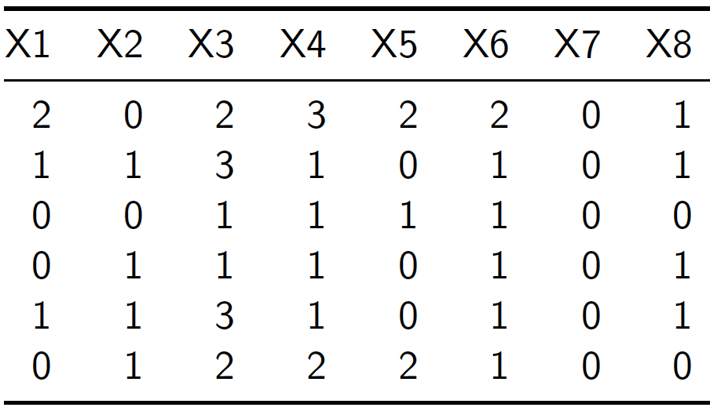

# Estimación del error de muestreo

Después de que la muestra fue seleccionada y luego de realizar el proceso de medición, es necesario realizar la estimación de los parámetros junto con la estimación de sus errores estándar, definido como la raiz cuadrada de la varianza.

Aunque la escogencia del diseño de muestreo y el estimador sean de libre elección para los investigadores, no lo es el cálculo de las medidas de confiabilidad y precisión. Dado que la base científica sobre la cual descansa el muestreo es la inferencia estadística, se deben respetar las normas básicas para la asignación y posterior cálculo del margen de error, que constituye una medida unificada del error total de muestreo que cuantifica la incertidumbre acerca de las estimaciones en una encuesta. La forma de estimar el error estándar depende de:

- La complejidad del diseño de muestreo: estratifiación, selección proporcional al tamaño, múltiples etapas. 
- La complejidad del estimador: ajuste de pesos por ausencia de respuesta, calibración, razón de totales, medias, percentiles, coeficientes de regresión. 

En general, podría afirmase que existen tres alternativas para calcular el error estándar de las estimaciones en una encuesta. Basados en la estrategia de muestreo es posible encontrar las *fórmulas exactas* que describan la varianza del estimador; sin embargo cuando el estimador utilizado no es una función lineal de totales, puede ser posible utilizar un enfoque de *linealización de Taylor* para aproximar la varianza del estimador a una función lineal. Por último, es posible apoyarse en en los métodos computacionales moderno y aplicar los principios de los *pesos replicados* para aproximar la varianza de cualquier estimador en una encuesta de hogares. 

## Fórmulas exactas y linealización de Taylor

En la mayoría de casos de interés se pueden encontrar las fórmulas exactas que aplican a cada diseño de muestreo y a cada estimador usado. Para diseños simples es posible implementarlas para calcular la estimación de los errores directamente. Sin embargo, en diseños multietápicos y con estimadores simples se pueden tornar extremadamente complicadas. Más aún, en diseños multietápicos y para estimadores complejos simplemente no son una opción plausible.

La estimación de la varianza en una estrategia de muestreo es una tarea no siempre sencilla. A partir de la teoría se establece un camino lógico basado en las probabilidades de inclusión de primer y segundo orden. En general, para cualquier diseño de muestreo sin reemplazo, la fórmula exacta para calcular una varianza del estimador de Horvitz-Thompson está dada por:

$$Var(\hat{t}_y) = \sum_U\sum_U \Delta_{kl}\frac{y_k}{\pi_k}\frac{y_l}{\pi_l}$$

En donde $\Delta_{kl} = \pi_{kl} - \pi_l \pi_l$. Además, la probabilidad de inclusión de segundo orden se denota análogamente como $\pi_{kl}$ y define la probabilidad de que los elementos $k$ y $l$ pertenezcan a la muestra al mismo tiempo.

$$
\pi_{kl}=Pr(k\in s, \  l\in s)=Pr(I_k\ I_l=1)=\sum_{s \ni k, l} p(s).
$$

En donde el subíndice ${s \ni k, l}$ se refiere a la suma sobre todas las muestras que contienen a los elementos $k$-ésimo y $l$-ésimo. Evidentemente, por razones computacionales y porque es imposible acceder a la observación de los registros sobre toda la población finita, hacer este cálculo para los estimadores de los indicadores de interés en las encuestas simplemente no es viable. 

En la práctica de las encuestas de hogares nunca se podrá contar con la varianza exacta de un estimador; por consiguiente, para tener una estimación de la precisión de la estrategia de muestreo se debe estimar la varianza del estimador. @Gutierrez_2016 afrima que un estimador insesgado para esta varianza está dada por la siguiente expresión:

$$
    \widehat{Var}_1(\hat{t}_{y,\pi})=\sum\sum_S \dfrac{\Delta_{kl}}{\pi_{kl}}\frac{y_k}{\pi_k}\frac{y_l}{\pi_l}
$$

Asimismo, si el diseño es de tamaño de muestra fijo, un estimador insesgado está dado por
$$
\widehat{Var}_2(\hat{t}_{y,\pi})=-\frac{1}{2}\sum\sum_S\frac{\Delta_{kl}}{\pi_{kl}}\left(\frac{y_k}{\pi_k}-\frac{y_l}{\pi_l}\right)^2
$$

De esta forma, cuando el tamaño de muestra es suficientemente grande, se puede construir un intervalo de confianza de nivel $(1-\alpha)$ para el total poblacional $t_y$ como se indica a continuación:

$$
IC(1-\alpha)=\left[\hat{t}_{y,\pi}-z_{1-\alpha / 2}\sqrt{ Var(\hat{t}_{y,\pi})},\hat{t}_{y,\pi}+z_{1-\alpha / 2}\sqrt{Var(\hat{t}_{y,\pi})}\right]
$$

donde $z_{1-\alpha / 2}$ se refiere al percentil $(1-\alpha / 2)$ de una variable aleatoria con distribución normal estándar. Como cada diseño de muestreo induce una forma cerrada para las probabilidades de inclusión de primer y segundo orden, las fórmulas de la estimación de la varianza se reducen ostensiblemente. Por ejemplo, si el diseño de muestreo es aleatorio simple, la fórmula de la estimación de la varianza es
 
 $$
 \widehat Var(\hat{t}_{y\pi}) = \frac{N^2}{n} \left( 1- \frac{n}{N} \right) S^2_{yS}
 $$
 
En donde $S^2_{yS}$ es la varianza muestral de los valores de la característica de interés en la muestra aleatoria $S$, dada por

$$
S^2_{yS}=\frac{1}{n-1}\sum_{k\in S}(y_k-\bar{y}_S)^2
$$

Por otro lado, si el diseño de muestreo es aleatorio estratificado y el parámetro de interés es una media, la fórmula del estimador de Horvitz-Thompson es $\bar{y}_{\pi} = \frac{1}{N}\sum_s d_k y_k = \sum_{h=1}^H W_h \bar{y}_h$. Ahora, siendo $S^2_{yh}$ la varianza muestral en el estrato $h$ de los valores de la característica de interés, la fórmula de la estimación de su varianza es
 
 $$
\widehat Var(\bar{y}_{\pi}) = \sum_{h=1}^H w_h^2 \frac{1-f_h}{n_h}S^2_{yh}
 $$
 
Por otro lado, cuando el diseño de muestreo se complejiza, también lo hace la estimación de la varianza. Por ejemplo, si el diseño de muestreo es estratificada y bietápico, de tal forma que dentro de cada estrato $U_h$ $h=1,\ldots, H$ existen $N_{Ih}$ unidades primarias de muestreo, de las cuales se selecciona una muestra $s_{Ih}$ de $n_{Ih}$ unidades mediante un diseño de muestreo aleatorio simple; y además, se considera que el sub-muestreo dentro de cada unidad primaria seleccionada es también aleatorio simple, de tal manera que para cada unidad primaria de muestreo seleccionada $i\in s_{Ih}$ de tamaño $N_i$ se selecciona una submuestra $s_i$ de elementos de tamaño $n_i$, entonces la forma final del estimador de la varianza del estimador de Horvitz-Thompson para el total poblacional quedaría de la siguiente manera:

$$
\widehat{Var}(\hat{t}_{y,\pi})=
\sum_{h=1}^H\left[\frac{N_{Ih}^2}{n_{Ih}}\left(1-\frac{n_{Ih}}{N_{Ih}}\right)S^2_{\hat{t}_{yh}S_I}+
\frac{N_{Ih}}{n_{Ih}}\sum_{i\in S_{Ih}}\frac{N_i^2}{n_i}\left(1-\frac{n_i}{N_i}\right)S^2_{y_{S_i}}\right]
$$

En donde $S^2_{\hat{t}_{y}S_I}$ y $S^2_{y_{S_i}}$ son, respectivamente, las varianzas muestrales de los totales estimados en las UPM seleccionadas y las varianzas muestrales de los hogares incluidos en la submuestra dentro de las UPM seleccionadas en la muestra de la primera etapa. 

Las fórmulas computacionales requeridas para estimar la varianza de estadísticas descriptivas como la media muestral están disponibles para algunos diseños complejos que incorporan elementos como la estratificación y el muestreo por conglomerados. Sin embargo, en el caso de estadísticas analíticas más complejas, tales como coeficientes de correlación y coeficientes de regresión, no se encuentra fácilmente las fórmulas específicas en diseños muestrales que se aparten del muestreo aleatorio simple. Estas fórmulas son enormemente complicadas o, en última instancia, se resisten al análisis matemático. 

## La técnica del último conglomerado

Debido a las dificultades algebraicas y computacionales, estimar la varianza en encuestas complejas que contemplan esquemas de conglomeración, selección en varias etapas y estratificación, puede tornarse bastante tedioso, costoso y además muy demorado. En este documento se explica por qué la técnica del último conglomerado resulta ser una buena opción a la hora de aproximar la varianza en una encuesta compleja.

Para la estimación de la varianza de los estimadores de interés en encuestas multi-etápicas, los programas computacionales existentes utilizan una aproximación conocida como la técnica del último conglomerado. Esta aproximación, que sólo tiene en cuenta la varianza de los estimadores en la primera etapa, supone que ese muestreo fue realizado con reemplazo. Los procedimientos de muestreo en etapas posteriores de la selección son ignorados a menos que el factor de corrección para poblaciones finitas sea importante a nivel municipal. 

En particular considere cualquier estimador del total poblacional dado por la siguiente combinación lineal

\begin{equation}
\label{est}
\hat{t}_{y}=\sum_{k\in s} d_k y_k = \sum_{k\in U} I_k d_k y_k 
\end{equation}

En donde $I_k$ son variables indicadoras de la pertenecia del elemento $k$ a la muestra $s$. Ahora, asumamos que el factor de expansión de la encuesta $d_k$ cumple con los supuestos básicos de un ponderador que hace insesgado a $\hat{t}_{y}$, es decir:

\begin{equation*}
E_p(I_k d_k) = 1
\end{equation*}

Se supone un diseño de muestreo en varias etapas (dos o más) en donde la primera etapa supone la selección de una muestra $s_I$ de $m_I$ unidades primarias de muestreo (UPM) $U_i$ ($i\in s_I$) de tal forma que

- Si la selección se realizó con reeemplazo, la $i$-ésima UPM tiene probabhilidad de selección $p_{I_i}$.
- Si la selección se realizó sin reeemplazo, la $i$-ésima UPM tiene probabilidad de inclusión $\pi_{I_i}$.

En las subsiguientes etapas de muestreo, se procede a seleccionar una muestra de elementos para cada una de las UPM seleccionadas en la primera etapa de muestreo. Dentro de la $i$-ésima UPM se selecciona una muestra $s_i$ de elementos; en particular la probabilidad condicional de que el $k$-ésimo elemento pertenzca a la muestra dada que la UPM que la contiene ha sido seleccionada en la muestra de la primera etapa está dada por la siguiente expresión:

\begin{equation*}
\pi_{k|i} = Pr(k \in s_i | i \in s_I)
\end{equation*}

Por ejemplo, si el muestreo es sin reemplazo en todas sus etapas, la probabilidad de inclusión del $k$-ésimo elemento a la muestra $s$ está dada por

\begin{align*}
\label{piki}
\pi_k & = Pr(k \in s)\\ 
& = Pr(k \in s_i, i \in s_I) \\
& = Pr(k \in s_i | i \in s_I) Pr(i \in s_I) = \pi_{k|i} \times \pi_{I_i}
\end{align*}

Dado que el inverso de las probabilidades de inclusión son un ponderador natural, entonces se definen las siguientes cantidades:

1. $d_{I_i} = \frac{1}{\pi_I}$, que es el factor de expansión de la $i$-ésima UPM.
2. $d_{k|i} = \frac{1}{\pi_{k|i}}$, que es el factor de expansión del $k$-ésimo elemento dentro para la $i$-ésima UPM.
3. $d_k = d_{I_i} \times d_{k|i}$, que es el factor de expansión final del $k$-ésimo elemento para toda la población $U$.

**Resultado**: *Bajo un diseño de muestreo en varias etapas, el estimador de Hansen-Hurwitz para el total poblacional está dada por:*
\begin{equation}
\label{HH}
\hat{t}_{y,p}=\frac{1}{m_I}\sum_{i=1}^{m_I}\frac{\hat{t}_{y_i}}{p_{I_i}}
\end{equation}

*Y su varianza estimada es:*
\begin{equation}
\label{var}
\widehat{Var}(\hat{t}_{y,p})=\frac{1}{m_I(m_I-1)}\sum_{i=1}^{m_I}\left(\frac{\hat{t}_{y_i}}{p_{I_i}}-\hat{t}_{y,p}\right)^2
\end{equation}

Supongamos ahora que la encuesta tiene un diseño complejo $p(s)$ que no contempla reeemplazo en la primera etapa. Por lo tanto, algunas cantidades deben ser equiparadas para poder utilizar esta aproximación. En principio, nótese que las cantidades $\hat{t}_{y_i}$ representan lo totales estimados de la variable de intereés en la $i$-ésima UPM y están dados por:

\begin{equation}
\hat{t}_{y_i} = \sum_{k \in s_i} \frac{y_k}{\pi_{k|i}}
= \sum_{k \in s_i} d_{k|i} y_k 
\end{equation}

Utilizar la aproximación de la varianza requiere equiparar los términos de manera apropiada. En primer lugar, fijémonos en los estimadores dados por \eqref{HH} y \eqref{est}. Para realizar esta comparación, se requiere que
se asuma la siguiente igualdad en las probabilidades de inclusión de la primera etapa:

\begin{equation}
\label{cons}
\pi_{I_i} = p_{I_i} \times m_I 
\end{equation}

Por lo tanto, el estimador del total poblacional quedaría definido desde \eqref{est} como un estimador tipo Hanwen-Hurwitz.

\begin{align*}
\hat{t}_{y} =\sum_{k\in s} d_k y_k  
= \sum_{i=1}^{m_I}\sum_{k \in s_i} d_k y_k 
= \sum_{i=1}^{m_I}\sum_{k \in s_i} \frac{1}{\pi_{I_i} \pi_{k|i}} y_k 
= \sum_{i=1}^{m_I}\frac{\hat{t}_{y_i}}{\pi_{I_i}} 
\approx \frac{1}{m_I}\sum_{i=1}^{m_I}\frac{\hat{t}_{y_i}}{p_{I_i}}
\end{align*}

Ahora, dado que la forma del estimador ha sido equiparada con un estimador tipo Hanwen-Hurwitz, es posible utilizar su estimación de varianza. Aún más, después de un poco de álgebra y tuilizando la equiparación dada por \eqref{cons}, es posible tener la siguiente aproximación, cuya gran ventaja es que sólo hace uso de los factores de expansión finales $d_k$, que suelen ser reportados por los Institutos Nacionales de Estadística cuando liberan los microdatos de sus encuestas, en vez de los factores de expansión de la primera etapa o los factores de expansión condicionales dentro de las UPM. 

\begin{align*}
\widehat{Var}(\hat{t}_{y,p})&=\frac{1}{m_I(m_I-1)}\sum_{i=1}^{m_I}\left(\frac{\hat{t}_{y_i}}{p_{I_i}}-\hat{t}_{y}\right)^2\\
&=\frac{m_I}{m_I-1}\sum_{i=1}^{m_I}\frac{1}{m_I^2}\left(\frac{\sum_{k \in s_i} d_{k|i} y_k }{p_{I_i}}-\sum_{i=1}^{m_I}\sum_{k \in s_i} d_k y_k \right)^2 \\
&=\frac{m_I}{m_I-1}\sum_{i=1}^{m_I}\left(\frac{\sum_{k \in s_i} d_{k|i} y_k }{m_I p_{I_i}}-\frac{1}{m_I}\sum_{i=1}^{m_I}\sum_{k \in s_i} d_k y_k \right)^2 \\
&=\frac{m_I}{m_I-1}\sum_{i=1}^{m_I}\left(\frac{\sum_{k \in s_i} d_{k|i} y_k }{\pi_{I_i}}-\frac{1}{m_I}\sum_{i=1}^{m_I}\sum_{k \in s_i} d_k y_k \right)^2 \\
&=\frac{m_I}{m_I-1}\sum_{i=1}^{m_I}\left( \sum_{k \in s_i} d_k y_k -\frac{1}{m_I}\sum_{i=1}^{m_I}\sum_{k \in s_i} d_k y_k \right)^2 
\end{align*}

Basado en lo anterior, al definir $\breve{t}_{y_i} = \sum_{k \in s_i} d_k y_k$ como la contribución^[Note que la suma de estas contribuciones en la muestra de la primera etapa da como resultado la estimación $\hat{t}_y$.] de la $i$-ésima UPM a la estimación del total poblacional y $\bar{\breve{t}}_{y}=\frac{1}{m_I}\sum_{i=1}^{m_I}\breve{t}_{y_i}$ como la contribución promedio en el muestreo de la primera etapa, entonces el estimador de varianza toma la siguiente forma, conocida como el estimador de varianza del **último conglomerado**.

\begin{align}
\label{UC}
\widehat{Var}(\hat{t}_{y,p})
=\frac{m_I}{m_I-1}\sum_{i=1}^{m_I}\left( \breve{t}_{y_i} -\frac{1}{m_I}\sum_{i=1}^{m_I}\breve{t}_{y_i} \right)^2 
=\frac{m_I}{m_I-1}\sum_{i=1}^{m_I}\left( \breve{t}_{y_i} - \bar{\breve{t}}_{y} \right)^2
\end{align}

Siguiendo con el escenario de muestreo planteado en las secciones anteriores, si el diseño de la encuesta es estratificado por regiones $h$, con tres etapas de selección dentro de cada estrato, entonces al utilizar la técnica del último conglomerado, el estimador de la varianza de $\hat{t}_{y}$ estaría dado por

$$
\hat{V}(\hat{t}_{y}) = 
\sum_h\frac{n_h}{n_h-1}\sum_{i\in s_h}\left(\hat{t}_{y_i}-\bar{\hat{t}}_{y_h}\right)^2
$$

En donde $\hat{t}_{y_i} = \sum_{k \in s_{hi}} w_k y_k$, $\bar{\hat{t}}_{y_h}=(1/n_h)\sum_{i \in s_h}\hat{t}_{y_i}$ y $n_h$ es el número de UPMs seleccionadas en el estrato $h$. Este procedimiento, propuesto por @hansen1953sample tiende a sobrestimar la varianza verdadera, aunque resulta ser una técnica apetecida por los investigadores puesto que utiliza directamente los pesos finales de muestreo o factores de expansión que son publicados por los INE.

Utilizar la técnica del **último conglomerado** es una salida práctica al problema de la estimación de la varianza que, para la mayoría de encuestas que brindan estadísticas oficiales a los países, puede tornarse bastante complejo. Si bien, la expresión \eqref{UC} no brinda estimaciones de varianza estrictamente insesgadas, sí constituye una aproximación bastante precisa. 

¿Qué es un **último conglomerado**? Es la primera unidad de muestreo en un diseño complejo. Por ejemplo, considere el siguiente diseño de muestreo en cuatro etapas:

\begin{equation*}
\underbrace{\textbf{Municipio}}_{\text{UPM}} \Rrightarrow
\underbrace{\textbf{Sector}}_{\text{USM}} \Rrightarrow
\underbrace{\textbf{Vivienda}}_{\text{UTM}} \Rrightarrow
\underbrace{\textbf{Hogar}}_{\text{UFM}}
\end{equation*}

En la primera las unidades primarias de muestreo (UPM) son los municipios; dentro de cada municipio, se seleccionan unidades secundarias de muestreo (USM) que corresponden a sectores cartográficos; de esta forma, el submuestreo continua hasta seleccionar las unidades finales de muestreo (UFM) que son los hogares. 

Ahora, por lo general, la primera etapa de muestreo de una encuesta está inducida por dos tipos de diseños: estratificado o con probabilidad de selección proporcional al tamaño del municipio. En cualquiera de los dos casos, se cren subgrupos de inclusión forzosa. En el muestreo estratificado serán las ciudades grandes y en el muestreo proporcional también, puesto que la medida de tamaño inducira probabilidades de inclusión mayores a uno. 
Luego, los municipios pertenecientes a este subgrupo de inclusión forzosa no pueden ser condierados como UPM, sino como un estrato de ciudades grandes. En cada ciudad de este estrato se realizará un muestreo de la siguiente manera:

\begin{equation*}
\underbrace{\textbf{Sector}}_{\text{UPM}} \Rrightarrow
\underbrace{\textbf{Vivienda}}_{\text{USM}} \Rrightarrow
\underbrace{\textbf{Hogar}}_{\text{UFM}}
\end{equation*}

Es necesario tener en cuenta esta particularidad de las encuestas para poder aplicar correctamente esta técnica de aproximación de varianzas. En resumen, para aquellas ciudades que pertenecen al estrato de inclusión forsoza, las UPM serán los sectores cartográficos, y para el resto del país, las UPM serán los municipios cuya probabilidad de inclusión en la muestra de la primera etapa es menor a uno. 

## Linealización de Taylor

Cuando se trata de estimar parámetros que tienen una forma no lineal, es posible recurrir al uso de las herramientas del análisis matemático para aproximar sus varianzas con el fin de publicar las cifras oficiales con sus respectivos errores estándar. @Valliant_Dever_Kreuter_2013 mencionan que esta técnica se basa en expresar el estimador como función de estimadores lineales de totales. Por ejemplo, si el interés recae en estimar un parámetro poblacional $\theta$ que a su vez depende de $p$ estimadores lineales, entonces su estimador de muestreo se debe expresar como

$$
\hat{\theta}=f(\hat{t}_1, \ldots, \hat{t}_p)
$$

En donde $\hat{t}_j=\sum_{k\in s}w_k y_{jk}$ es un estimador del $j$-ésimo total. Por consiguiente, si el estimador de interés no es una función lineal de totales, entonces las propiedades estadísticas comunes como insesgamiento, eficiencia y precisión de los estimadores deben ser aproximadas. Es común usar la técnica de la linealización de Taylor para encontrar aproximaciones lineales de primer orden. @Gutierrez_2016[, capitulo 8] presenta una explicación detallada de esta técnica aplicada a diferentes escenarios de estimación, en donde se consideran los siguientes pasos para construir un estimador linealizado de la varianza de una función no lineal de totales:

1. Expresar el estimador del parámetro de interés $\hat{\theta}$ como una función de estimadores de totales insesgados. Así, $\hat{\theta}=f(\hat{t}_1, \hat{t}_2,\ldots,\hat{t}_Q)$.
1. Determinar todas las derivadas parciales de $f$ con respecto a cada total estimado $\hat{t}_{q,\pi}$ y evaluar el resultado en las cantidades poblacionales $t_q$. Así
$$
a_q=\left.\dfrac{\partial f(\hat{t}_1,\ldots,\hat{t}_Q)}{\partial \hat{t}_{q}}\right|_{\hat{t}_1=t_1,\ldots,\hat{t}_Q=t_Q}
$$
1. Aplicar el teorema de Taylor para funciones vectoriales para linealizar la estimación $\hat{\theta}$ con $\mathbf{a}=(t_1,t_2,\cdots,t_Q)'$. En el paso anterior, se vio que $\bigtriangledown\hat{\theta}'=(a_1,\cdots,a_Q)$. Por consiguiente se tiene que
$$
\hat{\theta}=f(\hat{t}_1,\ldots,\hat{t}_Q) \cong B+\sum_{q=1}^Qa_q(\hat{t}_{q}-t_q)
$$
1. Definir una nueva variable $E_k$ con $k\in S$ al nivel de cada elemento observado en la muestra aleatoria.
$$
E_k=\sum_{q=1}^Qa_qy_{qk}
$$
1. Si los estimadores $\hat{t}_{q}$ son estimadores de Horvitz-Thompson, una expresión que aproxima la varianza de $\hat{\theta}$ está dada por
$$
AVar(\hat{\theta})=Var\left(\sum_{q=1}^Qa_q\hat{t}_{q,\pi}\right)
=Var\left(\sum_S\frac{E_k}{\pi_k}\right)=\sum\sum_U\Delta_{kl}\frac{E_k}{\pi_k}\frac{E_l}{\pi_l}.
$$

Tal como se advirtió anteriormente, @Gutierrez_2016 afirma que, para encontrar una estimación de la varianza de $\hat{\theta}$, no es posible utilizar directamente los valores $E_k$, porque éstos dependen de los totales poblacionales (las derivadas $a_q$ se evalúan en los totales poblacionales que son desconocidos). Por consiguiente, los valores $E_k$ se aproximan reemplazando los totales desconocidos por los estimadores de los mismos. Siendo $e_k$ la aproximación de la variable linealizada dada por
$$
e_k=\sum_{q=1}^Q\hat{a}_qy_{qk}
$$

donde $\hat{a}_q$ corresponde a un estimador de $a_q$. Si los estimadores $\hat{t}_{q}$, la aproximación de Taylor para el estimador la varianza del estimador de Horvitz-Thompson para un total está dado por la siguiente expresión 

$$
    \widehat{Var}(\hat{t}_{y,\pi})=\sum\sum_S \dfrac{\Delta_{kl}}{\pi_{kl}}\frac{e_k}{\pi_k}\frac{e_l}{\pi_l}
$$

Por ejemplo, bajo este contexto, si se quisiera estimar la tasa de desocupación (función no lineal de totales) definida como el cociente entre el total poblacional de personas que se encuentran en edad laboral pero que carecen de un empleo $({t}_{y})$ sobre la cantidad de personas que pertenecen a la población económicamente activa  $({t}_{z})$, entonces, la estimación de la aproximación de la varianza del estimador de esta razón $\hat{\theta}=\dfrac{\hat{t}_{y,\pi}}{\hat{t}_{z,\pi}}$ estaría definida como sigue en términos de las variables linealizadas 
$$
e_k=\dfrac{1}{\hat{t}_{z,\pi}}(y_k-\hat{\theta}z_k)
$$

Si, además, el muestreo de la encuesta es bietápico con selección aleatoria simple sin reemplazo en cada etapa, entonces este estimador de la varainza tomaría la siguiente forma:

$$
\widehat{Var}(\hat{\theta})=\frac{N_{I}^2}{n_{I}}\left(1-\frac{n_{I}}{N_{I}}\right)S^2_{\hat{t}_{e}S_I}+
\frac{N_{I}}{n_{I}}\sum_{i\in S_{I}}\frac{N_i^2}{n_i}\left(1-\frac{n_i}{N_i}\right)S^2_{e_{S_i}}
$$

En donde $S^2_{\hat{t}_{e}S_I}$ es la varianza muestral de los totales estimados $t_{ei}$ $i\in s_I$ de las UPM seleccionadas en la primera etapa del muestreo y $S^2_{e_{S_i}}$ es la varianza muestral entre los valores $e_k$ para los elementos incluidos en la submuestra dentro de cada unidad primaria de muestreo seleccionada en la primera etapa.
De la misma manera, para el caso particular de la estimación de un promedio utilizando el estimador de Hájek, las anteriores expresiones pueden adaptarse convenientemente.

Si se utiliza un estimador de calibración para el total poblacional de la característica de interés $t_y$, entonces la varianza estimada del estimador utilizando la técnica de linealización de Taylor haría uso de las siguientes variables linealizadas

$$
e_k=y_k-\mathbf{x}_k'\mathbf{\hat{\theta}}
$$ 

En donde $\mathbf{x}_k$ son las variables relacionadas con el vector de totales auxiliares $\mathbf{t}_{\mathbf{x}}$, medidas en la misma encuesta y $\mathbf{\hat{\theta}}$ es el vector estimado de coeficientes de regresión entre los valores que toman la característica de interés $y_k$ y el vector de información auxiliar $\mathbf{x}_k$.

En la región la *Pesquisa Nacional por Amostra de Domicilios Continua*, en Brasil, y la *Encuesta de Caracterización Socioeconómica Nacional*, en Chile, utilizan esquemas de linealización de Taylor en conjunción con el acercamiento del último conglomerado. En resumen, la linealización de Taylor supone que es posible definir una aproximación lineal de $\hat{\theta}$ así

$$
\hat{\theta} - \theta 
\approx \sum_{j=1}^p \frac{\partial f(\hat{t}_1, \ldots, \hat{t}_p) }{\partial \hat{t}_j}(\hat{t}_j - t_j)
= \sum_{k\in s} w_k e_k + c
$$

En donde $e_k= \sum_{j=1}^p \frac{\partial f(\hat{t}_1, \ldots, \hat{t}_p) }{\partial \hat{t}_j} y_{jk}$ son variables linealizadas y $c$ son constantes determinísticas que por consiguiente no aportan a la varianza de $\hat{\theta}$. Nótese lo conveniente de expresar esta aproximación de esta manera puesto que al final, las cantidades que intervienen en la varianza se pueden expresar como una suma ponderada de las variables $e_k$ y por consiguiente es posible aplicar todos los principios establecidos anteriormente. De esta forma, asumiendo el escenario de muestreo planteado en las secciones anteriores, el estimador de la varianza de la  aproximación lineal de $\hat{\theta}$ está dado por

$$
\hat{V}(\hat{\theta}) = 
\sum_h\frac{n_h}{n_h-1}\sum_{i\in s_h}\left(\hat{t}_{e_i}-\bar{\hat{t}}_{e_h}\right)^2
$$

En donde $\hat{t}_{e_i} = \sum_{k \in s_{hi}} w_k e_k$ y $\bar{\hat{t}}_{e_h}=(1/n_h)\sum_{i \in s_h}\hat{t}_{e_i}$. Por ejemplo, si el interés estuviera en estimar una razón, entonces las nuevas variables linealizadas son $e_k=(1/\hat{t}_{y_2})(y_{1k}-\hat{\theta} \ y_{2k})$.

## Réplicas

Las complicaciones en el cálculo de los errores de muestreo pueden ser mayores dependiendo de la escogencia del estimador y del diseño de muestreo asumido para la recolección de la información primaria. En algunas ocasiones, el proceso de linealización puede resultar complicado, por lo que es posible optar por una estrategia computacional aproximada que permite pasar por alto el proceso teórico de definición de las cantidades que estiman la varianza del estimador. Este conjunto de métodos supone la idea de la selección sistemática de *submuestras* que son utilizadas para estimar el parámetro de interés, utilizando los mismos principios de estimación que con la muestra completa. Por lo anterior, se obtienen estimaciones puntuales para cada réplica, las cuales son utilizadas para estimar la varianza del estimador de interés. 

En ausencia de fórmulas adecuadas, en los últimos años han aparecido una variedad de técnicas empíricas que proporcionan *varianzas aproximadas que parecen satisfactorias para fines prácticos* [@Kish_1965]. Estos métodos utilizan una muestra de datos para construir submuestras y generar una distribución para las estimaciones de los parámetros de interés utilizando cada submuestra. Los resultados de la submuestra se analizan para obtener una estimación del parámetro, así como intervalos de confianza para esa estimación. El enfoque general de esta técnicas computacional se basa en:

1. Dividir la toda la muestra en pequeños subconjutnos (réplicas).
2. Repetir los mismos procesos de ajuste de ponderadores en cada réplica. 
3. Hacer la estimación en cada subgrupo.
4. La varianza del estimador se calcula de manera simple como la deviación de todas las estimaciones en cada réplica.

Usando esta metodología, no se requiere que las bases de datos públicas contengan la información asociada a los estratos o UPM y esto protege la anonimización de los respondientes. Además, no se requiere conocer el diseño de muestreo utilizado en la encuesta, puesto que al proveer las réplicas en las bases de datos, los investigadores pueden estimar el error de muestreo de forma automatizada y sin necesidad de intrincadas fórmulas matemáticas. Estos métodos ha demostrado ser eficientes y precisos para la mayoría de parámetros de interés, algunas encuestas que utilizan estas metodologías son la American Community Survey, la American Housing Survey y la Current Population Survey.

En particular, hay tres metodologías que abordan este problema: las réplicas repetidas balanceadas [@McCarthy_1969; @Judkins_1990], el Jackknife [@Krewski_Rao_1981] y el Bootstrap [@Rao_Wu_1988]. La idea general detrás de estos métodos es que, partiendo de la muestra completa, en cada réplica se seleccione un conjunto de UPMs manteniendo todas las unidades que hayan sido seleccionadas dentro de esas UPMs. Luego, es necesario reponderar los pesos de muestreo para que se conserve la representatividad; de esta manera, para cada réplica se obtendrá un nuevo conjunto de pesos de muestreo. Con estos pesos, se calcula la estimación de interés, obteniendo tantas estimaciones como réplicas definidas. @Wolter_2007 provee todos los detalles teóricos referentes al problema de la estimación de la varianza utilizando réplicas. 

En lo concerniente con las técnicas de remuestreo y la utilización de las réplicas para el cálculo de los errores de muestreo se recalca que la técnica de *Jackknife* es útil para estimar parámetros lineales, pero no tiene un buen comportamiento cuando se trata de estimar percentiles o funciones de distribución. La técnica de *réplicas repetidas balanceadas* es útil para estimar parámetros lineales y no lineales, pero puede ser deficiente cuando se tienen dominios pequeños que pueden inducir estimaciones nulas en la configuración de los pesos. Sin embargo, el ajuste de Fay a la técnica anterior resulta palear todos los anteriores inconvenientes. En este caso es importante utilizar una matriz de Hadammard que induzca no más de 120 réplicas para que la publicación de la base de datos no se sobrecargue. Por último, el *bootstrap* debe ser utilizado con con detenimiento porque debe replicar el diseño de muestreo exacto y esto se hace construyendo una población a partir de los pesos de muestreo. 

#### La técnica de Jackknife {-}

Este método provee estimaciones eficientes para estimadores lineales y no lineales (a excepción de los percentiles). En su forma más básica, los pesos replicados se crean al retirar una UPM del análisis. Por ende, se tendrán tantas réplicas como UPM existan en la muestra. Además, cuando una UPM se retira en la réplica, todas las unidades dentro de esa UPM también se retiran. El desarrollo del procedimiento de Jackknife se remonta a un método utilizado por @Quenouille para reducir el sesgo de las estimaciones. El refinamiento ulterior del método [@mosteller1968data] llevó a su aplicación en una serie de situaciones de las ciencias sociales en las que las fórmulas no están fácilmente disponibles para el cálculo de errores de muestreo. 

Este procedimiento ofrece mayor flexibilidad, pues el Jackknife puede implementarse en una amplia variedad de diseños muestrales; además de facilidad de uso, puesto que no requiere de software especializado. El concepto principal de esta técnica parte de una muestra de tamaño $n$, la cual se divide en $A$ grupos de igual tamaño $m=n/A$, a partir de esta división, la varianza de un estimador $\hat{\theta}$ se estima a partir de la varianza observada en los $A$ grupos.

Para cada grupo $(a=1,2,...,A)$, se calcula $\hat{\theta}_{(a)}$, una estimación para el parámetro $\theta$, calculada de la misma forma que la estimación $\hat{\theta}$ obtenida con la muestra completa, pero solo con la información restante (luego de la eliminación del grupo $a$). Para $a=1,2,...,A$ se define 

$$\hat{\theta}_{a}=A\hat{\theta}-(A-1)\hat{\theta}_{(a)}$$

como un pseudovalor de $\theta$. El estimador obtenido mediante Jackknife se presenta como una alternativa a $\hat{\theta}$ y se define como:

$$\hat{\theta}_{JK}=\dfrac{1}{A}\sum_{a=1}^{A}\hat{\theta}_{a}$$

mientras que el estimador de la varianza obtenido mediante Jackknife se obtiene como: 

$$\hat{V}_{JK1}=\dfrac{1}{A(A-1)}\sum_{a=1}^{A}\left(\hat{\theta}_{a}-\hat{\theta}_{JK}\right)^{2}$$

También es posible utilizar como estimador alternativo: 

$$\hat{V}_{JK2}=\dfrac{1}{A(A-1)}\sum_{a=1}^{A}\left(\hat{\theta}_{a}-\hat{\theta}\right)^{2}$$

Para diseños estratificados y multietápicos en los cuales las unidades primarias de muestreo han sido seleccionadas en el estrato $h$, para $h=1, \ldots, H$, el estimador de varianza de Jackknife para la estimación de un parámetro poblacional  está dado por

$$ \hat{V}_{JK}(\hat{\theta}) = \sum_{h=1}^H \frac{n_h - 1}{n_h} \sum_{i=1}^{n_h}
(\hat{\theta}_{(hi)}-\hat{\theta})^2$$

donde $\hat{\theta}_{(hi)}$ es la estimación de $\theta$ usando los datos de la muestra excluyendo las observaciones en la $i$-ésima unidad primaria de muestreo [@Korn_Graubard_1999, pg. 29 – 30]. @shao2012jackknife[, Teorema 6.2] garantiza la convergencia en probabilidad de este estimador hacia la varianza teórica, de donde se puede concluir que es un estimador aproximadamente insesgado para la varianza teórica. Los pesos de la unidad $k$ que pertenece a la UPM $U_i$, en el estrato $U_h$ están dados por la siguiente expresión:

$$
d_{hk}^i = 
\begin{cases}
0, \ \text{si $U_i \in U_h$ y $k \in U_i$ }\\
d_k, \ \text{si $k \notin U_h$}\\
\frac{m_h}{m_h-1}d_k, \ \text{si $U_i \in U_h$ y $k \notin U_i$}
\end{cases}
$$

En donde $m_h$ es el número de UPM en el estrato $U_h$. Por último, para reducir el número de réplicas s pueden conformar *unidades de varianza*, uniendo varias UPM dentro de un mismo estrato, y también *estratos de varianza*, colapsando estratos dentro de la muestra. En el primer caso, se podrían emparejar las UPM en cada estrato de acuerdo a la medida de tamaño. En este caso, el estimador de varianza está dado por la siguientes expresión

$$
Var(\hat{\theta}) = \sum_h \frac{m_h-m_{hg}}{m_h} 
\sum_{i \in s_{hg}} (\hat{\theta}_{hg} - \hat{\theta})^2
$$

En donde $\hat{\theta}_{hg}$ es el estimador del parámetro retirando el $g$-ésimo grupo del estrato $U_h$.

#### El método de las Réplicas Repetidas Balanceadas {-}

Esta técnica se desarrolló para diseños en donde dos UPM son seleccionadas por estrato. Funciona consistentemente para la estimación de parámetros lineales y no lineales (incluidos los percentiles)y, además, asegura máxima dispersión de las UPM a través de las regiones geográficas (estratos) [@Valliant_Dever_2017]. Si el submuestreo en cada estrato es $m_h = 2$, entonces es posible hacer $2^H$ posibles réplicas al seleccionar aleatoriamente una UPM en cada estrato. 

Es posible lograr la misma eficiencia reduciendo el número de réplicas utilizando un enfoque ortogonal con matrices de Hadamard, que son matrices cuadradas cuyas columnas deben ser ortogonales. Considere la siguiente figura, en donde el valor +1 implica que la primera UPM se mantiene^[Las UPM que se mantienen en cada réplica se llaman *half-samples*.] como parte de la réplica y la segunda UPM es retirada de la réplica; el valor -1 implica que la segunda UPM se mantiene como parte de la réplica y la primera UPM es retirada de la réplica. Por tanto, en cada réplica se retira una UPM por estrato. Esto implica que:

- El producto punto entre cualquier combinación de dos columnas deber ser igual a cero. 
- Por ejemplo, tomando las columnas 3 y 7, se tiene que
\begin{align*}
&(1, 1, -1, -1, 1, 1, -1, -1)' \cdot (1, 1, -1,-1,-1,-1,1,1)'  \\ 
&=  1 + 1 + 1 + 1 -1 - 1 - 1 -1  \\
&=0 
\end{align*}

De esta forma, el número de réplicas ortogonales será igual al *menor múltiplo de 4 mayor o igual al número de estratos*. Por consiguiente, el peso de los individuos en la UPM que se mantiene se multiplica por un factor de 2. Por tanto, se tiene que

$$
d_{k} = 
\begin{cases}
0, \ \text{si $k$ pertence a la UPM que fue retirada}\\
2d_k, \ \text{en otro caso.}
\end{cases}
$$

Bajo la metodología BRR, el estimador de la varianza toma la siguiente forma:
$$
Var(\hat{\theta}) = \frac{1}{A}\sum_{a=1}^A(\hat{\theta}_a - \hat\theta )^2
$$
En donde $\hat{\theta}_a$ es el estimador del parámetro de interés en la réplica $a$. 

Una desventaja del método BRR es que las unidades en dominios con muestra pequeña pueden estar ausentes en algunas combinaciones de réplicas por el diseño ortogonal. Lo anterior conlleva una pérdida de precisión en el cálculo del error estándar. Una solución a este problema es modificar los pesos en las réplicas. Para la aplicación de la Réplicas Repetidas Balanceadas es recomendable usar el método de Fay, en donde se siguen los lineamientos basados en la matriz de Hadamard, aunque las UPM no son retiradas completamente, sino que su peso se modifica de la siguiente manera:
$$
d_k^a=
\begin{cases}
\rho*d_k\\ \text{si $k$ no pertenece a la *half-sample*}
(2-\rho)d_k \text{en otro caso}
\end{cases}
$$

En donde $0<\rho<1$. Algunos estudios por simulación han mostrado una buena eficiencia para valores de $\rho$ iguales a 0.3, 0.5 o 0.7. Bajo la metodología BRR con el ajuste de Fay, el estimador de la varianza toma la siguiente forma:
$$
Var(\hat{\theta}) = \frac{1}{A(1-\rho)^2}\sum_{a=1}^A(\hat{\theta}_a - \hat\theta )^2
$$

En donde $\hat{\theta}_a$ es el estimador del parámetro de interés en la réplica $a$. Para la aplicación de este método, los pesos de muestreo se ajustan para generar los pesos de repetición y, posteriormente, se repiten los ajustes por ausencia de respuesta  y calibración para estos nuevos pesos. Con esta metodología se estiman los errores de muestreo y la varianza de muestreo, incluyendo el impacto de la ausencia de respuesta, el cual se espera que sea pequeño, pero relevante en el momento de calcular estimadores más precisos. Retomando las observaciones hechas anteriormente, en el caso en el que la encuesta cuente con estratos en donde se encuentre una sola UPM, el método de las réplicas repetidas balanceadas no es aplicable puesto que al eliminar una unidad, algunos estratos quedarán vacíos. 

#### Método de Bootstrap {-}

En este apartado se presenta el método de Bootstrap [@EfroTibs93], el cual es muy utilizado por su fácil implementación; además de ser flexible en términos del número de réplicas que se crean. Teniendo los pesos muestrales calibrados (denotados por $w_k^{cal}$), se procede a crear las réplicas con el método de remuestreo con el fin de poder calcular estimaciones de indicadores junto con las varianzas de estimación. En el contexto de las encuestas de hogares, se trata de realizar un remuestreo a las unidades primarias de muestreo seleccionadas desde el marco de áreas. 

@Rao_Wu_1984 y @Rao_Wu_1988 aconsejan seleccionar una muestra con reemplazo de $n_I - 1$ de las $n_I$ UPM de la muestra, teniendo en cuenta la probabilidad de selección del diseño complejo en la primera etapa. Dado que la selección es con reemplazo, una UPM puede quedar seleccionada más de una vez en esta nueva muestra. Por otro lado, también es posible realizar una selección sin reemplazo; en este caso, @Preston recomiendan seleccionar una muestra con reemplazo de $n_I/2$ de las $n_I$ UPM de la muestra, teniendo en cuenta la probabilidad de selección del diseño complejo en la primera etapa.

El Bootstrap es el método basado en réplicas más versatil para el cálculo de errores estándar. @Valliant_Dever_2017 mencionan que es muy eficiente en la estimación de parámetros lineales y no lineales, a diferencia del Jackknife que no es eficiente en la estimación de percentiles. Funciona también para tamaños de muestra pequeños, a diferencia del método BRR que requiere una muestra de mínimo dos UPM por estrato. Este método requiere una cantidad de réplicas grande, usualmente mayor a 200.

Siendo $s_{BS}$ la submuestra Bootstrap, el peso del individuo $k$ perteneciente a la UPM $i$ del estrato $h$ sigue la siguiente expresión:
$$
d_{k} = 
\begin{cases}
0, \text{\ si la UPM $i$ no pertence a $s_{BS}$} \\
d_k\left[1 - \sqrt{\frac{m^*_h}{m_h-1}}+\sqrt{\frac{m^*_h}{m_h-1}}
\frac{m_h}{m^*_h}m^*_{hi}
\right], \text{\ en otro caso} 
\end{cases}
$$

En donde $m_h$ es el úmero de UPM en la muestra original del estrato $h$, $m^*_h$ es el número de UPM en la muestra Bootstrap y $m^*_{hi}$ es el número de veces que la UPM $i$ fue seleccionada en la muestra Bootstrap. En este caso se selecciona una muestra Bootstrap con $m^*_h = m_h - 1$, y los pesos toman la siguiente forma

$$
d_{k} = 
\begin{cases}
0, \text{\ si la UPM $i$ no pertence a $s_{BS}$} \\
d_k \left[\frac{m^*_h}{m_h-1} m^*_{hi}\right], \text{\ en otro caso} 
\end{cases}
$$

Bajo la metodología Bootstrap, el estimador de la varianza toma la siguiente forma:
$$
Var(\hat{\theta}) = \frac{1}{B}\sum_{b=1}^B(\hat{\theta}_b - \hat\theta )^2
$$
En donde $\hat{\theta}_b$ es el estimador del parámetro de interés en la réplica $b$ inducida por la muestra Bootstrap. En resumen, para la $i$-ésima réplica, se tiene los pesos muestrales $w_1^i,w_2^i, \cdots, w_n^i$, con $i=1,\cdots,200$, y estos pesos serán utilizados para calcular las estimaciones de totales, proporciones, promedios y razones y sus respectivas varianzas o desviaciones. 

En general, es necesario reflejar el ajuste de los pesos en las réplicas, por esto es necesario trabajar con la muestra originalmente seleccionada, la cual contendrá unidades no elegibles y unidades que no respondieron. Los mismos ajustes que se hicieron a la muestra original se deben realizar en cada réplica. Si hubo calibración de pesos también debe ser incluida como un proceso en cada réplica, para asegurar que el error estándar inducido por estos métodos incluirá el incremento (o decremento) de la varianza inducida por estos ajustes a los pesos. 

