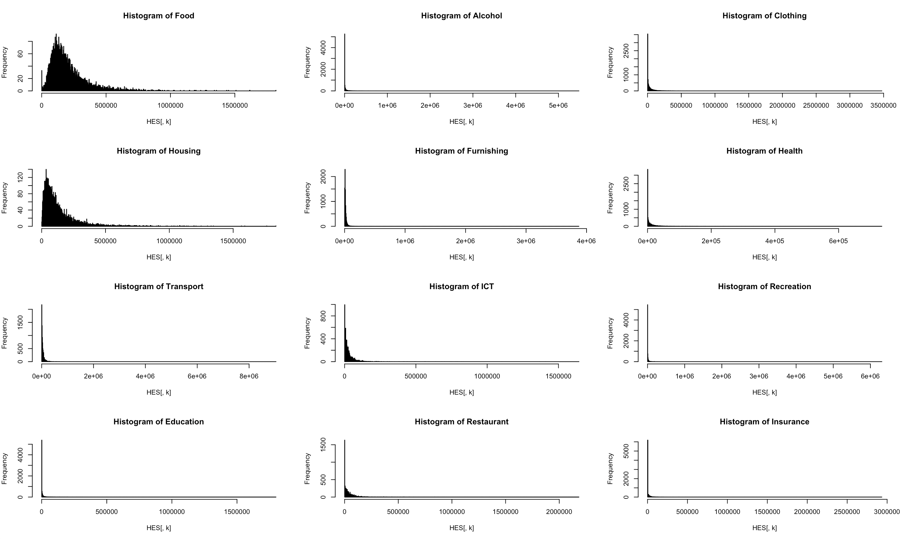

# Detección de datos atípicos

En esta sección se describen los aspectos teóricos y prácticos de la identificación de valores atípicos en una base de datos completa (incluso con registros que ya han sido imputados), basándose en métodos que han mostrado buenas propiedades en la inferencia de encuestas de hogares. Después de una breve introducción, se presenta un enfoque no exhaustivo del problema de la identificación de valores atípicos, así como la teoría detrás de los métodos y algunos hallazgos empíricos de la imputación de valores atípicos. 

El enfoque de imputación de valores atípicos sigue los mismos principios que el método utilizado para imputar registros en las secciones anteriores. Al final, se recomienda que cuando se encuentren valores atípicos, se marquen para su revisión. Cuando se revisan, el error se corrige (si el valor atípico es erróneo) o las estimaciones se ajustan (si el valor atípico es simplemente improbable). Por último, si es erróneo pero no se puede localizar al encuestado, se debe imputar el valor.

Por tanto, estamos interesados en detectarlos, y
en solucionar el problema reemplazando los valores inverosímiles por otros más realistas.
Detectar valores atípicos y distinguir aquellos que son errores de aquellos que
son inusualmente altos (o bajos) pero valores correctos, es un desafío. Haciendo estos
correcciones en los microdatos (es decir, en los datos a nivel del hogar) en lugar de
a nivel agregado (en tablas de resultados), se suma al desafío. Un valor atípico es un punto de datos que está distante de todos los demás puntos de datos. Thera son dos fuentes de valores atípicos:

1. *Valores erróneos*: entrada de datos o errores de medición
1. *Valores improbables o raros*: valores válidos, pero poco probables

Los valores erróneos deben corregirse, eliminarse o imputarse; mientras tanto, se deben dejar valores improbables en el conjunto de datos y se debe tomar una decisión para ajustar ese valor para reducir su impacto en el análisis de la encuesta. Los valores que se apartan de la distribución habitual pueden clasificarse como valores atípicos o como puntos influyentes. El tratamiento de los valores para el análisis viene definido por su clasificación.

- *Valores atípicos representativos*: valores que se han registrado correctamente y representan otras unidades de población con valores similares.
- *Valores atípicos no representativos*: registrados incorrectamente o únicos, lo que significa que no hay otra persona como ellos.
- *Puntos de influencia*: cuando el efecto conjunto del punto de datos atípicos y su respectivo peso muestral tienen un efecto significativo. Estos pueden ser representativos o no representativos.

A menudo, los valores atípicos pueden ser representativos de otros en la población, por lo que siguen siendo importantes y deben permanecer en el conjunto de datos. Al final, el proceso de identificación de valores atípicos se trata de un compromiso entre el sesgo y la varianza. Los valores atípicos pueden tener un gran impacto en los estimadores de ubicación y escala, como la media y la varianza, así como en los estimadores de totales y tamaños de subpoblaciones. Aunque estos estimadores permanecen insesgados, su varianza crece en presencia de valores atípicos. Por lo tanto, se debe considerar una compensación entre el sesgo y la varianza cuando se acercan a los valores atípicos.

## Algunos métodos de detección de valores extremos

@Filzmoser_Gussenbauer_Templ_2016 afirma que en el proceso de entrada de datos se pueden cometer errores. Por ejemplo, la introducción de valores de gasto imposibles, es decir, valores
que son demasiado altos o demasiado bajos para ser plausibles. Estos valores extremos pueden tener
un impacto significativo en algunos tipos de análisis (indicadores de desigualdad,
o coeficientes de regresión, pueden verse significativamente afectados por un número reducido de
valores influyentes en un conjunto de datos). 

#### 	Método Top-Down {-}

Suponga que $y_1\le\cdots\le y_n$ denota los valores ordenados de la variable de interés $y$ en la muestra $s$. Siendo, $Y_s$ el porcentaje acumulado del total de todos los elementos en la muestra, entonces se calcula el porcentaje de contribución acumulado $P_j$

$$
P_j=100\times\frac{\sum_{k=j}^n y_k}{Y_s}
$$

Grandes cambios entre valores significan posibles valores atípicos. También es posible calcular esta medida incluyendo el peso de muestreo para localizar qué valores ponderados tienen efectos anormalmente grandes.

$$
P_j=100\times\frac{\sum_{k=j}^n w_k\ y_k}{\hat t_{y, \pi}}
$$

#### Método de boxplot {-}

Uno de los métodos más básicos para identificar valores atípicos es construir un diagrama de caja utilizando la mediana y el rango intercuartílico $(IQR)$ de la variable de interés. En primer lugar, se define el $IQR=Q_3–Q_1$ y la mediana como $m=Q_2$. Por consiguiente, un elemento se define como un valor atípico si cae fuera del siguiente intervalo:

$$
(m-c \times IQR,\ m+c \times IQR)
$$
En donde $c$ es una constante predeterminada.

#### Transformación de Box-Cox {-}

Si la distribución de la variable es sesgada (como usualmente lo son los ingresos y gastos), es útil transformar la distribución para lograr una distribución normal antes de determinar valores atípicos. La transformación de Box-Cox de tiene la siguiente forma:

$$
y(\lambda)=\left\{\begin{matrix}\frac{y^\lambda-1}{\lambda},\;if\ \lambda\neq0,\\log(y),\;if\ \lambda=0\\\end{matrix}\right.
$$

En donde $\lambda\in(-5,5)$. De esta forma, un ordenador iterará entre cada posible valor de $\lambda$ para encontrar el que mejor reproduzca una distribución normal. Con esta nueva distribución, se puede utilizar el criterio de decisión de boxplot. La transformación anterior solo funciona para valores positivos. Hay otras formas de transformar los datos, incluido el procedimiento de estandarización, que se muestra en el siguiente método.

#### Método de distancia estandarizada {-}

Sean $z_k=w_ky_k$, $m_z$ una estimación para la ubicación de z, y una $\sigma_z$ una estimación para  la escala de $z$. Entonces, la distancia estandarizada puede entonces definirse como

$$
\delta_{z_k}=\frac{z_k-m_z}{\sigma_z}
$$

De forma similar al método de boxplot, los registros se clasificaran como valores atípicos si el valor absoluto de $\delta_{z_k}$ es mayor que un umbral predeterminado (normalmente 3). La media y la varianza de la muestra se pueden utilizar para las estimaciones de ubicación y escala para $z_k$, pero no son robustas, ya que incluirán los valores atípicos potenciales, lo que a suvez reduce la probabilidad de que se identifiquen correctamente los registros atípicos. Por consiguiente, es posible utilizar estimadores robustos resistentes a valores atípicos para $m_z$ Y $\sigma_z$, como por ejemplo la mediana y el rango intercuartílico de $z_k$.

#### Método de Hidiroglou-Bertholot {-}

Es posible utilizar una distancia estandarizada para detectar si la relación entre dos variables $x$, $y$ en una unidad difiere de las otras unidades. Este método utiliza la idea de distancia estandarizada y también incorpora una medida de importancia para el tamaño de la unidad, con el fin de determinar el umbral para considerar un registro como un valor atípico. El algoritmo de identificación sigue los siguientes pasos:

1. Para cada elemento, calcule $r_k=y_k/x_k \ (k\in s)$.
1. Transforme los datos para poder detectar valores atípicos en cualquier extremo de la distribución. Los datos transformados están dados por:
$$
s_k=\left\{\begin{matrix}1-\frac{med(r_k)}{r_k},\;\ si\ 0\le r_k\le m e d(r_k)\\\frac{med(r_k)}{r_k}-1,\;\ en \ otro \ caso\\\end{matrix}\right.
$$
1. Incorpore la magnitud de los datos calculando los efectos $E_k$ dados por
$$
E_k = s_k \times max(x_k,y_k)^\phi
$$
El parámetro $\phi$ proporciona una medida de control para el impacto del tamaño en el efecto, que puede alterar las curvas de decisión de límite superior e inferior.
1. A continuación, calcule el primer, segundo y tercer cuartil de efectos dados por $E_{Q_1}, \ E_{Q_2}, \ E_{Q_3}$, respectivamente.
1. Los rangos intercuartílicos se calculan entonces como
$$
d_{Q_1}=max(E_{Q_2}–E_{Q_1}\ , \ |0.5 \times E_{Q_2}|) \ \ \ \ y \ \ \ \ d_{Q_3}=max(E_{Q_3}–E_{Q_2}\ , \ |0.5 \times E_{Q_2}|) 
$$
Nótese que la cantidad $|0.5*E_{Q_2}|$ es utilizada para reducir la tendencia a declarar falsos valores atípicos. Por ejemplo, esto ayudaría si la mayoría de los valores estuvieran agrupados alrededor de un valor particular, con unos pocos registros desviándose de él.
1. Por último, los registros son declarados como valores atípicos si el valor de su efecto $E_k$ queda fuera del intervalo $(E_{Q_2} – c \times d_{Q_1} \ , \ E_{Q_2} + c \times d_{Q_3})$; en donde $c$ controla el ancho de la región de aceptación.

#### Método de la distancia de Mahalanobis {-}

Este método tiene en cuenta la estructura multidimensional de los datos. La distancia de Mahalanobis para una unidad se puede definir como
$$
MD_k^2=(\mathbf{x}_k-\bar{\mathbf{x}})' \ \mathbf{S}^{-1} \ (\mathbf{x}_k-\bar{\mathbf{x}})
$$

Si los datos siguen una distribución normal multivariante, se puede demostrar que la distribución de esta distancia es Ji-cuadrado con $p$ grados de libertad, $MD_k^2\sim\chi_p^2$, suponiendo que hay $p$ variables de interés en la base de datos. A continuación, las unidades se declaran como potencialemente atípicas si superan el umbral del percentil 0.975 de la distribución $\chi_{p,0.975}^2$. Esta estadística se puede hacer robusta mediante el uso de estimaciones robustas para la ubicación y la escala.

####	La distancia de Cook y el criterio DFBETAS {-}

Los registros influyentes son valores atípicos que afectan significativamente a los modelos de  regresión. Para ubicarlos, es posible utilizar la Distancia de Cook, que mide cuánto impacta la unidad $i$-ésima en la estimación de la unidad $j$-ésima, y está dada por:

$$
D_i=\frac{\sum_{j=1}^{n}(\hat y_j- \hat y_{j(i)})^2}{(p+1) \ {\hat{\sigma}}^2}
$$

En donde $\hat y_j$ es el valor estimado para la observación $j$-ésima cuando el punto $i$-ésimo es incluido en la estimación, mientras que $y_{j(i)}$ es el estimador cuando se excluye el punto $i$-ésimo.

Por otra parte, el estadístico DFBETAS mide cuánto influye la observación $i$-ésima en los estimadores de los coeficientes en una regresión lineal. La estadística se puede escribir como sigue:

$$
DFBETAS_{j,i}=\frac{b_j-b_{j,i}}{\sqrt{S_{(i)}^2 \ C_{j,i}}}
$$

En donde $b_j$ es la estimación para el $j$-ésimo coeficiente de regresión, $b_{j,i}$ es la estimación calculada sin la observación $i$-ésima, $S_{(i)}^2$ es la varianza de la muestra calculada sin la  observación $i$-ésima, y $C_{j,i}$ es el $j$-ésimo elemento de la diagonal de la matriz $(\mathbf{x}'\mathbf{x})^{-1}$.

Es posible considerar muchos valores $D$ como umbrales posibles en la distancia de Cook para determinar si un valor atípico es influyente; algunos autores afirman que cualquier valor $D$ mayor que uno debe considerarse influyente, mientras que otros afirman que el umbral debe ser $4/N$ o $4/(N-p-1)$. El límite para el valor de la estadística DFBETAS debería ser cualquier cifra cuyo valor absoluto sea mayor o igual que $2/\sqrt n$.

## Valores atípicos en una encuesta de consumo

A la hora de detectar valores atípicos podría considerarse la estructura multivariante de los datos (relación con otras variables). Para esto se debería elegir un conjunto de covariables de acuerdo con el juicio de los expertos y la desagregación necesaria. A pesar de que en la base de datos existan registros y valores observados para una observación, es posible que, después de la detección de valores atípicos, toda la información de una unidad sea declarada sospechosa. Por ende, una vez que se ha detectado una unidad como valores atípico potenciales, es posible decidir que todos sus registros sean eliminados, de no comprobarse  la fiabilidad de la información. Por consiguiente, si se mantiene la unidad, toda su  información se declara como confiable y valdrá la pena analizarla. De lo contrario, el registro se eliminará de los datos de la muestra que afectan la estructura del esquema de ponderación. Luego, la unidad se declarará como una unidad elegible no encuestada (ENR).

Después de decidir acerca de los valores atípicos de la unidad, es necesario detectar los valores atípicos de los registros para las variables específicas de la encuesta. Por ejemplo, en una encuesta de presupuestos familiares, las variables de interés serán los rubros asociados a los ingresos y a los gastos del hogar. En este caso, se sugiere que la variable de interés de una categoría particular se transforme utilizando el enfoque de Box-Cox.  Esto se hace porque las distribuciones de ingresos y gastos siempre están sesgadas. Una vez transformados, es posible utilizar las medidas anteriormente mencionadas para decidir acerca de la eliminación del registro. Por ejemplo, si dos o tres de los métodos detectan un registro como un posible valor atípico, entonces se verifica la información sobre ese registro. Si la información  del  elemento  es sospechosa, se debe eliminar y utilizar un enfoque de imputación sobre ese registro.

Siguiendo con el esquema de la encuesta de presupuestos familiares, podría ser conveniente que, a nivel de gasto, la detección de los valores atípicos se realizara, no sobre cada artículo, sino a nivel agregado para cada nivel de división COICOP. Además se deben tener en cuenta que, en este tipo de encuestas, los valores nulos para el gasto o consumo de artículos particulares son frecuentes, ya que no se puede esperar que todos los hogares consuman todos los artículos posibles. Estos valores cero se denominan *ceros estructurales*. Por ende, es muy pertinente estudiar y decidir si la metodología de detección de valores atípicos tendrá en cuenta los ceros o no. En general, cuando la incidencia de los ceros es baja no debería existir ningún inconveniente en analizar el conjunto de datos icnluyendo estos ceros. Por ende, esta decisión debería ser independiente para cada división. 

Para algunos componentes concretos, el número de ceros puede ser bastante alto y los algoritmos de detección de valores atípicos pueden fallar si el número de ceros está por encima de un determinado umbral. Las observaciones podrían incluso convertirse en valores atípicos debido a los ceros cuando se aplican métodos de detección. En este sentido, es necesario contemplar umbrales flexibles para cada división. Por ejemplo, un valor de cero en los gastos de alimentos sería poco realista, pero podría ser cierto para los gastos en ropa de bebé o muebles. Por las anteriores razones, es plausible recomendar la agregación de los componentes del consumo en grandes categorías a nivel de producto/servicio o grupos agregados de productos y servicios. Además, un indicador fiable no solo para medir la desigualdad en el consumo sino también para realizar un seguimiento de los cambios en el proceso de detección de valores atípicos y la imputación posterior es el coeficiente de Gini.

Por ejemplo, considere la siguiente tabla que muestra la presencia de ceros en cada división COICOP junto con el Gini para algunas de las categorías anteriormente mencionadas. Por ejemplo, nótese que la incidencia de ceros es mucho menor en la categoría de vivienda que en las categorías de educación o recreación.   

|     Categoría    | Ceros | Gini |
|:----------------:|:-----:|:----:|
|      Alimentos   |   27  |  36  |
|      Alcohol     |  4333 |  90  |
|       Ropa       |  2558 |  78  |
|     Vivienda     |   5   |  48  |
|      Muebles     |   85  |  53  |
|       Salud      |  2746 |  78  |
|    Transporte    |  616  |  69  |
|        TIC       |  551  |  62  |
|    Recreación    |  3538 |  92  |
|     Educación    |  4802 |  90  |
|    Restaurantes  |  1421 |  65  |
|      Seguros     |  4837 |  90  |
| Cuidado personal |  129  |  51  |

Esta metodología también se puede aplicar para grupos. La siguiente tabla muestra la presencia de ceros estructurales para algunos artículos de la sección Alimentos. Una vez más, dependiendo del país, sería esperable encontrar una mayor incidencia de ceros en algunos artículos. En este caso particular, nótese que hay una mayor cantidad de ceros en artículos como té o café, que en artículos como cereal, azucar o leche. 

|     Artículos    | Ceros | Gini |
|:----------------:|:-----:|:----:|
|     Cereales     |   87  |  37  |
|       Carne      |  481  |  47  |
|      Pescado     |  305  |  56  |
|       Leche      |  290  |  47  |
|      Aceites     |  482  |  51  |
|      Frutas      |  981  |  67  |
|     Verduras     |  188  |  47  |
|     Azucares     |  290  |  56  |
| Comida procesada |  253  |  43  |
|       Jugos      |  3650 |  79  |
|       Café       |  5286 |  86  |
|        Té        |  4709 |  86  |
|       Cacao      |  4421 |  78  |
|       Agua       |  5287 |  86  |
|     Refresco     |  4859 |  86  |
|   Otras bebidas  |  3353 |  79  |

Como se resaltó anteriormente, para datos muy sesgados, los métodos para la detección de valores atípicos podrían resultar problemáticos, ya que el intervalo en el que los puntos de datos no se consideran valores atípicos es simétrico alrededor de la mediana. Por ejemplo, la siguiente figura muestra el comportamiento estructural de algunas divisiones, es notable que todas las distribuciones de gasto y consumo en estos conceptos están extremadamente sesgadas.

Para ajustarse a este problema es posible utilizar la transformación de Box-Cox con el fin de obtener una distribución simétrica para los datos antes de determinar los posibles valores atípicos. La siguiente figura muestra el proceso de iteración de esta metodología en algunas divisiones. La línea vertical en cada gráfica corresponde al mejor valor que podría tomar $\lambda$ para que los datos se ajusta a una distribución normal.

Luego de haber transformado apropiadamente los datos, es posible utilizar la metodología de Boxplot, uno de los métodos más básicos (aunque muy poderoso), para identificar valores atípicos. Como se mencionó en la sección anterior, la gráfica mostrará el mínimo de la muestra, el primer cuartil, la mediana, el tercer cuartil y el máximo. La caja va del primer al tercer cuartil (que contiene por definición el 50% de los datos más internos), así como la mediana que generalmente está marcada por una línea media. Para la aplicación específica de la detección de valores atípicos dentro de las divisiones COICOP es posible que la constante predeterminada $c$ varíe entre divisiones. Por ejemplo, la siguiente tabla muestra el número de valores atípicos detectados en cada división por este método.

|     División     | Outliers |
|:----------------:|:--------:|
|      Alimentos   |    222   |
|      Alcohol     |     0    |
|       Ropa       |     0    |
|     Vivienda     |    87    |
|      Muebles     |    330   |
|       Salud      |     0    |
|    Transporte    |    743   |
|        TIC       |    668   |
|    Recreación    |     0    |
|     Educación    |     0    |
|    Restaurantes  |    31    |
|      Seguros     |     0    |
| Cuidado personal |    400   |

Por otro lado, también es posible tener en cuenta la relación entre el gasto en cada división y el ingreso reportado por el hogar en la encuesta. En general, no se puede suponer que esta relación es homogénea entre todos los encuestados, máxime si se tiene en cuenta que la selección de las unidades muestrales se hace en todos los grupos socioeconómicos del país. Sin embargo, sí es posible hacer este supuesto dentro de clases homogéneas, como por ejemplo el cruce entre los quintiles (o deciles) del ingreso y las regiones del país. De esta forma, dentro de cada grupo se supondría que la relación entre el gasto y el ingreso es uniforme. Por ejemplo, en la siguiente tabla se muestra el número de valores atípicos detectados en cada división mediante el método Hidiroglou-Bertholot.

|     División     | Outliers |
|:----------------:|:--------:|
|     Alimentos    |    74    |
|      Alcohol     |    141   |
|       Ropa       |    73    |
|     Vivienda     |    53    |
|      Muebles     |    177   |
|       Salud      |    71    |
|    Transporte    |    89    |
|        TIC       |    128   |
|    Recreación    |    168   |
|     Educación    |    117   |
|   Restaurantes   |    48    |
|      Seguros     |    100   |
| Cuidado personal |    247   |

Es necesario tener en cuenta que, como la lógica detrás de estos dos métodos difiere, cada uno identificará un número diferente de valores atípicos. Esto es una ventaja, porque los métodos son complementarios. Por ejemplo, en divisiones como ropa, vivienda, salud, recreación y educación, donde el método Boxplot no encontró ningún valor atípico posible, el método HB sí lo encontró. Es así como, teniendo en cuenta los resultados de estos dos métodos, se puede especificar una regla lógica para asignar una marca a los registros de la base de datos que deban ser revisados por considerarse sospechosos. Por ejemplo, es posible que haya categorías en las que la regla lógica sea una conjunción de los resultados de los métodos, mientras que podría haber otras en las que la regla lógica sea una disyunción entre los resultados. 

Al final, se debe imputar cualquier valor que se considere como un valor atípico. Como se vio en los capítulos anteriores, la imputación puede estar apoyada por un enfoque basado en modelos. Por ejemplo, para imputar el gasto percápita anualizado, es posible utilizar el método de regresión con el vecino más cercano, donde se define un modelo lineal para las unidades encuestadas (sin incluir los valores atípicos). Una vez estimados los coeficientes de regresión, se calcula un valor previsto para esas unidades de valores atípicos y se identifica a un solo donante como el hogar cuyo gasto total en esa División está más cerca de la predicción. La información  necesaria (incluida en el vector de covariables)  se podría resumir de la siguiente manera:

* *Composición del hogar*: número de adultos, número de hijos, número de hombres, número de mujeres, edad media de los adultos, edad media de los niños, edad de la persona más joven, edad de la persona mayor, edad de la cabeza, grado más alto de la cabeza.
* *Ocupación y fuerza de trabajo*: situación laboral del jefe, número de personas empleadas, número de personas desempleadas.
* *Calidad de la vivienda*: creado a partir de la sección de calidad de la vivienda, que puede incluir la tasa de hacinamiento (como la relación entre el número de habitaciones utilizadas principalmente para dormir por el número de personas en el hogar), el material de la pared exterior, y la principal fuente de agua potable para el hogar.
* Ubicación delhogar*: departamento o región y área (urbana y rural).

Al asumir que valores similares en la predicción producirán valores similares en la realidad, podemos "pedir prestado" el valor observado para imputar el valor atípico del "vecino". En la siguiente tabla se presentan algunos resúmenes de la distribución de los gastos a nivel de división antes de imputar los valores atípicos.

|    División      | Mínimo |   Mediana   |  Máximo |
|:----------------:|:------:|:-----------:|:-------:|
|    Víveres       |    0   | 164587 | 1819370 |
|    Alcohol       |    0   |    0   | 5475960 |
|      Ropa        |    0   |  8180  | 3474000 |
|    Vivienda      |    0   |  89040 | 1835500 |
|    Muebles       |    0   |  10503 | 3871476 |
|     Salud        |    0   |  2400 |  735180 |
|   Transporte     |    0   |  24700 | 9038783 |
|      TIC         |    0   |  16125 | 1642500 |
|   Recreación     |    0   |   860  | 6307200 |
|   Educación      |    0   |    0   | 1800000 |
|  Restaurante     |    0   |  22100 | 2184000 |
|     Seguro       |    0   |    0 | 2932400 |
| Cuidado personal |    0   |  18540 | 1223734 |

Por último, en la tabla que se muestra a continuación se examinan algunos resúmenes sobre la distribución de los gastos a nivel de división habiendo imputado los valores atípicos de forma diferencial y con independencia ne cada división. Se nota cómo la imputación pasa realmente cambia la perspectiva del consumo mínimo y máximo. Esto significa que la detección de valores atípicos se centró en ambos lados de la distribución del gasto. 

|   División    |  Mínimo   |   Mediana   |  Máximo |
|:-------------:|:---------:|:-----------:|:-------:|
|   Alimentos   | 4560 | 166280 | 1616504 |
|    Alcohol    |   0  |    0   |  930400 |
|      Ropa     |   0  |  8250  | 1446532 |
|    Vivienda   | 3000 |  89280 |  726000 |
|    Muebles    |  243 |  10730 |  279382 |
|     Salud     |   0  |  2400  |  654000 |
|   Transporte  |  60  |  29900 |  365000 |
|      TIC      |   0  |  16627 |  591000 |
|   Recreación  |   0  |   867  | 1054100 |
|   Educación   |   0  |    0   |  494000 |
|  Restaurantes  |   0  |  22133 |  520000 |
|     Seguro    |   0  |    0   |  723000 |
| Cuidado personal |   400 |  18855 |  658960 |

