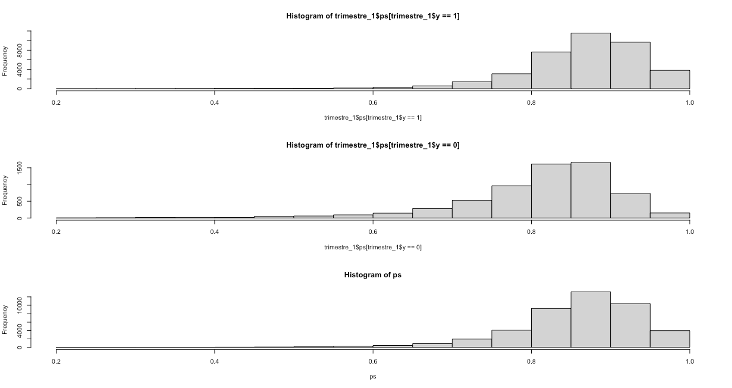
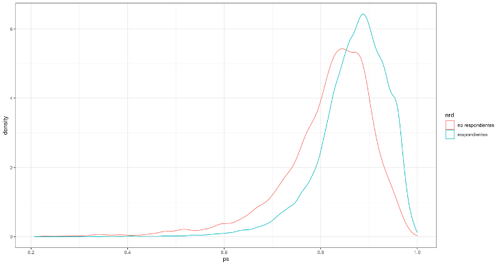

# Ausencia de respuesta de unidad

En una encuesta la información auxiliar puede utilizarse en dos etapas: en la planeación del diseño de muestreo y en la escogencia del estimador. En el primer caso, es posible utilizar la información auxiliar para construir estratos, definir conglomerados, asignar los tamaños de muestra dentro de los estratos, o incluso construir probabilidades de selección desiguales. De la misma forma, en el segundo caso, la información auxiliar puede utilizarse en la estimación de los parámetros de interés al definir nuevos ajustes de ponderación, al imponer restricciones de consistencia con la información auxiliar disponible a nivel de censos, registros o encuestas para que la distribución de la muestra expandida coincida plenamente con algunas características poblacionales. En este capítulo se aborda el uso de la información auxiliar en el estimador para corregir los sesgos generados por la ausencia de respuesta.
  
Como se ha expuesto anteriormente, la ausencia de respuesta a nivel de unidad puede tener consecuencias muy graves en la inferencia resultante de las encuestas de hogares, puesto que si el conjunto de respondientes tiene características distintas al conjunto de no respondientes, entonces se introducirá sesgo en la estimación de los parámetros de interés.

## Sesgo sobre los estimadores

Asumiendo que existe ausencia de respuesta en la muestra, considere la siguiente forma de estimar (ingenuamente) el promedio poblacional $\bar{y}_U$ mediante el estimador de Hájek

$$
\tilde{y}_s = \frac{\sum_{s_r}d_ky_k}{\sum_{s_r}d_k} = \frac{\hat{t}_y}{\hat{N}}
$$

Siendo $\bar{\phi}$ el promedio de las probabilidades de respuesta, el sesgo generado por la ausencia de respuesta puede cuantificarse de la siguiente manera:

$$
B\left(\tilde{y}_s\right)  = 
\frac{1}{N\bar{\phi}}\sum_U(y_k-\bar{y}_U)(\phi_k-\bar{\phi})
= \frac{Cov\left(\bar{y},\phi\right)}{\bar{\phi}}
= \frac{Cor\left(Y,\phi\right)S\left(Y\right)S\left(\phi\right)}{\bar{\phi}}
$$

En donde $Cov\left(Y,\phi\right)$ es la covarianza poblacional entre
los valores de la característica de interés y las probabilidades de respuesta,
$cor\left(Y,\phi\right)$ es el coeficiente de correlación poblacional
y $S\left(Y\right)$ es la desviación estandar poblacional de la variable objetivo. Dado que el valor del coeficiente de correlación está restringido
al intervalo $[-1, 1]$, el valor máximo del sesgo absoluto será igual a

$$
|B\left(\tilde{y}_s\right)| \leq 
\frac{S\left(\phi\right)S\left(y\right)}{\bar{\phi}}
= \frac{\left(1-R\left(\phi\right)\right)S\left(y\right)}{2\bar{\phi}}
$$

A pesar de que este límite superior no se puede calcular en situaciones prácticas, sí es posible estimarlo utilizando los datos de la muestra y las probabilidades
de respuesta estimadas. Nótese que si el mecanismo de ausencia de respuesta fuese MCAR, entonces el valor de $R\left(\phi\right)$ sería uno, y por consiguiente no habría sesgo. De la misma forma, en el caso extremo en el que la característica de interés fuese homogénea en toda la población, tampoco habría sesgo en el estimador, y bastaría con utilizar los datos de la muestra de respondientes efectivos, sin ningún tipo de corrección.  

Además de las anteriores consideraciones, es posible evaluar las propuestas de escogencia de variables para calibración de @KaltonFloresCervantes_2003 y de @Sarndal_2011. En particular, este último autor considera un indicador del sesgo por ausencia de respuesta sobre los estimadores de calibración, cuya lógica se basa en que, en el mejor de los casos, en el que no hubiese errores de cobertura ni ausencia de respuesta, el estimador de expansión $\hat{t}_{y}$ sería insesgado y la distancia que habría entre este y el estimador de calibración $\hat{t}_{y,cal}$ se podría cuantificar como $\Delta_A = \frac{(\hat{t}_{y,cal} - \hat{t}_{y})}{N}$. Este indicador se sugiere como una posible herramienta para comparar potenciales variables de calibración, de tal forma que cuando el valor de $|\Delta_A|$ sea grande habría un indicio para preferir un vector de calibración sobre otro. Además, al estandarizarla, esta medida puede ser descompuesta en los siguiente tres factores:

$$\frac{\Delta_A}{S_y} = cv_g \ \times R_{y,\mathbf{x}} \ \times R_{D,C}$$

De esta forma, el primer factor representa el coeficiente de variación de los pesos $g_k$; el segundo factor al cuadrado es el coeficiente de determinación de una regresión múltiple entre la variable de estudio y las variables del vector de calibración; el último factor al cuadrado es el coeficiente de determinación (proporción de varianza explicada) en una regresión ponderada que pasa por el origen entre las desviaciones de las covariables $D_j = \hat{t}_{x, j} - t_{x,j}$ y las covarianzas de la variable de estudio y las covariables $C_j = cov(y, x_j)$.


## Soluciones 

Como se expuso en la sección anterior, si no hay correlación entre la variable de interés y la estructura de la ausencia de respuesta entonces no hay sesgo en los estimadores. Esto quiere decir que, si la probabilidad de respuesta es homogénea (representatividad fuerte) o pudiera modelarse (representatividad débil) para todos los individuos, entonces el sesgo se podría eliminar. En esta sección se explorarán dos caminos que, al incorporar información auxiliar, eliminan el sesgo causado por el fenómeno de la ausencia de respuesta.

Ambas opciones, ajuste de factores de expansión mediante modelos de *propensity score* y estimadores de calibración, descansan en el paradigma de la inferencia basada en el diseño de muestreo y por ende se contemplan como dos posibilidades atractivas que mantienen la buenas propiedades de la estimación directa en encuestas de hogares. 

### Propensity Score

Como se mencionó anteriormente, uno de los ajustes que se debe realizar en la generación de los ponderadores finales es la corrección por ausencia de respuesta. En donde

$$d_{4k} =  \frac{d_{3k}}{\hat{\phi_k}}$$

Como ya se había mencionado en los capítulos anteriores, si el patrón de ausencia de respuesta es NMAR, entonces $\phi_k = f(\mathbf{y}_k, \beta)$ y en este caso, como no es posible tener acceso a los determinantes de la respuesta (porque precisamente son las mismas variables de interés en la encuesta), entonces no es posible estimar el patrón de ausencia de respuesta. Por ende, en este escenario habrá sesgo siempre. Por el contrario, si el patrón de ausencia de respuesta es MCAR o MAR, entonces $\phi_k = f(\mathbf{x}_k, \boldsymbol{\beta})$; en este caso, si fuese posible tener acceso a las covariables $\mathbf{x}$ que determinan el mecanismo de respuesta, entonces es posible estimar las probabilidades de respuesta mediante $\hat{\phi}_k = f(\mathbf{x}_k, \hat{\boldsymbol{\beta}})$. Efectivamente, en el caso del estimador de Horvitz-Thompson, el sesgo del estimador se anula puesto que

\begin{align*}
E(\hat{t}_y) &= E\left(\sum_{k\in s_r}d_{3k}y_k\right) \\
&= E\left(\sum_{k\in s_r}\frac{y_k}{\pi_k \hat{\phi_k}}\right)\\
&= E\left(E\left(\sum_{k\in U}\frac{y_k}{\pi_k \hat{\phi_k}}I_kD_k|I_k\right)\right)\\
&= \sum_{k\in U}\frac{y_k}{\pi_k \hat{\phi_k}}E\left(I_k\right)E\left(D_k|I_k\right)\\
&= \sum_{k\in U}\frac{y_k}{\pi_k \hat{\phi_k}}\pi_k\phi_k = t_y
\end{align*}

Asumiendo que el modelo está bien establecido, entonces se tendrá una concordancia directa entre $\hat{\phi_k}$ y $\phi_k$; por lo tanto se anularían en la última igualdad de la ecuación anterior. Además, el insesgamiento viene supeditado puesto que,

$$
E(I_kD_k) 
= E\left(E(I_kD_k|I_k) \right)
= E(I_k)E(D_k|I_k) = \pi_k \phi_k
$$

En resumen, si se tiene acceso a información auxiliar (contenida en el marco de muestreo o en otras preguntas de la encuesta), y si se considera que el mecanismo que genera la ausencia de respuesta en la encuesta de hogares es MAR o MCAR, es posible ajustar un modelo de *propensity score* para la ausencia de respuesta (en donde la variable dependiente es una variable indicadora de la respuesta del individuo por lo general supeditado a una distribución Bernoulli o Binomial). En resumen, es posible definir el siguiente estimador insesgado

$$
\hat{t}_y=\sum_{k\in s_{ER}}d_{4k}y_k
$$

En donde

$$
d_{4k} = \frac{d_{3k}}{\hat{\phi_k}}  \ \ \ \ \ \ \ \ \forall \ k  \in s_{ER}
$$

Siempre es muy importante realizar una validación exhaustiva de los modelos utilizados para estimar la probabilidad de respuesta. En general, es necesario que el modelo satisfaga las siguientes dos condiciones:

1. *Soporte común*: al igual que en un experimento aleatorizado, es necesario garantizar que ninguna combinación de las covariables induzca un estado (respuesta o ausencia de respuesta) de forma determinística. Es decir sobre todas las combinaciones en las covariables deben existir respondientes y no respondientes. Esta condición se puede escribir como:
$$
0 < Pr(D_{1,k} = 1 |\mathbf{x}_{1}) < 1 
$$
2. *Balanceo*: como la respuesta de las unidades de muestreo no provienen de un estudio aleatorizado, es necesario garantizar que la distribución de las $\hat\phi_k$ sea similar entre respondientes y no respondientes. De esta forma, es posible expandir el subconjunto de respondientes efectivos a la muestra original (que incluye a las unidades no respondientes), la cual a su vez expande a toda la población de interés. Esta condición se puede escribir como:

\begin{align*}
\hat\phi_{1, k} &= Pr[D_{1, k} | I_{1, k} = 1,\mathbf{x}] \\
&= Pr[D_{1, k} | k \in s_r, I_{1, k} = 1, \mathbf{x}] \\
&= Pr[D_{1, k} | k \notin s_r, I_{1, k} = 1, \mathbf{x}]
\end{align*}

Por último, se debe corroborar que la suma de los pesos ajustados por la ausencia de respuesta esté cercana al tamaño de la población que se quiere representar. La figura \@ref(fig:figel3a) permite ilustrar el soporte común entre respondientes y no respondientes para un modelo de *propensity score*; nótese que ambas distribuciones son similares, por lo que es posible concluir que efectivamente las covariables usadas están representando bien la estructura estocástica en respondientes y no respondientes. 

<div class="figure" style="text-align: center">

<p class="caption">(\#fig:figel3a)Distribución de las probabilidades estimadas de respuesta: respondientes (arriba), no respondientes (medio), ambos (abajo).</p>
</div>

Además, la figura \@ref(fig:figel3b) muestra la propiedad de balanceo en el modelo; véase cómo ambas distribuciones se alejan de los extremos (ceros y uno) y presentan una caracterización similar. 

<div class="figure" style="text-align: center">

<p class="caption">(\#fig:figel3b)Balanceo entre respondientes y no respondientes</p>
</div>

### Calibración 


Como lo afirma @Sar08, la calibración provee una forma sistemática para involucrar la información auxiliar. En la mayoría de aplicaciones prácticas, la calibración provee un enfoque simple para incorporar esta información dentro de la etapa de estimación. La información auxiliar fue usada para mejorar la precisión de los estimativos mucho antes que el término calibración fuera popular. La calibración puede ser usada efectivamente en encuestas donde la información auxiliar está disponible en diferentes niveles. Por ejemplo, al realizar un muestreo en dos etapas la información auxiliar puede existir para las unidades de la primera etapa (los conglomerados) y puede existir otra información para las unidades de la segunda etapa (elementos o conglomerados).

Como se ha detallado con amplitud en este y los capítulos anteriores, la ausencia de respuesta de unidad tiene consecuencias dañinas en la inferencia con encuestas de hogares. En este caso es altamente recomendable que se implemente ajuste a los factores de ponderación de las unidades (hogares o personas). A pesar de que los modelos de *propensity score* tienen una larga trayectoria en el manejo de la ausencia de respuesta, la calibración utilizada para corregir estos sesgos ofrece una relativamente nueva perspectiva. Nótese que el estimador tradicional toma la siguiente forma:

$$
\hat t_y^* = \sum_{s_r} w_k\ y_k = \sum_{s_r} \frac{d_k}{\phi_k} y_k 
$$

Esta anterior expresión indica que implícitamente se genera un procedimiento en dos etapas en donde, en primer lugar, se calculan lo pesos básicos inducidos por el diseño de muestreo, luego se ajusta un modelo de *propensity score* para estimar las probabilidades de respuesta $\phi_k$. A esta estrategia generalmente se le agrega una tercera etapa en donde se crean nuevos pesos calibrados con respecto a proyecciones demográficas post-censales, como por ejemplo los cruces entre edad, sexo y región. Al ajustar los pesos para que sumen exactamente la cifra de las proyecciones censales, se reduce el sesgo de subcobertura.

@Sar08 afirma que la práctica general es asumir que el estimador $\hat t_y^*$ es insesgado, cuando en realidad no lo es, puesto que no es posible conocer todos los determinantes del mecanismo de respuesta para ajustar el modelo que estima las probabilidades de respuesta. Además, de la sección anterior se deduce que este supuesto implica que se considere que $\pi_k \hat\phi_k$ es la verdadera probabilidad de inclusión de la unidad, cuando en realidad no es así. Por lo tanto, realizar un ajuste a los factores de expansión únicamente basados en los modelos de *propensity score* traerá inevitablemente una cierta cantidad de sesgo en la estimación de los parámetros en las encuestas de hogares.

Bajo este escenario, el enfoque de calibración doble surge como un proceso metodológico adicional que pretende corregir estos sesgos. Para poder utilizarlo, es necesario tener información auxiliar en dos niveles: la población y la muestra. Este tipo de metodologías pueden ser usadas en las encuestas tipo panel, o panel rotativo. En este proceso es necesario contar con dos tipos de información auxiliar:

1. Por un lado tendremos la información poblacional usual que se utiliza para calibrar los factores de expansión en un levantamiento regular. Las variables que intervienen en esta calibración las notaremos como $\boldsymbol{x}_{1k}$ y por lo general denotan la pertenencia de los individuos a regiones, o grupos de edad, sexo o área (urbano, rural).
1. Por otro lado deberemos tener acceso a información auxiliar en la muestra original (que incluya a las unidades respondientes y no respondientes) y que notaremos como $\boldsymbol{x}_{2k}$. Por ejemplo, utilizando la información del panel al momento de la primera medición, sería posible contar con información concerniente a la condición de ocupación, ingresos, o cualquier otra variable medida en la primera oleada del panel. 

Por lo tanto, es posible calibrar los pesos en la muestra de respondientes ($s_r$) a nivel de la información auxiliar disponible en la muestra original ($s$), y luego a nivel nacional ($U$) o por los estratos de interés. Si el mecanismo que genera la ausencia de respuesta es MAR o MCAR, es posible que los ponderadores de calibración eliminen el sesgo en las estimaciones finales si es que las variables que generan este mecanismo se han calibrado en alguno de las dos niveles mencionados. @Sarndal_Lundstrom_2006 proponen que, para lograr este objetivo, se encuentre un primer conjunto de pesos calibrados sujetos a la siguiente restricción:

$$
\sum_{s}w_{1k}\boldsymbol{x}_{1k} = \sum_{U}\boldsymbol{x}_{1k}
$$

Luego, en una segunda etapa, se deben usar estos pesos intermedios $w_{1k}$ para calcular los pesos finales de calibración $w_{k}$ de la muestra de respondientes efectivos que están sujetos a la siguiente restricción:

$$
\sum_{s_r}w_{k}\boldsymbol{x}_{2k} = \sum_{s}w_{1k}\boldsymbol{x}_{k} = 
\begin{pmatrix}
\sum_{U}\boldsymbol{x}_{1k}\\
\sum_{s_r}w_{1k}\boldsymbol{x}_{2k}
\end{pmatrix}
$$

En este sentido, nótese que la forma funcional de los pesos de calibración doble resultantes de este proceso de optimización se pueden escribir de la siguiente manera:

$$
w_k = d_k \times g_k  \cong d_k \times \hat \phi_k
$$

Por ende, bajo el raciocinio de la calibración, los pesos $g_k$ se pueden ver como una estimación de las probabilidades de respuesta $\phi_k$. Por otra parte, de las expresiones, sobre el sesgo de los estimadores que no contienen ningún tipo de corrección, se puede notar que el sesgo se propaga a través de las variables de la encuesta y se propaga con más fuerza en las variables correlacionadas con los determinantes de la ausencia de respuesta. 

Para mostrar cómo el ajuste a los factores de expansión, con las dos metodologías anteriormente mencionadas, inducen menor sesgo que los estimadores comunes, se planeó el siguiente experimento:

1. Se generó una población compuesta por individuos con diferente propensión de respuesta MCAR.
1. Se utilizaron metodologías de calibración y se comparó, de forma empírica, el efecto de la ausencia de respuesta sobre las estimaciones finales.

En primera instancia, cabe mencionar que la población se definió a partir del ingreso del hogar, y se creó usando variables auxiliares disponibles (sexo). De esta forma, se le dio una probabilidad de respuesta diferencial entre los grupos correspondientes al cruce de las categorías de estas dos variables. Como resultado de las simulaciones, se generaron estimaciones para el estimador de Horvitz-Thompson sin ajuste de ningún tipo y para un estimador de calibración que tuvo en cuenta los conteos poblacionales censales para cada las dos categorías de la variables sexo. La figura \@ref(fig:fightcal) muestra el comportamiento de ambas estimaciones. La línea roja refleja el parámetro desconocido, los puntos negros indican las estimaciones del estimador de calibración en cada iteración de la simulación, mientras que los puntos grises muestran las estimaciones del estimador de Horvitz-Thompson en cada iteración de la simulación

<div class="figure" style="text-align: center">

<p class="caption">(\#fig:fightcal)Estimaciones de Horvtiz-Thompson y de calibración.</p>
</div>


En conjunto con la gráfica anterior, la figura \@ref(fig:fightcaldist) muestra la distribución sesgada del estimador de Horvitz-Thompson (gris) en comparación con el insesgamiento del estimador de calibración (negro). Bajo este esquema de respuesta, incluir en la calibración las variables pertinentes corrige el sesgo generado por la ausencia de respuesta. En este estudió se encontró que el estimador ingenuo (HT) produjo sesgo para la estimación de los tamaños de hombres y mujeres, para el tamaño de la población, para los ingresos de hombres y mujeres y para los ingresos de la población.

<div class="figure" style="text-align: center">

<p class="caption">(\#fig:fightcaldist)Distribuciones del estimador de Horvtiz-Thompson y del estimador de calibración</p>
</div>

Como se mencionó anteriormente, hay mejores formas de calibrar, puesto que el problema de la calibración se reduce a cómo introducir la información auxiliar en la estructura de estimación de la encuesta, es posible que existan variables que reduzcan el sesgo, pero no todas las variables inducirán el mismo nivel de precisión. Al momento de escoger, se deberían seleccionar aquellas variables que reduzcan el sesgo y que además reduzcan la varianza. Por tanto, las variables auxiliares que se usen como insumo en los procesos de calibración deben:

- Ser capaces de explicar la variación de la probabilidad de respuesta.
- Estar correlacionadas con las variables de interés.
- Identificar los dominios de estimación más importantes.


En particular al introducir otras covariables en la calibración (grupo de edad, escolaridad, región, área), además de la corrección del sesgo se evidencia un aumento de la precisión en las nuevas estimaciones, tal como lo muestra las distribuciones de los estimadores en la figura \@ref(fig:fightcal2dist), en donde se consideran tres estimadores: el estimador de Horvitz-Thompson (gris claro), el estimador de calibración con restricción de sexo (negro) y el estimador de calibración con todas las restricciones (gris oscuro).

<div class="figure" style="text-align: center">

<p class="caption">(\#fig:fightcal2dist)Distribuciones del estimador de Horvtiz-Thompson y de dos estimadores de calibración</p>
</div>


## Las consecuencias de la pandemia por COVID-19 en las encuestas de la región

Siguiendo a @CEPAL_sesgos2020, en su intento por frenar la velocidad de contagio del COVID-19, los gobiernos de la región determinaron la imposición de restricciones de movilidad que truncaron la recolección presencial de las encuestas de hogares. Para hacer frente a este inconveniente y poder seguir produciendo estadísticas oficiales pertinentes y oportunas, la mayoría de INE en la región decidieron realizar el seguimiento continuo a un panel seleccionado de un periodo reciente y mediante contacto telefónico seguir con la recolección de la información primaria. Uno de los retos más importantes que esta pandemia le impuso a los INE fue la corrección del sesgo de selección en las encuestas de hogares. A pesar de los ingentes esfuerzos que se hicieron por minimizarlo durante la recolección, el cambio de un modo presencial a un modo telefónico trajo consigo consecuencias indeseadas que se pudieron enfrentar con algunas de las metodologías que se explicaron en esta sección. 

En @CEPAL_publica, se afirma que un buen punto de partida para los INE fue poder contar con una muestra probabilística de meses anteriores y conformar con ella un panel de seguimiento durante el periodo en el que se tuvieron estas restricciones de movilidad. En términos de notación, llamémosla la muestra maestra. Sin embargo, se debe tener en cuenta los siguientes dos aspectos importantes:

1. No todos los hogares seleccionados de forma probabilística proveyeron su información de contacto telefónico. 
2. No todos los hogares contactables respondieron el cuestionario de la encuesta. 

Haciendo cálculos gruesos, si suponemos que la cobertura de la submuestra que sí proveyó datos de contacto asciende al 85 % y que la probabilidad de que un hogar contactado responda toda la encuesta es del 80 %, entonces contaríamos solamente con un 68% de la muestra original. A estas cuentas habría que ajustarlas con el efecto de la atrición en el panel, que crece a medida que se siga utilizando. En estos términos, sería un grave error y una suposición poco plausible asumir que los hogares respondientes efectivos se comportan de manera similar a los hogares no respondientes y a los hogares no cubiertos. El mejor escenario que puede plantearse es considerar que la muestra efectiva no está libre de sesgos, hacer una búsqueda exploratoria de su magnitud con los datos recolectados y tratar de minimizarlo (o incluso eliminarlo) utilizando alguna de las técnicas estadísticas que mencionamos en este documento. 

La figura \@ref(fig:fight3dist) presenta tres posibles escenarios que los INE pudieron encontrar en esta búsqueda. En el diagrama de la izquierda se verifica la ausencia de sesgo, en el diagrama del centro y en el de la derecha se confirma que la magnitud del sesgo es significativa. Nótese que la línea horizontal azul correspondería a la estimación publicada en el mes en el que se seleccionó la muestra maestra, mientras que la línea roja horizontal representa el promedio de las simulaciones con la muestra efectiva. Cada uno de los resultados de las simulaciones está representado por las fluctuaciones punteadas.

<div class="figure" style="text-align: center">

<p class="caption">(\#fig:fight3dist)Distribuciones del estimador de Horvtiz-Thompson en tres escenarios de interés.</p>
</div>

La figura \@ref(fig:fight4dist) muestra un escenario simulado en donde se contempla el uso del estimador ajustado con la técnica de *propensity score* (línea verde) y el estimador de calibración en dos etapas (línea azul) comparado con el estimador sin ningún tipo de ajuste (línea negra). Lo que se esperaría es que es estimador ingenuo subestime los tamaños poblacionales y los indicadores de interés; mientras que los estimadores ajustados, siempre que el mecanismo de ausencia de respuesta sea MAR o MCAR, elimina este sesgo. 

<div class="figure" style="text-align: center">

<p class="caption">(\#fig:fight4dist)Distribuciones del estimador de Horvtiz-Thompson y de dos estimadores ajustados.</p>
</div>

Los caminos que se deben seguir luego de corroborar la presencia (o ausencia) de sesgo dependerán de la estrategia de levantamiento de información que los países hayan decidido hacer. En el escenario más optimista, ante la ausencia de sesgo, se estaría en una buena posición para replicar los procesos usuales de inferencia. Sin embargo, ante la sospecha de que sí existe sesgo - posición parsimoniosa y recomendada por @CEPAL_sesgos2020 -, y dependiendo de la información auxiliar disponible, los INE pudieron disponer de las dos alternativas metodológicas que se describieron anteriormente. 

Muchos países de la región decidieron realizar un seguimiento mensual telefónico a la muestra maestra como alternativa a las restricciones de movilidad que se han impuesto en los países y que impiden la recolección presencial de la información. En este caso, partiendo de una muestra probabilística se pueden realizar ajustes a los factores de expansión de manera diferencial [@CEPAL_continua]. 

En particular, dado que se tuvo acceso a todo un conjunto de covariables $\mathbf{x}$ en la muestra maestra, fue posible determinar el mejor modelo para estimar el patrón de ausencia de respuesta en la muestra de respondientes efectivos. En este paso se asumió que la probabilidad de respuesta dependía de alguna combinación lineal de las covariables en la muestra maestra; es decir que el mecanismo que genera esa ausencia de respuesta se pudo describir mediante $\mathbf{x}$. Teniendo en cuenta que los pesos originales de la encuesta telefónica se denotan como $d_k$, y habiendo estimado $\hat\phi_{k}$ para respondientes y no respondientes de la muestra telefónica, entonces el factor de expansión ajustado tomó forma $w_k = \frac{d_k}{\hat{\phi}_k}$.

En este sentido, utilizar el factor de expansión $w_k$ minimizaría el sesgo de selección que se generó por el cambio de modo en la recolección de la información. Por ejemplo, podría considerarse que un buen modelo de *propensity score* contemplase la edad, el nivel educativo, el área de residencia (rural/urbano), el sexo del respondiente, la región geográfica, el estado de ocupación en el mes de observación de la muestra maestra y el ingreso percápita del hogar. Nótese que todas las covariables en el modelo, salvo el área y la región geográfica, necesariamente provienen de las observaciones obtenidas en la muestra maestra.

Por otro lado, @CEPAL_publica afirma que al imponer una cierta coherencia entre las cifras oficiales ya publicadas y las que la encuesta telefónica pudo producir, es preferible el uso de los estimadores de calibración. Al usar este enfoque se asegura una estructura inferencial robusta en presencia de la información disponible puesto que se reduce tanto el error de muestreo (aumentando la precisión) como el error debido a la ausencia de respuesta (eliminando el sesgo). A manera de ejemplo, podríamos considerar que las siguientes dos etapas de la calibración son suficientes para eliminar el sesgo generado por el cambio de modo de recolección:

- En la primera etapa se calibran los pesos de la muestra maestra usando las variables de edad, región, área y sexo, definidas convenientemente en $\boldsymbol{x}_{1k}$. Los totales de estas variables se encuentran en los conteos censales o en su defecto, en las proyecciones demográficas.
- En una segunda etapa se calibrarán los pesos de la muestra telefónica usando las anteriores variables $\boldsymbol{x}_{1k}$ y además las variables de ingreso percápita, condición de ocupación, rama de actividad y escolaridad, definidas convenientemente en en $\boldsymbol{x}_{2k}$.  Los totales de estas variables fueron estimados en la misma publicación de la encuesta basada en la muestra maestra.

### Ejemplo

Esta sección revisa los pasos principales que se debieron considerar para erradicar (o al menos minimizar en la medida más considerable) el sesgo de selección de una encuesta recopilada durante la pandemia por COVID19. Los datos que se usarán son artificiales, pero sirven para mostrar y ejemplificar las diferentes etapas propuestas para la evaluación y minimización del impacto del COVID-19 en la calidad de las encuestas.

Supongamos un conjunto de datos artificial que define una población finita $U$ de tamaño $N = 50000$, y supongamos que estamos interesados en observar la situación laboral de cada persona en $U$. En aras de la simplicidad, supondremos que una persona solo puede estar *empleada* o *desempleada*. Quisiéramos observar esta característica de interés en dos periodos diferentes $t_0$ y $t_1$. Por un lado, suponga que $t_0$ corresponde a un período de recolección regular antes de la pandemia; por otro lado, supongamos que $t_1$ corresponde al período donde las restricciones de movimiento debido a la pandemia afectaron la recolección estándar de encuestas por muestreo.

Si tuviéramos acceso a toda la población, nos encontraríamos con que en $t_0$, el 80% de las personas estaría empleada, mientras que el 20% estaría desempleada. Sin embargo, debido al impacto de la pandemia en los indicadores sociales (e.g., pobreza y mercado laboral), en $t_1$, observaríamos que muchas personas perdieron su trabajo, y la mitad de la población está desempleada.


El siguiente conjunto de datos muestra una versión reducida de 20 individuos de esta población finita.


```{=html}
<div id="yyqpcrtavw" style="overflow-x:auto;overflow-y:auto;width:auto;height:auto;">
<style>html {
  font-family: -apple-system, BlinkMacSystemFont, 'Segoe UI', Roboto, Oxygen, Ubuntu, Cantarell, 'Helvetica Neue', 'Fira Sans', 'Droid Sans', Arial, sans-serif;
}

#yyqpcrtavw .gt_table {
  display: table;
  border-collapse: collapse;
  margin-left: auto;
  margin-right: auto;
  color: #333333;
  font-size: 16px;
  font-weight: normal;
  font-style: normal;
  background-color: #FFFFFF;
  width: auto;
  border-top-style: solid;
  border-top-width: 2px;
  border-top-color: #A8A8A8;
  border-right-style: none;
  border-right-width: 2px;
  border-right-color: #D3D3D3;
  border-bottom-style: solid;
  border-bottom-width: 2px;
  border-bottom-color: #A8A8A8;
  border-left-style: none;
  border-left-width: 2px;
  border-left-color: #D3D3D3;
}

#yyqpcrtavw .gt_heading {
  background-color: #FFFFFF;
  text-align: center;
  border-bottom-color: #FFFFFF;
  border-left-style: none;
  border-left-width: 1px;
  border-left-color: #D3D3D3;
  border-right-style: none;
  border-right-width: 1px;
  border-right-color: #D3D3D3;
}

#yyqpcrtavw .gt_title {
  color: #333333;
  font-size: 125%;
  font-weight: initial;
  padding-top: 4px;
  padding-bottom: 4px;
  border-bottom-color: #FFFFFF;
  border-bottom-width: 0;
}

#yyqpcrtavw .gt_subtitle {
  color: #333333;
  font-size: 85%;
  font-weight: initial;
  padding-top: 0;
  padding-bottom: 6px;
  border-top-color: #FFFFFF;
  border-top-width: 0;
}

#yyqpcrtavw .gt_bottom_border {
  border-bottom-style: solid;
  border-bottom-width: 2px;
  border-bottom-color: #D3D3D3;
}

#yyqpcrtavw .gt_col_headings {
  border-top-style: solid;
  border-top-width: 2px;
  border-top-color: #D3D3D3;
  border-bottom-style: solid;
  border-bottom-width: 2px;
  border-bottom-color: #D3D3D3;
  border-left-style: none;
  border-left-width: 1px;
  border-left-color: #D3D3D3;
  border-right-style: none;
  border-right-width: 1px;
  border-right-color: #D3D3D3;
}

#yyqpcrtavw .gt_col_heading {
  color: #333333;
  background-color: #FFFFFF;
  font-size: 100%;
  font-weight: normal;
  text-transform: inherit;
  border-left-style: none;
  border-left-width: 1px;
  border-left-color: #D3D3D3;
  border-right-style: none;
  border-right-width: 1px;
  border-right-color: #D3D3D3;
  vertical-align: bottom;
  padding-top: 5px;
  padding-bottom: 6px;
  padding-left: 5px;
  padding-right: 5px;
  overflow-x: hidden;
}

#yyqpcrtavw .gt_column_spanner_outer {
  color: #333333;
  background-color: #FFFFFF;
  font-size: 100%;
  font-weight: normal;
  text-transform: inherit;
  padding-top: 0;
  padding-bottom: 0;
  padding-left: 4px;
  padding-right: 4px;
}

#yyqpcrtavw .gt_column_spanner_outer:first-child {
  padding-left: 0;
}

#yyqpcrtavw .gt_column_spanner_outer:last-child {
  padding-right: 0;
}

#yyqpcrtavw .gt_column_spanner {
  border-bottom-style: solid;
  border-bottom-width: 2px;
  border-bottom-color: #D3D3D3;
  vertical-align: bottom;
  padding-top: 5px;
  padding-bottom: 5px;
  overflow-x: hidden;
  display: inline-block;
  width: 100%;
}

#yyqpcrtavw .gt_group_heading {
  padding: 8px;
  color: #333333;
  background-color: #FFFFFF;
  font-size: 100%;
  font-weight: initial;
  text-transform: inherit;
  border-top-style: solid;
  border-top-width: 2px;
  border-top-color: #D3D3D3;
  border-bottom-style: solid;
  border-bottom-width: 2px;
  border-bottom-color: #D3D3D3;
  border-left-style: none;
  border-left-width: 1px;
  border-left-color: #D3D3D3;
  border-right-style: none;
  border-right-width: 1px;
  border-right-color: #D3D3D3;
  vertical-align: middle;
}

#yyqpcrtavw .gt_empty_group_heading {
  padding: 0.5px;
  color: #333333;
  background-color: #FFFFFF;
  font-size: 100%;
  font-weight: initial;
  border-top-style: solid;
  border-top-width: 2px;
  border-top-color: #D3D3D3;
  border-bottom-style: solid;
  border-bottom-width: 2px;
  border-bottom-color: #D3D3D3;
  vertical-align: middle;
}

#yyqpcrtavw .gt_from_md > :first-child {
  margin-top: 0;
}

#yyqpcrtavw .gt_from_md > :last-child {
  margin-bottom: 0;
}

#yyqpcrtavw .gt_row {
  padding-top: 8px;
  padding-bottom: 8px;
  padding-left: 5px;
  padding-right: 5px;
  margin: 10px;
  border-top-style: solid;
  border-top-width: 1px;
  border-top-color: #D3D3D3;
  border-left-style: none;
  border-left-width: 1px;
  border-left-color: #D3D3D3;
  border-right-style: none;
  border-right-width: 1px;
  border-right-color: #D3D3D3;
  vertical-align: middle;
  overflow-x: hidden;
}

#yyqpcrtavw .gt_stub {
  color: #333333;
  background-color: #FFFFFF;
  font-size: 100%;
  font-weight: initial;
  text-transform: inherit;
  border-right-style: solid;
  border-right-width: 2px;
  border-right-color: #D3D3D3;
  padding-left: 12px;
}

#yyqpcrtavw .gt_summary_row {
  color: #333333;
  background-color: #FFFFFF;
  text-transform: inherit;
  padding-top: 8px;
  padding-bottom: 8px;
  padding-left: 5px;
  padding-right: 5px;
}

#yyqpcrtavw .gt_first_summary_row {
  padding-top: 8px;
  padding-bottom: 8px;
  padding-left: 5px;
  padding-right: 5px;
  border-top-style: solid;
  border-top-width: 2px;
  border-top-color: #D3D3D3;
}

#yyqpcrtavw .gt_grand_summary_row {
  color: #333333;
  background-color: #FFFFFF;
  text-transform: inherit;
  padding-top: 8px;
  padding-bottom: 8px;
  padding-left: 5px;
  padding-right: 5px;
}

#yyqpcrtavw .gt_first_grand_summary_row {
  padding-top: 8px;
  padding-bottom: 8px;
  padding-left: 5px;
  padding-right: 5px;
  border-top-style: double;
  border-top-width: 6px;
  border-top-color: #D3D3D3;
}

#yyqpcrtavw .gt_striped {
  background-color: rgba(128, 128, 128, 0.05);
}

#yyqpcrtavw .gt_table_body {
  border-top-style: solid;
  border-top-width: 2px;
  border-top-color: #D3D3D3;
  border-bottom-style: solid;
  border-bottom-width: 2px;
  border-bottom-color: #D3D3D3;
}

#yyqpcrtavw .gt_footnotes {
  color: #333333;
  background-color: #FFFFFF;
  border-bottom-style: none;
  border-bottom-width: 2px;
  border-bottom-color: #D3D3D3;
  border-left-style: none;
  border-left-width: 2px;
  border-left-color: #D3D3D3;
  border-right-style: none;
  border-right-width: 2px;
  border-right-color: #D3D3D3;
}

#yyqpcrtavw .gt_footnote {
  margin: 0px;
  font-size: 90%;
  padding: 4px;
}

#yyqpcrtavw .gt_sourcenotes {
  color: #333333;
  background-color: #FFFFFF;
  border-bottom-style: none;
  border-bottom-width: 2px;
  border-bottom-color: #D3D3D3;
  border-left-style: none;
  border-left-width: 2px;
  border-left-color: #D3D3D3;
  border-right-style: none;
  border-right-width: 2px;
  border-right-color: #D3D3D3;
}

#yyqpcrtavw .gt_sourcenote {
  font-size: 90%;
  padding: 4px;
}

#yyqpcrtavw .gt_left {
  text-align: left;
}

#yyqpcrtavw .gt_center {
  text-align: center;
}

#yyqpcrtavw .gt_right {
  text-align: right;
  font-variant-numeric: tabular-nums;
}

#yyqpcrtavw .gt_font_normal {
  font-weight: normal;
}

#yyqpcrtavw .gt_font_bold {
  font-weight: bold;
}

#yyqpcrtavw .gt_font_italic {
  font-style: italic;
}

#yyqpcrtavw .gt_super {
  font-size: 65%;
}

#yyqpcrtavw .gt_footnote_marks {
  font-style: italic;
  font-weight: normal;
  font-size: 65%;
}
</style>
<table class="gt_table">
  <thead class="gt_header">
    <tr>
      <th colspan="3" class="gt_heading gt_title gt_font_normal" style>Un vistazo a la población</th>
    </tr>
    <tr>
      <th colspan="3" class="gt_heading gt_subtitle gt_font_normal gt_bottom_border" style>20 filas de un total de 50000</th>
    </tr>
  </thead>
  <thead class="gt_col_headings">
    <tr>
      <th class="gt_col_heading gt_columns_bottom_border gt_left" rowspan="1" colspan="1"></th>
      <th class="gt_col_heading gt_columns_bottom_border gt_left" rowspan="1" colspan="1">y0</th>
      <th class="gt_col_heading gt_columns_bottom_border gt_left" rowspan="1" colspan="1">y1</th>
    </tr>
  </thead>
  <tbody class="gt_table_body">
    <tr><td class="gt_row gt_left gt_stub" style="font-family: Courier;">1</td>
<td class="gt_row gt_left">Employed</td>
<td class="gt_row gt_left">Employed</td></tr>
    <tr><td class="gt_row gt_left gt_stub" style="font-family: Courier;">2</td>
<td class="gt_row gt_left">Employed</td>
<td class="gt_row gt_left">Unemployed</td></tr>
    <tr><td class="gt_row gt_left gt_stub" style="font-family: Courier;">3</td>
<td class="gt_row gt_left">Employed</td>
<td class="gt_row gt_left">Employed</td></tr>
    <tr><td class="gt_row gt_left gt_stub" style="font-family: Courier;">4</td>
<td class="gt_row gt_left">Employed</td>
<td class="gt_row gt_left">Employed</td></tr>
    <tr><td class="gt_row gt_left gt_stub" style="font-family: Courier;">5</td>
<td class="gt_row gt_left">Employed</td>
<td class="gt_row gt_left">Unemployed</td></tr>
    <tr><td class="gt_row gt_left gt_stub" style="font-family: Courier;">6</td>
<td class="gt_row gt_left">Employed</td>
<td class="gt_row gt_left">Unemployed</td></tr>
    <tr><td class="gt_row gt_left gt_stub" style="font-family: Courier;">7</td>
<td class="gt_row gt_left">Employed</td>
<td class="gt_row gt_left">Employed</td></tr>
    <tr><td class="gt_row gt_left gt_stub" style="font-family: Courier;">8</td>
<td class="gt_row gt_left">Unemployed</td>
<td class="gt_row gt_left">Unemployed</td></tr>
    <tr><td class="gt_row gt_left gt_stub" style="font-family: Courier;">9</td>
<td class="gt_row gt_left">Employed</td>
<td class="gt_row gt_left">Unemployed</td></tr>
    <tr><td class="gt_row gt_left gt_stub" style="font-family: Courier;">10</td>
<td class="gt_row gt_left">Employed</td>
<td class="gt_row gt_left">Unemployed</td></tr>
    <tr><td class="gt_row gt_left gt_stub" style="font-family: Courier; font-size: x-small; background-color: #E4E4E4;">11..49990</td>
<td class="gt_row gt_left" style="background-color: #E4E4E4;"></td>
<td class="gt_row gt_left" style="background-color: #E4E4E4;"></td></tr>
    <tr><td class="gt_row gt_left gt_stub" style="font-family: Courier;">49991</td>
<td class="gt_row gt_left">Unemployed</td>
<td class="gt_row gt_left">Unemployed</td></tr>
    <tr><td class="gt_row gt_left gt_stub" style="font-family: Courier;">49992</td>
<td class="gt_row gt_left">Unemployed</td>
<td class="gt_row gt_left">Unemployed</td></tr>
    <tr><td class="gt_row gt_left gt_stub" style="font-family: Courier;">49993</td>
<td class="gt_row gt_left">Employed</td>
<td class="gt_row gt_left">Unemployed</td></tr>
    <tr><td class="gt_row gt_left gt_stub" style="font-family: Courier;">49994</td>
<td class="gt_row gt_left">Unemployed</td>
<td class="gt_row gt_left">Unemployed</td></tr>
    <tr><td class="gt_row gt_left gt_stub" style="font-family: Courier;">49995</td>
<td class="gt_row gt_left">Employed</td>
<td class="gt_row gt_left">Employed</td></tr>
    <tr><td class="gt_row gt_left gt_stub" style="font-family: Courier;">49996</td>
<td class="gt_row gt_left">Employed</td>
<td class="gt_row gt_left">Employed</td></tr>
    <tr><td class="gt_row gt_left gt_stub" style="font-family: Courier;">49997</td>
<td class="gt_row gt_left">Employed</td>
<td class="gt_row gt_left">Employed</td></tr>
    <tr><td class="gt_row gt_left gt_stub" style="font-family: Courier;">49998</td>
<td class="gt_row gt_left">Employed</td>
<td class="gt_row gt_left">Employed</td></tr>
    <tr><td class="gt_row gt_left gt_stub" style="font-family: Courier;">49999</td>
<td class="gt_row gt_left">Employed</td>
<td class="gt_row gt_left">Employed</td></tr>
    <tr><td class="gt_row gt_left gt_stub" style="font-family: Courier;">50000</td>
<td class="gt_row gt_left">Employed</td>
<td class="gt_row gt_left">Employed</td></tr>
  </tbody>
  
  
</table>
</div>
```

Las siguientes tablas muestran los flujos netos de la población finita en los dos períodos considerados. Tenga en cuenta que $y_0$ representa la característica de interés en el período previo a la pandemia; mientras tanto, $y_1$ representa la característica de interés en el período de la pandemia por COVID-19.


```{=html}
<div id="rjweqtravs" style="overflow-x:auto;overflow-y:auto;width:auto;height:auto;">
<style>html {
  font-family: -apple-system, BlinkMacSystemFont, 'Segoe UI', Roboto, Oxygen, Ubuntu, Cantarell, 'Helvetica Neue', 'Fira Sans', 'Droid Sans', Arial, sans-serif;
}

#rjweqtravs .gt_table {
  display: table;
  border-collapse: collapse;
  margin-left: auto;
  margin-right: auto;
  color: #333333;
  font-size: 16px;
  font-weight: normal;
  font-style: normal;
  background-color: #FFFFFF;
  width: auto;
  border-top-style: solid;
  border-top-width: 2px;
  border-top-color: #A8A8A8;
  border-right-style: none;
  border-right-width: 2px;
  border-right-color: #D3D3D3;
  border-bottom-style: solid;
  border-bottom-width: 2px;
  border-bottom-color: #A8A8A8;
  border-left-style: none;
  border-left-width: 2px;
  border-left-color: #D3D3D3;
}

#rjweqtravs .gt_heading {
  background-color: #FFFFFF;
  text-align: center;
  border-bottom-color: #FFFFFF;
  border-left-style: none;
  border-left-width: 1px;
  border-left-color: #D3D3D3;
  border-right-style: none;
  border-right-width: 1px;
  border-right-color: #D3D3D3;
}

#rjweqtravs .gt_title {
  color: #333333;
  font-size: 125%;
  font-weight: initial;
  padding-top: 4px;
  padding-bottom: 4px;
  border-bottom-color: #FFFFFF;
  border-bottom-width: 0;
}

#rjweqtravs .gt_subtitle {
  color: #333333;
  font-size: 85%;
  font-weight: initial;
  padding-top: 0;
  padding-bottom: 6px;
  border-top-color: #FFFFFF;
  border-top-width: 0;
}

#rjweqtravs .gt_bottom_border {
  border-bottom-style: solid;
  border-bottom-width: 2px;
  border-bottom-color: #D3D3D3;
}

#rjweqtravs .gt_col_headings {
  border-top-style: solid;
  border-top-width: 2px;
  border-top-color: #D3D3D3;
  border-bottom-style: solid;
  border-bottom-width: 2px;
  border-bottom-color: #D3D3D3;
  border-left-style: none;
  border-left-width: 1px;
  border-left-color: #D3D3D3;
  border-right-style: none;
  border-right-width: 1px;
  border-right-color: #D3D3D3;
}

#rjweqtravs .gt_col_heading {
  color: #333333;
  background-color: #FFFFFF;
  font-size: 100%;
  font-weight: normal;
  text-transform: inherit;
  border-left-style: none;
  border-left-width: 1px;
  border-left-color: #D3D3D3;
  border-right-style: none;
  border-right-width: 1px;
  border-right-color: #D3D3D3;
  vertical-align: bottom;
  padding-top: 5px;
  padding-bottom: 6px;
  padding-left: 5px;
  padding-right: 5px;
  overflow-x: hidden;
}

#rjweqtravs .gt_column_spanner_outer {
  color: #333333;
  background-color: #FFFFFF;
  font-size: 100%;
  font-weight: normal;
  text-transform: inherit;
  padding-top: 0;
  padding-bottom: 0;
  padding-left: 4px;
  padding-right: 4px;
}

#rjweqtravs .gt_column_spanner_outer:first-child {
  padding-left: 0;
}

#rjweqtravs .gt_column_spanner_outer:last-child {
  padding-right: 0;
}

#rjweqtravs .gt_column_spanner {
  border-bottom-style: solid;
  border-bottom-width: 2px;
  border-bottom-color: #D3D3D3;
  vertical-align: bottom;
  padding-top: 5px;
  padding-bottom: 5px;
  overflow-x: hidden;
  display: inline-block;
  width: 100%;
}

#rjweqtravs .gt_group_heading {
  padding: 8px;
  color: #333333;
  background-color: #FFFFFF;
  font-size: 100%;
  font-weight: initial;
  text-transform: inherit;
  border-top-style: solid;
  border-top-width: 2px;
  border-top-color: #D3D3D3;
  border-bottom-style: solid;
  border-bottom-width: 2px;
  border-bottom-color: #D3D3D3;
  border-left-style: none;
  border-left-width: 1px;
  border-left-color: #D3D3D3;
  border-right-style: none;
  border-right-width: 1px;
  border-right-color: #D3D3D3;
  vertical-align: middle;
}

#rjweqtravs .gt_empty_group_heading {
  padding: 0.5px;
  color: #333333;
  background-color: #FFFFFF;
  font-size: 100%;
  font-weight: initial;
  border-top-style: solid;
  border-top-width: 2px;
  border-top-color: #D3D3D3;
  border-bottom-style: solid;
  border-bottom-width: 2px;
  border-bottom-color: #D3D3D3;
  vertical-align: middle;
}

#rjweqtravs .gt_from_md > :first-child {
  margin-top: 0;
}

#rjweqtravs .gt_from_md > :last-child {
  margin-bottom: 0;
}

#rjweqtravs .gt_row {
  padding-top: 8px;
  padding-bottom: 8px;
  padding-left: 5px;
  padding-right: 5px;
  margin: 10px;
  border-top-style: solid;
  border-top-width: 1px;
  border-top-color: #D3D3D3;
  border-left-style: none;
  border-left-width: 1px;
  border-left-color: #D3D3D3;
  border-right-style: none;
  border-right-width: 1px;
  border-right-color: #D3D3D3;
  vertical-align: middle;
  overflow-x: hidden;
}

#rjweqtravs .gt_stub {
  color: #333333;
  background-color: #FFFFFF;
  font-size: 100%;
  font-weight: initial;
  text-transform: inherit;
  border-right-style: solid;
  border-right-width: 2px;
  border-right-color: #D3D3D3;
  padding-left: 12px;
}

#rjweqtravs .gt_summary_row {
  color: #333333;
  background-color: #FFFFFF;
  text-transform: inherit;
  padding-top: 8px;
  padding-bottom: 8px;
  padding-left: 5px;
  padding-right: 5px;
}

#rjweqtravs .gt_first_summary_row {
  padding-top: 8px;
  padding-bottom: 8px;
  padding-left: 5px;
  padding-right: 5px;
  border-top-style: solid;
  border-top-width: 2px;
  border-top-color: #D3D3D3;
}

#rjweqtravs .gt_grand_summary_row {
  color: #333333;
  background-color: #FFFFFF;
  text-transform: inherit;
  padding-top: 8px;
  padding-bottom: 8px;
  padding-left: 5px;
  padding-right: 5px;
}

#rjweqtravs .gt_first_grand_summary_row {
  padding-top: 8px;
  padding-bottom: 8px;
  padding-left: 5px;
  padding-right: 5px;
  border-top-style: double;
  border-top-width: 6px;
  border-top-color: #D3D3D3;
}

#rjweqtravs .gt_striped {
  background-color: rgba(128, 128, 128, 0.05);
}

#rjweqtravs .gt_table_body {
  border-top-style: solid;
  border-top-width: 2px;
  border-top-color: #D3D3D3;
  border-bottom-style: solid;
  border-bottom-width: 2px;
  border-bottom-color: #D3D3D3;
}

#rjweqtravs .gt_footnotes {
  color: #333333;
  background-color: #FFFFFF;
  border-bottom-style: none;
  border-bottom-width: 2px;
  border-bottom-color: #D3D3D3;
  border-left-style: none;
  border-left-width: 2px;
  border-left-color: #D3D3D3;
  border-right-style: none;
  border-right-width: 2px;
  border-right-color: #D3D3D3;
}

#rjweqtravs .gt_footnote {
  margin: 0px;
  font-size: 90%;
  padding: 4px;
}

#rjweqtravs .gt_sourcenotes {
  color: #333333;
  background-color: #FFFFFF;
  border-bottom-style: none;
  border-bottom-width: 2px;
  border-bottom-color: #D3D3D3;
  border-left-style: none;
  border-left-width: 2px;
  border-left-color: #D3D3D3;
  border-right-style: none;
  border-right-width: 2px;
  border-right-color: #D3D3D3;
}

#rjweqtravs .gt_sourcenote {
  font-size: 90%;
  padding: 4px;
}

#rjweqtravs .gt_left {
  text-align: left;
}

#rjweqtravs .gt_center {
  text-align: center;
}

#rjweqtravs .gt_right {
  text-align: right;
  font-variant-numeric: tabular-nums;
}

#rjweqtravs .gt_font_normal {
  font-weight: normal;
}

#rjweqtravs .gt_font_bold {
  font-weight: bold;
}

#rjweqtravs .gt_font_italic {
  font-style: italic;
}

#rjweqtravs .gt_super {
  font-size: 65%;
}

#rjweqtravs .gt_footnote_marks {
  font-style: italic;
  font-weight: normal;
  font-size: 65%;
}
</style>
<table class="gt_table">
  <thead class="gt_header">
    <tr>
      <th colspan="3" class="gt_heading gt_title gt_font_normal" style>Flujos netos verdaderos en la población finita</th>
    </tr>
    <tr>
      <th colspan="3" class="gt_heading gt_subtitle gt_font_normal gt_bottom_border" style>Antes de la pandemia por COVID-19</th>
    </tr>
  </thead>
  <thead class="gt_col_headings">
    <tr>
      <th class="gt_col_heading gt_columns_bottom_border gt_left" rowspan="1" colspan="1">y0</th>
      <th class="gt_col_heading gt_columns_bottom_border gt_right" rowspan="1" colspan="1">n</th>
      <th class="gt_col_heading gt_columns_bottom_border gt_right" rowspan="1" colspan="1">prop</th>
    </tr>
  </thead>
  <tbody class="gt_table_body">
    <tr><td class="gt_row gt_left">Employed</td>
<td class="gt_row gt_right">40000</td>
<td class="gt_row gt_right">0.8</td></tr>
    <tr><td class="gt_row gt_left">Unemployed</td>
<td class="gt_row gt_right">10000</td>
<td class="gt_row gt_right">0.2</td></tr>
  </tbody>
  
  
</table>
</div>
```

```{=html}
<div id="cbithhjhgb" style="overflow-x:auto;overflow-y:auto;width:auto;height:auto;">
<style>html {
  font-family: -apple-system, BlinkMacSystemFont, 'Segoe UI', Roboto, Oxygen, Ubuntu, Cantarell, 'Helvetica Neue', 'Fira Sans', 'Droid Sans', Arial, sans-serif;
}

#cbithhjhgb .gt_table {
  display: table;
  border-collapse: collapse;
  margin-left: auto;
  margin-right: auto;
  color: #333333;
  font-size: 16px;
  font-weight: normal;
  font-style: normal;
  background-color: #FFFFFF;
  width: auto;
  border-top-style: solid;
  border-top-width: 2px;
  border-top-color: #A8A8A8;
  border-right-style: none;
  border-right-width: 2px;
  border-right-color: #D3D3D3;
  border-bottom-style: solid;
  border-bottom-width: 2px;
  border-bottom-color: #A8A8A8;
  border-left-style: none;
  border-left-width: 2px;
  border-left-color: #D3D3D3;
}

#cbithhjhgb .gt_heading {
  background-color: #FFFFFF;
  text-align: center;
  border-bottom-color: #FFFFFF;
  border-left-style: none;
  border-left-width: 1px;
  border-left-color: #D3D3D3;
  border-right-style: none;
  border-right-width: 1px;
  border-right-color: #D3D3D3;
}

#cbithhjhgb .gt_title {
  color: #333333;
  font-size: 125%;
  font-weight: initial;
  padding-top: 4px;
  padding-bottom: 4px;
  border-bottom-color: #FFFFFF;
  border-bottom-width: 0;
}

#cbithhjhgb .gt_subtitle {
  color: #333333;
  font-size: 85%;
  font-weight: initial;
  padding-top: 0;
  padding-bottom: 6px;
  border-top-color: #FFFFFF;
  border-top-width: 0;
}

#cbithhjhgb .gt_bottom_border {
  border-bottom-style: solid;
  border-bottom-width: 2px;
  border-bottom-color: #D3D3D3;
}

#cbithhjhgb .gt_col_headings {
  border-top-style: solid;
  border-top-width: 2px;
  border-top-color: #D3D3D3;
  border-bottom-style: solid;
  border-bottom-width: 2px;
  border-bottom-color: #D3D3D3;
  border-left-style: none;
  border-left-width: 1px;
  border-left-color: #D3D3D3;
  border-right-style: none;
  border-right-width: 1px;
  border-right-color: #D3D3D3;
}

#cbithhjhgb .gt_col_heading {
  color: #333333;
  background-color: #FFFFFF;
  font-size: 100%;
  font-weight: normal;
  text-transform: inherit;
  border-left-style: none;
  border-left-width: 1px;
  border-left-color: #D3D3D3;
  border-right-style: none;
  border-right-width: 1px;
  border-right-color: #D3D3D3;
  vertical-align: bottom;
  padding-top: 5px;
  padding-bottom: 6px;
  padding-left: 5px;
  padding-right: 5px;
  overflow-x: hidden;
}

#cbithhjhgb .gt_column_spanner_outer {
  color: #333333;
  background-color: #FFFFFF;
  font-size: 100%;
  font-weight: normal;
  text-transform: inherit;
  padding-top: 0;
  padding-bottom: 0;
  padding-left: 4px;
  padding-right: 4px;
}

#cbithhjhgb .gt_column_spanner_outer:first-child {
  padding-left: 0;
}

#cbithhjhgb .gt_column_spanner_outer:last-child {
  padding-right: 0;
}

#cbithhjhgb .gt_column_spanner {
  border-bottom-style: solid;
  border-bottom-width: 2px;
  border-bottom-color: #D3D3D3;
  vertical-align: bottom;
  padding-top: 5px;
  padding-bottom: 5px;
  overflow-x: hidden;
  display: inline-block;
  width: 100%;
}

#cbithhjhgb .gt_group_heading {
  padding: 8px;
  color: #333333;
  background-color: #FFFFFF;
  font-size: 100%;
  font-weight: initial;
  text-transform: inherit;
  border-top-style: solid;
  border-top-width: 2px;
  border-top-color: #D3D3D3;
  border-bottom-style: solid;
  border-bottom-width: 2px;
  border-bottom-color: #D3D3D3;
  border-left-style: none;
  border-left-width: 1px;
  border-left-color: #D3D3D3;
  border-right-style: none;
  border-right-width: 1px;
  border-right-color: #D3D3D3;
  vertical-align: middle;
}

#cbithhjhgb .gt_empty_group_heading {
  padding: 0.5px;
  color: #333333;
  background-color: #FFFFFF;
  font-size: 100%;
  font-weight: initial;
  border-top-style: solid;
  border-top-width: 2px;
  border-top-color: #D3D3D3;
  border-bottom-style: solid;
  border-bottom-width: 2px;
  border-bottom-color: #D3D3D3;
  vertical-align: middle;
}

#cbithhjhgb .gt_from_md > :first-child {
  margin-top: 0;
}

#cbithhjhgb .gt_from_md > :last-child {
  margin-bottom: 0;
}

#cbithhjhgb .gt_row {
  padding-top: 8px;
  padding-bottom: 8px;
  padding-left: 5px;
  padding-right: 5px;
  margin: 10px;
  border-top-style: solid;
  border-top-width: 1px;
  border-top-color: #D3D3D3;
  border-left-style: none;
  border-left-width: 1px;
  border-left-color: #D3D3D3;
  border-right-style: none;
  border-right-width: 1px;
  border-right-color: #D3D3D3;
  vertical-align: middle;
  overflow-x: hidden;
}

#cbithhjhgb .gt_stub {
  color: #333333;
  background-color: #FFFFFF;
  font-size: 100%;
  font-weight: initial;
  text-transform: inherit;
  border-right-style: solid;
  border-right-width: 2px;
  border-right-color: #D3D3D3;
  padding-left: 12px;
}

#cbithhjhgb .gt_summary_row {
  color: #333333;
  background-color: #FFFFFF;
  text-transform: inherit;
  padding-top: 8px;
  padding-bottom: 8px;
  padding-left: 5px;
  padding-right: 5px;
}

#cbithhjhgb .gt_first_summary_row {
  padding-top: 8px;
  padding-bottom: 8px;
  padding-left: 5px;
  padding-right: 5px;
  border-top-style: solid;
  border-top-width: 2px;
  border-top-color: #D3D3D3;
}

#cbithhjhgb .gt_grand_summary_row {
  color: #333333;
  background-color: #FFFFFF;
  text-transform: inherit;
  padding-top: 8px;
  padding-bottom: 8px;
  padding-left: 5px;
  padding-right: 5px;
}

#cbithhjhgb .gt_first_grand_summary_row {
  padding-top: 8px;
  padding-bottom: 8px;
  padding-left: 5px;
  padding-right: 5px;
  border-top-style: double;
  border-top-width: 6px;
  border-top-color: #D3D3D3;
}

#cbithhjhgb .gt_striped {
  background-color: rgba(128, 128, 128, 0.05);
}

#cbithhjhgb .gt_table_body {
  border-top-style: solid;
  border-top-width: 2px;
  border-top-color: #D3D3D3;
  border-bottom-style: solid;
  border-bottom-width: 2px;
  border-bottom-color: #D3D3D3;
}

#cbithhjhgb .gt_footnotes {
  color: #333333;
  background-color: #FFFFFF;
  border-bottom-style: none;
  border-bottom-width: 2px;
  border-bottom-color: #D3D3D3;
  border-left-style: none;
  border-left-width: 2px;
  border-left-color: #D3D3D3;
  border-right-style: none;
  border-right-width: 2px;
  border-right-color: #D3D3D3;
}

#cbithhjhgb .gt_footnote {
  margin: 0px;
  font-size: 90%;
  padding: 4px;
}

#cbithhjhgb .gt_sourcenotes {
  color: #333333;
  background-color: #FFFFFF;
  border-bottom-style: none;
  border-bottom-width: 2px;
  border-bottom-color: #D3D3D3;
  border-left-style: none;
  border-left-width: 2px;
  border-left-color: #D3D3D3;
  border-right-style: none;
  border-right-width: 2px;
  border-right-color: #D3D3D3;
}

#cbithhjhgb .gt_sourcenote {
  font-size: 90%;
  padding: 4px;
}

#cbithhjhgb .gt_left {
  text-align: left;
}

#cbithhjhgb .gt_center {
  text-align: center;
}

#cbithhjhgb .gt_right {
  text-align: right;
  font-variant-numeric: tabular-nums;
}

#cbithhjhgb .gt_font_normal {
  font-weight: normal;
}

#cbithhjhgb .gt_font_bold {
  font-weight: bold;
}

#cbithhjhgb .gt_font_italic {
  font-style: italic;
}

#cbithhjhgb .gt_super {
  font-size: 65%;
}

#cbithhjhgb .gt_footnote_marks {
  font-style: italic;
  font-weight: normal;
  font-size: 65%;
}
</style>
<table class="gt_table">
  <thead class="gt_header">
    <tr>
      <th colspan="3" class="gt_heading gt_title gt_font_normal" style>Flujos netos verdaderos en la población finita</th>
    </tr>
    <tr>
      <th colspan="3" class="gt_heading gt_subtitle gt_font_normal gt_bottom_border" style>En medio de la pandemia por COVID-19</th>
    </tr>
  </thead>
  <thead class="gt_col_headings">
    <tr>
      <th class="gt_col_heading gt_columns_bottom_border gt_left" rowspan="1" colspan="1">y1</th>
      <th class="gt_col_heading gt_columns_bottom_border gt_right" rowspan="1" colspan="1">n</th>
      <th class="gt_col_heading gt_columns_bottom_border gt_right" rowspan="1" colspan="1">prop</th>
    </tr>
  </thead>
  <tbody class="gt_table_body">
    <tr><td class="gt_row gt_left">Employed</td>
<td class="gt_row gt_right">25000</td>
<td class="gt_row gt_right">0.5</td></tr>
    <tr><td class="gt_row gt_left">Unemployed</td>
<td class="gt_row gt_right">25000</td>
<td class="gt_row gt_right">0.5</td></tr>
  </tbody>
  
  
</table>
</div>
```

La siguiente tabla muestra los flujos brutos de la población finita entre los dos periodos considerados. Como se puede observar, 25000 personas permanecieron ocupadas en los dos periodos, y 15000 personas cambiaron su situación laboral de ocupadas a desocupadas; de los desempleados en el primer período, ninguno pudo conseguir trabajo, mientras que 10000 personas permanecieron desempleadas en ambos períodos.


```{=html}
<div id="sdijeyqodm" style="overflow-x:auto;overflow-y:auto;width:auto;height:auto;">
<style>html {
  font-family: -apple-system, BlinkMacSystemFont, 'Segoe UI', Roboto, Oxygen, Ubuntu, Cantarell, 'Helvetica Neue', 'Fira Sans', 'Droid Sans', Arial, sans-serif;
}

#sdijeyqodm .gt_table {
  display: table;
  border-collapse: collapse;
  margin-left: auto;
  margin-right: auto;
  color: #333333;
  font-size: 16px;
  font-weight: normal;
  font-style: normal;
  background-color: #FFFFFF;
  width: auto;
  border-top-style: solid;
  border-top-width: 2px;
  border-top-color: #A8A8A8;
  border-right-style: none;
  border-right-width: 2px;
  border-right-color: #D3D3D3;
  border-bottom-style: solid;
  border-bottom-width: 2px;
  border-bottom-color: #A8A8A8;
  border-left-style: none;
  border-left-width: 2px;
  border-left-color: #D3D3D3;
}

#sdijeyqodm .gt_heading {
  background-color: #FFFFFF;
  text-align: center;
  border-bottom-color: #FFFFFF;
  border-left-style: none;
  border-left-width: 1px;
  border-left-color: #D3D3D3;
  border-right-style: none;
  border-right-width: 1px;
  border-right-color: #D3D3D3;
}

#sdijeyqodm .gt_title {
  color: #333333;
  font-size: 125%;
  font-weight: initial;
  padding-top: 4px;
  padding-bottom: 4px;
  border-bottom-color: #FFFFFF;
  border-bottom-width: 0;
}

#sdijeyqodm .gt_subtitle {
  color: #333333;
  font-size: 85%;
  font-weight: initial;
  padding-top: 0;
  padding-bottom: 6px;
  border-top-color: #FFFFFF;
  border-top-width: 0;
}

#sdijeyqodm .gt_bottom_border {
  border-bottom-style: solid;
  border-bottom-width: 2px;
  border-bottom-color: #D3D3D3;
}

#sdijeyqodm .gt_col_headings {
  border-top-style: solid;
  border-top-width: 2px;
  border-top-color: #D3D3D3;
  border-bottom-style: solid;
  border-bottom-width: 2px;
  border-bottom-color: #D3D3D3;
  border-left-style: none;
  border-left-width: 1px;
  border-left-color: #D3D3D3;
  border-right-style: none;
  border-right-width: 1px;
  border-right-color: #D3D3D3;
}

#sdijeyqodm .gt_col_heading {
  color: #333333;
  background-color: #FFFFFF;
  font-size: 100%;
  font-weight: normal;
  text-transform: inherit;
  border-left-style: none;
  border-left-width: 1px;
  border-left-color: #D3D3D3;
  border-right-style: none;
  border-right-width: 1px;
  border-right-color: #D3D3D3;
  vertical-align: bottom;
  padding-top: 5px;
  padding-bottom: 6px;
  padding-left: 5px;
  padding-right: 5px;
  overflow-x: hidden;
}

#sdijeyqodm .gt_column_spanner_outer {
  color: #333333;
  background-color: #FFFFFF;
  font-size: 100%;
  font-weight: normal;
  text-transform: inherit;
  padding-top: 0;
  padding-bottom: 0;
  padding-left: 4px;
  padding-right: 4px;
}

#sdijeyqodm .gt_column_spanner_outer:first-child {
  padding-left: 0;
}

#sdijeyqodm .gt_column_spanner_outer:last-child {
  padding-right: 0;
}

#sdijeyqodm .gt_column_spanner {
  border-bottom-style: solid;
  border-bottom-width: 2px;
  border-bottom-color: #D3D3D3;
  vertical-align: bottom;
  padding-top: 5px;
  padding-bottom: 5px;
  overflow-x: hidden;
  display: inline-block;
  width: 100%;
}

#sdijeyqodm .gt_group_heading {
  padding: 8px;
  color: #333333;
  background-color: #FFFFFF;
  font-size: 100%;
  font-weight: initial;
  text-transform: inherit;
  border-top-style: solid;
  border-top-width: 2px;
  border-top-color: #D3D3D3;
  border-bottom-style: solid;
  border-bottom-width: 2px;
  border-bottom-color: #D3D3D3;
  border-left-style: none;
  border-left-width: 1px;
  border-left-color: #D3D3D3;
  border-right-style: none;
  border-right-width: 1px;
  border-right-color: #D3D3D3;
  vertical-align: middle;
}

#sdijeyqodm .gt_empty_group_heading {
  padding: 0.5px;
  color: #333333;
  background-color: #FFFFFF;
  font-size: 100%;
  font-weight: initial;
  border-top-style: solid;
  border-top-width: 2px;
  border-top-color: #D3D3D3;
  border-bottom-style: solid;
  border-bottom-width: 2px;
  border-bottom-color: #D3D3D3;
  vertical-align: middle;
}

#sdijeyqodm .gt_from_md > :first-child {
  margin-top: 0;
}

#sdijeyqodm .gt_from_md > :last-child {
  margin-bottom: 0;
}

#sdijeyqodm .gt_row {
  padding-top: 8px;
  padding-bottom: 8px;
  padding-left: 5px;
  padding-right: 5px;
  margin: 10px;
  border-top-style: solid;
  border-top-width: 1px;
  border-top-color: #D3D3D3;
  border-left-style: none;
  border-left-width: 1px;
  border-left-color: #D3D3D3;
  border-right-style: none;
  border-right-width: 1px;
  border-right-color: #D3D3D3;
  vertical-align: middle;
  overflow-x: hidden;
}

#sdijeyqodm .gt_stub {
  color: #333333;
  background-color: #FFFFFF;
  font-size: 100%;
  font-weight: initial;
  text-transform: inherit;
  border-right-style: solid;
  border-right-width: 2px;
  border-right-color: #D3D3D3;
  padding-left: 12px;
}

#sdijeyqodm .gt_summary_row {
  color: #333333;
  background-color: #FFFFFF;
  text-transform: inherit;
  padding-top: 8px;
  padding-bottom: 8px;
  padding-left: 5px;
  padding-right: 5px;
}

#sdijeyqodm .gt_first_summary_row {
  padding-top: 8px;
  padding-bottom: 8px;
  padding-left: 5px;
  padding-right: 5px;
  border-top-style: solid;
  border-top-width: 2px;
  border-top-color: #D3D3D3;
}

#sdijeyqodm .gt_grand_summary_row {
  color: #333333;
  background-color: #FFFFFF;
  text-transform: inherit;
  padding-top: 8px;
  padding-bottom: 8px;
  padding-left: 5px;
  padding-right: 5px;
}

#sdijeyqodm .gt_first_grand_summary_row {
  padding-top: 8px;
  padding-bottom: 8px;
  padding-left: 5px;
  padding-right: 5px;
  border-top-style: double;
  border-top-width: 6px;
  border-top-color: #D3D3D3;
}

#sdijeyqodm .gt_striped {
  background-color: rgba(128, 128, 128, 0.05);
}

#sdijeyqodm .gt_table_body {
  border-top-style: solid;
  border-top-width: 2px;
  border-top-color: #D3D3D3;
  border-bottom-style: solid;
  border-bottom-width: 2px;
  border-bottom-color: #D3D3D3;
}

#sdijeyqodm .gt_footnotes {
  color: #333333;
  background-color: #FFFFFF;
  border-bottom-style: none;
  border-bottom-width: 2px;
  border-bottom-color: #D3D3D3;
  border-left-style: none;
  border-left-width: 2px;
  border-left-color: #D3D3D3;
  border-right-style: none;
  border-right-width: 2px;
  border-right-color: #D3D3D3;
}

#sdijeyqodm .gt_footnote {
  margin: 0px;
  font-size: 90%;
  padding: 4px;
}

#sdijeyqodm .gt_sourcenotes {
  color: #333333;
  background-color: #FFFFFF;
  border-bottom-style: none;
  border-bottom-width: 2px;
  border-bottom-color: #D3D3D3;
  border-left-style: none;
  border-left-width: 2px;
  border-left-color: #D3D3D3;
  border-right-style: none;
  border-right-width: 2px;
  border-right-color: #D3D3D3;
}

#sdijeyqodm .gt_sourcenote {
  font-size: 90%;
  padding: 4px;
}

#sdijeyqodm .gt_left {
  text-align: left;
}

#sdijeyqodm .gt_center {
  text-align: center;
}

#sdijeyqodm .gt_right {
  text-align: right;
  font-variant-numeric: tabular-nums;
}

#sdijeyqodm .gt_font_normal {
  font-weight: normal;
}

#sdijeyqodm .gt_font_bold {
  font-weight: bold;
}

#sdijeyqodm .gt_font_italic {
  font-style: italic;
}

#sdijeyqodm .gt_super {
  font-size: 65%;
}

#sdijeyqodm .gt_footnote_marks {
  font-style: italic;
  font-weight: normal;
  font-size: 65%;
}
</style>
<table class="gt_table">
  <thead class="gt_header">
    <tr>
      <th colspan="2" class="gt_heading gt_title gt_font_normal" style>Flujos brutos verdaderos en la población finita</th>
    </tr>
    <tr>
      <th colspan="2" class="gt_heading gt_subtitle gt_font_normal gt_bottom_border" style>Cambio en el estado laboral</th>
    </tr>
  </thead>
  <thead class="gt_col_headings">
    <tr>
      <th class="gt_col_heading gt_columns_bottom_border gt_right" rowspan="1" colspan="1">Employed</th>
      <th class="gt_col_heading gt_columns_bottom_border gt_right" rowspan="1" colspan="1">Unemployed</th>
    </tr>
  </thead>
  <tbody class="gt_table_body">
    <tr class="gt_group_heading_row">
      <td colspan="2" class="gt_group_heading">Employed</td>
    </tr>
    <tr><td class="gt_row gt_right">25000</td>
<td class="gt_row gt_right">15000</td></tr>
    <tr class="gt_group_heading_row">
      <td colspan="2" class="gt_group_heading">Unemployed</td>
    </tr>
    <tr><td class="gt_row gt_right">0</td>
<td class="gt_row gt_right">10000</td></tr>
  </tbody>
  
  
</table>
</div>
```


La medición y observación de la situación laboral se realiza a través de una encuesta por muestreo en ambos períodos. De esta forma, supongamos que se selecciona una muestra aleatoria simple sin reemplazo $s_0$ de tamaño $n_0 = 4000$ de $U$. Para simplificar, supongamos que se pretende observar la misma muestra en ambos períodos (tipo panel).

Como el lector debe considerar, la muestra anterior a la pandemia tenía un modo regular de recolección presencial. Sin embargo, dadas las restricciones de movilidad impuestas por los gobiernos para frenar la propagación de la pandemia, la modalidad de recolección del último período debió cambiar. Los INE usaron los registros de la muestra anterior (antes del COVID-19) para obtener el número de teléfono de los hogares seleccionados, tratar de hacer un contacto exitoso y administrar un cuestionario por teléfono. Por supuesto, las tasas de muestreo en ambos períodos diferirían, puesto que no todos los hogares de la primera muestra proporcionaron un número de teléfono válido y, de los válidos, no todos contestaron la encuesta telefónica.


La muestra telefónica es más pequeña (2289) que la muestra realizada cara a cara (4000). Los investigadores sospechan que los sesgos de selección no son despreciables en la muestra telefónica. Las siguientes tablas muestran los resultados basados en las muestras (no ponderados) para la encuesta cara a cara y la encuesta telefónica, respectivamente.


```{=html}
<div id="mefjryzote" style="overflow-x:auto;overflow-y:auto;width:auto;height:auto;">
<style>html {
  font-family: -apple-system, BlinkMacSystemFont, 'Segoe UI', Roboto, Oxygen, Ubuntu, Cantarell, 'Helvetica Neue', 'Fira Sans', 'Droid Sans', Arial, sans-serif;
}

#mefjryzote .gt_table {
  display: table;
  border-collapse: collapse;
  margin-left: auto;
  margin-right: auto;
  color: #333333;
  font-size: 16px;
  font-weight: normal;
  font-style: normal;
  background-color: #FFFFFF;
  width: auto;
  border-top-style: solid;
  border-top-width: 2px;
  border-top-color: #A8A8A8;
  border-right-style: none;
  border-right-width: 2px;
  border-right-color: #D3D3D3;
  border-bottom-style: solid;
  border-bottom-width: 2px;
  border-bottom-color: #A8A8A8;
  border-left-style: none;
  border-left-width: 2px;
  border-left-color: #D3D3D3;
}

#mefjryzote .gt_heading {
  background-color: #FFFFFF;
  text-align: center;
  border-bottom-color: #FFFFFF;
  border-left-style: none;
  border-left-width: 1px;
  border-left-color: #D3D3D3;
  border-right-style: none;
  border-right-width: 1px;
  border-right-color: #D3D3D3;
}

#mefjryzote .gt_title {
  color: #333333;
  font-size: 125%;
  font-weight: initial;
  padding-top: 4px;
  padding-bottom: 4px;
  border-bottom-color: #FFFFFF;
  border-bottom-width: 0;
}

#mefjryzote .gt_subtitle {
  color: #333333;
  font-size: 85%;
  font-weight: initial;
  padding-top: 0;
  padding-bottom: 6px;
  border-top-color: #FFFFFF;
  border-top-width: 0;
}

#mefjryzote .gt_bottom_border {
  border-bottom-style: solid;
  border-bottom-width: 2px;
  border-bottom-color: #D3D3D3;
}

#mefjryzote .gt_col_headings {
  border-top-style: solid;
  border-top-width: 2px;
  border-top-color: #D3D3D3;
  border-bottom-style: solid;
  border-bottom-width: 2px;
  border-bottom-color: #D3D3D3;
  border-left-style: none;
  border-left-width: 1px;
  border-left-color: #D3D3D3;
  border-right-style: none;
  border-right-width: 1px;
  border-right-color: #D3D3D3;
}

#mefjryzote .gt_col_heading {
  color: #333333;
  background-color: #FFFFFF;
  font-size: 100%;
  font-weight: normal;
  text-transform: inherit;
  border-left-style: none;
  border-left-width: 1px;
  border-left-color: #D3D3D3;
  border-right-style: none;
  border-right-width: 1px;
  border-right-color: #D3D3D3;
  vertical-align: bottom;
  padding-top: 5px;
  padding-bottom: 6px;
  padding-left: 5px;
  padding-right: 5px;
  overflow-x: hidden;
}

#mefjryzote .gt_column_spanner_outer {
  color: #333333;
  background-color: #FFFFFF;
  font-size: 100%;
  font-weight: normal;
  text-transform: inherit;
  padding-top: 0;
  padding-bottom: 0;
  padding-left: 4px;
  padding-right: 4px;
}

#mefjryzote .gt_column_spanner_outer:first-child {
  padding-left: 0;
}

#mefjryzote .gt_column_spanner_outer:last-child {
  padding-right: 0;
}

#mefjryzote .gt_column_spanner {
  border-bottom-style: solid;
  border-bottom-width: 2px;
  border-bottom-color: #D3D3D3;
  vertical-align: bottom;
  padding-top: 5px;
  padding-bottom: 5px;
  overflow-x: hidden;
  display: inline-block;
  width: 100%;
}

#mefjryzote .gt_group_heading {
  padding: 8px;
  color: #333333;
  background-color: #FFFFFF;
  font-size: 100%;
  font-weight: initial;
  text-transform: inherit;
  border-top-style: solid;
  border-top-width: 2px;
  border-top-color: #D3D3D3;
  border-bottom-style: solid;
  border-bottom-width: 2px;
  border-bottom-color: #D3D3D3;
  border-left-style: none;
  border-left-width: 1px;
  border-left-color: #D3D3D3;
  border-right-style: none;
  border-right-width: 1px;
  border-right-color: #D3D3D3;
  vertical-align: middle;
}

#mefjryzote .gt_empty_group_heading {
  padding: 0.5px;
  color: #333333;
  background-color: #FFFFFF;
  font-size: 100%;
  font-weight: initial;
  border-top-style: solid;
  border-top-width: 2px;
  border-top-color: #D3D3D3;
  border-bottom-style: solid;
  border-bottom-width: 2px;
  border-bottom-color: #D3D3D3;
  vertical-align: middle;
}

#mefjryzote .gt_from_md > :first-child {
  margin-top: 0;
}

#mefjryzote .gt_from_md > :last-child {
  margin-bottom: 0;
}

#mefjryzote .gt_row {
  padding-top: 8px;
  padding-bottom: 8px;
  padding-left: 5px;
  padding-right: 5px;
  margin: 10px;
  border-top-style: solid;
  border-top-width: 1px;
  border-top-color: #D3D3D3;
  border-left-style: none;
  border-left-width: 1px;
  border-left-color: #D3D3D3;
  border-right-style: none;
  border-right-width: 1px;
  border-right-color: #D3D3D3;
  vertical-align: middle;
  overflow-x: hidden;
}

#mefjryzote .gt_stub {
  color: #333333;
  background-color: #FFFFFF;
  font-size: 100%;
  font-weight: initial;
  text-transform: inherit;
  border-right-style: solid;
  border-right-width: 2px;
  border-right-color: #D3D3D3;
  padding-left: 12px;
}

#mefjryzote .gt_summary_row {
  color: #333333;
  background-color: #FFFFFF;
  text-transform: inherit;
  padding-top: 8px;
  padding-bottom: 8px;
  padding-left: 5px;
  padding-right: 5px;
}

#mefjryzote .gt_first_summary_row {
  padding-top: 8px;
  padding-bottom: 8px;
  padding-left: 5px;
  padding-right: 5px;
  border-top-style: solid;
  border-top-width: 2px;
  border-top-color: #D3D3D3;
}

#mefjryzote .gt_grand_summary_row {
  color: #333333;
  background-color: #FFFFFF;
  text-transform: inherit;
  padding-top: 8px;
  padding-bottom: 8px;
  padding-left: 5px;
  padding-right: 5px;
}

#mefjryzote .gt_first_grand_summary_row {
  padding-top: 8px;
  padding-bottom: 8px;
  padding-left: 5px;
  padding-right: 5px;
  border-top-style: double;
  border-top-width: 6px;
  border-top-color: #D3D3D3;
}

#mefjryzote .gt_striped {
  background-color: rgba(128, 128, 128, 0.05);
}

#mefjryzote .gt_table_body {
  border-top-style: solid;
  border-top-width: 2px;
  border-top-color: #D3D3D3;
  border-bottom-style: solid;
  border-bottom-width: 2px;
  border-bottom-color: #D3D3D3;
}

#mefjryzote .gt_footnotes {
  color: #333333;
  background-color: #FFFFFF;
  border-bottom-style: none;
  border-bottom-width: 2px;
  border-bottom-color: #D3D3D3;
  border-left-style: none;
  border-left-width: 2px;
  border-left-color: #D3D3D3;
  border-right-style: none;
  border-right-width: 2px;
  border-right-color: #D3D3D3;
}

#mefjryzote .gt_footnote {
  margin: 0px;
  font-size: 90%;
  padding: 4px;
}

#mefjryzote .gt_sourcenotes {
  color: #333333;
  background-color: #FFFFFF;
  border-bottom-style: none;
  border-bottom-width: 2px;
  border-bottom-color: #D3D3D3;
  border-left-style: none;
  border-left-width: 2px;
  border-left-color: #D3D3D3;
  border-right-style: none;
  border-right-width: 2px;
  border-right-color: #D3D3D3;
}

#mefjryzote .gt_sourcenote {
  font-size: 90%;
  padding: 4px;
}

#mefjryzote .gt_left {
  text-align: left;
}

#mefjryzote .gt_center {
  text-align: center;
}

#mefjryzote .gt_right {
  text-align: right;
  font-variant-numeric: tabular-nums;
}

#mefjryzote .gt_font_normal {
  font-weight: normal;
}

#mefjryzote .gt_font_bold {
  font-weight: bold;
}

#mefjryzote .gt_font_italic {
  font-style: italic;
}

#mefjryzote .gt_super {
  font-size: 65%;
}

#mefjryzote .gt_footnote_marks {
  font-style: italic;
  font-weight: normal;
  font-size: 65%;
}
</style>
<table class="gt_table">
  
  <thead class="gt_col_headings">
    <tr>
      <th class="gt_col_heading gt_columns_bottom_border gt_left" rowspan="1" colspan="1">Estado</th>
      <th class="gt_col_heading gt_columns_bottom_border gt_right" rowspan="1" colspan="1">n</th>
      <th class="gt_col_heading gt_columns_bottom_border gt_right" rowspan="1" colspan="1">prop</th>
    </tr>
  </thead>
  <tbody class="gt_table_body">
    <tr><td class="gt_row gt_left">Employed</td>
<td class="gt_row gt_right">3184</td>
<td class="gt_row gt_right">0.796</td></tr>
    <tr><td class="gt_row gt_left">Unemployed</td>
<td class="gt_row gt_right">816</td>
<td class="gt_row gt_right">0.204</td></tr>
  </tbody>
  
  
</table>
</div>
```

```{=html}
<div id="hzccrsbrsz" style="overflow-x:auto;overflow-y:auto;width:auto;height:auto;">
<style>html {
  font-family: -apple-system, BlinkMacSystemFont, 'Segoe UI', Roboto, Oxygen, Ubuntu, Cantarell, 'Helvetica Neue', 'Fira Sans', 'Droid Sans', Arial, sans-serif;
}

#hzccrsbrsz .gt_table {
  display: table;
  border-collapse: collapse;
  margin-left: auto;
  margin-right: auto;
  color: #333333;
  font-size: 16px;
  font-weight: normal;
  font-style: normal;
  background-color: #FFFFFF;
  width: auto;
  border-top-style: solid;
  border-top-width: 2px;
  border-top-color: #A8A8A8;
  border-right-style: none;
  border-right-width: 2px;
  border-right-color: #D3D3D3;
  border-bottom-style: solid;
  border-bottom-width: 2px;
  border-bottom-color: #A8A8A8;
  border-left-style: none;
  border-left-width: 2px;
  border-left-color: #D3D3D3;
}

#hzccrsbrsz .gt_heading {
  background-color: #FFFFFF;
  text-align: center;
  border-bottom-color: #FFFFFF;
  border-left-style: none;
  border-left-width: 1px;
  border-left-color: #D3D3D3;
  border-right-style: none;
  border-right-width: 1px;
  border-right-color: #D3D3D3;
}

#hzccrsbrsz .gt_title {
  color: #333333;
  font-size: 125%;
  font-weight: initial;
  padding-top: 4px;
  padding-bottom: 4px;
  border-bottom-color: #FFFFFF;
  border-bottom-width: 0;
}

#hzccrsbrsz .gt_subtitle {
  color: #333333;
  font-size: 85%;
  font-weight: initial;
  padding-top: 0;
  padding-bottom: 6px;
  border-top-color: #FFFFFF;
  border-top-width: 0;
}

#hzccrsbrsz .gt_bottom_border {
  border-bottom-style: solid;
  border-bottom-width: 2px;
  border-bottom-color: #D3D3D3;
}

#hzccrsbrsz .gt_col_headings {
  border-top-style: solid;
  border-top-width: 2px;
  border-top-color: #D3D3D3;
  border-bottom-style: solid;
  border-bottom-width: 2px;
  border-bottom-color: #D3D3D3;
  border-left-style: none;
  border-left-width: 1px;
  border-left-color: #D3D3D3;
  border-right-style: none;
  border-right-width: 1px;
  border-right-color: #D3D3D3;
}

#hzccrsbrsz .gt_col_heading {
  color: #333333;
  background-color: #FFFFFF;
  font-size: 100%;
  font-weight: normal;
  text-transform: inherit;
  border-left-style: none;
  border-left-width: 1px;
  border-left-color: #D3D3D3;
  border-right-style: none;
  border-right-width: 1px;
  border-right-color: #D3D3D3;
  vertical-align: bottom;
  padding-top: 5px;
  padding-bottom: 6px;
  padding-left: 5px;
  padding-right: 5px;
  overflow-x: hidden;
}

#hzccrsbrsz .gt_column_spanner_outer {
  color: #333333;
  background-color: #FFFFFF;
  font-size: 100%;
  font-weight: normal;
  text-transform: inherit;
  padding-top: 0;
  padding-bottom: 0;
  padding-left: 4px;
  padding-right: 4px;
}

#hzccrsbrsz .gt_column_spanner_outer:first-child {
  padding-left: 0;
}

#hzccrsbrsz .gt_column_spanner_outer:last-child {
  padding-right: 0;
}

#hzccrsbrsz .gt_column_spanner {
  border-bottom-style: solid;
  border-bottom-width: 2px;
  border-bottom-color: #D3D3D3;
  vertical-align: bottom;
  padding-top: 5px;
  padding-bottom: 5px;
  overflow-x: hidden;
  display: inline-block;
  width: 100%;
}

#hzccrsbrsz .gt_group_heading {
  padding: 8px;
  color: #333333;
  background-color: #FFFFFF;
  font-size: 100%;
  font-weight: initial;
  text-transform: inherit;
  border-top-style: solid;
  border-top-width: 2px;
  border-top-color: #D3D3D3;
  border-bottom-style: solid;
  border-bottom-width: 2px;
  border-bottom-color: #D3D3D3;
  border-left-style: none;
  border-left-width: 1px;
  border-left-color: #D3D3D3;
  border-right-style: none;
  border-right-width: 1px;
  border-right-color: #D3D3D3;
  vertical-align: middle;
}

#hzccrsbrsz .gt_empty_group_heading {
  padding: 0.5px;
  color: #333333;
  background-color: #FFFFFF;
  font-size: 100%;
  font-weight: initial;
  border-top-style: solid;
  border-top-width: 2px;
  border-top-color: #D3D3D3;
  border-bottom-style: solid;
  border-bottom-width: 2px;
  border-bottom-color: #D3D3D3;
  vertical-align: middle;
}

#hzccrsbrsz .gt_from_md > :first-child {
  margin-top: 0;
}

#hzccrsbrsz .gt_from_md > :last-child {
  margin-bottom: 0;
}

#hzccrsbrsz .gt_row {
  padding-top: 8px;
  padding-bottom: 8px;
  padding-left: 5px;
  padding-right: 5px;
  margin: 10px;
  border-top-style: solid;
  border-top-width: 1px;
  border-top-color: #D3D3D3;
  border-left-style: none;
  border-left-width: 1px;
  border-left-color: #D3D3D3;
  border-right-style: none;
  border-right-width: 1px;
  border-right-color: #D3D3D3;
  vertical-align: middle;
  overflow-x: hidden;
}

#hzccrsbrsz .gt_stub {
  color: #333333;
  background-color: #FFFFFF;
  font-size: 100%;
  font-weight: initial;
  text-transform: inherit;
  border-right-style: solid;
  border-right-width: 2px;
  border-right-color: #D3D3D3;
  padding-left: 12px;
}

#hzccrsbrsz .gt_summary_row {
  color: #333333;
  background-color: #FFFFFF;
  text-transform: inherit;
  padding-top: 8px;
  padding-bottom: 8px;
  padding-left: 5px;
  padding-right: 5px;
}

#hzccrsbrsz .gt_first_summary_row {
  padding-top: 8px;
  padding-bottom: 8px;
  padding-left: 5px;
  padding-right: 5px;
  border-top-style: solid;
  border-top-width: 2px;
  border-top-color: #D3D3D3;
}

#hzccrsbrsz .gt_grand_summary_row {
  color: #333333;
  background-color: #FFFFFF;
  text-transform: inherit;
  padding-top: 8px;
  padding-bottom: 8px;
  padding-left: 5px;
  padding-right: 5px;
}

#hzccrsbrsz .gt_first_grand_summary_row {
  padding-top: 8px;
  padding-bottom: 8px;
  padding-left: 5px;
  padding-right: 5px;
  border-top-style: double;
  border-top-width: 6px;
  border-top-color: #D3D3D3;
}

#hzccrsbrsz .gt_striped {
  background-color: rgba(128, 128, 128, 0.05);
}

#hzccrsbrsz .gt_table_body {
  border-top-style: solid;
  border-top-width: 2px;
  border-top-color: #D3D3D3;
  border-bottom-style: solid;
  border-bottom-width: 2px;
  border-bottom-color: #D3D3D3;
}

#hzccrsbrsz .gt_footnotes {
  color: #333333;
  background-color: #FFFFFF;
  border-bottom-style: none;
  border-bottom-width: 2px;
  border-bottom-color: #D3D3D3;
  border-left-style: none;
  border-left-width: 2px;
  border-left-color: #D3D3D3;
  border-right-style: none;
  border-right-width: 2px;
  border-right-color: #D3D3D3;
}

#hzccrsbrsz .gt_footnote {
  margin: 0px;
  font-size: 90%;
  padding: 4px;
}

#hzccrsbrsz .gt_sourcenotes {
  color: #333333;
  background-color: #FFFFFF;
  border-bottom-style: none;
  border-bottom-width: 2px;
  border-bottom-color: #D3D3D3;
  border-left-style: none;
  border-left-width: 2px;
  border-left-color: #D3D3D3;
  border-right-style: none;
  border-right-width: 2px;
  border-right-color: #D3D3D3;
}

#hzccrsbrsz .gt_sourcenote {
  font-size: 90%;
  padding: 4px;
}

#hzccrsbrsz .gt_left {
  text-align: left;
}

#hzccrsbrsz .gt_center {
  text-align: center;
}

#hzccrsbrsz .gt_right {
  text-align: right;
  font-variant-numeric: tabular-nums;
}

#hzccrsbrsz .gt_font_normal {
  font-weight: normal;
}

#hzccrsbrsz .gt_font_bold {
  font-weight: bold;
}

#hzccrsbrsz .gt_font_italic {
  font-style: italic;
}

#hzccrsbrsz .gt_super {
  font-size: 65%;
}

#hzccrsbrsz .gt_footnote_marks {
  font-style: italic;
  font-weight: normal;
  font-size: 65%;
}
</style>
<table class="gt_table">
  
  <thead class="gt_col_headings">
    <tr>
      <th class="gt_col_heading gt_columns_bottom_border gt_left" rowspan="1" colspan="1">Estado</th>
      <th class="gt_col_heading gt_columns_bottom_border gt_right" rowspan="1" colspan="1">n</th>
      <th class="gt_col_heading gt_columns_bottom_border gt_right" rowspan="1" colspan="1">prop</th>
    </tr>
  </thead>
  <tbody class="gt_table_body">
    <tr><td class="gt_row gt_left">Employed</td>
<td class="gt_row gt_right">1406</td>
<td class="gt_row gt_right">0.614242</td></tr>
    <tr><td class="gt_row gt_left">Unemployed</td>
<td class="gt_row gt_right">883</td>
<td class="gt_row gt_right">0.385758</td></tr>
  </tbody>
  
  
</table>
</div>
```

El primer paso en la búsqueda de sesgos de selección es calcular la tasa de respuesta. En este caso, de 4000 encuestados seleccionados originalmente, solo 2289 respondió a la entrevista telefónica. Lo que equivale a una tasa de respuesta de tan solo el 57 %. 

Luego, se debe evaluar la naturaleza de la ausencia de repuesta. Este paso está dedicado a reconocer si la falta de respuesta sigue una estructura MAR o MCAR. Bajo el supuesto MCAR, uno no esperaría encontrar patrones fuertes en las covariables; es decir, ninguna categoría dentro de las covariables debe mostrar una tasa de respuesta diferente. Por otro lado, bajo el supuesto MAR, uno puede encontrar patrones fuertes en una o múltiples covariables. Para verificar qué supuesto (MAR o MCAR) se ajusta mejor a las observaciones de la muestra seleccionada durante el COVID19, supongamos que sí tenemos acceso a los datos de la muestra de la muestra pre-pandemia y podemos identificar a los individuos, encuestados y no encuestados, de la última muestra.


Como se ve en la siguiente tabla, de los 2289 encuestados en la encuesta telefónica, 96.5487112% estaban empleados en el período anterior, y aproximadamente 3.4512888% estaban desempleados, lo que indica un patrón sólido que puede indicar un proceso MAR. 


```{=html}
<div id="udnipfjoev" style="overflow-x:auto;overflow-y:auto;width:auto;height:auto;">
<style>html {
  font-family: -apple-system, BlinkMacSystemFont, 'Segoe UI', Roboto, Oxygen, Ubuntu, Cantarell, 'Helvetica Neue', 'Fira Sans', 'Droid Sans', Arial, sans-serif;
}

#udnipfjoev .gt_table {
  display: table;
  border-collapse: collapse;
  margin-left: auto;
  margin-right: auto;
  color: #333333;
  font-size: 16px;
  font-weight: normal;
  font-style: normal;
  background-color: #FFFFFF;
  width: auto;
  border-top-style: solid;
  border-top-width: 2px;
  border-top-color: #A8A8A8;
  border-right-style: none;
  border-right-width: 2px;
  border-right-color: #D3D3D3;
  border-bottom-style: solid;
  border-bottom-width: 2px;
  border-bottom-color: #A8A8A8;
  border-left-style: none;
  border-left-width: 2px;
  border-left-color: #D3D3D3;
}

#udnipfjoev .gt_heading {
  background-color: #FFFFFF;
  text-align: center;
  border-bottom-color: #FFFFFF;
  border-left-style: none;
  border-left-width: 1px;
  border-left-color: #D3D3D3;
  border-right-style: none;
  border-right-width: 1px;
  border-right-color: #D3D3D3;
}

#udnipfjoev .gt_title {
  color: #333333;
  font-size: 125%;
  font-weight: initial;
  padding-top: 4px;
  padding-bottom: 4px;
  border-bottom-color: #FFFFFF;
  border-bottom-width: 0;
}

#udnipfjoev .gt_subtitle {
  color: #333333;
  font-size: 85%;
  font-weight: initial;
  padding-top: 0;
  padding-bottom: 6px;
  border-top-color: #FFFFFF;
  border-top-width: 0;
}

#udnipfjoev .gt_bottom_border {
  border-bottom-style: solid;
  border-bottom-width: 2px;
  border-bottom-color: #D3D3D3;
}

#udnipfjoev .gt_col_headings {
  border-top-style: solid;
  border-top-width: 2px;
  border-top-color: #D3D3D3;
  border-bottom-style: solid;
  border-bottom-width: 2px;
  border-bottom-color: #D3D3D3;
  border-left-style: none;
  border-left-width: 1px;
  border-left-color: #D3D3D3;
  border-right-style: none;
  border-right-width: 1px;
  border-right-color: #D3D3D3;
}

#udnipfjoev .gt_col_heading {
  color: #333333;
  background-color: #FFFFFF;
  font-size: 100%;
  font-weight: normal;
  text-transform: inherit;
  border-left-style: none;
  border-left-width: 1px;
  border-left-color: #D3D3D3;
  border-right-style: none;
  border-right-width: 1px;
  border-right-color: #D3D3D3;
  vertical-align: bottom;
  padding-top: 5px;
  padding-bottom: 6px;
  padding-left: 5px;
  padding-right: 5px;
  overflow-x: hidden;
}

#udnipfjoev .gt_column_spanner_outer {
  color: #333333;
  background-color: #FFFFFF;
  font-size: 100%;
  font-weight: normal;
  text-transform: inherit;
  padding-top: 0;
  padding-bottom: 0;
  padding-left: 4px;
  padding-right: 4px;
}

#udnipfjoev .gt_column_spanner_outer:first-child {
  padding-left: 0;
}

#udnipfjoev .gt_column_spanner_outer:last-child {
  padding-right: 0;
}

#udnipfjoev .gt_column_spanner {
  border-bottom-style: solid;
  border-bottom-width: 2px;
  border-bottom-color: #D3D3D3;
  vertical-align: bottom;
  padding-top: 5px;
  padding-bottom: 5px;
  overflow-x: hidden;
  display: inline-block;
  width: 100%;
}

#udnipfjoev .gt_group_heading {
  padding: 8px;
  color: #333333;
  background-color: #FFFFFF;
  font-size: 100%;
  font-weight: initial;
  text-transform: inherit;
  border-top-style: solid;
  border-top-width: 2px;
  border-top-color: #D3D3D3;
  border-bottom-style: solid;
  border-bottom-width: 2px;
  border-bottom-color: #D3D3D3;
  border-left-style: none;
  border-left-width: 1px;
  border-left-color: #D3D3D3;
  border-right-style: none;
  border-right-width: 1px;
  border-right-color: #D3D3D3;
  vertical-align: middle;
}

#udnipfjoev .gt_empty_group_heading {
  padding: 0.5px;
  color: #333333;
  background-color: #FFFFFF;
  font-size: 100%;
  font-weight: initial;
  border-top-style: solid;
  border-top-width: 2px;
  border-top-color: #D3D3D3;
  border-bottom-style: solid;
  border-bottom-width: 2px;
  border-bottom-color: #D3D3D3;
  vertical-align: middle;
}

#udnipfjoev .gt_from_md > :first-child {
  margin-top: 0;
}

#udnipfjoev .gt_from_md > :last-child {
  margin-bottom: 0;
}

#udnipfjoev .gt_row {
  padding-top: 8px;
  padding-bottom: 8px;
  padding-left: 5px;
  padding-right: 5px;
  margin: 10px;
  border-top-style: solid;
  border-top-width: 1px;
  border-top-color: #D3D3D3;
  border-left-style: none;
  border-left-width: 1px;
  border-left-color: #D3D3D3;
  border-right-style: none;
  border-right-width: 1px;
  border-right-color: #D3D3D3;
  vertical-align: middle;
  overflow-x: hidden;
}

#udnipfjoev .gt_stub {
  color: #333333;
  background-color: #FFFFFF;
  font-size: 100%;
  font-weight: initial;
  text-transform: inherit;
  border-right-style: solid;
  border-right-width: 2px;
  border-right-color: #D3D3D3;
  padding-left: 12px;
}

#udnipfjoev .gt_summary_row {
  color: #333333;
  background-color: #FFFFFF;
  text-transform: inherit;
  padding-top: 8px;
  padding-bottom: 8px;
  padding-left: 5px;
  padding-right: 5px;
}

#udnipfjoev .gt_first_summary_row {
  padding-top: 8px;
  padding-bottom: 8px;
  padding-left: 5px;
  padding-right: 5px;
  border-top-style: solid;
  border-top-width: 2px;
  border-top-color: #D3D3D3;
}

#udnipfjoev .gt_grand_summary_row {
  color: #333333;
  background-color: #FFFFFF;
  text-transform: inherit;
  padding-top: 8px;
  padding-bottom: 8px;
  padding-left: 5px;
  padding-right: 5px;
}

#udnipfjoev .gt_first_grand_summary_row {
  padding-top: 8px;
  padding-bottom: 8px;
  padding-left: 5px;
  padding-right: 5px;
  border-top-style: double;
  border-top-width: 6px;
  border-top-color: #D3D3D3;
}

#udnipfjoev .gt_striped {
  background-color: rgba(128, 128, 128, 0.05);
}

#udnipfjoev .gt_table_body {
  border-top-style: solid;
  border-top-width: 2px;
  border-top-color: #D3D3D3;
  border-bottom-style: solid;
  border-bottom-width: 2px;
  border-bottom-color: #D3D3D3;
}

#udnipfjoev .gt_footnotes {
  color: #333333;
  background-color: #FFFFFF;
  border-bottom-style: none;
  border-bottom-width: 2px;
  border-bottom-color: #D3D3D3;
  border-left-style: none;
  border-left-width: 2px;
  border-left-color: #D3D3D3;
  border-right-style: none;
  border-right-width: 2px;
  border-right-color: #D3D3D3;
}

#udnipfjoev .gt_footnote {
  margin: 0px;
  font-size: 90%;
  padding: 4px;
}

#udnipfjoev .gt_sourcenotes {
  color: #333333;
  background-color: #FFFFFF;
  border-bottom-style: none;
  border-bottom-width: 2px;
  border-bottom-color: #D3D3D3;
  border-left-style: none;
  border-left-width: 2px;
  border-left-color: #D3D3D3;
  border-right-style: none;
  border-right-width: 2px;
  border-right-color: #D3D3D3;
}

#udnipfjoev .gt_sourcenote {
  font-size: 90%;
  padding: 4px;
}

#udnipfjoev .gt_left {
  text-align: left;
}

#udnipfjoev .gt_center {
  text-align: center;
}

#udnipfjoev .gt_right {
  text-align: right;
  font-variant-numeric: tabular-nums;
}

#udnipfjoev .gt_font_normal {
  font-weight: normal;
}

#udnipfjoev .gt_font_bold {
  font-weight: bold;
}

#udnipfjoev .gt_font_italic {
  font-style: italic;
}

#udnipfjoev .gt_super {
  font-size: 65%;
}

#udnipfjoev .gt_footnote_marks {
  font-style: italic;
  font-weight: normal;
  font-size: 65%;
}
</style>
<table class="gt_table">
  
  <thead class="gt_col_headings">
    <tr>
      <th class="gt_col_heading gt_columns_bottom_border gt_left" rowspan="1" colspan="1">Estado</th>
      <th class="gt_col_heading gt_columns_bottom_border gt_right" rowspan="1" colspan="1">n</th>
      <th class="gt_col_heading gt_columns_bottom_border gt_right" rowspan="1" colspan="1">prop</th>
    </tr>
  </thead>
  <tbody class="gt_table_body">
    <tr><td class="gt_row gt_left">Employed</td>
<td class="gt_row gt_right">2210</td>
<td class="gt_row gt_right">0.96548711</td></tr>
    <tr><td class="gt_row gt_left">Unemployed</td>
<td class="gt_row gt_right">79</td>
<td class="gt_row gt_right">0.03451289</td></tr>
  </tbody>
  
  
</table>
</div>
```


Finalmente, al examinar el estado anterior de los 1711 no encuestados, se observa que casi el 56.9257744% estaban empleados en el periodo anterior, mientras que el 43.0742256% estaban desempleados. Las proporciones no son similares en ningún aspecto, lo que apunta a un posible sesgo de selección.


```{=html}
<div id="qnsxxdlyoy" style="overflow-x:auto;overflow-y:auto;width:auto;height:auto;">
<style>html {
  font-family: -apple-system, BlinkMacSystemFont, 'Segoe UI', Roboto, Oxygen, Ubuntu, Cantarell, 'Helvetica Neue', 'Fira Sans', 'Droid Sans', Arial, sans-serif;
}

#qnsxxdlyoy .gt_table {
  display: table;
  border-collapse: collapse;
  margin-left: auto;
  margin-right: auto;
  color: #333333;
  font-size: 16px;
  font-weight: normal;
  font-style: normal;
  background-color: #FFFFFF;
  width: auto;
  border-top-style: solid;
  border-top-width: 2px;
  border-top-color: #A8A8A8;
  border-right-style: none;
  border-right-width: 2px;
  border-right-color: #D3D3D3;
  border-bottom-style: solid;
  border-bottom-width: 2px;
  border-bottom-color: #A8A8A8;
  border-left-style: none;
  border-left-width: 2px;
  border-left-color: #D3D3D3;
}

#qnsxxdlyoy .gt_heading {
  background-color: #FFFFFF;
  text-align: center;
  border-bottom-color: #FFFFFF;
  border-left-style: none;
  border-left-width: 1px;
  border-left-color: #D3D3D3;
  border-right-style: none;
  border-right-width: 1px;
  border-right-color: #D3D3D3;
}

#qnsxxdlyoy .gt_title {
  color: #333333;
  font-size: 125%;
  font-weight: initial;
  padding-top: 4px;
  padding-bottom: 4px;
  border-bottom-color: #FFFFFF;
  border-bottom-width: 0;
}

#qnsxxdlyoy .gt_subtitle {
  color: #333333;
  font-size: 85%;
  font-weight: initial;
  padding-top: 0;
  padding-bottom: 6px;
  border-top-color: #FFFFFF;
  border-top-width: 0;
}

#qnsxxdlyoy .gt_bottom_border {
  border-bottom-style: solid;
  border-bottom-width: 2px;
  border-bottom-color: #D3D3D3;
}

#qnsxxdlyoy .gt_col_headings {
  border-top-style: solid;
  border-top-width: 2px;
  border-top-color: #D3D3D3;
  border-bottom-style: solid;
  border-bottom-width: 2px;
  border-bottom-color: #D3D3D3;
  border-left-style: none;
  border-left-width: 1px;
  border-left-color: #D3D3D3;
  border-right-style: none;
  border-right-width: 1px;
  border-right-color: #D3D3D3;
}

#qnsxxdlyoy .gt_col_heading {
  color: #333333;
  background-color: #FFFFFF;
  font-size: 100%;
  font-weight: normal;
  text-transform: inherit;
  border-left-style: none;
  border-left-width: 1px;
  border-left-color: #D3D3D3;
  border-right-style: none;
  border-right-width: 1px;
  border-right-color: #D3D3D3;
  vertical-align: bottom;
  padding-top: 5px;
  padding-bottom: 6px;
  padding-left: 5px;
  padding-right: 5px;
  overflow-x: hidden;
}

#qnsxxdlyoy .gt_column_spanner_outer {
  color: #333333;
  background-color: #FFFFFF;
  font-size: 100%;
  font-weight: normal;
  text-transform: inherit;
  padding-top: 0;
  padding-bottom: 0;
  padding-left: 4px;
  padding-right: 4px;
}

#qnsxxdlyoy .gt_column_spanner_outer:first-child {
  padding-left: 0;
}

#qnsxxdlyoy .gt_column_spanner_outer:last-child {
  padding-right: 0;
}

#qnsxxdlyoy .gt_column_spanner {
  border-bottom-style: solid;
  border-bottom-width: 2px;
  border-bottom-color: #D3D3D3;
  vertical-align: bottom;
  padding-top: 5px;
  padding-bottom: 5px;
  overflow-x: hidden;
  display: inline-block;
  width: 100%;
}

#qnsxxdlyoy .gt_group_heading {
  padding: 8px;
  color: #333333;
  background-color: #FFFFFF;
  font-size: 100%;
  font-weight: initial;
  text-transform: inherit;
  border-top-style: solid;
  border-top-width: 2px;
  border-top-color: #D3D3D3;
  border-bottom-style: solid;
  border-bottom-width: 2px;
  border-bottom-color: #D3D3D3;
  border-left-style: none;
  border-left-width: 1px;
  border-left-color: #D3D3D3;
  border-right-style: none;
  border-right-width: 1px;
  border-right-color: #D3D3D3;
  vertical-align: middle;
}

#qnsxxdlyoy .gt_empty_group_heading {
  padding: 0.5px;
  color: #333333;
  background-color: #FFFFFF;
  font-size: 100%;
  font-weight: initial;
  border-top-style: solid;
  border-top-width: 2px;
  border-top-color: #D3D3D3;
  border-bottom-style: solid;
  border-bottom-width: 2px;
  border-bottom-color: #D3D3D3;
  vertical-align: middle;
}

#qnsxxdlyoy .gt_from_md > :first-child {
  margin-top: 0;
}

#qnsxxdlyoy .gt_from_md > :last-child {
  margin-bottom: 0;
}

#qnsxxdlyoy .gt_row {
  padding-top: 8px;
  padding-bottom: 8px;
  padding-left: 5px;
  padding-right: 5px;
  margin: 10px;
  border-top-style: solid;
  border-top-width: 1px;
  border-top-color: #D3D3D3;
  border-left-style: none;
  border-left-width: 1px;
  border-left-color: #D3D3D3;
  border-right-style: none;
  border-right-width: 1px;
  border-right-color: #D3D3D3;
  vertical-align: middle;
  overflow-x: hidden;
}

#qnsxxdlyoy .gt_stub {
  color: #333333;
  background-color: #FFFFFF;
  font-size: 100%;
  font-weight: initial;
  text-transform: inherit;
  border-right-style: solid;
  border-right-width: 2px;
  border-right-color: #D3D3D3;
  padding-left: 12px;
}

#qnsxxdlyoy .gt_summary_row {
  color: #333333;
  background-color: #FFFFFF;
  text-transform: inherit;
  padding-top: 8px;
  padding-bottom: 8px;
  padding-left: 5px;
  padding-right: 5px;
}

#qnsxxdlyoy .gt_first_summary_row {
  padding-top: 8px;
  padding-bottom: 8px;
  padding-left: 5px;
  padding-right: 5px;
  border-top-style: solid;
  border-top-width: 2px;
  border-top-color: #D3D3D3;
}

#qnsxxdlyoy .gt_grand_summary_row {
  color: #333333;
  background-color: #FFFFFF;
  text-transform: inherit;
  padding-top: 8px;
  padding-bottom: 8px;
  padding-left: 5px;
  padding-right: 5px;
}

#qnsxxdlyoy .gt_first_grand_summary_row {
  padding-top: 8px;
  padding-bottom: 8px;
  padding-left: 5px;
  padding-right: 5px;
  border-top-style: double;
  border-top-width: 6px;
  border-top-color: #D3D3D3;
}

#qnsxxdlyoy .gt_striped {
  background-color: rgba(128, 128, 128, 0.05);
}

#qnsxxdlyoy .gt_table_body {
  border-top-style: solid;
  border-top-width: 2px;
  border-top-color: #D3D3D3;
  border-bottom-style: solid;
  border-bottom-width: 2px;
  border-bottom-color: #D3D3D3;
}

#qnsxxdlyoy .gt_footnotes {
  color: #333333;
  background-color: #FFFFFF;
  border-bottom-style: none;
  border-bottom-width: 2px;
  border-bottom-color: #D3D3D3;
  border-left-style: none;
  border-left-width: 2px;
  border-left-color: #D3D3D3;
  border-right-style: none;
  border-right-width: 2px;
  border-right-color: #D3D3D3;
}

#qnsxxdlyoy .gt_footnote {
  margin: 0px;
  font-size: 90%;
  padding: 4px;
}

#qnsxxdlyoy .gt_sourcenotes {
  color: #333333;
  background-color: #FFFFFF;
  border-bottom-style: none;
  border-bottom-width: 2px;
  border-bottom-color: #D3D3D3;
  border-left-style: none;
  border-left-width: 2px;
  border-left-color: #D3D3D3;
  border-right-style: none;
  border-right-width: 2px;
  border-right-color: #D3D3D3;
}

#qnsxxdlyoy .gt_sourcenote {
  font-size: 90%;
  padding: 4px;
}

#qnsxxdlyoy .gt_left {
  text-align: left;
}

#qnsxxdlyoy .gt_center {
  text-align: center;
}

#qnsxxdlyoy .gt_right {
  text-align: right;
  font-variant-numeric: tabular-nums;
}

#qnsxxdlyoy .gt_font_normal {
  font-weight: normal;
}

#qnsxxdlyoy .gt_font_bold {
  font-weight: bold;
}

#qnsxxdlyoy .gt_font_italic {
  font-style: italic;
}

#qnsxxdlyoy .gt_super {
  font-size: 65%;
}

#qnsxxdlyoy .gt_footnote_marks {
  font-style: italic;
  font-weight: normal;
  font-size: 65%;
}
</style>
<table class="gt_table">
  
  <thead class="gt_col_headings">
    <tr>
      <th class="gt_col_heading gt_columns_bottom_border gt_left" rowspan="1" colspan="1">Estado</th>
      <th class="gt_col_heading gt_columns_bottom_border gt_right" rowspan="1" colspan="1">n</th>
      <th class="gt_col_heading gt_columns_bottom_border gt_right" rowspan="1" colspan="1">prop</th>
    </tr>
  </thead>
  <tbody class="gt_table_body">
    <tr><td class="gt_row gt_left">Employed</td>
<td class="gt_row gt_right">974</td>
<td class="gt_row gt_right">0.5692577</td></tr>
    <tr><td class="gt_row gt_left">Unemployed</td>
<td class="gt_row gt_right">737</td>
<td class="gt_row gt_right">0.4307423</td></tr>
  </tbody>
  
  
</table>
</div>
```


Para verificar la asociación entre la respuesta en la encuesta telefónica y la situación laboral en la encuesta presencial, se puede utilizar herramientas de inferencia clásica, como la estadística Ji-cuadrado de Pearson y el estadístico V de Cramer. La siguiente tabla resume el comportamiento de la respuesta en la encuesta telefónica dada la situación laboral en la encuesta presencial.


```{=html}
<div id="pabqlxluqb" style="overflow-x:auto;overflow-y:auto;width:auto;height:auto;">
<style>html {
  font-family: -apple-system, BlinkMacSystemFont, 'Segoe UI', Roboto, Oxygen, Ubuntu, Cantarell, 'Helvetica Neue', 'Fira Sans', 'Droid Sans', Arial, sans-serif;
}

#pabqlxluqb .gt_table {
  display: table;
  border-collapse: collapse;
  margin-left: auto;
  margin-right: auto;
  color: #333333;
  font-size: 16px;
  font-weight: normal;
  font-style: normal;
  background-color: #FFFFFF;
  width: auto;
  border-top-style: solid;
  border-top-width: 2px;
  border-top-color: #A8A8A8;
  border-right-style: none;
  border-right-width: 2px;
  border-right-color: #D3D3D3;
  border-bottom-style: solid;
  border-bottom-width: 2px;
  border-bottom-color: #A8A8A8;
  border-left-style: none;
  border-left-width: 2px;
  border-left-color: #D3D3D3;
}

#pabqlxluqb .gt_heading {
  background-color: #FFFFFF;
  text-align: center;
  border-bottom-color: #FFFFFF;
  border-left-style: none;
  border-left-width: 1px;
  border-left-color: #D3D3D3;
  border-right-style: none;
  border-right-width: 1px;
  border-right-color: #D3D3D3;
}

#pabqlxluqb .gt_title {
  color: #333333;
  font-size: 125%;
  font-weight: initial;
  padding-top: 4px;
  padding-bottom: 4px;
  border-bottom-color: #FFFFFF;
  border-bottom-width: 0;
}

#pabqlxluqb .gt_subtitle {
  color: #333333;
  font-size: 85%;
  font-weight: initial;
  padding-top: 0;
  padding-bottom: 6px;
  border-top-color: #FFFFFF;
  border-top-width: 0;
}

#pabqlxluqb .gt_bottom_border {
  border-bottom-style: solid;
  border-bottom-width: 2px;
  border-bottom-color: #D3D3D3;
}

#pabqlxluqb .gt_col_headings {
  border-top-style: solid;
  border-top-width: 2px;
  border-top-color: #D3D3D3;
  border-bottom-style: solid;
  border-bottom-width: 2px;
  border-bottom-color: #D3D3D3;
  border-left-style: none;
  border-left-width: 1px;
  border-left-color: #D3D3D3;
  border-right-style: none;
  border-right-width: 1px;
  border-right-color: #D3D3D3;
}

#pabqlxluqb .gt_col_heading {
  color: #333333;
  background-color: #FFFFFF;
  font-size: 100%;
  font-weight: normal;
  text-transform: inherit;
  border-left-style: none;
  border-left-width: 1px;
  border-left-color: #D3D3D3;
  border-right-style: none;
  border-right-width: 1px;
  border-right-color: #D3D3D3;
  vertical-align: bottom;
  padding-top: 5px;
  padding-bottom: 6px;
  padding-left: 5px;
  padding-right: 5px;
  overflow-x: hidden;
}

#pabqlxluqb .gt_column_spanner_outer {
  color: #333333;
  background-color: #FFFFFF;
  font-size: 100%;
  font-weight: normal;
  text-transform: inherit;
  padding-top: 0;
  padding-bottom: 0;
  padding-left: 4px;
  padding-right: 4px;
}

#pabqlxluqb .gt_column_spanner_outer:first-child {
  padding-left: 0;
}

#pabqlxluqb .gt_column_spanner_outer:last-child {
  padding-right: 0;
}

#pabqlxluqb .gt_column_spanner {
  border-bottom-style: solid;
  border-bottom-width: 2px;
  border-bottom-color: #D3D3D3;
  vertical-align: bottom;
  padding-top: 5px;
  padding-bottom: 5px;
  overflow-x: hidden;
  display: inline-block;
  width: 100%;
}

#pabqlxluqb .gt_group_heading {
  padding: 8px;
  color: #333333;
  background-color: #FFFFFF;
  font-size: 100%;
  font-weight: initial;
  text-transform: inherit;
  border-top-style: solid;
  border-top-width: 2px;
  border-top-color: #D3D3D3;
  border-bottom-style: solid;
  border-bottom-width: 2px;
  border-bottom-color: #D3D3D3;
  border-left-style: none;
  border-left-width: 1px;
  border-left-color: #D3D3D3;
  border-right-style: none;
  border-right-width: 1px;
  border-right-color: #D3D3D3;
  vertical-align: middle;
}

#pabqlxluqb .gt_empty_group_heading {
  padding: 0.5px;
  color: #333333;
  background-color: #FFFFFF;
  font-size: 100%;
  font-weight: initial;
  border-top-style: solid;
  border-top-width: 2px;
  border-top-color: #D3D3D3;
  border-bottom-style: solid;
  border-bottom-width: 2px;
  border-bottom-color: #D3D3D3;
  vertical-align: middle;
}

#pabqlxluqb .gt_from_md > :first-child {
  margin-top: 0;
}

#pabqlxluqb .gt_from_md > :last-child {
  margin-bottom: 0;
}

#pabqlxluqb .gt_row {
  padding-top: 8px;
  padding-bottom: 8px;
  padding-left: 5px;
  padding-right: 5px;
  margin: 10px;
  border-top-style: solid;
  border-top-width: 1px;
  border-top-color: #D3D3D3;
  border-left-style: none;
  border-left-width: 1px;
  border-left-color: #D3D3D3;
  border-right-style: none;
  border-right-width: 1px;
  border-right-color: #D3D3D3;
  vertical-align: middle;
  overflow-x: hidden;
}

#pabqlxluqb .gt_stub {
  color: #333333;
  background-color: #FFFFFF;
  font-size: 100%;
  font-weight: initial;
  text-transform: inherit;
  border-right-style: solid;
  border-right-width: 2px;
  border-right-color: #D3D3D3;
  padding-left: 12px;
}

#pabqlxluqb .gt_summary_row {
  color: #333333;
  background-color: #FFFFFF;
  text-transform: inherit;
  padding-top: 8px;
  padding-bottom: 8px;
  padding-left: 5px;
  padding-right: 5px;
}

#pabqlxluqb .gt_first_summary_row {
  padding-top: 8px;
  padding-bottom: 8px;
  padding-left: 5px;
  padding-right: 5px;
  border-top-style: solid;
  border-top-width: 2px;
  border-top-color: #D3D3D3;
}

#pabqlxluqb .gt_grand_summary_row {
  color: #333333;
  background-color: #FFFFFF;
  text-transform: inherit;
  padding-top: 8px;
  padding-bottom: 8px;
  padding-left: 5px;
  padding-right: 5px;
}

#pabqlxluqb .gt_first_grand_summary_row {
  padding-top: 8px;
  padding-bottom: 8px;
  padding-left: 5px;
  padding-right: 5px;
  border-top-style: double;
  border-top-width: 6px;
  border-top-color: #D3D3D3;
}

#pabqlxluqb .gt_striped {
  background-color: rgba(128, 128, 128, 0.05);
}

#pabqlxluqb .gt_table_body {
  border-top-style: solid;
  border-top-width: 2px;
  border-top-color: #D3D3D3;
  border-bottom-style: solid;
  border-bottom-width: 2px;
  border-bottom-color: #D3D3D3;
}

#pabqlxluqb .gt_footnotes {
  color: #333333;
  background-color: #FFFFFF;
  border-bottom-style: none;
  border-bottom-width: 2px;
  border-bottom-color: #D3D3D3;
  border-left-style: none;
  border-left-width: 2px;
  border-left-color: #D3D3D3;
  border-right-style: none;
  border-right-width: 2px;
  border-right-color: #D3D3D3;
}

#pabqlxluqb .gt_footnote {
  margin: 0px;
  font-size: 90%;
  padding: 4px;
}

#pabqlxluqb .gt_sourcenotes {
  color: #333333;
  background-color: #FFFFFF;
  border-bottom-style: none;
  border-bottom-width: 2px;
  border-bottom-color: #D3D3D3;
  border-left-style: none;
  border-left-width: 2px;
  border-left-color: #D3D3D3;
  border-right-style: none;
  border-right-width: 2px;
  border-right-color: #D3D3D3;
}

#pabqlxluqb .gt_sourcenote {
  font-size: 90%;
  padding: 4px;
}

#pabqlxluqb .gt_left {
  text-align: left;
}

#pabqlxluqb .gt_center {
  text-align: center;
}

#pabqlxluqb .gt_right {
  text-align: right;
  font-variant-numeric: tabular-nums;
}

#pabqlxluqb .gt_font_normal {
  font-weight: normal;
}

#pabqlxluqb .gt_font_bold {
  font-weight: bold;
}

#pabqlxluqb .gt_font_italic {
  font-style: italic;
}

#pabqlxluqb .gt_super {
  font-size: 65%;
}

#pabqlxluqb .gt_footnote_marks {
  font-style: italic;
  font-weight: normal;
  font-size: 65%;
}
</style>
<table class="gt_table">
  
  <thead class="gt_col_headings">
    <tr>
      <th class="gt_col_heading gt_columns_bottom_border gt_center" rowspan="1" colspan="1">Estado</th>
      <th class="gt_col_heading gt_columns_bottom_border gt_center" rowspan="1" colspan="1">Respuesta</th>
      <th class="gt_col_heading gt_columns_bottom_border gt_right" rowspan="1" colspan="1">Freq</th>
    </tr>
  </thead>
  <tbody class="gt_table_body">
    <tr><td class="gt_row gt_center">Employed</td>
<td class="gt_row gt_center">0</td>
<td class="gt_row gt_right">974</td></tr>
    <tr><td class="gt_row gt_center">Unemployed</td>
<td class="gt_row gt_center">0</td>
<td class="gt_row gt_right">737</td></tr>
    <tr><td class="gt_row gt_center">Employed</td>
<td class="gt_row gt_center">1</td>
<td class="gt_row gt_right">2210</td></tr>
    <tr><td class="gt_row gt_center">Unemployed</td>
<td class="gt_row gt_center">1</td>
<td class="gt_row gt_right">79</td></tr>
  </tbody>
  
  
</table>
</div>
```

De la tabla anterior se puede realizar la prueba de bondad de ajuste de Pearson entre las dos variables de interés (respuesta en la encuesta telefónica y situación laboral en la encuesta presencial) para determinar si existe una correlación significativa. El sistema de hipótesis es el siguiente:

* H0: Las dos variables son independientes.
* H1: Las dos variables se relacionan entre sí.

A partir de estos datos, la estadística de prueba toma el valor de 944 (muy grande) con un valor-p muy pequeño y cercano a cero, lo que indica una fuerte relación. Finalmente, la estadística V de Cramer mide la fuerza de la asociación entre dos variables nominales, y toma valores entre cero (sin asociación) y uno (asociación fuerte). Para este caso, el valor del estadístico es cercano a 0,5, indicando una asociación significativa que debe ser considerada en los próximos pasos para minimizar el posible sesgo de selección que puede afectar la inferencia de la encuesta telefónica.


Como se pudo observar anteriormente, existe fuerte evidencia de que el mecanismo de respuesta de la encuesta telefónica depende de la situación laboral del individuo en el período anterior. Eso significa que las personas que estaban desempleadas tienden a responder menos que las personas que estaban empleadas. Para simplificar el ejemplo, asumimos que la probabilidad de ser un encuestado depende de la situación laboral anterior. De esta forma, $\phi_k$ puede escribirse como una función de ese estado laboral anterior, incluido en las covariables $\mathbf{z}$.

$$
{\phi}_k = f(\mathbf{z}_k, {\boldsymbol{\beta}})   
$$


Como $\phi_k$ se puede escribir como una función de las covariables disponibles, podemos afirmar que el mecanismo de respuesta sigue un enfoque MAR. Como el patrón de no respuesta es MAR, y es posible tener acceso a las covariables $\mathbf{z}$ que determinan el mecanismo de respuesta, entonces también será posible estimar las probabilidades de respuesta por $\hat{\phi}_k = f(\mathbf{z }_k, \hat{\boldsymbol{\beta}})$ para usarlo en la generación de nuevos pesos. Después de ajustar un modelo de *propensity-score*, la siguiente figura muestra el histograma de laas probabilidades de respuesta estimadas, las cuales solo toman dos valores (0.6940955 y 0.0968137 ), uno para cada categoría de la situación laboral en la encuesta presencial.


Luego, utilizando los datos telefónicos y el nuevo conjunto de ponderaciones $d_{4k}$, ajustado por el puntaje de propensión estimado, tenemos que el número estimado de empleados en el período COVID es $\hat{t}_y=\sum_{k\in s_{ER}}d_{4k}y_{1k} =$ 25320.72.

Por otra parte, también es posible calibrar los pesos en la muestra telefónica a nivel de la información auxiliar disponible en la muestra presencial, y luego a nivel nacional. Como el mecanismo que genera la falta de respuesta es MAR, es posible que este nuevo conjunto de pesos de calibración elimine el sesgo. Para lograr este objetivo, se encuentra un primer conjunto de pesos calibrados sujetos a la siguiente restricción:

$$
\sum_{s_0}w_{0k}\boldsymbol{x}_{k} = \sum_{U}\boldsymbol{x}_{k} = \mathbf{t_x}
$$

Donde $\mathbf{t_x}$ puede representar conteos nacionales provenientes de censos o proyecciones demográficas. Luego, en una segunda etapa, estos pesos intermedios $w_{0k}$ deben utilizarse para calcular los pesos finales de calibración $w_{1k}$ de la muestra de encuestados efectivos que están sujetos a la siguiente restricción:

$$
\sum_{s_0}w_{1k}\boldsymbol{x}_{k} =
\begin{pmatrix}
\sum_{U}\boldsymbol{x}_{k}\\
\sum_{s_1}w_{0k}\boldsymbol{z}_{k} 
\end{pmatrix} =
\begin{pmatrix}
\mathbf{t_x}\\
\hat{\mathbf{t}}_\mathbf{z}
\end{pmatrix}
$$

En donde, $\hat{\mathbf{t}}_\mathbf{z}$ representa las cifras estimadas provenientes de la encuesta presencial. El estimador de calibración se puede escribir de la siguiente manera:

$$
\hat{t}_y^{cal}=\sum_{k\in s_1}w_{1k}y_{1k}
$$


Después de realizar la calibración en dos etapas, y utilizando los datos de la encuestas telefónica junto con el nuevo conjunto de pesos calibradas, tenemos que el número estimado de empleados en el período COVID es $\hat{t}_y^{cal}=\sum_{k\in s_1}w_{1k}y_{1k}=$ `format r(Tyhat.cal, scientific = F)`. Tenga en cuenta que la forma funcional de los pesos de calibración doble resultantes de este proceso de optimización se pueden escribir de la siguiente manera:

$$
w_{1k} = d_k \times g_{0k} \times g_{1k} \cong d_k \times \hat \phi_k
$$

Por lo tanto, bajo este escenario, los pesos $g_k$ pueden verse como una estimación de las probabilidades de respuesta $\phi_k$. La siguiente figura muestra el histograma de los puntajes de propensión pronosticados. Solo toman dos valores (0.690625 y 0.09875 ), uno para cada categoría del estatus laboral en la encuesta cara a cara.


Por último, nótese que si no se considera el mecanismo de ausencia de respuesta, sería fácil obtener estimaciones engañosas y sesgadas. Este enfoque ingenuo e incorrecto conduce al siguiente estimador sesgado

$$
\hat{t}_y^{exp}=\sum_{k\in s_1}d_{3k}y_{1k}
$$


Donde $d_{1k}$ se refiere a los pesos muestrales no ajustados de la encuesta telefónica. Bajo este escenario, el número estimado de empleados en el período COVID es $\hat{t}_y^{exp}=\sum_{k\in s_1}d_{1k}y_{1k} =$ 30712.1.


