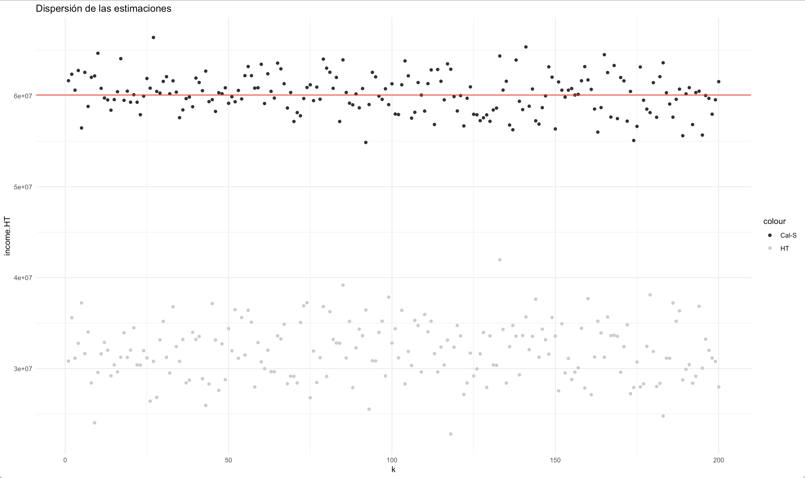
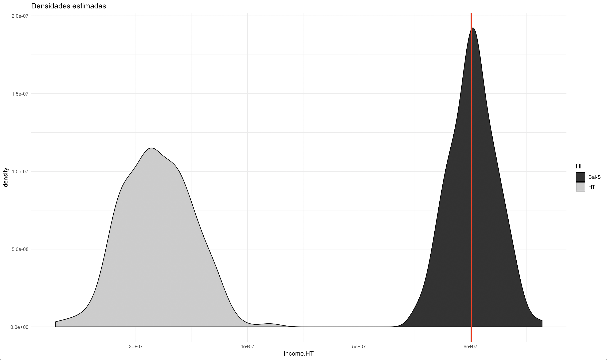

# Corrección de sesgos debidos a la ausencia de respuesta de unidad

En una encuesta la información auxiliar puede utilizarse en dos etapas: en la planeación del diseño de muestreo y en la escogencia del estimador. En el primer caso, es posible utilizar la información auxiliar para construir estratos, definir conglomerados, asignar los tamaños de muestra dentreo de los estratos, o incluso construir probabilidades de selección desiguales. De la misma forma, en el segundo caso, la información auxiliar puede utilizarse en la estimación de los parámetros de interés al definir nuevos ajustes de ponderación, al imponer restricciones de consistencia con la información auxiliar disponible a nivel de censos, registros o encuestas para que la distribución de la muestra expandida coincida plénamente con algunas características poblacionales. En este capítulo se aborda el uso de la información auxiliar en el estimador para corregir los sesgos generados por la ausencia de respuesta.
  
Como se ha expuesto anteriormente, la ausencia de respuesta a nivel de unidad puede tener consecuencias muy graves en la inferencia resultante de las encuestas de hogares, puesto que si el conjunto de respondientes tiene características distintas al conjunto de no respondientes, entonces se introducirá sesgo en la estimación de los parámetros de interés.

## Sesgo sobre los estimadores

Asumiendo que existe ausencia de respuesta en la muestra, considere la siguiente forma de estimar (ingenuamente) el promedio poblacional $\bar{y}_U$ mediante el estimador de Hájek

$$
\tilde{y}_s = \frac{\sum_{s_r}d_ky_k}{\sum_{s_r}d_k} = \frac{\hat{t}_y}{\hat{N}}
$$

Siendo $\bar{\phi}$ el promedio de las probabilidades de respuesta, el sesgo generado por la ausencia de respuesta puede cuantificarse de la siguiente manera:

$$
B\left(\tilde{y}_s\right)  = 
\frac{1}{N\bar{\phi}}\sum_U(y_k-\bar{y}_U)(\phi_k-\bar{\phi})
= \frac{Cov\left(\bar{y},\phi\right)}{\bar{\phi}}
= \frac{Cor\left(Y,\phi\right)S\left(Y\right)S\left(\phi\right)}{\bar{\phi}}
$$

En donde $Cov\left(Y,\phi\right)$ es la covarianza poblacional entre
los valores de la característica de interés y las probabilidades de respuesta,
$cor\left(Y,\phi\right)$ es el coeficiente de correlación poblacional
y $S\left(Y\right)$ es la desviación estandar poblacional de la variable objetivo. Dado que el valor del coeficiente de correlación está restringido
al intervalo $[-1, 1]$, el valor máximo del sesgo absoluto será igual a

$$
|B\left(\tilde{y}_s\right)| \leq 
\frac{S\left(\phi\right)S\left(y\right)}{\bar{\phi}}
= \frac{\left(1-R\left(\phi\right)\right)S\left(y\right)}{2\bar{\phi}}
$$

A pesar de que este límite superior no se puede calcular en situaciones prácticas, sí es posible estimarlo utilizando los datos de la muestra y las probabilidades
de respuesta estimadas. Nótese que si el mecanismo de ausencia de respuesta fuese MCAR, entonces el valor de $R\left(\phi\right)$ sería uno, y por consiguiente no habría sesgo. De la misma forma, en el caso extremo en el que la característica de interés fuese homogénea en toda la población, tampoco habría sesgo en el estimador, y bastaría con utilizar los datos de la muestra, sin ningún tipo de corrección.  

Además de las anteriores consideraciones, es posible evaluar las propuestas de escogencia de variables para calibración de @KaltonFloresCervantes_2003 y de @Sarndal_2011. En particular, este último autor considera un indicador del sesgo por ausencia de respuesta sobre los estimadores de calibración, cuya lógica se basa en que, en el mejor de los casos, en el que no hubiese errores de cobertura ni ausencia de respuesta, el estimador de expansión $\hat{t}_{y}$ sería insesgado y la distancia que habría entre este y el estimador de calibración $\hat{t}_{y,cal}$ se podría cuantificar como $\Delta_A = \frac{(\hat{t}_{y,cal} - \hat{t}_{y})}{N}$. Este indicador se sugiere como una posible herramienta para comparar potenciales variables de calibración, de tal forma que cuando el valor de $|\Delta_A|$ sea grande habría un indicio para preferir un vector de calibración sobre otro. Además, al estandarizarla, esta medida puede ser descompuesta en los siguiente tres factores:

$$\frac{\Delta_A}{S_y} = cv_g \ \times R_{y,\mathbf{x}} \ \times R_{D,C}$$

De esta forma, el primer factor representa el coeficiente de variación de los pesos $g_k$; el segundo factor al cuadrado es el coeficiente de determinación de una regresión múltiple entre la variable de estudio y las variables del vector de calibración; el úlitmo factor al cuadrado es el coeficiente de determinación (proporción de varianza explicada) en una regresión ponderada que pasa por el origen entre las desviaciones de las covariables $D_j = \hat{t}_{x} - t_x$ y las covarianzas de la variable de estudio y las covaraibles $C_j = cov(y, x_j)$.

## Soluciones 

Como se expuso en la sección anterior, si no hay correlación entre la variable de interés y la estructura de la ausencia de respuesta entonces no hay sesgo en los estimadores. Esto quiere decir que, si la probabilidad de respuesta es homogénea (representatividad fuerte) o pudiera modelarse (representatividad débil) para todos los individuos, entonces el sesgo se podría eliminar. En esta sección se explorarán dos caminos que, al incorporar información auxiliar, eliminan el sesgo causado por el fenómeno de la ausencia de respuesta.

Ambas opciones, ajuste de factores de expansión mediante modelos de *propensity score* y estimadores de calibración, descansan en el paradigma de la inferencia basada en el diseño de muestreo y por ende se contemplan como dos posibilidades atractivas que mantienen la buenas propiedades de la estimación directa en encuestas de hogares. 

### Propensity Score

Como se mencionó anteriormente, uno de los ajustes que se debe realizar en la generación de los ponderadores finales es la corrección por ausencia de respuesta. En donde

$$d_{4k} =  \frac{d_{3k}}{\hat{\phi_k}}$$

Nótese que, si el patrón de ausencia de respuesta es MNAR, entonces 

$$
\phi_k = f(\mathbf{y}_k, \beta)
$$

Y en este caso, como no es posible tener acceso a los determinantes de la respuesta (porque precisamente son las mismas variables de interés en la encuesta), entonces no es posible estimar el patrón de ausencia de respuesta. Por ende, en este escenario habrá sesgo siempre. Por el contrario, si el patrón de ausencia de respuesta es MCAR o MAR, entonces 

$$
\phi_k = f(\mathbf{x}_k, \boldsymbol{\beta})
$$ 

En este caso, si fuese posible tener acceso a las covariables $\mathbf{x}$ que determinan el mecanismo de respuesta, entonces es posible estimar las probabilidades de respuesta mediante 

$$
\hat{\phi}_k = f(\mathbf{x}_k, \hat{\boldsymbol{\beta}})
$$

Efectivamente, en el caso del estimador de Horvitz-Thompson, el sesgo del estimador se anula puesto que

\begin{align*}
E(\hat{t}_y) &= E\left(\sum_{k\in s_r}d_{3k}y_k\right) \\
&= E\left(\sum_{k\in s_r}\frac{y_k}{\pi_k \hat{\phi_k}}\right)\\
&= EE\left(\sum_{k\in U}\frac{y_k}{\pi_k \hat{\phi_k}}I_kD_k|I_k\right)\\
&= \sum_{k\in U}\frac{y_k}{\pi_k \hat{\phi_k}}E\left(I_k\right)E\left(D_k|I_k\right)\\
&= \sum_{k\in U}\frac{y_k}{\pi_k \hat{\phi_k}}\pi_k\phi_k = t_y
\end{align*}

Asumiendo que el modelo está bien establecido, entonces se tendrá una concordancia directa entre $\hat{\phi_k}$ y $\phi_k$; por lo tanto se anularían en la última ecuación anterior. Además, el insesgamiento viene supeditado puesto que,

$$
E(I_kD_k) 
= EE(I_kD_k|I_k) 
= E(I_k)E(D_k|I_k) = \pi_k \phi_k
$$

En resumen, si se tiene acceso a información auxiliar (contenida en el marco de muestreo o en otras preguntas de la encuesta), y si se considera que el mecanismo que genera la ausencia de respuesta en la encuesta de hogares es MAR o MCAR, es posible ajustar un modelo de *propensity score* para la ausencia de respuesta (en donde la variable dependiente es una variable indicadora de la respuesta del individuo por lo general supeditado a una distribución Bernoulli o Binomial).

### Calibración 

Como lo afirma @Sar08, la calibración provee una forma sistemática para involucrar la información auxiliar. En la mayoría de aplicaciones prácticas, la calibración provee un enfoque simple para incorporar esta información dentro de la etapa de estimación. La información auxiliar fue usada para mejorar la precisión de los estimativos mucho antes que el término calibración fuera popular. La calibración puede ser usada efectivamente en encuestas donde la información auxiliar está disponible en diferentes niveles. Por ejemplo, al realizar un muestreo en dos etapas la información auxiliar puede existir para las unidades de la primera etapa (los conglomerados) y puede existir otra información para las unidades de la segunda etapa (elementos o conglomerados).

Como se ha detallado con amplitud en este y los capítulos anteriores, la ausencia de respuesta de unidad tiene consecuencias dañinas en la inferencia con encuestas de hogares. En este caso es altamente recomendable que se implemente ajuste a los factores de ponderación de las unidades (hogares o personas). A pesar de que los modelos de *propensity score* tienen una larga trayectoria en el manejo de la ausencia de respuesta, la calibración utilizada para corregir estos sesgos ofrece una relativamente nueva perspectiva. Nótese que el estimador tradicional toma la siguiente forma:

$$
\hat t_y^* = \sum_{s_r} w_k\ y_k = \sum_{s_r} \frac{d_k}{\phi_k} y_k 
$$

Esta anterior expresión indica que implícitamente se genera un procedimiento en dos etapas en donde, en primer lugar, se calculan lo pesos básicos inducidos por el diseño de muestreo, luego se ajusta un modelo de *propensity score* para estimar las probabilidades de respuesta $\phi_k$. A esta estrategia generalmente se le agrega una tercera etapa en donde se crean nuevos pesos calibrados con respecto a proyecciones demográficas post-censales, como por ejemplo los cruces entre edad, sexo y región. Al ajustar los pesos para que sumen exactamente la cifra de las proyecciones censales, se reduce el sesgo de subcobertura.

@Sar08 afirma que la práctica general es asumir que el estimador $\hat t_y^*$ es insesgado, cuando en realidad no lo es, puesto que no es posible conocer todos los determinantes del mecanismo de respuesta para ajustar el modelo que estima las probabilidades de respuesta. Además, de la sección anterior se deduce que este supuesto implica que se considere que $\pi_k \hat\phi_k$ es la verdadera probabilidad de inclusión de la unidad, cuando en realidad no es así. Por lo tanto, realizar un ajuste a los factores de expansión únicamente basados en los modelos de *propensity score* traerá inevitablemente una cierta cantidad de sesgo en la estimación de los parámetros en las encuestas de hogares.

Bajo este escenario, el enfoque de calibración doble surge como un proceso metodológico adicional que pretende corregir estos sesgos. En este proceso es necesario contar con dos tipos de información auxiliar. En un lado tendremos la información nacional usual que se utiliza para calibrar los factores de expansión en un levantamiento regular. Las variables que intervienen en esta calibración las notaremos como $\boldsymbol{x}_{1k}$. Por otro lado deberemos tener acceso a información auxiliar en la muestra original (que incluye a las unidades respondientes y no respondeintes) y que notaremos como $\boldsymbol{x}_{2k}$. Por lo tanto, es posible calibrar los pesos en la muestra de respondientes ($s_r$) a nivel de la información auxiliar disponible en la muestra original ($s$), y luego a nivel nacional ($U$) o por los estratos de interés. 

Si el mecanismo que genera la ausencia de respuesta es MAR o MCAR, es posible que los ponderadores de calibración eliminen el sesgo en las estimaciones finales si es que las variables que generan este mecanismo se han calibrado en alguno de las dos niveles mencionados. @Sarndal_Lundstrom_2006 proponen que, para lograr este objetivo, se encuentre un primer conjunto de pesos calibrados sujetos a la siguiente restricción:

$$
\sum_{s}w_{1k}\boldsymbol{x}_{1k} = \sum_{U}\boldsymbol{x}_{1k}
$$

Luego, en una segunda etapa, se deben usar estos pesos intermedios $w_{1k}$ para calcular los pesos finales de calibración $w_{k}$ de la muestra telefónica que están sujetos a la siguiente restricción:

$$
\sum_{s_t}w_{k}\boldsymbol{x}_{2k} = \sum_{s_m}w_{1k}\boldsymbol{x}_{k} = 
\begin{pmatrix}
\sum_{U}\boldsymbol{x}_{1k}\\
\sum_{s_t}w_{1k}\boldsymbol{x}_{2k}
\end{pmatrix}
$$

En este sentido, nótese que la forma funcional de los pesos de calibración se puede escribir de la siguiente manera:

$$
w_k = d_k \times g_k  \cong d_k \times \hat \phi_k
$$

Por ende, bajo el raciocinio de la calibración, los pesos $g_k$ se pueden ver como una estimación de las probabilidades de respuesta $\phi_k$. Por otra parte, de las expresiones, sobre el sesgo de los estimadores que no contienen ningún tipo de corrección, se puede notar que el sesgo se propaga a través de las variables de la encuesta y se propaga con más fuerza en las variables correlacionadas con los determinantes de la ausencia de respuesta. 

Para mostrar cómo el ajuste a los factores de expansión, con las dos metodologías anteriormente mencionadas, inducen menor sesgo que los estimadores comunes, se planeó el siguiente experimento:

1. Se generó una población compuesta por individuos con diferente propensión de respuesta MCAR.
1. Se utilizaron metodologías de calibración y se comparó, de forma empírica, el efecto de la ausencia de respuesta sobre las estimaciones finales.

En primera instancia, cabe mencionar que la población se definió a partir del ingreso del ingreso del hogar, y se creó usando variables auxiliares disponibles (sexo). De esta forma, se le dio una probabilidad de respuesta diferencial entre los grupos correspondientes al cruce de las categorías de estas dos variables. Como resultado de las simulaciones, se generaron estimaciones para el estimador de Horvitz-Thompson sin ajuste de ningún tipo y para un estimador de calibración que tuvo en cuenta los conteos poblacionales censales para cada las dos categorías de la variables sexo. La siguiente figura muestra el comportamiento de ambas estimaciones. La línea roja refleja el parámetro desconocido, los puntos negros indican las estimaciones del estimador de calibración en cada iteración de la simulación, mientras que los puntos grises muestran las estimaciones del estimador de Horvitz-Thompson en cada iteración de la simulación

En conjunto con la gráfica anterior, la siguiente figura muestra la distribución sesgada del estimador de Horvitz-Thompson (gris) en comparación con el insesgamiento del estimador de calibración (negro). Bajo este esquema de respuesta, incluir en la calibración las variables pertinentes corrige el sesgo generado por la ausencia de respuesta. En particular, el estimador ingenuo mostró sesgo en los tamaños estimados de hombres y mujeres, en el tamaño estimado de la población, en los ingresos estimados de hombres y mujeres y en los ingresos estimados de la población.

Como se mencionó anteriormente, hay mejores formas de calibrar, puesto que el problema de la calibración se reduce a cómo introducir la información auxiliar en la estructura de estimación de la encuesta, es posible que existan variables que reduzcan el sesgo, pero no todas las variables inducirán el mismo nivel de precisión. Al momento de escoger, se deberían seleccionar aquellas variables que reduzcan el sesgo y que además reduzcan la varianza. Por tanto, las variables auxiliares que se usen como insumo en los procesos de calibración deben:

- Ser capaces de explicar la variación de la probabilidad de respuesta.
- Estar correlacionadas con las variables de interés.
- Identificar los dominios de estimación más importantes.

En particular al introducir otras covariables en la calibración (grupo de edad, escolaridad, región, área), además de la corrección del sesgo se evidencia un aumento de la precisión en las nuevas estimaciones, tal como lo muestra las distribuciones de los estimadores en la siguiente figura, en donde se consideran tres estimadores: el estimador de Horvitz-Thompson (gris claro), el estimador de calibración con restricción de sexo (negro) y el estimador de calibración con todas las restricciones (gris oscuro).

## La pandemia por COVID-19 y la ausencia de respuesta por unidad

En su intento por frenar la velocidad de contagio del COVID-19, los gobiernos de la región determinaron la imposición de restricciones de movilidad que truncaron la recolección presencial de las encuestas de hogares. Para hacer frente a este inconveniente y poder seguir produciendo estadísticas oficiales pertinentes y oportunas, la mayoría de INE en la región decidieron realizar el seguimiento continuo a un panel seleccionado de un periodo reciente y mediante contacto telefónico seguir con la recolección de la información primaria. Uno de los retos más importantes que esta pandemia le impuso a las oficinas nacionales de estadística es la corrección del sesgo de selección en las encuestas de hogares. A pesar de los ingentes esfuerzos que se hacieron por minimizarlo durante la recolección, lo cierto es que cambiar de un modo presencial a un modo telefónico trae consigo consecuencias indeseadas que se pueden enfrentar con algunas de las metodologías que se explicaron en esta sección. 

Es cierto que es un buen punto de partida para las ONE poder contar con una muestra probabilística de meses anteriores y conformar con ella un panel de seguimiento durante el periodo en el que se tengan estas restricciones de movilidad. En términos de notación, llamémosla la muestra maestra. Sin embargo, se debe tener en cuenta los siguientes dos aspectos importantes:

1. No todos los hogares seleccionados de forma probabilística proveyeron su información de contacto telefónico. 
2. No todos los hogares contactables respondieron el cuestionario de la encuesta. 

Haciendo cálculos gruesos, si suponemos que la cobertura de la submuestra que sí proveyó datos de contacto asciende al 85 % y que la probabilidad de que un hogar contactado responda toda la encuesta es del 80 %, entonces contaríamos solamente con un 68% de la muestra original. A estas cuentas habría que ajustarlas con el efecto de la atrición en el panel, que crece a medida que se siga utilizando. En estos términos, sería un grave error y una suposición poco plausible asumir que los hogares respondientes efectivos se comportan de manera similar a los hogares no respondientes y a los hogares no cubiertos. El mejor escenario que pueden plantearse es considerar que la muestra efectiva no está libre de sesgos, hacer una búsqueda exploratoria de su magnitud con los datos recolectados y tratar de minimizarlo (o incluso eliminarlo) utilizando alguna de las técnicas estadísticas que mencionamos en este documento. 

La figura 1 presenta tres posibles escenarios que los INE pudieron encontrar en esta búsqueda. En el diagrama de la izquierda se verifica la ausencia de sesgo, en el diagrama del centro y en el de la derecha se confirma que la magnitud del sesgo es significativa. Nótese que la línea horizontal azul correspondería a la estimación publicada en el mes en el que se seleccionó la muestra maestra, mientras que la línea roja horizontal representa el promedio de las simulaciones con la muestra efectiva. Cada uno de los resultados de las simulaciones está representado por las fluctuaciones punteadas.

La siguiente figura muestra un escenario simulado en donde se contempla el uso del estimador ajustado con la técnica de *propensity score* (línea verde) y el estimador de calibración en dos etapas (línea azul) comparado con el estimador sin ningún tipo de ajuste (línea negra). Lo que se esperaría es que es estimador ingenuo subestime los tamaños poblacionales y los indicadores de interés; mientras que los estimadores ajustados, siempre que el mecanismo de ausencia de respuesta sea MAR o MCAR, elimina este sesgo. 

Los caminos que se deben seguir luego de corroborar la presencia (o ausencia) de sesgo dependerán de la estrategia de levantamiento de información que los países hayan decidido hacer. En el escenario más optimista, ante la ausencia de sesgo, la ONE estaría en una buena posición para replicar los procesos usuales de inferencia. Sin embargo, si se sospecha de que sí existe sesgo, y dependiendo de la información auxiliar disponible, los INE pudieron disponer de las alternativas que se describen a continuación. 

#### Propensity score {-}

Como se mencionó anteriormente, muchos países de la región decidieron realizar un seguimiento mensual telefónico a la muestra maestra como alternativa a las restricciones de movilidad que se han impuesto en los países y que impiden la recolección presencial de la información. En este caso, partiendo de una muestra probabilística se pueden realizar ajustes a los factores de expansión de manera diferencial. 

En particular, tener una muestra maestra para la cual se obtuvo toda la información del cuestionario en un periodo anterior constituye un excelente punto de partida para tratar de eliminar el sesgo, puesto que se tendrá acceso a todo un conjunto de covariables $\mathbf{x}$ que determinarán el mejor modelo para estimar el patrón de ausencia de respuesta en la muestra de respondientes efectivos.

En este paso se debe asumir que la probabilidad de respuesta depende de alguna combinación lineal de las covariables en la muestra maestra; es decir que el mecanismo que genera esa ausencia de respuesta se puede describir mediante $\mathbf{x}$. Teniendo en cuenta que los pesos originales de la encuesta telefónica se denotan como $d_k$, y habiendo estimado $\hat\phi_{k}$ para respondientes y no respondientes de la muestra telefónica, entonces el factor de expansión ajustado tomaría la siguiente forma

$$
w_k = \frac{d_k}{\hat{\phi}_k}
$$

En este sentido, utilizar el factor de expansión $w_k$ minimizaría el sesgo de selección que se generó por el cambio de modo en la recolección de la información. Por ejemplo, podríamos considerar que un buen modelo de *propensity score* contemplase la edad, el nivel educativo, el área de residencia (rural/urbano), el sexo del respondiente, la región geográfica, el estado de ocupación en el mes de observación de la muestra maestra y el ingreso percápita del hogar. Nótese que todas las covariables en el modelo, salvo el área y la región geográfica, necesariamente provienen de las observaciones obtenidas en la muestra maestra.

#### Calibración en dos etapas {-}

La coherencia entre las cifras oficiales ya publicadas y las que la encuesta telefónica puede producir hace que sea preferible el uso de los estimadores de calibración, o al menos que se complemente. Al usar este enfoque se asegura una estructura inferencial robusta en presencia de la información disponible puesto que se reduce tanto el error de muestreo (aumentando la precisión) como el error debido a la ausencia de respuesta (eliminando el sesgo). A manera de ejemplo, podríamos considerar que la siguientes dos etapas de la calibración son suficientes para eliminar el sesgo generado por el cambio de modo de recolección:

- En la primera etapa se calibran los pesos de la muestra maestra usando las variables de edad, región, área y sexo, definidas convenientemente en en $\boldsymbol{x}_{1k}$. Los totales de estas variables se encuentran en los conteos censales o en su defecto, en las proyecciones demográficas.
- En una segunda etapa se calibrarán los pesos de la muestra telefónica usando las anteriores variables $\boldsymbol{x}_{1k}$ y además las variables de ingreso percápita, condición de ocupación, rama de actividad y escolaridad, definidas convenientemente en en $\boldsymbol{x}_{2k}$.  Los totales de estas variables fueron estimados en la misma publicación de la encuesta basada en la muestra maestra.

