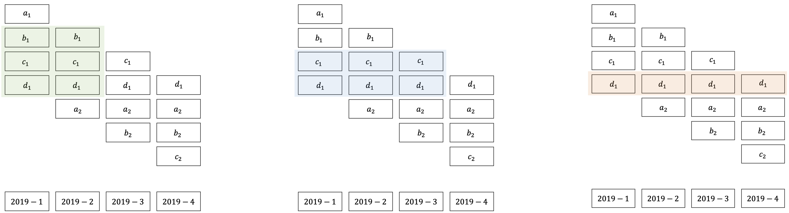
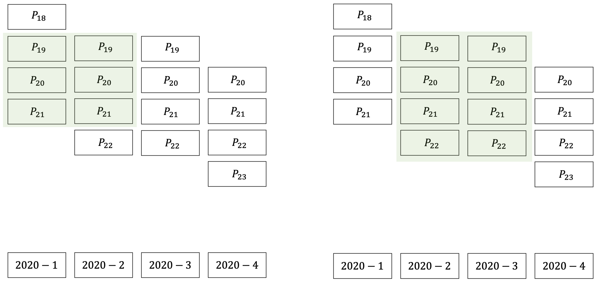
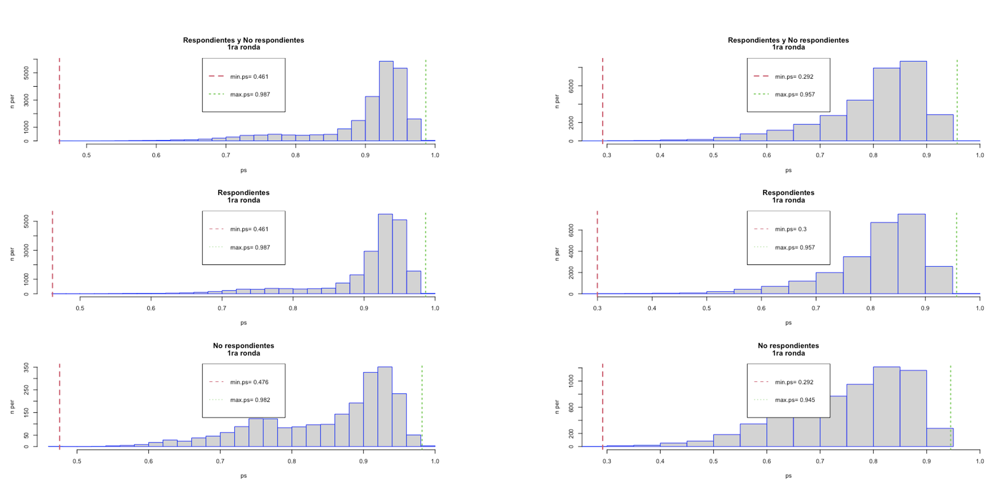
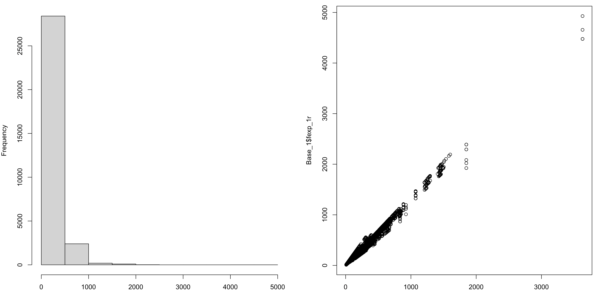

# Procesamiento longitudinal de las encuestas rotativas

Para algunos INE puede ser necesario contar con una estructura de ponderación longitudinal que le permita a las áreas de análisis producir estadísticas basadas en el seguimiento continuo a los hogares, afianzándose en el esquema de rotación de las encuestas. Para establecer los pasos que se requieren en la creación de un sistema de pesos longitudinales, primero es necesario definir qué es una encuesta longitudinal y más precisamente cómo las encuestas continuas con levantamientos transversales, puede tornarse en encuestas longitudinales. 

@Lynn_2009 plantea que una encuesta longitudinal es aquella que recolecta los datos de los mismos elementos muestrales en múltiples ocasiones a través del tiempo. Por ejemplo, una encuesta trimestral con un esquema rotativo 4(1)0 permitiría realizar observaciones continuas en el 25% de las viviendas durante todo un año. Cuando se requiere la generación de un sistema de ponderación longitudinal es necesario centrar la atención en la estimación del cambio del indicador en dos periodos de tiempo consecutivos, y su correspondiente estimación de la varianza. Cabe resaltar que este proceso debe tener en cuenta que las muestras no son independientes y por lo tanto se debe calcular la varianza de la primera ronda, la varianza de la segunda ronda y la correlación entre las dos rondas de interés. Estos tres componentes deben intervenir en el cálculo de los coeficientes de variación, así como en la determinación del tamaño de muestra en cada ronda.

Asimismo, con el análisis de los datos longitudinales es posible hacer otro tipo de análisis como por ejemplo: 

* Inferencia sobre la caracterización de las unidades observacionales que han cambiado de un estatus o otro: desde las bases de datos longitudinales es posible determinar las características de los hogares o personas que han sufrido algún cambio en las variables de interes. Por ejemplo, es posible determinar las características de los hogares que han salido (o entrado) de (a) la pobreza extrema, sin importar si se muestra un cambio neto significativo en el periodo de estudio.
* Inferencia acerca de la estabilidad (o inestabilidad) de características de interés sobre las observaciones longitudinales: combinando varios periodos de seguimiento es posible detectar que algunas unidades observacionales experimentan periodos de estabilidad (o fluctuación) sobre el fenómeno de interés. Por ejemplo, el análisis de este tipo de problemáticas puede propiciar un mejor entendimiento de las situaciones que confluyen para que un hogar entre a la pobreza extrema y se mantenga en ese estado por un periodo determinado.
* Caracterización de los eventos y fenómenos: con las encuestas longitudinales es posible entender a profundidad la duración de los periodos en los que una unidad observacional cambia de un estado a otro y persiste en este último. Por ejemplo, entrar a la pobreza, entrar a la inactividad económica, entrar a la desocupación, abandonar la educación, entre otros.
* Análisis de impactos, efectos y relaciones causales: los datos longitudinales pueden usarse muy efectivamente a la hora de establecer relaciones causales entre una intervención y un fenómeno de interés. Por ejemplo, es posible evaluar la magnitud del impacto que la pandemia por COVID-19 trajo sobre la tasa de desocupación y sus efectos a lo largo del año. 

## Diseño de paneles rotativos en las encuestas de la región

Algunas encuestas de hogares en América Latina permiten que un hogar sea visitado en más de una ocasión con el fin de tener estimaciones precisas acerca de los cambios de estado que el hogar o las personas que lo habitan puedan sufrir. Por ejemplo, en las encuestas de fuerza laboral, una persona puede pasar de estar ocupada en un periodo a inactiva en el siguiente periodo. Estos cambios y la dinámica propia que conllevan son de interés para los investigadores y deben ser contemplados desde una perspectiva más amplia en cuanto a su diseño. Nótese que este tipo de variaciones sobre los individuos es captada a través del componente longitudinal de la encuesta, constituido por los respondientes efectivos que fueron observados de forma sistemática en los periodos de interés.

Por ejemplo, la Encuesta Continua de Empleo (ECE), aplicada por el Instituto Nacional de Estadística de Bolivia, hace uso de una metodología mixta que permite el seguimiento continuo y transversal a la tasa de desocupación y a la tasa de subocupación, así como el seguimiento a los cambios que se presentan entre los periodos de interés (trimestres y semestres), a través del análisis longitudinal de los datos en el sector urbano (pues el diseño no es rotativo en el sector rural, debido a la baja incidencia de desempleo en esta zona). La ECE cuenta con un esquema rotacional 4(0)1, en donde una vivienda es entrevistada durante cuatro trimestres consecutivos, y luego sale del panel definitivamente. Un ejemplo de este tipo de esquemas se presenta en el siguiente cuadro. 

| Año  	| Trimestre 	| Panel 1  	| Panel 2  	| Panel 3  	| Panel 4  	|
|------	|-----------	|----	|----	|----	|----	|
| 2019 	| T1        	| $A$ 	| $B$ 	| $C$ 	| $D$ 	|
|      	| T2        	| $B$ 	| $C$ 	| $D$ 	| $E$ 	|
|      	| T3        	| $C$ 	| $D$ 	| $E$ 	| $F$ 	|
|      	| T4        	| $D$ 	| $E$ 	| $F$ 	| $G$ 	|
Table: *Rotación de páneles para un diseño 4(0)1.*

Nótese que entre el primer y el segundo periodo de medición hay un traslape del 75% de hogares. En particular, entre 2019-T1 y 2019-T2, la muestra se conserva en tres cuartas partes puesto que $B$, $C$ y $D$ se repiten. Esto mismo sucede en cada trimestre del esquema rotacional. Por otro lado, entre el primer y el tercer periodo habrá un traslape del 50%. Nótese que entre 2019-T1 y 2019-T3, la mitad de la muestra se conserva puesto que $C$ y $D$ se repiten. Este mismo patrón se encuentra a lo largo del esquema rotacional. Además, entre el primer y el cuarto periodo se tendrá un 25% de traslape. Nótese, por ejemplo, que entre 2019-T1 y 2019-T4, $D$ se repite. Finalmente, entre el primer trimestre de 2019 y el primero de 2020 no se tiene ningún tipo de traslape. 

Sin embargo, debido a la pandemia por COVID-19, el año 2020 fue un año atípico para los levantamientos de las encuestas de hogares en los INE de la región.  puesto que la crisis de salud trajo consigo muchos retos en términos de la consecución de la información primaria. Debido a las restricciones de movilidad que los gobiernos tuvieron que imponer para hacerle frente a la pandemia, en algunos trimestres se optó por replicar el mismo esquema de trimestres anteriores. En nuestro ejemplo, no se incluyó el 25% adicional que se tenía planeado, sino que la muestra fue exactamente la misma que en el primer trimestre. Además, cabe resaltar que en casí toda la región, la muestra de hogares se contactó, no de manera presencial, sino telefónica, disminuyendo la tasa de cobertura y de respuesta efectiva. 

| Año  	| Trimestre 	| Panel 1  	| Panel 2  	| Panel 3  	| Panel 4  	|
|------	|-----------	|----	|----	|----	|----	|
| 2020 	| T1        	| $E$ 	| $F$ 	| $G$ 	| $H$ 	|
|      	| T2        	| $F$ 	| $G$ 	| $H$ 	| $I$ 	|
|      	| T3        	| $F$ 	| $G$ 	| $H$ 	| $I$ 	|
|      	| T4        	| $G$ 	| $H$ 	| $I$ 	| $J$ 	|
Table: *Rotación de páneles en el diseño 4(0)1 para 2020.*

En este ejemplo, el traslape de la muestra de hogares entre el primer y el segundo trimestre de 2020 fue completo. Sin embargo, sí se presentaron variaciones significativas en las tasas de respuesta de ambos periodos puesto que en el primer trimestre la recolección de la información fue presencial, mientras que a partir del segundo trimestre fue telefónica. Además, entre el primer y el tercer trimestre del 2020 hubo un 75% de traslape; mientras que entre el primer trimestre y el último del 2020 hubo un 50% de traslape.

La figura anterior ejemplifica tres esquemas longitudinales que pueden ser creados para el año 2019. El primero de ellos (a la izquierda de la figura) representa la combinación del primer y segundo trimestre, que se define a través de la agregación de las dos mediciones en el primer y segundo trimestre de los paneles $b_1$, $c_1$ y $d_1$. El segundo esquema (centro) muestra la combinación de los primeros tres trimestres del año, definidos por los paneles $c_1$ y $d_1$. Por último, la base longitudinal anual parte de la combinación de las cuatro mediciones del panel $d_1$. 

## Generación de bases longitudinales para dos periodos consecutivos

El análisis longitudinal de las encuestas de hogares es un insumo valioso en la toma de decisiones puesto que permite obtener proveer una visión complementaria a los fenómenos sociales que no se puede obtener por otros medios. El seguimiento continuo a las unidades de observación no puede ser llevado a cabo en todas las encuestas continuas de la región, sino solamente en aquellas que contemplen esquemas rotativos en su planificación. Dado que en algunas encuestas, se contempla la asignación de la muestra a diferentes grupo de rotación, es posible analizar el comportamiento de los flujos brutos sobre indicadores tan importantes como los relacionados a la situación en la ocupación, la pobreza, entre otros.

El objetivo de esta sección es generar pesos longitudinales para todos los individuos pertenecientes a los paneles incumbentes de la muestra original en los dos primeros trimestre del 2020. Siguiendo la metodología de @Verma_Betti_Ghellini, es necesario seguir un procedimiento secuencial para la creación de los factores de expansión en el panel. En este orden de ideas, primero es necesario crear el conjunto de pesos iniciales (trasnversales en el primer periodo) para luego definir los pesos finales (longitudinales en el primer y segundo periodo). A continuación se resume el procedieminto:

1. Creación de pesos iniciales: teniendo en cuenta los pormenores del diseño de muestreo, la ENE selecciona una muestra de hogares y de personas que son miembros de estos hogares. Las ponderaciones iniciales se definen a partir de los factores de expansión transversales. Este proceso plantea al menos los siguientes pasos:
    - Determinación de los pesos básicos con el ajuste de selección de paneles rotativos.
    - Ajuste por ausencia de respuesta y cobertura.

2. Generación de los pesos longitudinales: la muestra debe ser modificada y ajustada para que refleje los cambios en la duración del panel para la población objetivo en los dos periodos de interés. En este caso se plantean al menos tres tipos de ajuste:
    - Definición de la población longitudinal (supeditada a los hogares que salen y entran en el periodo de referencia).
    - Ausencia de respuesta y pérdidas en la muestra debido a la atrición.
    - Calibración de los pesos logitudinales.
    
El primer paso en la generación de los pesos longitudinales consiste en realizar una consolidación de bases de datos, en donde se integren únicamente los periodos de interés. Es decir que este proceso producirá resultados diferentes para dos periodos, tres o cuatro. En general, se esperaría contar con un mayor número de unidades observacionales en el primer caso (dos periodos) y un número menor de unidades observacionales en el último caso (cuatro periodos). Nótese que en el caso particular de las encuestas con un esquema rotativo 4(0)1, no es posible realizar la integración de cinco periodos consecutivos, puesto que el esquema solo define el traslape de hasta cuatro periodos consecutivos. La siguiente gráfica muestra todas las posibilidades de bases de datos longitudinales resultantes que se pueden definir a partir de un esquema de rotación 4(0)1.

En general, es necesario asumir que al combinar los paneles y crear una sola base de datos, se está agregando información (puesto que se repiten las mediciones de los individuos pertenecientes a los paneles involucrados), pero al mismo tiempo se reduce el número de unidades observacionales (puesto que el número de individuos en la muestra que coinciden en los periodos de interés necesariamente es menor al número de individuos en la muestra de un corte transversal). 

### Creación de los pesos iniciales

Este primer paso empieza con la definición de los periodos consecutivos que se utilizarán en la combinación de las bases de datos. Se debe tener en cuenta que hubo un cambio abrupto que se presentó como respuesta a las restricciones de movilidad que trajo la pandemia, que a su vez configuró un cambio en el modo de recolección (de presencial a telefónico) a partir del segundo trimestre del 2020. Por ende, la muestra y los paneles de seguimiento son idénticos en el segundo y el tercer periodos del año 2020. 

Una vez definidos los periodos de interés, se debe realizar la combinación de las correspondientes bases de datos transversales. Este procedimiento debe tener en cuenta únicamente a las unidades muestrales que respondieron sistemáticamente en cada uno de los periodos de interés. En el escenario de la combinación de dos periodos, si una unidad respondió en ambos periodos será incluida en la base de datos combinada, de lo contrario (si respondió en el primer periodo, pero no en el segundo y viceversa) no será incluida en la base de datos.

#### Pesos básicos {-} 

La determinación de los pesos iniciales viene supeditada a los pesos básicos ajustados por cobertura $d_{1, k}$ del procesamiento transversal del primer trimestre que se quiere combinar. Por ejemplo, el primer escenario de la figura anterior resalta que se quiere combinar el primer trimestre con el segundo trimestre del 2020; en este caso se partiría de los pesos básicos ajustados por cobertura del primer trimestre del 2020. En el segundo escenario se combinan el segundo y el tercer trimestre del 2020, por tanto se partiría de los pesos básicos ajustados por cobertura y ausencia de respuesta del segundo trimestre del 2020.

En general, dado que cada panel es representativo del país y, se supone que debe tener las mismas características al momento de la selección, @LaRoche_2003 plantea que los pesos básicos se crean a partir del inverso de la probabilidad de inclusión de los paneles, así:

$$
d_{1, k}^{básico} = \frac{d_{1, k}}{Pr(\text{selección de paneles})}
$$

Al realizar la combinación de los dos primeros trimestres del 2020 en nuestro ejemeplo es evidente que hay tres paneles coincidentes y como la muestra transversal contiene cuatro paneles, entonces $Pr(\text{selección de paneles}) = \frac{3}{4}$. En cambio, por las condiciones asumidas para enfrentar la pandemia, cuando se realiza la combinación del segundo y tercer trimestre en el ejemplo se tiene que $Pr(\text{selección de paneles}) = \frac{4}{4} = 1$.

Es importante notar que al combinar paneles, la inferencia que se realiza está supeditada al periodo del primer panel. Además, en este paso es indispensable corroborar que la suma de los pesos básicos esté cercana al tamaño de la población que se quiere representar. Es decir, $\sum_{s^{(1)}} d_{1, k}^{básico} \approxeq N$; en donde $s^{(1)}$ se define como el conjunto de respondientes en el primer periodo que pertenecen a los paneles coincidentes en la muestra para los periodos combinados.

#### Ajuste por ausencia de respuesta {-}

A continuación, sobre los pesos básicos es necesario realizar un ajuste por ausencia de respuesta, que debería estar supeditado a las covariables disponibles en el marco de muestreo, en registros administrativos o, teniendo en cuenta el diseño de muestreo rotativo, en rondas anteriores de la misma encuesta. En general, es recomendable tener en cuenta el paradigma principal en el manejo de la ausencia de respuesta, el cual indica que respondientes y no respondientes difieren en la mayoría de los casos. Por supuesto, aquellas unidades que no respondieron deberán ser excluidas de la base de datos puesto que su peso de muestreo es nulo; es decir $d_{1, k}^{básico} = 0, \ \forall k \notin s_r^1$, en donde el conjunto $s_r^1$ representa a las unidades que respondieron la encuesta en el primer periodo de la combinación. 

En este esquema, es posible utilizar un enfoque basado en la estimación de las probabilidades de respuesta de cada individuo para ajustar los pesos básicos, para lo cual se necesita establecer una relación entre las unidades que respondieron y que no respondieron con las covariables auxiliares $\mathbf{x}_{1}$. En otras palabras, es necesario asegurar que las covariables estén disponibles para toda unidad seleccionada en el primer periodo de interés, independientemente de su respuesta final. Para el manejo efectivo de la ausencia de respuesta se consideran las variables dicotómicas $I_{1, k}$ y $D_{1, k}$, que indican si el hogar pertenece a la muestra del primer periodo y si respondió a la encuesta, respectivamente. La probabilidad de respuesta estará supeditada al siguiente modelo:

$$
\phi_{1, k} = Pr(D_{1, k} = 1|I_{1, k} = 1) = f(\mathbf{x}_{1}, \boldsymbol\beta)
$$

En la notación anterior, el conjunto de respondientes efectivos se define como aquel al que pertenecen las unidades muestrales que han respondido en el primer periodo de interés; además la función de enlace $f$, es por lo general no lineal y su escogencia depende del investigador. Por otro lado, si se decide utilizar un modelo de regresión logística, entonces la estimación de las probabilidades de respuesta tendrá la siguiente forma:

$$
\hat{\phi}_{1, k} = \frac{\exp{(\mathbf{x}_{1}' \hat{\boldsymbol\beta})}}{1 +\exp{(\mathbf{x}_{1}' \hat{\boldsymbol\beta})}}
$$

Una vez que se ha modelado la ausencia de respuesta, los pesos básicos son ajustados utilizando el inverso de la probabilidad de respuesta sobre los respondientes efectivos en el primer periodo de interés, así se conforma el primer conjunto de pesos iniciales de las bases de datos longitudinales:

$$
d_{1, k}^{inicial} = \frac{d_{1, k}^{básico}}{\hat{\phi}_{1, k}}
$$

Siempre es muy importante realizar una validación exhaustiva de los modelos utilizados para estimar la probabilidad de respuesta. En general, es necesario que el modelo satisfaga las siguientes dos condiciones:

1. *Soporte común*: al igual que en un experimento aleatorizado, es necesario garantizar que ninguna combinación de las covariables induzca un estado (respuesta o ausencia de respuesta) de forma determinística. Es decir sobre todas las combinaciones en las covariables deben existir respondientes y no respondientes. Esta condición se puede escribir como:
$$
0 < Pr(D_{1,k} = 1 |\mathbf{x}_{1}) < 1 
$$
2. *Balanceo*: como la respuesta de las unidades de muestreo no provienen de un estudio aleatorizado, es necesario garantizar que la distribución de las $\hat\phi_k$ sea similar entre respondientes y no respondientes. De esta forma, es posible expandir el subconjunto de respondientes efectivos $s_r^1$ a la muestra inicial (que incluye no respondientes) $s$, que a su vez expande a toda la población de interés. Esta condición se puede escribir como:

\begin{align*}
\hat\phi_{1, k} &= Pr[D_{1, k} | I_{1, k} = 1,\mathbf{x}_{1}] \\
&= Pr[D_{1, k} | k \in s_r^1, I_{1, k} = 1, \mathbf{x}_{1}] \\
&= Pr[D_{1, k} | k \notin s_r^1, I_{1, k} = 1, \mathbf{x}_{1}]
\end{align*}

Por último, se debe corroborar que la suma de los pesos ajustados por la ausencia de respuesta esté cercana al tamaño de la población que se quiere representar. Es decir, $\sum_{s^{(1)}} d_{1, k}^{inicial} \approxeq N$.

Es posible que, al construir la matriz de covariables para ajustar el modelo de respuesta, existan elementos que no respondieron en el primer periodo y que además no tengan información auxiliar porque su panel rotativo no se traslapa. En este caso, es posible calcular la tasa de respuesta efectiva y utilizarla como valor imputado a la probabilidad de respuesta $\hat\phi_{1, k}$. También existen unidades que se acaban de incorporar al panel rotativo y por ende no respondieron y no tienen información auxiliar. En este caso, es necesario imputarles el factor de expansión ajustado del hogar al que pertenecen.

La siguiente figura muestra la distribución de las probabilidades de respuesta para las combinaciones de los dos primeros trimestres del 2020 (izquierda) y del segundo y tercer trimestre (derecha). En general, se nota un buen balance entre respondientes y no respondientes, pues las tres distrtibucuiones son similares en ambos gráficos. Además, el soporte común de la probabilidad de respuesta excluye al cero y al uno, como se muestra en la siguiente figura.

### Generación de los pesos longitudinales

#### Definición de la población longitudinal {-}

La población longitudinal está supeditada a todas aquellas unidades que han permanecido en la población de interés entre el primer y el segundo periodo; en el caso de la ENE la población longitudinal del primer semestre del 2020 serían todas las personas que estuvieron en la población objetivo del primer periodo y que han permanecido en la población hasta el segundo periodo, inclusive. 

Por supuesto, es necesario tener en cuenta que entre ambos periodos pueden haber ocurrido cambios en la población, como personas que han dejado de pertenecer a la población objetivo (por diversos motivos como la muerte, reclutamiento, internamiento en alguna institución, migración, entre otros). Siendo así, la población de interés en el segundo periodo sí contiene a las personas que han entrado (nacimientos, migración, licenciamiento de alguna institución, etc.) a conformar la población de interés desde el primer periodo, mientras que la población longitudinal no los contiene.

Es en esta segunda instancia en donde nacen los pesos definitivos y se construye la base longitudinal que será usada para realizar los análisis de interés. En primer lugar, se define la muestra longitudinal $s^{(2)}$como aquella constituida por las unidades seleccionadas en ambos periodos de interés para los paneles coincidentes; es decir, por la intersección de las muestras transversales del primer periodo $s^1$ y el segundo periodo $s^2$:

$$
s^{(2)} = s^1 \boldsymbol\cap s^2
$$

La muestra $s^{(2)}$ es representativa de la población longitudinal en los dos periodos combinados. En esta etapa, el factor de expansión longitudinal se define como idéntico al peso resultante de la sección anterior; es decir $d_{2, k}^{inicial} = d_{1, k}^{inicial}$.

#### Ausencia de respuesta y atrición {-}

La conformación de la base de datos longitudinal parte de los pesos iniciales creados en la sección anterior. Sin embargo, hay que tener en cuenta que existirán unidades que no respondieron en alguno de los periodos de la combinación. En general, se forman tres subconjuntos de no respondientes; el primero conformado por las unidades que sí respondieron en el primer periodo y que no respondieron en el segundo, el segundo definido por las unidades que no respondieron en el primer periodo y que sí respondieron en el segundo, el tercero conformado por las unidades que no respondieron en ninguno de los periodos. En cualquiera de los anteriores casos es necesario identificar estas unidades a las cuales se le asignará un peso longitudinal nulo; es decir 

\begin{equation*}
d_{2, k}^{inicial} =
\begin{cases}
d_{1, k}^{inicial}, &\ \forall k \in s_r^{(2)}  \\
0, &\ \forall k \notin s_r^{(2)}
\end{cases}
\end{equation*}

En donde el conjunto $s_r^{(2)} = s_r^1 \boldsymbol\bigcap s_r^2$ representa a las unidades que respondieron la encuesta en ambos periodos de la combinación, es decir a todas las unidades respondientes en $s^1$ que a la vez respondieron en $s^2$. El raciocinio detrás de esta determinación es que, para todo efecto práctico de comparación entre periodos, los diseños de muestreo de las encuestas rotativas en la región inducen relativamente pocas combinaciones.

De la misma forma en que se realizó el ajuste en la sección anterior, es posible utilizar un enfoque basado en la estimación de las probabilidades de respuesta de cada individuo para ajustar los pesos iniciales, para lo cual se requiere de covariables auxiliares $\mathbf{x}_{2}$ en el segundo periodo. Es así como se consideran las variables dicotómicas $I_{2, k}$ y $D_{2, k}$, que indican si la unidad pertenece a la muestra del segundo periodo y si respondió a la encuesta en el segundo periodo, respectivamente. La probabilidad de respuesta estará supeditada al siguiente modelo:

$$
\phi_{2, k} = Pr(D_{2, k} = 1|I_{2, k} = 1) = f(\mathbf{x}_{2}, \boldsymbol\beta)
$$

Una vez que se ha modelado la ausencia de respuesta, los pesos longitudinales son ajustados utilizando el inverso de la probabilidad de respuesta sobre los respondientes efectivos en el primer periodo de interés:

$$
d_{2, k}^{longitudinal} = \frac{d_{2, k}^{inicial}}{\hat{\phi}_{2, k} }
$$

#### Calibración de los pesos logitudinales {-}

Luego del ajuste por ausencia de respuesta es aconsejable imponer algunas restricciones sobre los factores de expansión; en particular, se busca que la suma de los pesos reproduzca con exactitud los conteos poblacionales, o las proyecciones demográficas, en el país, en las regiones o departamentos, en los subgrupos de edad y sexo, en las áreas urbana y rural, etc. En general, en las restricciones de la calibración pueden intervenir tanto variables a nivel de individuo como de hogar. Es importante enfatizar que los totales auxiliares usados en la calibración deben representar la población del primer periodo de interés, puesto que, al conformar un panel que no adiciona elementos a lo largo de los periodos de medición, la muestra será representativa únicamente del periodo en cual fue seleccionada. Teniendo en cuenta que las variables de calibración están representadas por el vector $\mathbf{z}_k$ y que sus agregaciones poblacionales estan disponible, entonces este conjunto de restricciones sobre los nuevos pesos longitudinales calibrados $d_{2, k}^{calibrado}$ se puede escribir como:

$$
\sum_{s^{(2)}} d_{2, k}^{calibrado} \  \mathbf{z}_k = \sum_{U} \mathbf{z}_k
$$

En particular para las dos combinaciones de la ENE se utilizaron restricciones sobre las proyecciones poblacionales (en el primer periodo de la combinación) de los cruces entre departamento (9: Chuquisaca, La Paz, Cochabamba, Oruro, Potosí, Tarija, Santa Cruz, Beni y Pando), área (2: urbano y rural), edad (2: mayores de catorce años y menores de 14 años) y sexo (2: hombres y mujeres). El siguiente gráfico muestra la distribución de los pesos calibrados (izquierda) y su relación con los pesos ajustados por la ausencia de respuesta (derecha). En general, se nota un comportamiento similar entre ambos conjuntos de pesos; los nuevos factores de expansión calibrados se ajustan a los totales poblacionales mediante transformaciones multiplicativas simples. 

## Generación de bases longitudinales anuales

En esta sección se describen los pasos necesarios para combinar bases de datos longitudinales que permitan hacer seguimiento a la situación de los hogares a lo largo de todo un año. La metodología que se recomienda implementar es una generalización de los pasos descritos en @Verma_Betti_Ghellini, que define un procedimiento secuencial para la creación de los factores de expansión en el panel. El raciocinio de este procedimiento sigue exactamente los mismos pasos que los mencionados anteriormente en la creación de bases longitudinales para dos periodos consecutivos. Es decir, primero es necesario crear el conjunto de pesos iniciales (transversales en el primer periodo) para luego definir los pesos finales (longitudinales en  los cuatro trimestres de todo un año).

El primer paso en la generación de los pesos longitudinales consiste en realizar una consolidación de bases de datos, en donde se integren únicamente los periodos de interés: los cuatro trimestres del año. Es necesario filtrar cada una de las bases transversales con el identificador del panel de interés. De esta forma se tendrán cuatro bases de datos conteniendo únicamente la información de estos paneles comunes. 

La determinación de los pesos iniciales viene supeditada a los pesos básicos ajustados por cobertura $d_{(1,k)}$ del procesamiento transversal del primer trimestre que se quiere combinar. En general, los pesos básicos se crean a partir del inverso de la probabilidad de inclusión de los paneles; puesto que, al realizar la combinación de los cuatro trimestres en un esquema 4(0)1, es evidente que hay un solo panel coincidente y como la muestra transversal contiene cuatro paneles, entonces $Pr(\rm selección \ de \ paneles) = 1/4$. En resumen, 

$$
d_{(1,k)}^{básico}=4 \times d_{(1,k)} = d_{(1,k)}/Pr(\rm selección \ de \ paneles) 
$$

Como se anotó anteriormente, se debe seguir un proceso riguroso de identificación secuencial de respondientes y no respondientes para poder realizar la combinación de las correspondientes bases de datos transversales. Este procedimiento debe tener en cuenta únicamente a las unidades muestrales que respondieron sistemáticamente en cada uno de los periodos de interés. Por lo tanto se sugiere que se sigan los siguientes pasos:
	

1. Trimestre T1 y T2.
    - Identificación de los respondientes en T1 y T2.
    - Identificación de quienes respondieron en T1 pero no en T2.
2. Trimestre T1, T2 y T3.
    - Identificación de los respondientes en T1, T2 y T3.
    - Identificación de quienes respondieron en T1 y en T2, pero no en T3.
3. Trimestre T1, T2, T3 y T4.
    - Identificación de los respondientes en T1, T2, T3 y T4.
    - Identificación de quienes respondieron en T1, T2 y en T3, pero no en T4.

En esta instancia se construye la base longitudinal que será usada para realizar los análisis de interés. En primer lugar, se define la muestra longitudinal $s^{(1234)}$ como aquella constituida por las unidades seleccionadas en ambos periodos de interés para los paneles coincidentes:
$$
s^{(1234)}=s^1 \cap s^2 \cap s^3 \cap s^4
$$
La muestra $s^{(1234)}$ es representativa de la población longitudinal en los periodos combinados. En esta etapa, el factor de expansión longitudinal se define como idéntico al peso resultante de la sección anterior; es decir

$$
d_{(1234,k)}^{inicial}=d_{(1,k)}^{inicial}
$$

Es necesario identificar las unidades que no respondieron en alguna ocasión para asignarles un peso longitudinal nulo; es decir
$d_{(1234,k)}^{inicial}=0$ para aquellas unidades $k \notin s_r^{(1234)}$; en donde el conjunto $s_r^{(1234)}$ representa a las unidades que respondieron la encuesta en todos los cuatro trimestres de la combinación. Por consiguiente, las unidades que no respondieron en alguna ocasión deberán ser excluidas de la base de datos puesto que su peso de muestreo es nulo.

Con base en la identificación de respondientes y no respondientes a lo largo del año es necesario realizar un ajuste por ausencia de respuesta, que debería estar supeditado a las covariables disponibles en el marco de muestreo, o en rondas anteriores de la misma encuesta. Se recomienda usar un enfoque basado en la estimación de las propensiones de respuesta de cada individuo para ajustar los pesos básicos. La probabilidad de respuesta estará supeditada al siguiente modelo:
$$
\phi_{(1234,k)}=Pr(D_{(1234,k)}=1|I_{(1234,k)}=1)=f(x,\beta)
$$
En la notación anterior, el conjunto de respondientes efectivos se define como aquel al que pertenecen las unidades muestrales que han respondido en todos los periodos de interés. Los pesos básicos son ajustados utilizando el inverso de la probabilidad estimada de respuesta sobre los respondientes efectivos en el primer periodo de interés, así se conforma el primer conjunto de pesos iniciales de las bases de datos longitudinales. Por último, se debe corroborar que la suma de los pesos ajustados por la ausencia de respuesta esté cercana al tamaño de la población que se quiere representar. 

Por último, en conjunción con lo anterior y teniendo en cuenta que es posible que los INE ya hayan publicado las cifras oficiales de los parámetros de interés en los tiempos $t-1$ y $t$, podría ser plausible considerar que los totales fila coincidan con las estimaciones publicadas en el periodo $t-1$ y que los totales columna coincidan con las estimaciones publicadas en el periodo $t$. 
