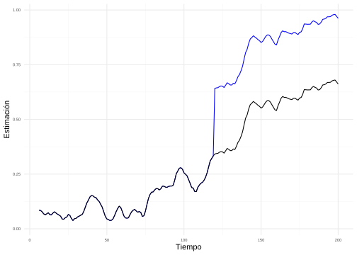
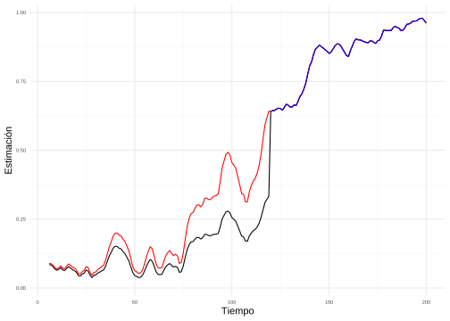
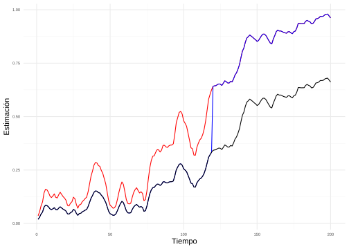
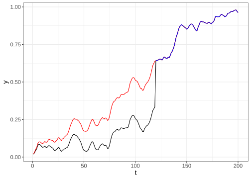
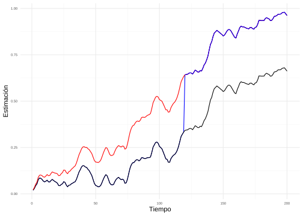

---
output:
  pdf_document: default
  html_document: default
---
# Comparabilidad: rediseño, impacto y empalme

Entre los objetivos más importantes de las Oficinas Nacionales de Estadística se encuentra el ser garantes de la comparabilidad de las estadísticas oficiales publicadas regularmente. Como se ha visto a los largo de todo este libro, entendemos una estrategia de muestreo como una dupla compuesta por un diseño de muestreo y un estimador. Desde un punto de vista estadístico esta dupla crea una medida de probabilidad discreta que induce las estimaciones de las estadísticas oficiales que serán publicadas y diseminadas por las ONE mediante la realización de las encuestas de hogares. Esta medida de probabilidad no solo induce la estimación puntual del parámetro de interés, sino que a su vez induce una estimación de su varianza y error de muestreo, que a su vez redunda en una inferencia completa y correcta. 

La estabilidad en el tiempo de la medida de probabilidad de las encuestas de hogares trae grandes ventajas, pues además de poder realizar comparaciones transversales entre subgrupos poblacionales de interés (región, zona, sexo, edad, escolaridad, discapacidad, etnia, entre muchos otros), será también posible realizar comparaciones temporales de dichos subgrupos. Uno de los ejemplos más ampliamente difundidos son los parámetros del mercado de trabajo (tasa de desocupación, tasa de participación, tasa de informalidad, entre otros), cuya importancia es tal que las ONE disponen de levantamientos continuos para poder estimarlos y diseminar su publicación regularmente (de forma trimestral, o incluso mensual). La comparación temporal de estas cifras permite el planteamiento de políticas públicas oportunas. 

Por ende, el cambio de alguno de los componentes de la estrategia de muestreo afectará de alguna manera la comparabilidad de las estadísticas oficiales en algunos puntos del tiempo y, si el efecto es significativo, incluso podrá poner en tela de juicio la idoneidad de la inferencia para la estimación de los parámetros de interés. Por ejemplo, considere que, debido a la coyuntura socioeconómica de un país, efectivamente hay un cambio negativo en el mercado de trabajo en un periodo de interés; pero este cambio no podrá ser debidamente captado si existe algún cambio simultaneo en el diseño de muestreo (que a su vez viene inducido por la forma en que se recolecta la información) o en el estimador de muestreo (debido cualquier cambio en el ajuste a los factores de expansión incluyendo los modelos de ausencia de respuesta y calibraciones).

Por la evolución natural de las encuestas, la adopción de nuevas metodologías de medición, el cambio en la forma de recolección de la información o incluso la adopción de nuevas proyecciones censales por la realización decenal de los censos de población y vivienda, es casi una tarea imposible no realizar ningún cambio en la vida de las encuestas de hogares. En este capítulo describiremos cuál es la mejor manera de realizar estos cambios para minimizar su impacto, cómo medir este efecto en el tiempo y, llegado el caso, cómo hacer comparables las series de tiempo que han sufrido una discontinuidad en un punto del tiempo debido a un cambio en la medida de probabilidad. 

## Rediseño de las encuestas

Aunque la comparabilidad de las estimaciones es un baluarte fundamental en la diseminación y publicación de las estadísticas oficiales provenientes de las encuestas de hogares, es casi imposible mantener intacta la medida de probabilidad de la inferencia a lo largo del tiempo. Las encuestas de hogares son frecuentemente rediseñadas para reflejar los cambios relacionados con la población de interés. Estos rediseños son necesarios para mantener la eficiencia de la estrategia de muestreo e incorporar mejoras metodológicas optimas.  A continuación, se enumeran algunos casos en los que puede existir un cambio que afecte la comparabilidad:

1. *Cambios en la forma de medición de los constructos*; es posible encontrar que la forma en que se miden los constructos cambien a través del tiempo. Por ejemplo, la concepción y definición de las fuentes del ingreso [@CEPAL_2018] para mediciones de pobreza monetaria o la actualización de los estándares de la Organización Internacional del Trabajo [@CIET19, @CIET13] en cuanto a la definición de los indicadores del mercado laboral, son algunos casos en los que los cuestionarios deben sufrir modificaciones para poder tener una inferencia oportuna. 
1. *Cambios en la definición de las subpoblaciones*; la generación de nuevos estándares sobre la clasificación de las subpoblaciones puede repercutir significativamente en la comparabilidad de las series. Por ejemplo, la adopción de estándares sobre la identificación de razas, etnias o pueblos originarios, además de cambios en la identifiación de migrantes y extranjeros; nuevos estándares sobre identificación de poblaciones con preferencias sexuales y de género diversas; nuevos estándares en la clasificación de las ocupaciones, entre otras. 
1. *Cambio en la forma de recolección de la información primaria*; con el pasar de los años y la adopción de nuevos procesos tecnológicos en las ONE de la región, es muy probable encontrar que las entrevistas que habitualmente se recolecataban de manera presencial con cuestionarios en papel, poco a poco van migrando a una forma de recolección presencial con dispositivos de captura digitales, e inclusive es posible encontrar cambios más drásticos en los que la recolección puede cambiarse a operativos telefónicos o mixtos. Esta nueva forma de recolección de la información puede traer cambios en la comparabilidad de las series.
1. *Cambios en la división territorial del país*; aunque este tipo de cambios no son tan frecuentes, es posible encontrar nuevas definiciones territoriales dentro de los países; por ejemplo, la creación de nuevas divisiones administrativas mayores (regiones, estados o departamentos) y/o menores (municipios, distritos, cantones o provincias). Estos cambios en la división administrativa y territorial de los países pueden redundar en discontinuidades, sobretodo en las estadísticas generadas a nivel subnacional.
1. *Cambios debido a la realización de nuevos censos en el país*; la mera realización de los censos puede traer consigo consecuencias inesperadas en la comparabilidad de las series. Por ejemplo:
    - La forma en la que se desarrollan los censos tiene una repercusión directa sobre la construcción de los marcos de muestreo, que inducen el diseño de muestreo de la encuesta. Si el censo anterior fue un censo de hecho y el actual es un censo de derecho (o viceversa) la definición y construcción cartográfica de las áreas de enumeración o empadronamiento serán diferentes en su tamaño y composición. Dado que estas áreas son el principal insumo de la creación de las Unidades Primarias de Muestreo, los cambios en la cartografía de los marcos de muestreo serán significativas y acabaran redundando en el quiebre de las series temporales. 
    - La actualización de las proyecciones demográficas trae consigo un cambio en los totales de control usados en los estimadores de calibración. Ante un cambio significativo en la población proyectada y la observada en el censo, es muy probable que las estadísticas oficiales de nivel (totales y tamaños, en particular) se vean afectadas por estos cambios y las estadísticas ya no sean comparables, pues se observará un incremento (o decremento) de las proyecciones de la población civil no instucionalizada [@CPSrediseno].
1. *Mejoras deliberadas*; cualquier otro cambio en la estrategia de muestreo puede traer discrepancias en las series de tiempo. Por ejemplo, una nueva forma de administración del marco de muestreo con nuevos tamaños en las UPM, o la adopción de una nueva estrategia de estratificación socioeconómica de las UPM del marco tendrán un efecto en las cifras. Asimismo, el cambio y mejora en el diseño de muestreo, la adopción de un nuevo estimadores o los cambios realizado en los ajustes de los pesos de muestreo y factores de expansión pueden tener connotaciones inesperadas en la comparabilidad de las cifras. 

## El impacto de los rediseños

Como los rediseños de las encuestas son inevitables, es muy recomendable definir de antemano los cambios que se surtirán y planear un experimento controlado a lo largo de un periodo suficiente de tiempo (por ejemplo, un año para eventos con estacionalidad como las estadísticas del trabajo) en donde la operación estadística transcurra en paralelo con dos acercamientos: el regular (sin cambios) y el nuevo (con los cambios del rediseño). Esta opción implica que la ONE debe tener a su disponibilidad la suficiente cantidad de recursos presupuestales, logísticos y humanos durante el tiempo en el cual transcurran ambos procesos. Por lo anterior, no todas las ONE de la región podrán asumir esta carga y se vuelve una opción inviable. Sin embargo, las autoridades de las ONE deberían realizar todos los esfuerzos posibles para conseguir los recursos suficientes y garantizar que se pueda medir el impacto de los cambios propuestos. 

Con base en lo anteriomente mencionado, es necesario tener en cuenta que sin este tipo de experimentos paralelos, será muy difícil medir el verdadero cambio, identificar la fuente de la discontinuidad en la serie y corregir el sesgo generado. Tal como lo afirma @Rubincausal, la aleatorización es la única forma de conseguir que no existan sesgos de selección en los experimentos controlados y es el único supuesto científicamente aceptado para medir este tipo de efectos. Con esta perspectiva en mente, los experimentos controlados deberán seleccionar aleatoriamente las UPM que participarían en ambas recolecciones. Esto no supone una carga adicional para las ONE, garantes de la aleatorización en las encuestas de hogares. 

@Brakel2008 menciona que hay varias posibilidades para llevar a cabo este tipo de experimentos paralelos; por una parte es posible tener dos operaciones estadísticas en campo con el mismo tamaño de muestra, o que la nueva operación tenga un tamaño de muestra menor e inclusive esté restringida a alguna subpoblación de interés. En cualquier caso, son la forma correcta para evitar efectos de confusión. De lo contrario, incluso ante cambios nulos, no se podrá discernir si esto es el resultado de la coyuntura de interés, o del rediseño de la encuesta. La figura \@ref(fig:fig20_1) muestra un ejemplo simulado del resultado esperado de un experimento paralelo. La línea negra representa la serie regular, la linea azul representa la nueva serie con los cambios del rediseño y la distancia entre ambas, representa el impacto del rediseño en cada punto del tiempo. 

(\#fig:fig20_1)Series de tiempo para el rediseño de una encuesta. La línea negra representa la serie regular; la línea azul representa la serie nueva. Fuente: elaboración propia.

Sin embargo, en algunos casos se hace imposible realizar dos levantamientos paralelos. Un claro ejemplo de este escenario lo tenemos en la pandemia por COVID-19, su efecto en las condiciones socioeconómicas de los hogares y su efecto en el modo de recolección de las encuestas. Como lo afirma @CEPAL_continua, desde la emergencia sanitaria derivada de la pandemia, las oficinas nacionales de estadística (ONE) tuvieron que interrumpir abruptamente la recopilación de información primaria como parte de muchas de sus operaciones estadísticas, incluidas las encuestas de hogares. A pesar de esto, las ONE pudieron seguir con sus levantamientos migrando de un modo de recolección presencial a telefónico. 
Este rediseño repentino (cambio en la metodología de recolección) fue necesario para que se siguieran produciendo cifras de empleo y pobreza, indicadores particularmente importantes en el contexto de la pandemia, dado el profundo impacto que las mismas restricciones de movimiento y cuarentenas tuvieron en la condición de ocupación de las personas de la región y, por ende, en la afectación de sus ingresos. Nótese que en este caso, no fue posible que las ONE pudiesen realizar experimentos paralelos.

@CEPAL_continua afirma que la pandemia obligó a que los países cambiaran varios aspectos en la metodología del levantamiento y análisis de la información, que pueden ser resumidos a continuación:

-	Cambió el modo de levantamiento de presencial a telefónico (o mixto, en algunos casos), así como las definiciones de la estructura de elegibilidad de las viviendas seleccionadas y sus correspondientes códigos de disposición.
-	Cambió el esquema de supervisión de los encuestadores y, en algunos casos, se suprimieron las actualizaciones cartográficas del número de hogares particulares en las unidades primarias de muestreo seleccionadas. 
-	Se introdujo un nuevo esquema de ajuste de factores de expansión, buscando eliminar el sesgo de cobertura (no todos los hogares en los levantamientos anteriores contaron con números telefónicos de contacto) y de ausencia de respuesta (algunos hogares contactados telefónicamente no contestaron el cuestionario).
-	Se revisitaron los esquemas de calibración de los factores de expansión y en aras de la flexibilidad de la metodología de estimación se restringió el número de restricciones de calibración. 

En algunos casos especiales, ante la imposibilidad de ejecutar dos encuestas paralelas, es posible obtener dos series paralelas. Por ejemplo, suponga un cambio en la forma de medición de las estadísticas del mercado de trabajo en un país; en particular, la adopción del estándar CIET 19 [@19CIET]. En algunos países es posible adoptar este estándar mediante la adición de nuevas preguntas al cuestionario original basado en la CIET 13 [@13CIET]. Otro caso especial puede deberse a la actualización de las proyecciones de población y los totales de control en los estimadores de calibración. Dado que el cambio solo afecta los procesos computacionales, es posible tener dos series paralelas, sin necesidad de tener dos levantamientos paralelos. 

Ya sea que se tenga la posibilidad de contar con dos series en paralelo o no,  existirán diferentes métodos que permitirán establecer si existe o no un impacto significativo debido a un cambio en la encuesta. En general, es posible enlistar las siguientes posibilidades:
1. Cuando se tienen las dos series en paralelo es posible cuantificar el impacto a través de estudios de causalidad basado en modelos econométricos.
2. Cuando solo se cuenta con una serie es posible acercarse al efecto del cambio utilizando modelos de series temporales en los que se involucran parámetros que indiquen a partir de qué momento se inició el cambio y su efecto en la serie (análisis de intervenciones).

En ambos casos, es necesario primero realizar este tipo de análisis para cuantificar el efecto del cambio. Luego, si el efecto resulta ser estadísticamente significativo, es necesario realizar el empalme de las series de tiempo que proporcione una serie ajustada comparable con ambas series: la regular y la nueva. Esta se conoce como la serie empalmada. 

Por ejemplo, para el caso en el que el indicador de interés sea un total, @Gbur propone la utilización de un modelo lineal para determinar los efectos del rediseño. Este modelo puede escribirse de la siguiente manera:

$$
\hat \theta_{tdg} = \hat N_{tdg} \ \theta_{td} + \hat N_{tdg} \ \beta_{t} + \varepsilon_{tdg} 
$$

En donde $\hat \theta_{tdg} = \sum_{k \in s_t} w_{ktg} \ y_{ktg}$ representa la estimación del indicador de interés en el tiempo $t$ para el dominio $d$. El subscrito $g = 1, 2$, solo toma dos valores e indica si la variable de interés fue observada bajo las condiciones del rediseño o no (tratamiento/control). Además, $\hat N_{tdg} = \sum_{k \in s_t} w_{ktg}$ es la suma de los factores de expansión en el tiempo $t$, del dominio $d$ en el tratamiento $g$. Este modelo relaciona el estimador directo $\hat \theta_{tdg}$ con el indicador verdadero $\theta_{tdg}$ y el efecto del rediseño en el tiempo $y$, denotado por $\beta_{t}$. Por supuesto, $\varepsilon_{tdg}$ denota los errores aleatorios con vector de medias nulo y matriz de varianzas $\boldsymbol V$, cuyas entradas (varianzas y covarianzas) son estimadas a partir de los principios de la estimación directa. Nótese que se supone independencia en la selección de los hogares o personas en cada grupo del tratamiento. 

Evidentemente si $\beta_{t}$ es estadísticamente igual de cero, entonces se afirma que no existe un efecto del rediseño en la serie regular, por ende se garantiza la comparabilidad entre las estimaciones de la serie regular y la serie nueva. Sin emabargo, en caso contrario, es necesario realizar un proceso de empalme de series como los que se especifican en la siguiente sección. 

## Empalme de series de tiempo

A continuación se realiza un recuento de algunas técnicas que permiten empalmar dos series. Cada uno de los escenarios que se enlistan a continuación deberá ser adoptado a las necesidades de cada ONE y de cada encuesta. En términos de notación, $\hat \theta^{R}_t$ representa la estimación regular en el tiempo $t$, $\hat \theta^{N}_t$ denota la nueva estimación en el tiempo $t$ y $\hat \theta^{E}_t$ corresponde a la estimación empalmada en el tiempo $t$.

### Factor suavizado

@DiNatale presenta el siguiente ajuste que suaviza sistemáticamente el cambio entre la nueva serie en tiempo del rediseño ($t_b$) y la serie regular en el punto inmediatamente anterior $t_b-1$. Es necesario identificar el punto donde ocurrió el cambio $t_b$, así como el punto que indicará el comienzo del empalme $t_1$. Luego, se debe calcular el factor de ajuste que representa el cambio (porcentual). 
$$
\gamma_t=\left(\frac{\hat \theta^{N}_{t_b}}{\hat \theta^{R}_{t_b-1}} -1\right)  \times \psi_t
$$
Así, suponiendo que $\psi_t = \frac{t}{t_b-1} \in (0,1)$ es un factor que aumenta a medida que el tiempo se acerca al punto de quiebre $t_b$, entonces la serie empalmada queda definida como 
$$
\hat \theta^{E}_t=\hat \theta^{R}_t* (1+\gamma_t),
\ \ \ \ \ \ \ \ \ \ \ \ \ \ \ \ \ \ \text{con } t=1,2,\cdots,t_b-1.
$$

En la Figura \@ref(fig:fig20_2) es posible observar cómo se empalman las series regular y nueva a partir del ajuste proporcional. Nótese que la estructura de la serie se mantiene integralmente. 

(\#fig:fig20_2)Empalme de series de tiempo con el método del factor suavizado. La línea negra corresponde a la serie regular; la línea azul representa la serie nueva; la línea roja denota la serie empalmada. Fuente: elaboración propia.

### Ajuste sintético aditivo y multiplicativo

En este caso se supone que la serie regular y la serie nueva se observan desde $t_b$ y que la serie empalmada sigue un ajuste aditivo dado por la siguiente expresión:

$$
\hat \theta^{E}_t=\hat \theta^{R}_t + \left(\hat \theta^{N}_{t_b} - \hat \theta^{R}_{t_b}\right) \times \psi_t
,
\ \ \ \ \ \ \ \ \ \ \ \ \ \ \ \ \ \ \text{con } t=1,2,\cdots,t_b-1.
$$

Este método tiene la desventaja de que la serie empalmada podría producir valores por fuera del rango del indicador de interés; por ejemplo, podria producir valores negativos. Por tanto, para evitar estos inconvenientes, es posible acudir a un empalme sintético multiplicativo, dado a continuación:

$$
\hat \theta^{E}_t=\hat \theta^{R}_t  \left(\dfrac{\hat \theta^{N}_{t_b}}{\hat \theta^{R}_{t_b}}\right)  \times \psi_t 
,
\ \ \ \ \ \ \ \ \ \ \ \ \ \ \ \ \ \ \text{con } t=1,2,\cdots,t_b-1.
$$

@Brakel2008 afirma que con los anteriores métodos la serie empalmada puede ser mayor que uno o menor que cero, lo cual es especialmente contraproducente en el caso de las proporciones y tasas. La Figura \@ref(fig:fig20_3) muestra el empalme de las series usando el ajuste sintético multiplicativo. 

$$
\hat \theta^{E}_t=\hat \theta^{R}_t + \left(\hat \theta^{N}_{t_b} - \hat \theta^{R}_{t_b}\right) \times \left( \dfrac{\hat \theta^{R}_t(1-\hat \theta^{R}_t)}{\hat \theta^{R}_{t_b}(1-\hat \theta^{R}_{t_b})}\right) 
,
\ \ \ \ \ \ \ \ \ \ \ \ \ \ \ \ \ \ \text{con } t=1,2,\cdots,t_b-1.
$$

(\#fig:fig20_3)Empalme de series de tiempo con el ajuste sintético multiplicativo. La línea negra corresponde a la serie regular; la línea azul representa la serie nueva; la línea roja denota la serie empalmada. Fuente: elaboración propia.

### Modelos estructurales

En el caso en el que no se tenga la oportunidad de tener un experimento paralelo y, por lo tanto, se carezca de dos series paralelas, es posible ajustar un modelo estructural de series de tiempo con una intervención justo en el momento del rediseño. Para simplificar la notación, en esta sección se supone que la serie no tiene estacionalidad, ni ciclos; aunque si los tuviera el espíritu del ajuste se mantiene. Por ende, siguiendo a @Brakel2008, el modelo estructural para la serie está dado por el nivel $L_t$ más el impacto $\beta$ en el momento del rediseño $t_b$ y se escribe de la siguiente manera:

$$
\hat \theta_{t}=L_t+\beta\delta_t+e_t
$$
En donde $\delta_t$ es una variable indicadora del tiempo en el que se implementó el rediseño en la encuesta

$$
\delta_t =
\begin{cases}
1 & \text{si $t\geq t_b$}\\
0 & \text{si $t< t_b$}
\end{cases}
$$

Además, $L_t$ es una tendencia estocástica autorregresiva que depende de una pendiente: 
$$
\begin{aligned}
L_t & = L_{t-1}+R_{t-1}+w_t \\
R_t & = R_{t-1}+\eta_t
\end{aligned}
$$
Note que $R_t$ es la pendiente, y $e_t$, $w_t$ y $\eta_t$ son ruidos de las diferentes ecuaciones. Este modelo debe ser escrito en la forma de **estado-espacio**, para que por medio de la apliccación del filtro de Kalman, se  logre la estimación de los parámetros y la extracción de los diferentes componentes de la serie (nivel, pendiente y efecto). El modelo de estado espacio está conformado por las ecuaciones de observación (medición) y estado (transición) que, respectivamente, están dadas por las siguientes expresiones: 

$$
\begin{aligned}
\hat \theta_{t}&=Z_t\alpha_t+\epsilon_t\\
\alpha_t&=T\alpha_{t-1}+\omega_t
\end{aligned}
$$
En donde $\alpha_t$ se conoce como el vector de estado. Para nuestro modelo estructural, $\alpha_t$ está dado por $\alpha_t=(L_t, R_t,\beta)'$. De esta forma, la ecuación de transición está definida por:

$$
\alpha_t=\begin{bmatrix}
L_t\\
R_t\\
\beta
\end{bmatrix}=\begin{bmatrix}
1&1&0\\
0&1&0\\
0&0&1
\end{bmatrix}
\begin{bmatrix}
L_{t-1}\\
R_{t-1}\\
\beta
\end{bmatrix}+
\begin{bmatrix}
w_t\\
\eta_t\\
0
\end{bmatrix}
$$

Mientras que la ecuación de medición queda como sigue:

$$
\hat \theta_{t}=\begin{bmatrix}
1&0&\delta_t
\end{bmatrix}\begin{bmatrix}
L_t\\
R_t\\
\beta
\end{bmatrix}+e_t
$$

Para emplamar la serie antes del punto $t_b$, se toma la serie regular y añadiendo gradualmente el efecto $\hat{\beta}$. Por ende, la serie empalmada será:

$$
x^{adj,2}_t=
\begin{cases}
x_t+\hat{\beta}*\psi_t&\text{si $t<t_0$}\\
x_t&\text{si no}
\end{cases}
$$

Los resultados de la aplicación del modelo son bastante satisfactorios, puesto que además de extraer la estructura de la serie, el modelo estructural es capaz de estimar correctamente el impacto de la intervención, sin necesidad de tener las dos series en paralelo. La Figura \@ref(fig:fig20_4) muestra el empalme de las series usando este acercamiento. Este tipo de modelos tienen bastantes ventajas metodológicas; por ejemplo, es posible ajustar más de un punto de intervención e incluso es posible incluir intervenciones de todo tipo (efecto en un solo tiempo, el mismo efecto o efecto creciente a partir de un tiempo). También es posible extraer la tendencia para suavizar la serie, la cual puede incluir componentes de estacionalidad o ciclos; además, es posible incluir otras series como covariables (con relaciones cambiantes en el tiempo).  

(\#fig:fig20_4)Empalme de series de tiempo usando un modelo estructural. La línea negra corresponde a la serie regular; la línea azul representa la serie nueva; la línea roja denota la serie empalmada. Fuente: elaboración propia.

Por último, en el caso en el que se disponga de ambas series en paralelo, también es posible proponer un modelo estructural bivariado. Asumiendo que las dos series no tienen componente estacional, podemos formular el modelo estructural bivariado para el vector $(\hat \theta^{R}_t,\hat \theta^{N}_t)'$ está dado por:

$$
\begin{aligned}
\hat \theta^{R}_t &= L_t+e_{1,t} \\
\hat \theta^{N}_t &= L_t+\beta\delta_t+e_{2,t}
\end{aligned}
$$

Para este modelo estructural, la ecuación de transición toma la misma forma que en el modelo univariado, mientras que la ecuación de medición queda como: 

$$
\begin{bmatrix}\hat \theta^{R}_t\\\hat \theta^{N}_t\end{bmatrix}=\begin{bmatrix}
1&0&0\\
1&0&\delta_t
\end{bmatrix}\begin{bmatrix}
L_t\\
R_t\\
\beta
\end{bmatrix}+e_t
$$

Al igual que en el modelo estructural univariado, los resultados de la aplicación logran extraer la estructura de la serie y estimar correctamente el impacto de la intervención. La Figura \@ref(fig:fig20_5) muestra el empalme de las series usando este acercamiento. 

(\#fig:fig20_5)Empalme de series de tiempo usando un modelo estructural. La línea negra corresponde a la serie regular; la línea azul representa la serie nueva; la línea roja denota la serie empalmada. Fuente: elaboración propia.

